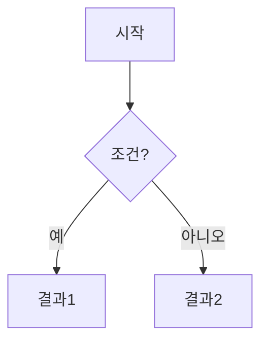

# CLAUDE.md

This file provides guidance to Claude Code (claude.ai/code) when working with code in this repository.

## 저장소 개요

백엔드 개발자의 공부 기록 저장소다. 코드가 아닌 마크다운 문서가 핵심 결과물이다.

```
Today-I-Learned/
├── AI/           # AI 도구, Claude Code 관련
├── BackEnd/      # Java, Spring, JPA, 테스트, 성능, 보안, 아키텍처
├── ComputerScience/  # DB, 알고리즘, CS 기초
├── FrontEnd/     # 프론트엔드 관련
├── Server/       # 배포, CI/CD
├── Others/       # 글쓰기, 기타
└── Posting/      # 블로그 포스팅용
```

## 문서 작성 원칙

### 글쓰기 가이드
`Others/Writing/테크니컬 라이터가 알려주는 무조건 읽히는 실전 글쓰기.md` 를 참고한다.

핵심 원칙:
- **짧게**: 단문 위주, 불필요한 내용 제거
- **두괄식**: 결론을 먼저 쓰고 근거를 나중에
- **쉽게**: 말하듯이, 구어체로, 한글 우선
- **정확하게**: 모호한 표현 지양

### 시각화
mermaid 다이어그램과 표를 활용해 직관적으로 작성한다.

참고 예시: `AI/claude-code/sillicon-valley-engineers-guide/02 컨텍스트 엔지니어링이 중요한 이유 - 프롬프트가 아니라 구조가 생산성을 만든다.md`

**표 예시 (비교)**:
| 항목 | A | B |
|---|---|---|
| 초점 | ... | ... |

**mermaid 예시 (흐름)**:


### 문서 구조
- `## 한눈에 보기` — 핵심 요약 표 또는 다이어그램
- `## 핵심 결론` — 두괄식 결론
- 본문 — 논리적 흐름으로 설명
