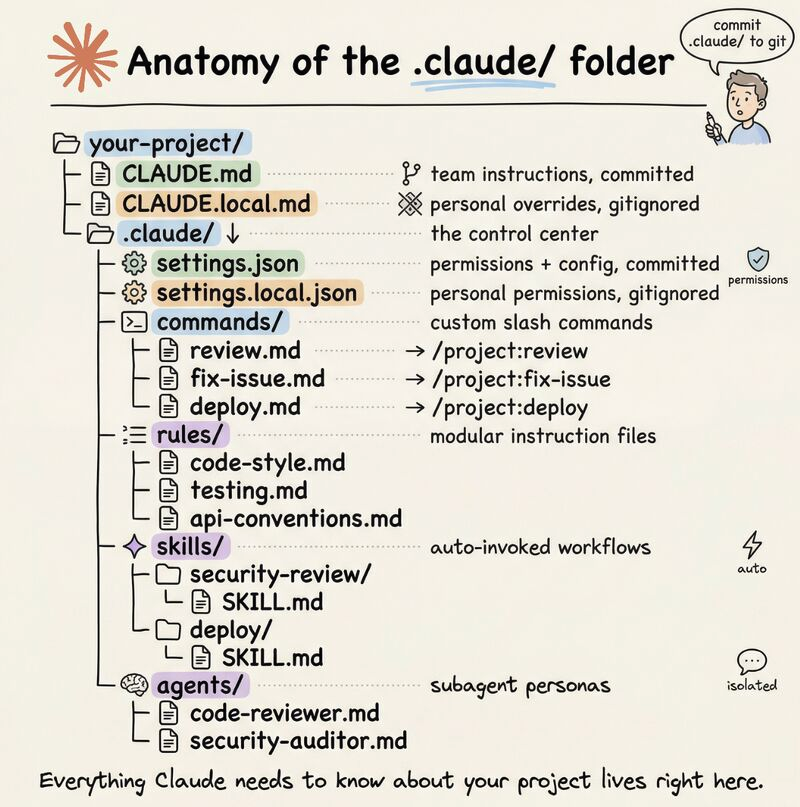

🛠️ Claude Code 핵심 설정 가이드

1. .claude/ 폴더: 프로젝트의 컨트롤 타워
   Claude가 코드베이스 내에서 행동하는 방식, 권한, 워크플로우를 정의하는 인프라 폴더입니다.

CLAUDE.md (가장 중요): Claude의 지침서입니다. 빌드 명령, 아키텍처 결정, 코딩 컨벤션 등을 200줄 이내로 작성하세요. 모든 세션의 시작점에서 Claude가 이를 읽고 따릅니다.

rules/ 폴더: 프로젝트가 커지면 규칙을 세분화하세요. 코드 스타일, 테스트 표준 등을 파일별로 나누어 관리하며, 특정 디렉토리에만 적용되도록 범위를 지정할 수 있습니다.

commands/ 폴더: 반복적인 워크플로우를 자동화합니다. 쉘 실행 결과(Git diff, 테스트 결과 등)를 프롬프트에 주입하여 Claude가 실시간 데이터를 바탕으로 작업하게 합니다.

skills/ 폴더: 특정 작업 조건이 일치할 때 Claude가 자동으로 실행하는 기능입니다. 명령어를 직접 입력할 필요가 없어 효율적입니다.

agents/ 폴더: 특정 작업에 최적화된 하위 에이전트를 정의합니다. 메인 대화창을 더럽히지 않고 격리된 환경에서 작업을 수행한 뒤 결과만 보고합니다.

2. 보안 및 개인화
   settings.json: 권한을 제어합니다. 예를 들어 npm run은 허용하되 .env 파일 접근은 차단하는 식의 보안 설정을 반드시 구성해야 합니다.

글로벌 vs 로컬:

로컬 (.claude/): 프로젝트 레포지토리에 포함되며 팀과 공유됩니다.

글로벌 (~/.claude/): 사용자 개인의 선호도와 여러 프로젝트에 걸친 자동 기억(Auto-memory)이 저장됩니다.

💡 3줄 핵심 요약
CLAUDE.md를 먼저 작성하라: 가장 적은 노력으로 가장 큰 효과를 보는 핵심 파일입니다.

자동화를 활용하라: 반복 작업은 commands로, 컨텍스트 기반 작업은 skills로 자동화하세요.

보안을 챙겨라: settings.json 설정을 통해 Claude의 활동 범위를 안전하게 제한하세요.

> [원문](https://www.linkedin.com/posts/akshay-pachaar_how-to-setup-your-claude-code-project-heres-activity-7441191827258368000-Rgiw?utm_source=share&utm_medium=member_desktop&rcm=ACoAAD-7aewBP7en8Fx9RZsOJ7dt1GHd6FA2o9M)

How to setup your Claude code project?

Here's everything you need to know:

Most developers set up Claude Code and start prompting immediately.

No 𝗖𝗟𝗔𝗨𝗗𝗘.𝗺𝗱. No custom commands. No permission rules. Just vibing.

Here's what a proper Claude Code project setup actually looks like:

Your project gets a .𝗰𝗹𝗮𝘂𝗱𝗲/ folder. Everything inside it tells Claude how to behave in your codebase, what it's allowed to do, and how to handle recurring workflows.

Start with 𝗖𝗟𝗔𝗨𝗗𝗘.𝗺𝗱. This is Claude's instruction manual. Write your build commands, your architecture decisions, your conventions, your gotchas. Keep it under 200 lines. Claude reads it at the start of every session and follows it throughout.

Once 𝗖𝗟𝗔𝗨𝗗𝗘.𝗺𝗱 gets crowded, split it into a 𝗿𝘂𝗹𝗲𝘀/ folder. One file per concern: code style, testing standards, API conventions. You can even scope rules to specific file paths so they only activate when Claude is working in certain directories.

Add 𝗰𝗼𝗺𝗺𝗮𝗻𝗱𝘀/ for your repeatable workflows. A markdown file called 𝗿𝗲𝘃𝗶𝗲𝘄.𝗺𝗱 creates 𝗽𝗿𝗼𝗷𝗲𝗰𝘁:𝗿𝗲𝘃𝗶𝗲𝘄. Use the 𝗟 backtick syntax to inject real shell output into the prompt before Claude sees it. Git diffs, issue details, test output, anything you want Claude to actually see.

Skills go in 𝘀𝗸𝗶𝗹𝗹𝘀/. The difference from commands: skills activate automatically when the task matches the description. You don't have to type anything. Claude reads the conversation, recognizes the match, and invokes the skill on its own.

Agents go in 𝗮𝗴𝗲𝗻𝘁𝘀/. Define a specialized subagent with its own system prompt, tool access, and model preference. It runs in an isolated context window, does its work, and returns only the findings. Your main session stays clean.

Finally, 𝘀𝗲𝘁𝘁𝗶𝗻𝗴𝘀.𝗷𝘀𝗼𝗻. This is where you define what Claude can and cannot do. Allow 𝗻𝗽𝗺 𝗿𝘂𝗻 *. Deny reading .𝗲𝗻𝘃 files. Five minutes of setup that prevents a lot of surprises.

One thing worth knowing: there are two 𝗹𝗰𝗹𝗮𝘂𝗱𝗲/ folders. The project one lives in your repo and gets committed. The global one at 𝘀/.𝗰𝗹𝗮𝘂𝗱𝗲/ holds your personal preferences and auto-memory across every project.

A few things to take away from this:

- 𝗖𝗟𝗔𝗨𝗗𝗘.𝗺𝗱 is the highest-leverage file. Start there.
- 𝘀𝗸𝗶𝗹𝗹𝘀/ beats 𝗰𝗼𝗺𝗺𝗮𝗻𝗱𝘀/ for anything context-triggered.
- 𝘀𝗲𝘁𝘁𝗶𝗻𝗴𝘀.𝗷𝘀𝗼𝗻 is simple but powerful. Do not skip it.
- Auto-memory at 𝘀/.𝗰𝗹𝗮𝘂𝗱𝗲/𝗽𝗿𝗼𝗷𝗲𝗰𝘁𝘀/ means Claude is quietly building context about your codebase across sessions.

The .𝗰𝗹𝗮𝘂𝗱𝗲/ folder is infrastructure. Treat it like one.

To learn more, check out Claude Code’s official documentation, which covers everything listed here in detail and you can use this as a reference.
_____
Share this with your network if you found this insightful ♻️
Follow me (Akshay Pachaar) for more insights and tutorials on AI and Machine Learning!