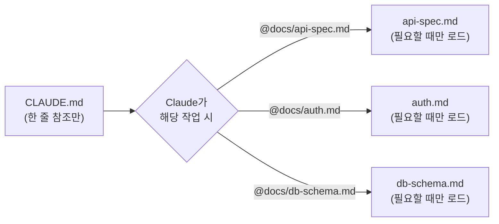
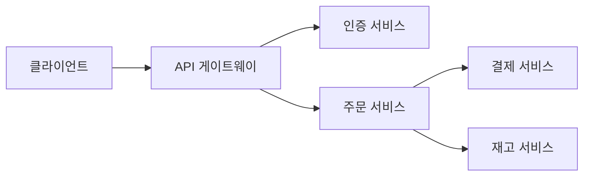
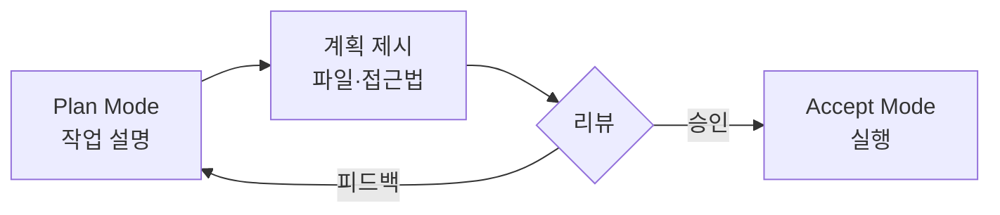
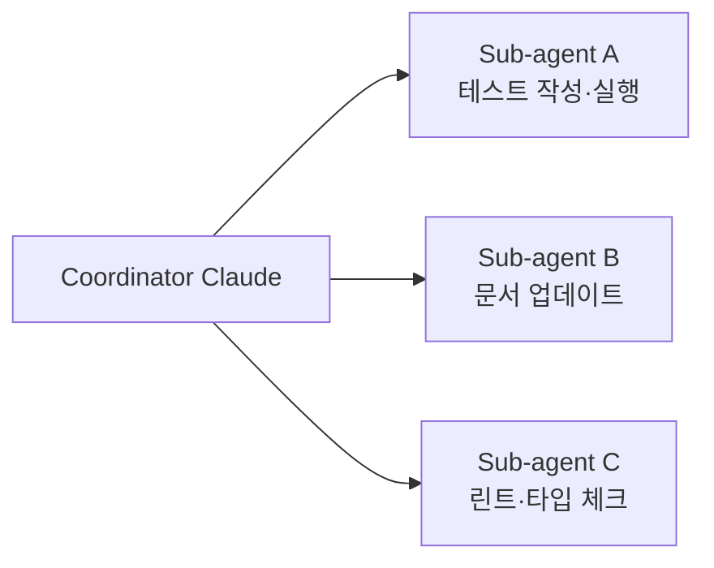

> [[전체강의 통합본] 클로드 코드 2시간 안에 마스터하기 | 입문→실전→심화 완전 정복 (풀버전)](https://www.youtube.com/watch?v=vxEvo2BLM6A)
>
> [노션 치트시트](https://raspy-roll-970.notion.site/Claude-Code-329f7725c9d981dba0afd9c83b810d3f)

> 💡 Claude Code 200% 활용 실전 워크플로우. 컨텍스트 관리부터 코딩 철학까지.

<!-- TOC -->
* [1. 컨텍스트 관리](#1-컨텍스트-관리)
  * [🧠 Second Brain & /memory 구축](#-second-brain--memory-구축)
  * [📦 Lazy Loading — CLAUDE.md 참조 구조](#-lazy-loading--claudemd-참조-구조)
  * [🔄 컨텍스트 윈도우 관리](#-컨텍스트-윈도우-관리)
  * [📊 MCP 토큰 모니터링](#-mcp-토큰-모니터링)
  * [🏗️ Mermaid 아키텍처 정리](#-mermaid-아키텍처-정리)
  * [📤 무거운 작업은 스크립트로 오프로드](#-무거운-작업은-스크립트로-오프로드)
* [2. 워크플로우 & 코딩 철학](#2-워크플로우--코딩-철학)
  * [📋 Plan Mode 먼저](#-plan-mode-먼저)
  * [🔁 TDD 기반 스마트 코딩](#-tdd-기반-스마트-코딩)
  * [🧐 Thinking 로그 읽기](#-thinking-로그-읽기)
  * [🔀 다른 AI에게 비평 받기](#-다른-ai에게-비평-받기)
  * [🐛 에러 로그 그대로 붙여넣기](#-에러-로그-그대로-붙여넣기)
  * [✅ 로컬 TODO.md 활용](#-로컬-todomd-활용)
  * [🏛️ WAT 프레임워크](#-wat-프레임워크)
    * [W — Workflows: 10분 투자로 수시간의 삽질을 줄인다](#w--workflows-10분-투자로-수시간의-삽질을-줄인다)
    * [A — Agents: Self-Healing이 핵심](#a--agents-self-healing이-핵심)
    * [T — Tools: 작은 도구가 큰 도구를 이긴다](#t--tools-작은-도구가-큰-도구를-이긴다)
    * [종합 예시: "블로그에 댓글 기능 추가하기"를 WAT로 풀기](#종합-예시-블로그에-댓글-기능-추가하기를-wat로-풀기)
* [📋 한눈에 보기](#-한눈에-보기)
  * [컨텍스트 관리 체크리스트](#컨텍스트-관리-체크리스트)
  * [워크플로우 체크리스트](#워크플로우-체크리스트)
<!-- TOC -->

# 1. 컨텍스트 관리

> 핵심 원칙: **컨텍스트는 자원이다**. 적게 넣고, 자주 비우고, 무거운 건 밖으로 빼라.

## 🧠 Second Brain & /memory 구축

Claude와 작업하면서 배운 것을 **로컬 마크다운 파일**에 저장한다. 프로젝트의 **기관 기억(institutional memory)**이 된다.

```markdown
## 2024-01-15: 인증 방식 변경
- JWT에서 세션 기반으로 변경
- 이유: 모바일 앱에서 토큰 리프레시 이슈
- 참고: auth/session.ts
```

**자동 메모리 시스템**:

| 항목 | 내용 |
|---|---|
| 명령어 | `/memory` — 자동 학습된 내용 확인/편집 |
| 저장 위치 | `~/.claude/projects/<project>/memory/MEMORY.md` |
| 로드 시점 | 매 세션 시작 시 처음 200줄 자동 로드 |
| 저장 트리거 | "기억해줘"라고 말하면 저장 |

> 📂 **사용 구분**: 개인 메모리는 `/memory`, 팀 공유 지식은 `CLAUDE.md`.

## 📦 Lazy Loading — CLAUDE.md 참조 구조

`CLAUDE.md`에 모든 정보를 넣으면 매 세션마다 수천 토큰이 낭비된다. **참조만 두고, 상세 내용은 별도 파일로 분리**한다.



**❌ 나쁜 예** — 모든 내용을 `CLAUDE.md`에 직접 작성:

```markdown
# CLAUDE.md (나쁜 예)
## API 엔드포인트
- POST /api/auth/login - 로그인...
- POST /api/auth/register - 회원가입...
- GET /api/users/:id - 유저 조회...
- ... (50개 더)
```

**✅ 좋은 예** — 한 줄 참조만 남기기:

```markdown
# CLAUDE.md (좋은 예)
## 프로젝트 문서
- API 스펙: @docs/api-spec.md
- DB 스키마: @docs/db-schema.md
- 인증 설계: @docs/auth.md
- 코딩 컨벤션: @docs/conventions.md
```

Claude는 필요할 때만 해당 파일을 읽는다. 이게 **Lazy Loading**.

> 💡 **폴더별 `CLAUDE.md`**: `src/auth/CLAUDE.md`, `src/payments/CLAUDE.md`처럼 폴더별로 분리하면 Claude가 해당 폴더 작업 시에만 해당 `CLAUDE.md`를 읽어 컨텍스트 bloat 방지.

## 🔄 컨텍스트 윈도우 관리

> ⚠️ **핵심 원칙: 한 세션 = 한 피처**
> 한 세션에서 여러 기능을 연달아 구현하지 않는다. 신선한 컨텍스트가 부풀어진 컨텍스트보다 항상 낫다.

> ⚠️ 핵심: **플래닝 세션과, 구현 세션을 분리**

**실전 워크플로우**:


| 명령어 | 역할 |
|---|---|
| `/clear` | 컨텍스트 완전 초기화 |
| `/compact` | 대화 내용 압축 (맥락 유지) |

## 📊 MCP 토큰 모니터링

MCP를 여러 개 연결하면 **도구 설명만으로도 토큰을 크게 소비**한다. `/context`로 주기적으로 확인하고, 안 쓰는 MCP는 `/mcp`에서 비활성화.

> 💡 **토큰 절약 팁**: Notion, Linear 같은 MCP는 도구 설명이 매우 크다. 자주 쓰는 기능만 골라 **커스텀 MCP를 래핑**하면 토큰 절약 + 응답 품질 향상.

## 🏗️ Mermaid 아키텍처 정리

`CLAUDE.md`에 **Mermaid 다이어그램**으로 아키텍처를 정리하면 Claude가 프로젝트 구조를 한눈에 파악한다.



> 💡 **팁**: 별도 파일(`docs/architecture.md`)에 정리하고, `CLAUDE.md`에서 `@docs/architecture.md`로 참조한다.

## 📤 무거운 작업은 스크립트로 오프로드

무거운 데이터 처리를 대화 안에서 시키면 **컨텍스트가 오염**된다. Claude에게 **스크립트를 작성**하게 하고, 결과만 받는다.

| 상황 | 프롬프트 예시 |
|---|---|
| DB 마이그레이션 검증 | "10만 행 CSV 파싱해서 무결성 검증 스크립트 작성해줘. 결과는 `summary.json`으로" |
| 로그 분석 | "수백 MB 로그에서 에러 패턴 추출 스크립트 만들어줘. `report.md`로 정리" |
| API 응답 비교 | "v1과 v2 응답 차이 비교 스크립트 작성해줘. diff를 `api-diff.json`으로" |

> ⚠️ **핵심**: 무거운 데이터는 스크립트로, **결과 요약만** Claude에게 전달.

# 2. 워크플로우 & 코딩 철학

## 📋 Plan Mode 먼저

큰 변경 작업은 **반드시 Plan Mode**(`Shift + Tab`)로 시작한다.



> ⚠️ Plan 없이 바로 실행하면 Claude가 엉뚱한 방향으로 코드를 대량 수정해버리는 참사가 벌어질 수 있다.

## 🔁 TDD 기반 스마트 코딩

**핵심 루프**: 작은 변경 → 테스트 → 린트 → 커밋 → 반복


> 💡 문제가 생겨도 **마지막 커밋**으로 돌아가면 되니 디버깅이 훨씬 쉬워진다.

## 🧐 Thinking 로그 읽기

Claude가 생각하는 과정을 보여주는 **thinking 로그**를 무시하지 않는다.

> 🛑 Claude가 잘못된 가정을 하고 있다면, 그 순간 **`Escape`로 중단**한다. 잘못된 가정 위에 쌓인 코드는 전부 쓸모없다. **초반에 잡는 게 핵심**.

## 🔀 다른 AI에게 비평 받기

Claude와 작업하다 막히면, `/export`로 대화를 내보내서 ChatGPT나 Gemini에게 보여준다.

> "이 대화를 분석해서, Claude가 놓치고 있는 것이나 잘못된 접근이 있으면 지적해줘"

> 💡 **자동화 팁**: Custom Skill을 만들어 `/review-with-gpt` 같은 명령으로 이 과정을 원커맨드 처리.

## 🐛 에러 로그 그대로 붙여넣기

> ⚠️ 에러를 해석해서 설명하지 않는다. **에러 로그를 통째로** Claude에게 던진다.
> 사람이 해석하면 정보가 빠질 수 있다. Claude는 스택 트레이스 분석에 능하다.

## ✅ 로컬 TODO.md 활용

프로젝트 루트에 `TODO.md`를 만들어 Claude에게 태스크를 추적하게 한다.

```markdown
- [ ] 결제 기능 구현 (Stripe 연동)
- [ ] 랜딩 페이지 CTA 수정
- [ ] 구독 시스템 설계
- [ ] 버그 #1: 로그인 리다이렉트 오류
- [ ] 버그 #2: 모바일 레이아웃 깨짐
```

**실전 워크플로우**:

| 단계 | 행동 |
|---|---|
| 하루 시작 | 할 일을 `TODO.md`에 체크리스트로 작성 |
| 작업 시작 | "TODO.md 읽고 첫 번째 항목부터 시작해" |
| 병렬 처리 | Agent Teams로 여러 태스크를 동시에 |
| 세션 종료 | "TODO.md 업데이트해줘" → 진행 상황 자동 반영 |

> 💡 여러 세션에 걸쳐 **작업의 연속성**을 유지하는 핵심 도구.

## 🏛️ WAT 프레임워크

Nate Herk(유튜버)가 제안한 **복잡한 프로젝트 관리 방법론**.

| 구성 요소 | 의미 | 핵심 |
|---|---|---|
| **W**orkflows | 작업 흐름 정의 | plain English로 단계를 명확히 |
| **A**gents | AI 에이전트 활용 | Self-healing + Sub-agent 병렬 처리 |
| **T**ools | 도구 조합 | 작고 원자적인 도구들의 조합 |

### W — Workflows: 10분 투자로 수시간의 삽질을 줄인다

코드를 쓰기 전에 **작업 흐름을 글로 먼저** 정의한다.

```
1. DB 스키마에 due_date, notification_sent 컬럼 추가
2. 마감일 설정 UI 컴포넌트 구현
3. 크론잡으로 마감 24시간 전 알림 발송 로직 작성
4. 알림 발송 후 notification_sent 플래그 업데이트
5. 각 단계마다 테스트 작성 후 통과 확인
```

Plan Mode와 자연스럽게 연결된다. **10분 투자해서 workflow를 명확히 정의하면, 수시간의 삽질을 줄일 수 있다**.

### A — Agents: Self-Healing이 핵심

Claude Code는 에러가 나면 스스로 로그를 읽고, 원인을 파악하고, 코드를 수정하고, 다시 실행한다.

**Sub-agent로 역할 분리 (병렬 처리)**:



| 방식 | 소요 시간 |
|---|---|
| 순차 처리 (1개 Claude) | 약 10분 |
| Sub-agent 3개 병렬 | 약 3~4분 |

### T — Tools: 작은 도구가 큰 도구를 이긴다

**Tool Atomicity (도구의 원자성)** — 하나의 거대한 스크립트보다 작은 단위 스크립트 여러 개가 훨씬 낫다.

```bash
# ❌ 나쁜 예: deploy-all.sh (200줄짜리 괴물)

# ✅ 좋은 예: 원자적 도구들의 조합
scripts/build.sh        # 빌드만
scripts/test.sh         # 테스트만
scripts/migrate.sh      # DB 마이그레이션만
scripts/deploy.sh       # 배포만
scripts/notify.sh       # 알림만
```

**실전 도구 종류**:

| 도구 | 용도 |
|---|---|
| Bash 스크립트 | DB 시드, 빌드, 테스트 등 반복 작업 |
| MCP 서버 | 외부 API(Stripe, GitHub, Notion) 연동 |
| Hooks | 커밋/저장 시 자동 린트·테스트 실행 |

### 종합 예시: "블로그에 댓글 기능 추가하기"를 WAT로 풀기

**W (Workflow 정의)**:

```
"블로그에 댓글 기능을 추가해줘. 다음 순서로 진행해:
1. comments 테이블 스키마 설계 및 마이그레이션
2. 댓글 CRUD API 엔드포인트 구현
3. 프론트엔드 댓글 컴포넌트 구현
4. 각 단계마다 테스트 작성 및 통과 확인"
```

**A (Agent 구성)**: Claude가 coordinator로서 Sub-agent들에게 작업 분배. API 구현 중 다른 Sub-agent가 테스트를 미리 설계하고, 에러 시 self-healing으로 자동 복구.

**T (Tools 활용)**: `scripts/migrate.sh`로 DB 마이그레이션, MCP로 GitHub PR 생성, Hooks로 커밋마다 테스트 자동 실행.

> 💡 **핵심**: AI의 추론과 코드 실행을 분리. Claude에게 생각하게 하고, 실행은 별도 도구에 맡기면 복잡한 워크플로우도 안정적으로 관리 가능.

# 📋 한눈에 보기

## 컨텍스트 관리 체크리스트

- [ ] `/memory`로 Second Brain 구축 (개인 메모리)
- [ ] `CLAUDE.md`에는 참조만, 상세 내용은 별도 파일로 (Lazy Loading)
- [ ] **한 세션 = 한 피처** 원칙 준수
- [ ] `/context`로 토큰 사용량 주기적 확인
- [ ] 안 쓰는 MCP는 `/mcp`에서 비활성화
- [ ] Mermaid로 아키텍처 정리
- [ ] 무거운 데이터 처리는 스크립트로 오프로드

## 워크플로우 체크리스트

- [ ] 큰 작업은 **Plan Mode**(`Shift + Tab`)부터
- [ ] **작은 변경 → 테스트 → 린트 → 커밋** 루프 유지
- [ ] Thinking 로그 확인, 잘못된 가정은 **`Escape`로 즉시 중단**
- [ ] 막히면 `/export` → 다른 AI에게 비평 받기
- [ ] 에러 로그는 **해석 없이 그대로** 붙여넣기
- [ ] `TODO.md`로 작업 연속성 유지
- [ ] 복잡한 프로젝트는 **WAT 프레임워크** 적용

---

> 🎬 시리즈 총 3편: 1편 입문 → **2편 실전 (현재)** → 3편 고급 활용
> 다음 편: 커스텀 스킬 만들기, Sub-Agent 병렬 실행, Hooks 자동화 파이프라인.
