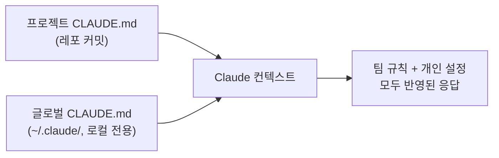
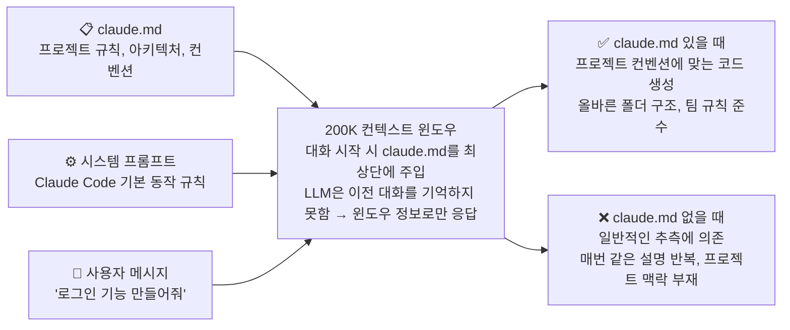

> [[전체강의 통합본] 클로드 코드 2시간 안에 마스터하기 | 입문→실전→심화 완전 정복 (풀버전)](https://www.youtube.com/watch?v=vxEvo2BLM6A)
>
> [노션 치트시트](https://raspy-roll-970.notion.site/Claude-Code-329f7725c9d98151974efd38865fb22f)

> 💡 Claude Code 입문 완벽 가이드. 초기 설정부터 필수 명령어까지.

<!-- TOC -->
* [1. 초기 설정 & claude.md](#1-초기-설정--claudemd)
  * [🚀 시작하기](#-시작하기)
    * [프로젝트 루트에서 claude code 실행](#프로젝트-루트에서-claude-code-실행)
    * [/init 명령어](#init-명령어)
  * [📂 claude.md 계층 구조](#-claudemd-계층-구조)
    * [디렉토리별 CLAUDE.md (300자 이내 권장)](#디렉토리별-claudemd-300자-이내-권장)
  * [✍️ claude.md에 넣어야 할 내용](#️-claudemd에-넣어야-할-내용)
    * [항목별 정리](#항목별-정리)
    * [CLAUDE.md 예시](#claudemd-예시)
  * [🎯 꿀팁 모음](#-꿀팁-모음)
    * [트리거 키워드](#트리거-키워드)
* [2. 키보드 단축키 & 네비게이션](#2-키보드-단축키--네비게이션)
  * [⌨️ 핵심 단축키](#️-핵심-단축키)
  * [🖼️ 스크린샷 드래그 앤 드롭](#️-스크린샷-드래그-앤-드롭)
  * [🖥️ iTerm 패널 단축키](#️-iterm-패널-단축키)
  * [⚡ ! 접두사로 bash 명령 실행](#-접두사로-bash-명령-실행)
* [3. 필수 슬래시 명령어](#3-필수-슬래시-명령어)
  * [🧹 컨텍스트 관리](#-컨텍스트-관리)
  * [🔧 모델 & 세션](#-모델--세션)
  * [🔌 MCP & 기타](#-mcp--기타)
  * [🛠️ 나만의 슬래시 명령어 만들기](#️-나만의-슬래시-명령어-만들기)
* [📋 한눈에 보기](#-한눈에-보기)
  * [단축키 Quick Reference](#단축키-quick-reference)
  * [명령어 Quick Reference](#명령어-quick-reference)
<!-- TOC -->

# 1. 초기 설정 & claude.md

## 🚀 시작하기

### 프로젝트 루트에서 claude code 실행

프로젝트 루트 디렉토리에서 Claude Code를 실행한다. Claude는 현재 디렉토리 기준으로 파일을 탐색하기 때문에, 엉뚱한 폴더에서 실행하면 프로젝트 구조를 파악하지 못한다.

### /init 명령어

`/init` 명령어로 `CLAUDE.md`를 자동 생성한다. Claude가 프로젝트를 분석해서 프로젝트 설명서를 만들어 준다.

## 📂 claude.md 계층 구조

> Compound Engineering — 팀 공유 & 개인정보 분리

| 구분 | 위치 | 용도 | 커밋 여부 |
|---|---|---|---|
| 글로벌 `CLAUDE.md` | `~/.claude/CLAUDE.md` | 모든 프로젝트 공통 (예: "항상 한국어로 답변") | ❌ 커밋 금지 |
| 프로젝트 `CLAUDE.md` | 레포 루트 | 해당 프로젝트만 적용 (아키텍처, 컨벤션, 빌드 명령) | ✅ 커밋 |

**핵심 원칙**: 글로벌 = 공통 규칙 / 프로젝트 = 해당 프로젝트의 아키텍처·컨벤션. 깔끔하게 분리.



### 디렉토리별 CLAUDE.md (300자 이내 권장)

1. 파일 크기 클수록 토큰 소모량 증가. 매 대화마다 토큰 낭비.
2. 크기 커지면 → 각 디렉토리마다 `CLAUDE.md` 쪼개서 작성.
   - 예: `/api`: `api/CLAUDE.md` → API 관련 규칙, 빌드 명령어, 아키텍처 설명

## ✍️ claude.md에 넣어야 할 내용



> 💡 **claude.md = 매 대화마다 자동 주입되는 "프로젝트 기억 장치"**
> LLM에겐 장기 기억이 없기 때문에, claude.md가 유일한 프로젝트 컨텍스트다.

1. LLM은 컨텍스트 안에 있는 정보만 기억함.
2. 프로젝트가 크면 클수록 모든 것을 읽어와야하기 때문에, claude.md가 없으면 매번 프로젝트 설명을 반복해야함. → 토큰 낭비.
3. 따라서 claude.md에 프로젝트의 모든 구조를 정리해놓고, 태스크를 바로 작업할 수 있게 준비해둠.

### 항목별 정리

| 항목 | 설명 | 예시 |
|---|---|---|
| 🚫 절대 규칙 (맨 위에 배치) | 위반하면 안 되는 금지 사항 | 프로덕션 DB 직접 쿼리 금지, 시크릿 파일 커밋 금지 |
| 🏗️ 아키텍처 | 폴더 구조, 기술 스택 (Claude가 파일 바로 찾을 수 있게 트리 형태) | `apps/web`, `apps/api`, `packages/ui` 트리 |
| 🔨 빌드 / 테스트 | 개발 서버, 테스트, 배포 명령어 | `pnpm dev`, `pnpm test` |
| 🧠 도메인 컨텍스트 | 비즈니스 용어, 데이터 흐름 | `Product → Variant → 독립 재고` |
| 📐 코딩 컨벤션 | 네이밍, 커밋, 패턴 규칙 | PascalCase 컴포넌트, Conventional Commits |

> ⚠️ **300줄 이하 유지**. 길면 매 대화마다 토큰 낭비.

### CLAUDE.md 예시

````plain
# Project: ShopEase (이커머스 플랫폼)

## Critical Rules (절대 규칙)

- 프로덕션 DB에 직접 쿼리 금지 - 반드시 staging 환경에서 먼저 테스트
- .env, credentials.json 등 시크릿 파일 절대 커밋 금지
- main 브랜치에 직접 push 금지 - 반드시 PR을 통해 머지

## Architecture (아키텍처)

모노레포 구조, Turborepo 기반

```
apps/
  web/            → Next.js 14 (App Router) - 고객용 프론트엔드
  admin/          → Next.js 14 - 어드민 대시보드
  api/            → Express + TypeScript - REST API 서버
packages/
  ui/             → 공유 UI 컴포넌트 (Shadcn/ui 기반)
  db/             → Prisma ORM + PostgreSQL
  shared/         → 공통 타입, 유틸리티
```

## Tech Stack (기술 스택)

- Frontend: Next.js 14, TypeScript, Tailwind CSS, Zustand
- Backend: Express, TypeScript, Prisma ORM
- DB: PostgreSQL (Supabase), Redis (캐싱)
- Infra: Vercel (프론트), Railway (API), GitHub Actions (CI/CD)

## Build & Test Commands (빌드/테스트)

```bash
pnpm dev
pnpm test
pnpm build
```

## Coding Conventions (코딩 컨벤션)

- 컴포넌트: PascalCase (`ProductCard.tsx`)
- 유틸/훅: camelCase (`useCart.ts`, `formatPrice.ts`)
- API 라우트: kebab-case (`/api/order-items`)
- 커밋 메시지: Conventional Commits (`feat:`, `fix:`, `chore:`)
- 커밋 메시지는 영어, 코드 주석은 한국어 허용
- React 컴포넌트는 named export 사용 (default export 금지)
- API 응답은 항상 `{ success, data, error }` 형태로 통일

## Key Patterns (핵심 패턴)

- Server Components 우선, 클라이언트 상태 필요할 때만 `"use client"`
- API 에러는 `AppError` 클래스로 통일 (`packages/shared/errors.ts`)
- DB 접근은 반드시 `packages/db`의 repository 패턴을 통해서만
- 환경변수는 `packages/shared/env.ts`에서 zod로 검증 후 사용
````

## 🎯 꿀팁 모음

| 팁 | 설명 |
|---|---|
| 규칙 우선순위 | 위에서 아래로 적용. 가장 중요한 규칙을 맨 위에 배치 |
| 직접 수정 X | "방금 우리가 정한 패턴, claude.md에 추가해줘" → 기존 내용과 자연스럽게 병합 |
| 트리거 키워드 | 짧은 명령으로 정해진 플로우 자동 실행 (아래 참고) |
| 팀 공유 | 레포에 커밋해서 팀 전체가 같은 규칙으로 Claude 사용 |

### 트리거 키워드

CLAUDE.md 안에 트리거 키워드를 등록해두면, 사용자가 그 키워드를 말할 때 Claude가 정해진 동작을 자동 실행한다. 매번 긴 프롬프트 반복 안 해도 됨.

**프롬프트 예시**:

> claude.md 에 트리거 키워드 설정해줘. test 돌리고 모두 패스하면 git commit push 를 한번에 해주는 커맨드 부탁해.

**CLAUDE.md 등록 예시**:

```markdown
## Trigger Keywords (트리거 키워드)

- `ship it` → `pnpm test` 실행 → 전체 패스 시 `git add . && git commit && git push` 일괄 실행. 실패 시 즉시 중단하고 실패 로그 보고.
- `quick fix` → 변경 파일만 lint + 타입 체크 후 커밋.
```

**효과**:

| Before | After |
|---|---|
| "테스트 돌려줘. 다 통과하면 커밋하고 푸시까지 해줘" 매번 입력 | `ship it` 한 마디 |
| 단계별 확인 누락 위험 | CLAUDE.md에 정의된 절차대로 실행 |

# 2. 키보드 단축키 & 네비게이션

## ⌨️ 핵심 단축키

| 단축키 | 동작 |
|---|---|
| `Shift + Tab` | Plan Mode ↔ Accept Mode 전환 |
| `Escape` | 즉시 중단 |
| `Escape` × 2 | 입력 내용 삭제 (텍스트 있을 때) / 이전 입력 복원 (입력창 비었을 때) |

**Plan Mode vs Accept Mode**:

| 모드 | 동작 |
|---|---|
| Plan Mode | Claude가 계획만 세우고 실행은 안 함 |
| Accept Mode | Claude가 계획 + 실행까지 함 |

> 💡 새 작업은 **항상 Plan Mode로 시작**. 계획 확인 후 Accept Mode로 전환 → 엉뚱한 수정 예방.

> Plan Mode를 사용해야 하는 실무적 이유: 큰 변경 전에 계획을 먼저 검토 → 잘못된 방향으로 코드 생성 방지 → 토큰/시간 절약.

`Escape`는 잘못된 방향이면 망설이지 말고 바로 누른다.

## 🖼️ 스크린샷 드래그 앤 드롭

터미널에 스크린샷을 드래그하면 Claude가 이미지를 인식한다.

> 💡 이미지만 던지지 말고, **"무엇인지" + "어떻게 할 것인지"**를 같이 알려주기.
> 예: "이 스크린샷은 로그인 페이지야. 비밀번호 필드 아래에 '비밀번호 찾기' 링크를 추가해줘"

## 🖥️ iTerm 패널 단축키

| 단축키 | 동작 |
|---|---|
| `Cmd + D` | 패널 세로 분할 |
| `Cmd + Shift + D` | 패널 가로 분할 |
| `Cmd + [` / `Cmd + ]` | 패널 간 이동 |

## ⚡ ! 접두사로 bash 명령 실행

Claude 프롬프트에서 `!`를 붙이면 대화를 끊지 않고 터미널 명령을 바로 실행할 수 있다.

```bash
!npm run build
!git status
!ls -la src/
```

# 3. 필수 슬래시 명령어

## 🧹 컨텍스트 관리

| 명령 | 동작 |
|---|---|
| `/clear` | 컨텍스트 완전 초기화 — 새 작업 시작 시 필수 |
| `/context` | 토큰 사용량 확인 (bar 형태). 80% 이상이면 `/clear` 또는 `/compact` |
| `/compact` | 컨텍스트 압축 — 맥락 유지하면서 토큰만 줄임 |
|  `/resume` | 이전 세션 복구 — 터미널 실수로 닫았을 때 다시 실행 후 `/resume`으로 복원 |

> 💡 `/clear` = 완전 초기화 vs `/compact` = 맥락 유지 압축

이전 대화가 쌓이면 200K 토큰 공간이 줄고 응답 품질도 떨어짐.

## 🔧 모델 & 세션

`/models` — 모델 전환:

| 모델 | 특징 | 용도 |
|---|---|---|
| Opus | 가장 똑똑함 | 복잡한 아키텍처, 어려운 버그 |
| Sonnet | 균형잡힌 성능 | 일반적인 코딩 작업 |
| Haiku | 가장 빠름 | 간단한 질문, 파일 탐색 |


## 🔌 MCP & 기타

`/mcp` — MCP(외부 도구 연결) 관리. 안 쓰는 MCP는 비활성화 (켜져 있으면 토큰 낭비).

| 명령 | 동작 |
|---|---|
| `/help` | 내장 도움말 |
| `/config` | 설정 변경 (To-Do 리스트 활성화 등) |
| `/export` | 채팅 내보내기 (Cursor 등으로 옮길 때 유용) |
| `/output-style` | 응답 스타일 설정 (학습 모드, 간결 모드 등) |

## 🛠️ 나만의 슬래시 명령어 만들기

프로젝트 루트에 `.claude/commands/` 폴더를 만들고 `.md` 파일을 넣으면, 파일 이름이 곧 슬래시 명령어가 된다.

```
.claude/
  commands/
    review_script.md    →  /review_script
    deploy_staging.md   →  /deploy_staging
```

> 💡 트리거 키워드와 비슷하지만, 슬래시 명령어는 **탭 자동완성**이 되고 Claude Code가 **구조적으로 인식**하기 때문에 더 안정적.

# 📋 한눈에 보기

## 단축키 Quick Reference

| 단축키 | 동작 |
|---|---|
| `Shift + Tab` | Plan Mode ↔ Accept Mode |
| `Escape` | 즉시 중단 |
| `Escape` × 2 | 입력 삭제 / 복원 |
| `!` + 명령어 | bash 명령 바로 실행 |

## 명령어 Quick Reference

| 명령 | 동작 |
|---|---|
| `/init` | claude.md 자동 생성 |
| `/clear` | 컨텍스트 초기화 (새 작업 시작 시) |
| `/compact` | 컨텍스트 압축 (맥락 유지) |
| `/context` | 토큰 사용량 확인 |
| `/models` | 모델 전환 (Opus / Sonnet / Haiku) |
| `/resume` | 이전 세션 복구 |
| `/mcp` | MCP 관리 |
| `/export` | 채팅 내보내기 |
