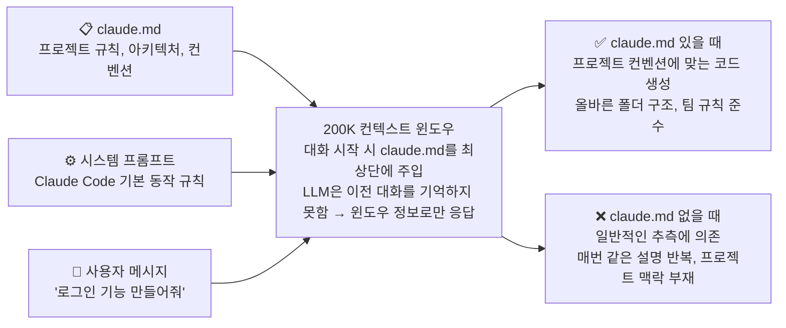
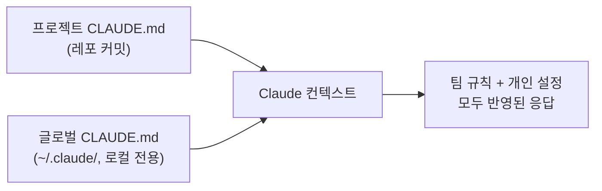

> [[전체강의 통합본] 클로드 코드 2시간 안에 마스터하기 | 입문→실전→심화 완전 정복 (풀버전)](https://www.youtube.com/watch?v=vxEvo2BLM6A)
> 
>  [노션 치트시트](https://raspy-roll-970.notion.site/Claude-Code-329f7725c9d981daa92fd96adb482111)

# 입문

## 1. 프로젝트 루트에서 claude code 실행과 /init 명령어

### 프로젝트 루트에서 claude code 실행

### /init 명령어

## 2. CLAUDE.md 왜 중요할까?



> 💡 **claude.md = 매 대화마다 자동 주입되는 "프로젝트 기억 장치"**
> LLM에겐 장기 기억이 없기 때문에, claude.md가 유일한 프로젝트 컨텍스트다.

1. LLM은 컨텍스트 안에 있는 정보만 기억함.
2. 프로젝트가 크면 클수록 모든 것을 읽어와야하기 때문에, claude.md가 없으면 매번 프로젝트 설명을 반복해야함. -> 토큰 낭비.
3. 따라서 claude.md에 프로젝트의 모든 구조를 정리해놓고, 태스크를 바로 작업할 수 있게 준비해둠.

### CLAUDE.md 뭘 넣어야할까?

| 항목 | 설명                                      | 예시 |
|---|-----------------------------------------|---|
| 🚫 절대 규칙 (맨 위에 배치) | Claude가 절대 하면 안 되는 것                    | 프로덕션 DB 직접 쿼리 금지, 시크릿 파일 커밋 금지 |
| 🏗️ 아키텍처 | 폴더 구조를 트리 형태로 <br>(Claude가 파일을 바로 찾을 수 있게) | `apps/web`, `apps/api`, `packages/ui` 트리 |
| 🔨 빌드 / 테스트 명령어 | Claude가 알아서 빌드 & 테스트 실행                 | `pnpm dev`, `pnpm test` |
| 🧠 도메인 컨텍스트 | 비즈니스 로직                                 | `Product → Variant → 독립 재고` |
| 📐 코딩 컨벤션 | 팀 규칙                                    | 네이밍 규칙, 커밋 메시지 포맷, 컴포넌트 패턴 |

### CLAUDE.md 예시

````plain
# Project: ShopEase (이커머스 플랫폼)

## Critical Rules (절대 규칙)

- 프로덕션 DB에 직접 쿼리 금지 - 반드시 staging 환경에서 먼저 테스트
- .env, credentials.json 등 시크릿 파일 절대 커밋 금지
- main 브랜치에 직접 push 금지 - 반드시 PR을 통해 머지

## Architecture (아키텍처)

모노레포 구조, Turborepo 기반

```
apps/
  web/            → Next.js 14 (App Router) - 고객용 프론트엔드
  admin/          → Next.js 14 - 어드민 대시보드
  api/            → Express + TypeScript - REST API 서버
packages/
  ui/             → 공유 UI 컴포넌트 (Shadcn/ui 기반)
  db/             → Prisma ORM + PostgreSQL
  shared/         → 공통 타입, 유틸리티
```

## Tech Stack (기술 스택)

- Frontend: Next.js 14, TypeScript, Tailwind CSS, Zustand
- Backend: Express, TypeScript, Prisma ORM
- DB: PostgreSQL (Supabase), Redis (캐싱)
- Infra: Vercel (프론트), Railway (API), GitHub Actions (CI/CD)

## Build & Test Commands (빌드/테스트)

```bash
```

## Coding Conventions (코딩 컨벤션)

- 컴포넌트: PascalCase (`ProductCard.tsx`)
- 유틸/훅: camelCase (`useCart.ts`, `formatPrice.ts`)
- API 라우트: kebab-case (`/api/order-items`)
- 커밋 메시지: Conventional Commits (`feat:`, `fix:`, `chore:`)
- 커밋 메시지는 영어, 코드 주석은 한국어 허용
- React 컴포넌트는 named export 사용 (default export 금지)
- API 응답은 항상 `{ success, data, error }` 형태로 통일

## Key Patterns (핵심 패턴)

- Server Components 우선, 클라이언트 상태 필요할 때만 `"use client"`
- API 에러는 `AppError` 클래스로 통일 (`packages/shared/errors.ts`)
- DB 접근은 반드시 `packages/db`의 repository 패턴을 통해서만
- 환경변수는 `packages/shared/env.ts`에서 zod로 검증 후 사용
````

### CLAUDE.md 는 300자 이내로

1. 파일 크기 클수록 토큰 소모량 증가.
2. 크기 커지면 -> 각 디렉토리마다 CLAUDE.md 쪼개서 작성
   - 예: `/api`: `api/CLAUDE.md` → API 관련 규칙, 빌드 명령어, 아키텍처 설명

### CLAUDE.md 트리거 키워드

- CLAUDE.md 안에 트리거 키워드를 등록해두면, 사용자가 그 키워드를 말할 때 Claude가 정해진 동작을 자동 실행한다. 
- 매번 긴 프롬프트 반복 안 해도 됨.

**프롬프트 예시**:

> claude.md 에 트리거 키워드 설정해줘. test 돌리고 모두 패스하면 git commit push 를 한번에 해주는 커맨드 부탁해.

**CLAUDE.md 등록 예시**:

```markdown
## Trigger Keywords (트리거 키워드)

- `ship it` → `pnpm test` 실행 → 전체 패스 시 `git add . && git commit && git push` 일괄 실행. 실패 시 즉시 중단하고 실패 로그 보고.
- `quick fix` → 변경 파일만 lint + 타입 체크 후 커밋.
```

**효과**:

| Before | After |
|---|---|
| "테스트 돌려줘. 다 통과하면 커밋하고 푸시까지 해줘" 매번 입력 | `ship it` 한 마디 |
| 단계별 확인 누락 위험 | CLAUDE.md에 정의된 절차대로 실행 |

## 3. 컴파운드 엔지니어링

> Compound Engineering — 팀 공유 & 개인정보 분리

| 구분 | 위치 | 용도 | 커밋 여부 |
|---|---|---|---|
| 프로젝트 `CLAUDE.md` | 레포 루트 | 팀 전체가 같은 규칙으로 Claude 사용 (아키텍처, 컨벤션, 빌드 명령) | ✅ 커밋 |
| 글로벌 `CLAUDE.md` | `~/.claude/CLAUDE.md` | 개인 설정 (로컬 경로, API 키, 개인 단축키) | ❌ 커밋 금지 |

**핵심 원칙**: 팀 공통 = 프로젝트 / 개인 전용 = 글로벌. 깔끔하게 분리.



# 실전

# 심화