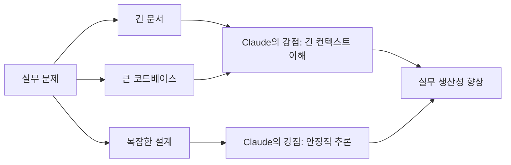
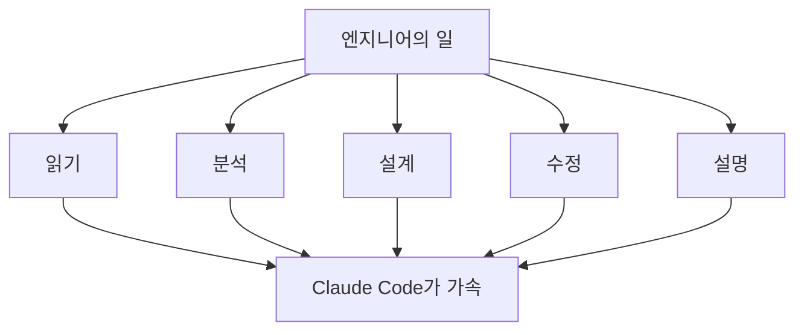

# 01. 왜 지금 클로드코드인가?

> 지금 Claude Code를 배워야 하는 이유는 단순하다.  
> 긴 문맥을 붙잡고, 깊게 생각하고, 실제 개발 작업 흐름 안에서 쓸모 있는 답을 내기 때문이다.

## 한눈에 보기

| 질문 | 짧은 답 |
|---|---|
| 왜 지금 배워야 하나 | 실무에서 바로 생산성을 올릴 수 있기 때문이다 |
| Claude의 강점은 무엇인가 | 긴 문맥 이해, 안정적인 추론, 자연스러운 글쓰기 |
| Claude Code가 특히 강한 영역은 | 문서 이해, 코드베이스 분석, 아키텍처 설계, 멀티스텝 작업 |
| 결국 무엇이 중요한가 | AI를 아는 것보다, AI를 도구로 다루는 능력이다 |

## 핵심 결론

Claude Code가 주목받는 이유는 "신기해서"가 아니다.  
**긴 문서와 긴 대화, 복잡한 코드베이스, 여러 단계의 문제 해결** 같은 실무 과제에서 강점을 보이기 때문이다.

특히 엔지니어에게 중요한 것은 다음 세 가지다.

- 긴 컨텍스트를 잃지 않는다.
- 빠르기보다 안정적으로 추론한다.
- 사람처럼 읽히는 결과물을 만든다.

## Claude vs ChatGPT

강의의 비교를 정리하면, 두 도구는 경쟁 관계이면서도 강점이 다르다.

| 항목 | Claude | ChatGPT |
|---|---|---|
| 컨텍스트 | Strong Long Context | Good Context Handling |
| 글쓰기 | Natural Writing Quality | Structured Writing Quality |
| 추론 성향 | Stable Reasoning | Fast Reasoning |
| 생태계 | 상대적으로 작음 | 상대적으로 큼 |

여기서 중요한 차이는 속도와 안정성의 방향이다.

- Claude는 더 오래 문맥을 잡고 숙고하는 쪽에 강하다.
- ChatGPT는 더 빠르게 구조화된 답을 내는 쪽에 강하다.

즉, Claude의 차별점은 `빨리 말하는 모델`보다 `끝까지 맥락을 붙잡는 모델`에 가깝다.



## Claude가 특히 잘하는 것

강의에서 강조한 포인트를 실무 기준으로 묶으면 아래와 같다.

| 영역 | 설명 | 왜 중요한가 |
|---|---|---|
| 긴 문서 이해 | 긴 문서를 넣고 요약, 설명, 재구성 | 문서를 빨리 읽고 판단할 수 있음 |
| PDF / 디자인 문서 / 코드베이스 분석 | 다양한 형태의 입력을 읽고 핵심 파악 | 문서와 코드 사이를 연결할 수 있음 |
| 아키텍처 / 시스템 디자인 | 설계 방향, 구조, 선택지 정리 | 구현 전에 사고 비용을 줄임 |
| 컨텍스트 유지 | 대화 중 핵심을 잃지 않고 이어감 | 긴 작업에서 품질이 덜 흔들림 |
| 멀티스텝 추론 | 한 번에 답하지 않고 단계적으로 생각 | 복잡한 문제에서 강함 |
| 자연스러운 글쓰기 | 인간이 쓴 것처럼 읽히는 문장 | 문서화, 설명, 전달력이 좋아짐 |

## 실전에서 바로 쓰이는 유스케이스

강의의 예시는 결국 아래 네 가지 상황으로 모인다.

| 상황 | Claude가 하는 일 | 기대 효과 |
|---|---|---|
| 긴 PDF를 빠르게 파악해야 할 때 | 30페이지 문서를 짧게 요약 | 읽는 시간 단축 |
| 대규모 코드 변경을 검토할 때 | 변경점 리뷰와 요약 | 리뷰 피로 감소 |
| 메모와 노트가 어지러울 때 | 구조화하고 정리 | 문서 품질 향상 |
| 기술 내용을 비기술자에게 설명할 때 | 쉬운 언어로 재작성 | 커뮤니케이션 비용 절감 |

핵심은 Claude가 단순히 "답변기"가 아니라,  
**읽고, 정리하고, 설계하고, 설명하는 보조 엔지니어**처럼 동작한다는 점이다.

## Anthropic은 어디에 집중하는가

Claude를 만든 회사는 Anthropic이다.  
강의에서는 이 회사의 초점을 세 가지로 정리한다.

| 초점 | 의미 |
|---|---|
| Safety | 위험한 출력보다 안전한 사용을 중시 |
| Reliability | 답변 품질의 일관성을 중시 |
| Long-context Reasoning | 긴 문맥을 이해하고 유지하는 능력을 중시 |

즉, Anthropic은 "더 화려한 데모"보다  
**길고 복잡한 입력을 안정적으로 다루는 모델**을 만드는 데 힘을 준다.

## 벤치마크는 어떻게 읽어야 하나

강의에는 Claude Opus 4.6 관련 여러 벤치마크가 나온다.  
중요한 것은 숫자를 외우는 것이 아니라, **무슨 능력을 측정하는지 이해하는 것**이다.

| 벤치마크 | 무엇을 보는가 | 강의에서 말한 의미 |
|---|---|---|
| Terminal Bench 2.5 | 터미널, CLI, 디버깅, 코드 수정 능력 | 개발자처럼 도구를 다루는가 |
| SWE-bench Verified | 실제 GitHub 기반 문제 해결 능력 | 실전 소프트웨어 엔지니어링에 강한가 |
| BrowserComp | 웹을 찾아 읽고 답하는 능력 | 정보 탐색과 정리 능력이 있는가 |
| Finance Agent | 금융 도메인 특화 추론 | 특정 도메인에서도 강한가 |
| Open RCA | 로그와 에러 기반 원인 분석 | 문제의 핵심 원인을 찾는가 |

### 강의에서 언급한 수치

| 항목 | 수치 |
|---|---|
| Terminal Bench 2.5 | 65.4 |
| SWE-bench Verified | 40.8% |
| BrowserComp | 84% |
| Finance Agent | 60.7% |
| Open RCA | 35% |

이 수치가 말해주는 핵심은 하나다.

- Claude는 특히 `에이전틱 코딩`, `실전 문제 해결`, `긴 문맥 기반 작업`에서 경쟁력이 있다.

## 왜 엔지니어에게 중요할까

모델 성능이 좋아질수록, 엔지니어의 일은 줄어드는 것이 아니라 바뀐다.  
이제 중요한 것은 직접 모든 것을 타이핑하는 능력만이 아니라,  
**AI에게 문맥을 주고, 작업을 위임하고, 결과를 검토하는 능력**이다.



즉, Claude Code를 배운다는 것은 새 장난감을 배우는 게 아니다.  
**앞으로의 개발 워크플로를 익히는 것**에 가깝다.

## 기억해야 할 포인트

| 기억할 문장 | 의미 |
|---|---|
| Claude는 긴 문맥에 강하다 | 긴 대화, 긴 문서, 큰 코드베이스에서 강점 |
| Claude는 안정적으로 추론한다 | 빠른 반응보다 깊은 숙고에 강점 |
| Claude Code는 실무형 도구다 | 읽기, 리뷰, 설계, 요약에 바로 쓸 수 있음 |
| 결국 중요한 것은 사용법이다 | 도구를 빨리 익힌 사람이 더 큰 생산성을 얻음 |

## 30초 요약

```text
왜 지금 Claude Code인가?

긴 문맥을 잘 잡고,
깊게 생각하고,
실제 개발 작업에 바로 도움이 되기 때문이다.

특히 문서 이해, 코드 리뷰, 설계, 요약 같은
엔지니어의 핵심 작업에서 강하다.

중요한 것은 모델 구경이 아니라
도구를 내 작업 흐름에 붙이는 능력이다.
```

## 한 문장 결론

Claude Code가 중요한 이유는, AI가 더 똑똑해져서가 아니라 **엔지니어의 실제 작업을 더 직접적으로 도와주는 단계에 들어섰기 때문**이다.
