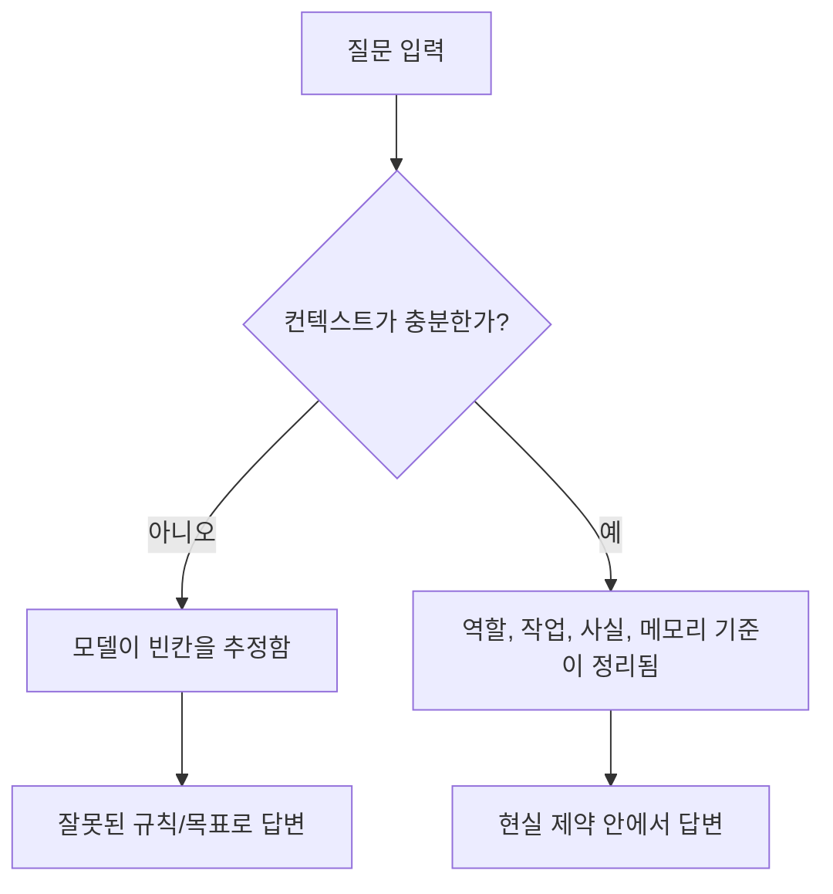
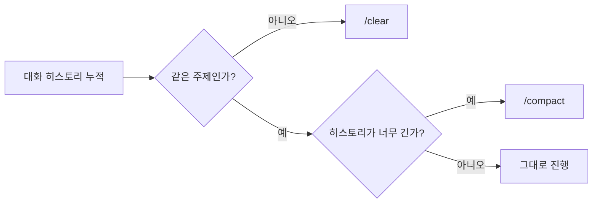

# 02. 컨텍스트 엔지니어링이 중요한 이유

> 컨텍스트 엔지니어링은 프롬프트를 잘 쓰는 기술이 아니다.  
> 모델이 **무엇을 알고, 무엇을 기억하고, 무엇을 무시하며, 무엇을 우선시할지** 미리 설계하는 기술이다.

## 한눈에 보기

| 항목 | 프롬프트 엔지니어링 | 컨텍스트 엔지니어링 |
|---|---|---|
| 초점 | 무엇을 말할까 | 모델이 어떤 상태에서 들을까 |
| 비유 | 좋은 문장 쓰기 | 방, 화이트보드, 규칙, 메모리 세팅하기 |
| 목적 | 질문 표현 최적화 | 답변 환경 최적화 |
| 실패 원인 | 질문이 모호함 | 배경, 제약, 목표, 메모리가 잘못됨 |

## 핵심 결론

좋은 답변은 좋은 프롬프트만으로 나오지 않는다.  
대부분의 실패는 모델이 멍청해서가 아니라, **우리가 의도한 질문과 모델이 실제로 푸는 질문이 다르기 때문**이다.

즉, 생산성을 만드는 것은 문장 재주보다 구조다.

## 왜 프롬프트보다 컨텍스트가 더 중요한가

모델의 답이 어긋나는 이유는 대체로 아래 네 가지다.

| 문제 | 설명 | 결과 |
|---|---|---|
| 관련 없는 히스토리 누적 | 이전 대화가 현재 질문과 섞임 | 초점이 흐려짐 |
| 제약 조건 누락 | 현실 조건이 없음 | 일반론, 모범답안 위주 답변 |
| 잘못된 규칙 가정 | 모델이 상황을 임의로 해석함 | 엉뚱한 방향 제안 |
| 잘못된 목표 최적화 | 사용자가 원하는 기준과 모델의 기준이 다름 | 장황함, 부정확함, 과한 창의성 또는 부족한 창의성 |



## 컨텍스트 엔지니어링의 정의

강의의 정의를 짧게 옮기면 이렇다.

- 모델이 무엇을 아는지 정한다.
- 무엇을 기억할지 정한다.
- 무엇을 무시할지 정한다.
- 무엇을 우선할지 정한다.

질문 전에 이 바닥을 먼저 깔아두는 작업이 컨텍스트 엔지니어링이다.

## 4가지 핵심 레이어

컨텍스트는 보통 아래 4개 층으로 설계한다.

| 레이어 | 질문 | 넣어야 할 것 | 빠지면 생기는 문제 |
|---|---|---|---|
| Role Context | 나는 누구로 답해야 하나 | 역할, 관점, 책임 | 친절하지만 뻔한 일반 답변 |
| Task Context | 지금 정확히 무슨 일을 해야 하나 | 평가 기준, 범위, 제외 항목 | 두루뭉술한 결과 |
| Information Context | 지금 사실인 것은 무엇인가 | 환경, 버전, 제약, 우선순위 | 환각, 교과서식 답변 |
| Memory Context | 무엇을 계속 기억하고 무엇을 버릴까 | 장기 메모리, 세션 정리 기준 | 오래된 전제, 잡음 누적 |

### 1. Role Context

모델에게 먼저 역할을 준다.  
역할을 주지 않으면 모델은 기본적으로 `generic하고 polite한 assistant`처럼 답한다.

예시:

| 나쁜 요청 | 좋은 요청 |
|---|---|
| `Explain Kubernetes RBAC` | `You are a Staff SRE reviewing a production RBAC design. Explain Kubernetes RBAC focusing on security boundaries and common failure modes.` |

핵심은 "설명해 줘"가 아니라, **누구의 시선으로 설명할지** 정하는 것이다.

### 2. Task Context

모델은 작업 정의가 느슨하면 일반론으로 흐른다.  
그래서 무엇을 최적화해야 하는지 작업 단위로 고정해야 한다.

예시:

| 나쁜 요청 | 좋은 요청 |
|---|---|
| `Review this code` | `Review this code for correctness, production readiness, and hidden scaling risks. Ignore style and formatting.` |

핵심은 **무엇을 보라고 할지**와 **무엇은 보지 말라고 할지**를 함께 주는 것이다.

### 3. Information Context

이 레이어가 가장 자주 빠진다.  
빠지면 모델은 현실 대신 베스트 프랙티스를 기준으로 말한다.

예시 제약:

| 정보 | 효과 |
|---|---|
| `This runs on EKS 1.28` | GKE 기준 제안을 줄임 |
| `IRSA is enabled` | 인증 설계를 AWS/EKS 현실에 맞춤 |
| `We cannot change IAM roles this quarter` | 실행 불가능한 제안 제거 |
| `Latency matters more than cost` | 비용 절감보다 지연 시간 최적화에 집중 |

핵심은 `best practice`가 아니라 **our reality**를 넣는 것이다.

### 4. Memory Context

모든 것을 계속 들고 가면 오히려 품질이 떨어진다.  
중요한 것은 많이 기억하는 것이 아니라, **맞는 것만 기억하는 것**이다.

| 구분 | 의미 | 언제 쓰나 |
|---|---|---|
| `/clear` | 세션 히스토리와 기존 문맥을 비움 | 주제가 완전히 바뀔 때 |
| `/compact` | 기존 히스토리를 압축해 핵심만 남김 | 같은 주제를 이어가지만 컨텍스트가 너무 길 때 |



## 나쁜 컨텍스트 vs 좋은 컨텍스트

| 나쁜 컨텍스트 | 좋은 컨텍스트 |
|---|---|
| 오래된 가정 | 안정된 선호 |
| 덜 끝난 아이디어 | 확정된 구조 |
| 이전의 잘못된 방향 | 이미 내린 아키텍처 결정 |
| 관련 없는 잡음 | 반드시 지켜야 할 non-negotiables |

좋은 컨텍스트는 많이 넣은 컨텍스트가 아니다.  
**깨끗하게 정리된 컨텍스트**다.

## 오래 기억해야 할 비유

강의의 가장 강한 비유는 이것이다.

> 컨텍스트 엔지니어링은 모델의 뇌를 위한 수동 가비지 컬렉션이다.

즉, 모델에게 이렇게 말하는 것이다.

- 이것은 기억해라.
- 이것은 잊어라.
- 이것을 우선해라.
- 나머지는 버려라.

이 비유를 기억하면 `/clear`, `/compact`, 메모리 설계의 의미가 한 번에 정리된다.

## 실전 체크리스트

질문을 던지기 전에 아래 4가지를 먼저 점검하면 된다.

| 체크 항목 | 확인 질문 |
|---|---|
| 역할 | 모델은 누구로 답하고 있는가 |
| 작업 | 정확히 어떤 기준으로 답해야 하는가 |
| 정보 | 현재 환경, 제약, 우선순위가 들어갔는가 |
| 메모리 | 계속 가져갈 것과 버릴 것이 구분되어 있는가 |

## 30초 요약

```text
프롬프트는 문장이다.
컨텍스트는 바닥이다.

답이 이상하면 문장을 먼저 의심하지 말고,
역할, 작업, 사실, 메모리를 먼저 점검하라.

좋은 컨텍스트는 많은 정보가 아니라
올바른 정보와 정리된 메모리다.
```

## 한 문장 결론

컨텍스트 엔지니어링의 본질은, 모델이 답하기 전에 **무대와 규칙과 기억을 먼저 설계하는 것**이다.
