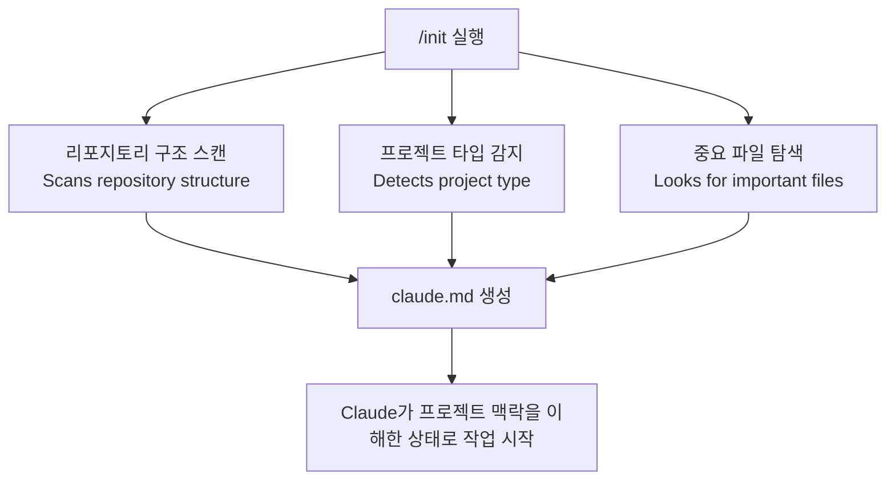
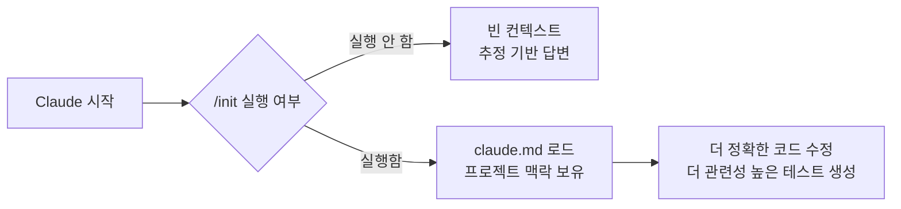
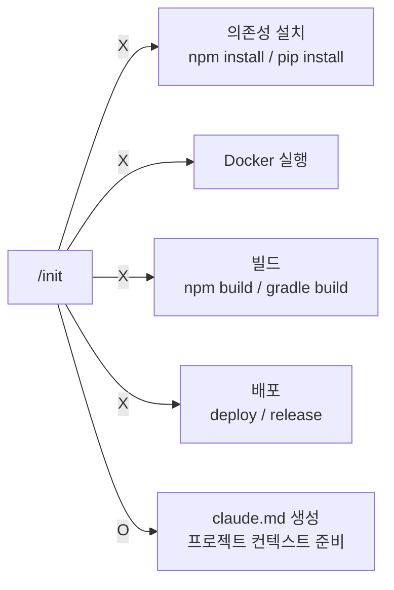

# 05. `/init` 명령어 — AI 작업 환경을 제대로 시작하는 법

> `/init` 없이 Claude에게 코드를 맡기는 것은,
> 아무것도 모르는 신입에게 코드베이스 설명도 없이 작업을 시키는 것과 같다.

## 한눈에 보기

| 항목 | 설명 |
|---|---|
| 명령어 | `/init` |
| 하는 일 | 현재 프로젝트를 Claude가 이해할 수 있도록 초기화 |
| 결과물 | `claude.md` 파일 생성 |
| 하지 않는 일 | 의존성 설치, 빌드, Docker 실행, 배포 |

## 핵심 결론

`/init`은 인프라를 건드리는 명령어가 아니다.
**Claude가 이 프로젝트를 이해하기 위한 컨텍스트를 준비하는 명령어**다.

> It Prepares Context, Not Infrastructure.

## `/init`이 하는 일



### 내부에서 벌어지는 일

| 단계 | 설명 | 예시 |
|---|---|---|
| 구조 스캔 | 디렉터리 구조, 배포 방식, 문서 위치 파악 | `src/`, `infra/`, `docs/` 등 |
| 프로젝트 타입 감지 | 사용 언어와 프레임워크 식별 | Python, Node, Go, Java, Scala 등 |
| 중요 파일 탐색 | 의존성·환경 파일 확인 | `README.md`, `package.json`, `pyproject.toml`, `requirements.txt`, `Dockerfile`, `.env` |
| 메모리 초기화 | 기본 프로젝트 메모리 설정 | `claude.md` 생성 |
| 도구 컨텍스트 준비 | Claude가 사용할 도구 환경 정리 | — |

## `/init` 전후 비교

| 상태 | Claude의 상황 |
|---|---|
| `/init` 전 | **Reasoning in a vacuum** — 아무것도 모르는 상태에서 추정으로 답변 |
| `/init` 후 | 리포 구조, 언어 생태계, 코드 변경 맥락, 테스트 기준을 알고 작업 |



## 언제 `/init`을 실행해야 하는가

| 상황 | 이유 |
|---|---|
| 새 프로젝트 시작 | 기본 bootstrap 구조 생성 |
| 다른 사람의 리포를 클론한 직후 | 프로젝트 전체 맥락 파악 |
| Claude가 엉뚱한 답변을 반복할 때 | 컨텍스트가 오염되거나 누락된 신호 |
| 구조적으로 큰 변경이 있는 브랜치로 전환 시 | 변화된 구조를 Claude에게 다시 알려주기 위해 |

## `/init`이 하지 않는 일

아래 작업은 `/init`의 역할이 아니다.



## 컨텍스트 엔지니어링과의 연결

컨텍스트 엔지니어링에서 배운 원칙과 그대로 연결된다.

| 컨텍스트 레이어 | `/init`이 채워주는 것 |
|---|---|
| Information Context | 현재 프로젝트 구조, 기술 스택, 의존성 |
| Task Context | 어떤 종류의 프로젝트인지 (타입, 빌드 방식) |
| Memory Context | `claude.md`에 기록된 프로젝트 기준 정보 |

> 모델은 **현재 환경을 알고 있을 때** 가장 좋은 결과를 낸다.
> `/init`은 그 환경을 세팅하는 첫 번째 단계다.

## 30초 요약

```text
/init은 Claude에게 "이 프로젝트가 무엇인지" 알려주는 명령어다.

실행하면 claude.md 파일이 만들어지고,
그 파일을 기반으로 Claude는 더 정확하게 작업한다.

빌드도, 배포도, 설치도 하지 않는다.
오직 컨텍스트만 준비한다.

새 프로젝트를 시작할 때,
낯선 리포를 클론했을 때,
Claude가 이상한 답을 반복할 때 — 실행하라.
```

## 한 문장 결론

`/init`의 본질은, Claude가 작업을 시작하기 전에 **이 프로젝트가 어떤 곳인지 미리 알게 만드는 것**이다.
