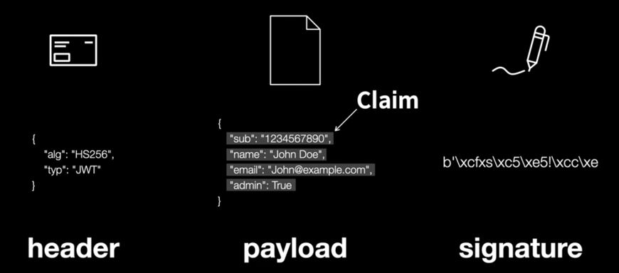
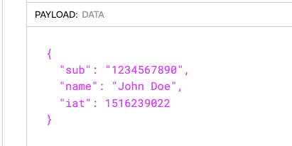

# 참고

> - 얄코: https://www.youtube.com/watch?v=1QiOXWEbqYQ
> - 생활코딩: https://www.youtube.com/watch?v=36lpDzQzVXs
> - [우리는 왜 JWT를 사용하는가? / JWT 사용 이유](https://puleugo.tistory.com/138)

<!-- TOC -->
* [참고](#참고)
* [JWT](#jwt)
  * [header](#header)
    * [type](#type)
    * [alg](#alg)
  * [payload](#payload)
    * [Claim](#claim)
    * [변조 위험](#변조-위험)
  * [verify signature](#verify-signature)
    * [서명의 원리 - 내가 인증(서명)했다는 것을 어떻게 보장하지?](#서명의-원리---내가-인증서명했다는-것을-어떻게-보장하지)
* [쿠키 Vs. JWT](#쿠키-vs-jwt)
  * [Cookie-based Session Management](#cookie-based-session-management)
* [세션과 JWT](#세션과-jwt)
  * [stateful Vs. stateless](#stateful-vs-stateless)
  * [JWT는 세션을 대체할 수 있는가?](#jwt는-세션을-대체할-수-있는가)
* [JWT를 쓸만한 서비스인지를 따져보라](#jwt를-쓸만한-서비스인지를-따져보라)
* [JWT의 단점은?](#jwt의-단점은)
  * [인증과 인가](#인증과-인가)
  * [어떤 사이트나 서비스에 사용자가 로그인해있다는 사실을 서버가 어떻게 인지할까](#어떤-사이트나-서비스에-사용자가-로그인해있다는-사실을-서버가-어떻게-인지할까)
    * [전통적인 방식 - 세션](#전통적인-방식---세션)
<!-- TOC -->

---

# JWT

- header, payload, verify signature 로 구성

## header

- header를 Base64 디코딩해보면 2가지 정보(type, arg)가 담겨있다.

### type

- type은 'jwt' 고정.

### alg

- 서명값(signature)를 만드는데 사용되는 알고리즘이 지정된다.
  - HS256 등..
- 1번 header와 2번 payload, 그리고 서버에 감춰놓은 비밀 값 이 셋을 암호화 알고리즘에 넣고 돌리면 서명값이 나오는다.
- 암호화 알고리즘이 단방향으로는 계산이 되어도 반대쪽으로는 안 되는거라서, 서버만 알고 있는 값을 비밀값을 찾아낼 방법이 없음.
  - 2번 payload를 조작해도 3번 signature가 달라져버리므로 조작이 불가.
- 3번 서명 값과 계산값이 일치하고, 유효기간도 지나지 않았다면 그 사용자는 로그인 된 회원으로서 인가를 받는다.

## payload

- payload의 각 부분을 `Claim(주장)` 이라고한다.
  - 왜 주장이라고 할까? 👉 **페이로드의 내용을 곧이 곧대로 믿을 수 없기 때문.**
    - 이 주장을 믿을 수 있는 방법이 `서명`이다.
      - 서명만 있으면 이 내용이 누가 보낸 것인지 확신할 수 있다.

### Claim

- Base64로 디코딩 하면 JSON 형태로 여러 정보들이 담겨 있음
  - 이 토큰을 누가 누구에게 발급했는지
  - 이 토큰이 언제까지 유효한지 
  - 서비스가 사용자에게 이 토큰을 통해 공개하기 원하는 내용
    - 사용자의 닉네임
    - 서비스상의 레벨
    - 관리자 여부
- 위 같은 정보들을 서비스 측에 원하는대로 토큰에 담을 수 있다.
- 토큰에 담긴 사용자 정보등의 데이터를 `Claim`이라고 함.

### 변조 위험

- admin값을 true로 변조하는 등의 위험이 있음
- 👉 그래서 header와 signature가 있는 것임.

## verify signature

### 서명의 원리 - 내가 인증(서명)했다는 것을 어떻게 보장하지?

---

# 쿠키 Vs. JWT

## Cookie-based Session Management

### 세션 방식의 단점

- 사용자의 정보(유저 이름 등)을 알기 위해서는 서버에 조회를 다시해야한다.
  - `session id`에는 그런 정보는 포함되어 있지 않기 때문
- 서버에 접속할 때마다 세션 테이블을 확인해야한다.
  - 사용자가 새로운 장치로 접속할 때마다, 세션 ID가 다시 생겨야하기 때문에 세션 테이블에 너무 많은 쓰기 작업 & 데이터 쌓인다. 
    - 👉 데이터베이스의 혹사

## JWT

- 이 JWT 토큰을 가지고 있는 유저는 **로그인 한 적 있는 유저**라는 뜻...!
  - 클라이언트는 이 토큰을 쿠키나 로컬 스토리지에 저장한다.

# 세션과 JWT

## stateful Vs. stateless

## JWT는 세션을 대체할 수 있는가?

- 세션을 대체하기에는 큰 단점이 있음.
- 

# JWT를 쓸만한 서비스인지를 따져보라

# JWT의 단점은?

## 인증과 인가

- 인증(Authentication)
  - 특정 서비스에 일정 권한이 주어진 사용자임을 ID/PW 등을 통해
- 인가(Authorization)
  - 인증을 한 사용자가

## 어떤 사이트나 서비스에 사용자가 로그인해있다는 사실을 서버가 어떻게 인지할까

### 전통적인 방식 - 세션

