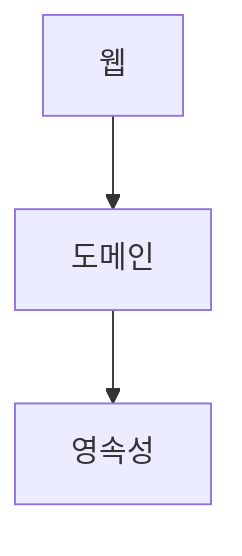

## 02 계층의 문제점

- 3계층 아키텍처
  - 웹 계층이 요청을 받아 도메인 계층의 서비스로 라우팅.
  - 서비스에서는 비즈니스 로직을 수행하고, 영속성 계층의 컴포넌트를 호출해 데이터베이스에 들어있는 도메인 엔티티의 현재 상태를 조회하거나 수정한다.

###  계층형 아키텍처의 문제점

- 변화에 매우 취약해서 유지보수하기 어려움.
- 나쁜 의존성이 스며들어, 소프트웨어를 변경하기 점점 더 어렵게 만듦.
- 계층은 아키텍처를 올바른 방향으로 유지하는데 필요한 가드레일을 충분히 제고앟지 않음.
- 유지보수성을 유지하기 위해서, 인간의 규유과 성실함에 너무 많의 의존해야함.

## 데이터베이스 주도 설계를 조장한다

## 지름길을 조장한다

### 규칙을 강제한다는 것

- 규칙을 강제한다는 것은 시니어 개발자가 코드 리뷰를 하는 것이 아니라 규칙을 위반했을 때 빌드가 실패하는 자동으로 강제되는 규칙을 의미.

## 테스트하기 어려워진다

## 유스케이스를 숨긴다

- 도메인 서비스가 고도로 전문화되고, 좁아서 각각이 단 하나의 유스케이스만 제공한다면 어떨까
  - UserService에서 사용자 등록 유스케이스를 검색할 필요 없이 RegisterUserService를 열고 곧바로 작업을 시작할 수 있음.

## 병렬 작업이 어려워진다

## 이것이 유지보수 가능한 소프트웨어를 구축하는 데 어떻게 도움이 될까?

