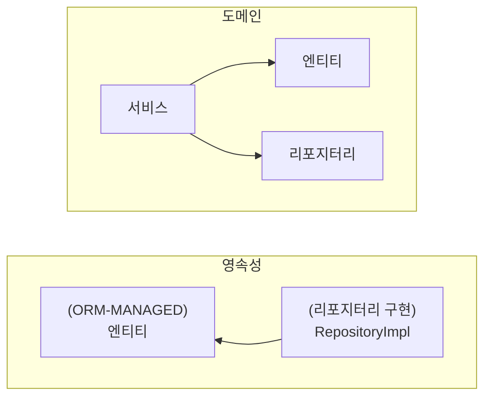
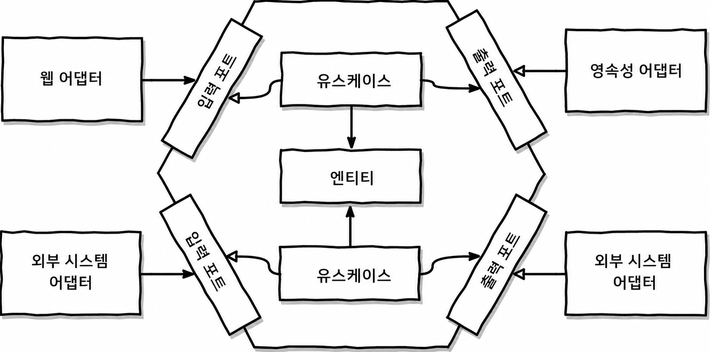
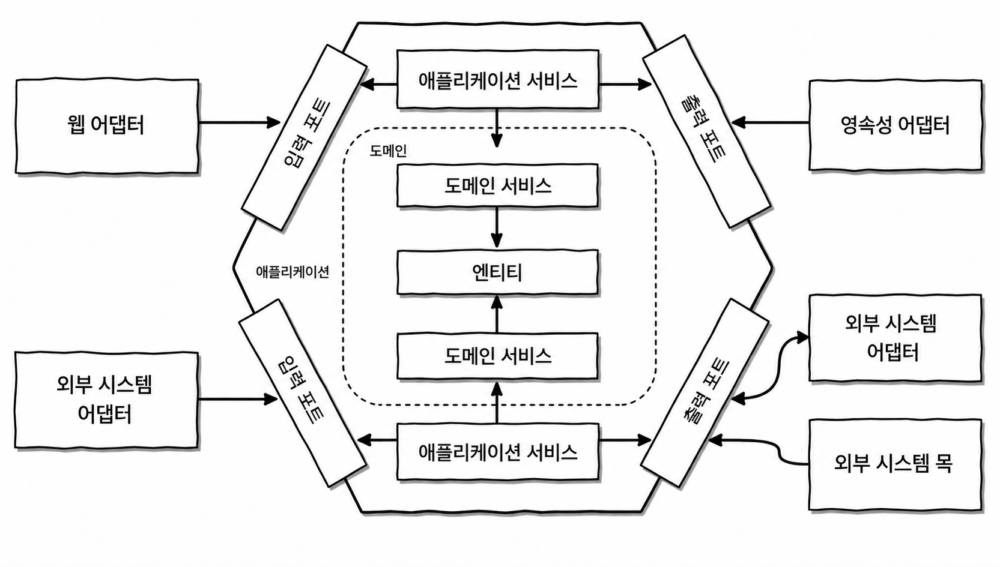

## 의존성 역전 원칙(DIP, Dependency Inversion Principle)

## 헥사고날 아키텍처

### DDD 헥사고날 아키텍처

- 애플리케이션 서비스: 
  - 입출력 포트와 도메인 서비스 간의 번역을 처리함으로써 도메인 서비스를 외부 세계로부터 보호
  - 잠재적으로 도메인 서비스간의 조율 담당
- 도메인 서비스라고 적힌 사각형은 유스케이스 박스와 같은 의미 

## 이것이 유지보수 가능한 소프트웨어를 구축하는 데 어떻게 도움이 될까?

1. 클린 아키테거, 헥사고날 아키텍처, 포트와 어댑터 아키텍처. 무엇이라고 칭하든 도메인 코드가 외부에 대한 의존성을 갖지 않도록 의존성을 역전시킴.
2. 이렇게함으로써 도메인 로직을 모든 영속성 및 UI에 특화된 문제로부터 분리하고, 코드베이스를 변경하는 이유의 수를 줄일 수 있음.
   1. **그리고 변경의 이유가 적을수록 유지보수성이 개선됨.**
3. 그럼 도메인 코드는 비즈니스 문제에 가장 적합한 형태로 자유롭게 모델링되고, 영속성과 UI코드는 영속성과 UI 문제에 가장 적합한 형태로 자유롭게 모델링될 수 있음.

