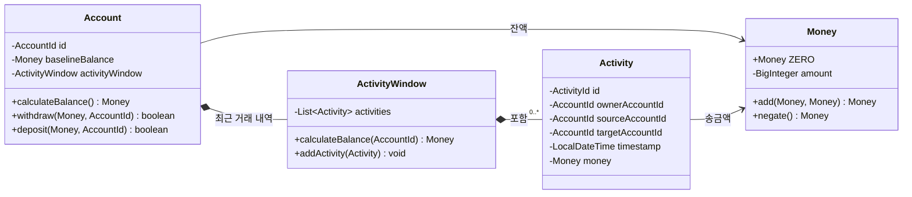
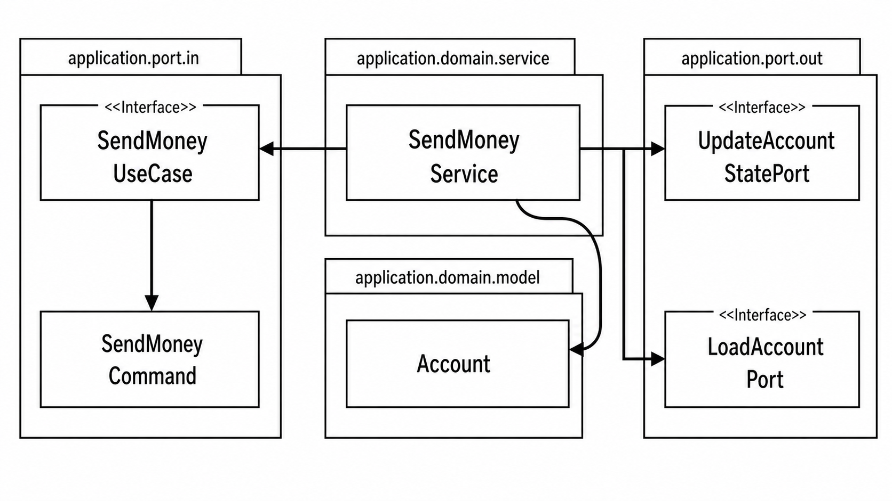

<!-- TOC -->
* [들어가며](#들어가며)
* [도메인 모델 구현하기](#도메인-모델-구현하기)
  * [자금 이체 유스케이스 객체지향적으로 모델링하기](#자금-이체-유스케이스-객체지향적으로-모델링하기)
    * [엔티티 설계](#엔티티-설계)
* [유스케이스 간단 소개](#유스케이스-간단-소개)
  * [유스케이스가 실제로 하는 일](#유스케이스가-실제로-하는-일)
  * [자금 이체 유스케이스 구현](#자금-이체-유스케이스-구현)
* [입력 검증](#입력-검증)
* [생성자의 위력](#생성자의-위력)
* [다양한 유스케이스에 대한 다양한 입력 모델](#다양한-유스케이스에-대한-다양한-입력-모델)
* [비즈니스 규칙 검증](#비즈니스-규칙-검증)
* [풍부한 도메인 모델 vs. 빈약한 도메인 모델](#풍부한-도메인-모델-vs-빈약한-도메인-모델)
* [다양한 유스케이스에 대한 다양한 출력 모델](#다양한-유스케이스에-대한-다양한-출력-모델)
* [읽기 전용 유스케이스는 어떻게 할까?](#읽기-전용-유스케이스는-어떻게-할까)
* [이것이 유지보수 가능한 소프트웨어를 구축하는 데 어떻게 도움이 될까?](#이것이-유지보수-가능한-소프트웨어를-구축하는-데-어떻게-도움이-될까-)
<!-- TOC -->
# 들어가며

- 이번 장에서는 앞서 논의한 아키텍처를 실제 코드로 구현하는 방법을 살펴봄.
- 우리 아키텍처에서는 애플리케이션, 웹, 영속성 계층이 매우 느슨하게 결합돼있고, 그 덕분에 도메인 코드를 자유롭게 모델링 가능.
  -  예를 들면 DDD, 풍부한 도메인 모델이나 빈약한 도메인 모델 등의 모델링 스타일 자유롭게 선택가능.
- 이번 장에서는 앞에서 소개한 헥사고날 아키텍처 스타일 내에서 유스케이스 구현하는 방법 설명함. 
- 도메인 중심 아키텍처에 적합하도록 도메인 엔티티부터 시작해서 이를 기반으로 유스케이스 구축해나감.

# 도메인 모델 구현하기

## 자금 이체 유스케이스 객체지향적으로 모델링하기

### 엔티티 설계

- 한 계좌에서 다른 계좌로 자금을 이체하는 유스케이스를 구현하려함.
- 객체지향적으로 모델링하는 방법 중 하나는 '출금계좌에서 출금'하고, '입금계좌에 입금'하게 하는 Account 엔티티를 생성하는 것



| 구성 요소 | 쉽게 말하면 | 역할 |
| --- | --- | --- |
| `Account` | 특정 시점의 계좌 상태 | 기준 잔액과 최근 거래 내역을 이용해 현재 잔액을 계산하고 입금·출금을 처리한다. |
| `baselineBalance` | 최근 거래 내역을 기록하기 시작하기 직전의 잔액 | 모든 과거 거래를 다시 계산하지 않도록 계산의 출발점이 된다. |
| `Activity` | 입금 또는 출금 한 건 | 어느 계좌에서 어느 계좌로 얼마가 이동했는지를 기록한다. |
| `ActivityWindow` | 최근 며칠 또는 몇 주 동안 발생한 거래 내역 묶음 | 모든 과거 거래가 아닌, 현재 잔액 계산에 필요한 최근 거래만 보관한다. |

예를 들어 `ActivityWindow`가 8월 1일부터의 거래만 보관한다면 다음과 같이 현재 잔액을 계산한다.

| 계산 항목 | 금액 | 의미 |
| --- | ---: | --- |
| `baselineBalance` | 100,000원 | 8월 1일 첫 거래가 발생하기 직전의 잔액 |
| 입금 `Activity` | +30,000원 | `ActivityWindow`에 보관된 최근 입금 |
| 출금 `Activity` | -10,000원 | `ActivityWindow`에 보관된 최근 출금 |
| 현재 잔액 | **120,000원** | 100,000원 + 30,000원 - 10,000원 |

즉, 현재 잔액을 구하기 위해 계좌가 만들어진 이후의 모든 거래를 불러올 필요가 없다. 과거 거래가 이미 반영된 `baselineBalance`에 `ActivityWindow`의 최근 거래만 더하고 빼면 된다.


# 유스케이스 간단 소개

## 유스케이스가 실제로 하는 일

- 보통 유스케이스는 다음과 같은 단계를 따름

```
1. 입력을 받는다.
2. 비즈니스 규칙을 검증한다.
3. 모델 상태를 조작한다.
4. 출력을 반환한다. 
```

- 유스케이스는 인커밍 어댑터로부터 입력을 받음.
- 입력 검증을 하지 않는 이유?
  - **_유스케이스 코드는 도메인 로직에만 관심을 가져야하고, 입력 검증으로 오염시켜선는 안 된다고 생각하기 때문._**
  - 따라서, 입력 검증은 다른 곳에서 수행할 것임.
- 유스케이스는 **비즈니스 규칙을 검증할 책임 존재.**
  - 비즈니스 규칙 검증 책임을 도메인 엔티티와 공유.
  - 이번 장 후반부에서 입력 검증과 비즈니스 규칙 검증 간의 차이점에 대해 논의할 것임.
- 비즈니스 규칙이 충족되면 유스케이스는 입력을 기반으로 모델의 상태를 어떤 식으로든 조작함.
  - 일반적으로 도메인 객체의 상태를 변경하고 영속화. 
  - 유스케이스가 영속성 외의 다른 부수효과를 유발할 경우 각 부수효과에 대해 적절한 어댑터를 호출함
- 마지막 단계: 아웃고잉 어댑터의 반환 값을 출력 객체로 변환. 해당 객체는 호출한 어댑터로 반환됨.


## 자금 이체 유스케이스 구현

- 2장 '계층의 문제점'에서 살펴본 광범위한 서비스의 문제를 방지하기 위해 모든 유스케이스를 하나의 서비스 클래스에 넣는 대신 **각 유스케이스마다 별도의 서비스 클래스를 생성함.**

```java
package io.refactoring.buckpal.application.domain.service;

@RequiredArgsConstructor
public class SendMoneyService implements SendMoneyUseCase {

  private final LoadAccountPort loadAccountPort;
  private final UpdateAccountStatePort updateAccountStatePort;

  @Override
  @Transactional
  public boolean sendMoney(SendMoneyCommand command) {
    // TODO: 비즈니스 규칙 검증
    // TODO: 모델 상태 조작
    // TODO: 출력 반환
  }
}
```

- 이 서비스에서는 SendMoenyUseCase 인커핑 포트 인터페이스를 구현하고, 
  - LoadAccountPort 아웃고잉 포트 인터페이스를 호출해 계좌를 로드한 후,  
    - UpdateAccountStatePort 포트를 호출해 업데이트된 계정 상태를 데이터베이스에 영속화한다
- @Transactional 애너테이션을 통해 데이터베이스 트랜잭션의 경계도 설정한다. (자세한 내용은 7장 영속성 어댑터 구현하기 에서 다룸)



> _서비스는 유스케이스를 구현하고, 도메인 모델을 수정하며, 아웃고잉 포트를 통해 수정된 상태를 영속화한다._

### (참고) DDD Repository 패턴과의 관계

- 예제의 UpdateAccountStatePort와 LoadAccountPort는 영속성 어댑터에의해 구현되는 포트 인터페이스.
- 이 두 포트를 함께 사용하는 일이 잦다면 더 넓은 범위의 인터페이스로 결합도 가능. 
  - DDD 용어로 표현 시 해당 인터페이스를 AccountRepository라고 부를 수 있음.
- 위 예제와 책의 나머지 부분에서는 'Repository'라는 이름을 영속성 어댑터에서만 사용하기로 했지만 다름 이름을 사용해도됨. 
  


# 입력 검증
# 생성자의 위력
# 다양한 유스케이스에 대한 다양한 입력 모델
# 비즈니스 규칙 검증
# 풍부한 도메인 모델 vs. 빈약한 도메인 모델
# 다양한 유스케이스에 대한 다양한 출력 모델
# 읽기 전용 유스케이스는 어떻게 할까?
# 이것이 유지보수 가능한 소프트웨어를 구축하는 데 어떻게 도움이 될까? 
