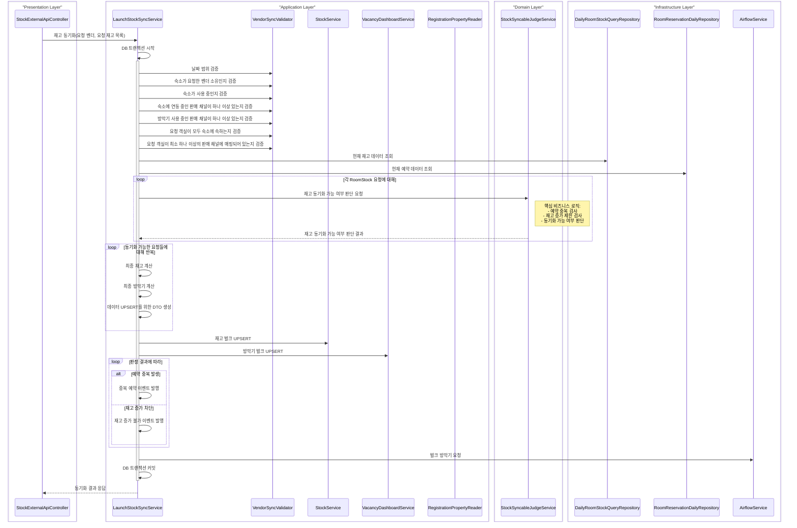
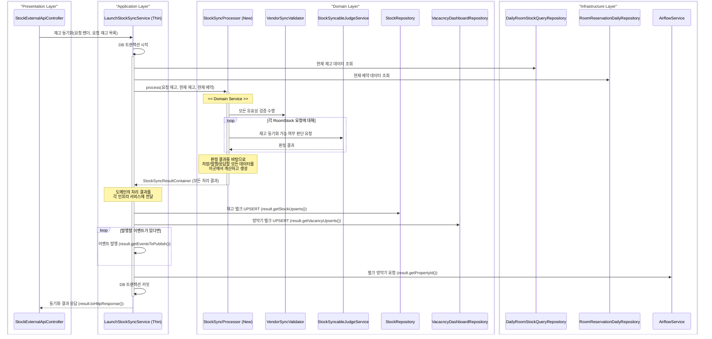

```mermaid
sequenceDiagram
    
    box "Presentation Layer"
        participant c as StockExternalApiController
    end
    
    box "Application Layer"  
        participant lss as LaunchStockSyncService
        participant vsv as VendorSyncValidator
        participant ss as StockService
        participant vs as VacancyDashboardService
        participant pr as RegistrationPropertyReader
    end
    
    box "Domain Layer"
        participant sjs as StockSyncableJudgeService
    end
    
    box "Infrastructure Layer"
        participant sqr as DailyRoomStockQueryRepository
        participant rr as  RoomReservationDailyRepository
        participant airs as AirflowService
    end
    
    c ->> lss: 재고 동기화(요청 벤더, 요청 재고 목록)
    lss ->> lss: DB 트랜잭션 시작
    activate lss
    
    %% 1. 요청 유효성 검증
    lss ->>vsv: 날짜 범위 검증
    lss->>vsv: 숙소가 요청한 벤더 소유인지 검증
    lss->>vsv: 숙소가 사용 중인지 검증
    lss->>vsv: 숙소에 연동 중인 판매 채널이 하나 이상 있는지 검증
    lss->>vsv: 방막기 사용 중인 판매 채널이 하나 이상 있는지 검증
    lss ->> vsv: 요청 객실이 모두 숙소에 속하는지 검증
    lss ->> vsv: 요청 객실이 최소 하나 이상의 판매 채널에 매핑되어 있는지 검증
    
    %% 2. 현재 데이터 조회
    lss->>sqr: 현재 재고 데이터 조회
    lss->>rr: 현재 예약 데이터 조회
    
    %% 3. 동기화 가능 여부 판단
    loop 각 RoomStock 요청에 대해
        lss->>sjs: 재고 동기화 가능 여부 판단 요청
        note right of sjs: 핵심 비즈니스 로직:<br>- 예약 중복 검사<br>- 재고 증가 제한 검사<br>- 동기화 가능 여부 판단
        sjs-->>lss: 재고 동기화 가능 여부 판단 결과
    end
    
    %% 4. 재고 및 방막기 계산
    loop 동기화 가능한 요청들에 대해 반복
        lss ->> lss: 최종 재고 계산
        lss ->> lss: 최종 방막기 계산
        lss ->> lss: 데이터 UPSERT를 위한 DTO 생성
    end
    
    %% 5. 데이터 저장
    lss->>ss: 재고 벌크 UPSERT
    lss->>vs: 방막기 벌크 UPSERT
    
    %% 6. 이벤트 발행
    loop 판정 결과에 따라
        alt 예약 중복 발생
            lss->>lss: 중복 예약 이벤트 발행
        else 재고 증가 차단
            lss->>lss: 재고 증가 불가 이벤트 발행
        end
    end
    
    %% 7. 외부 시스템 연동
    lss->>airs: 벌크 방막기 요청
    lss ->> lss: DB 트랜잭션 커밋
    deactivate lss
    
    lss-->>c: 동기화 결과 응답
 
    
```

```mermaid
sequenceDiagram

    box "Presentation Layer"
        participant c as StockExternalApiController
    end

    box "Application Layer"
        participant lss as LaunchStockSyncService (Thin)
    end

    box "Domain Layer"
        participant ssp as StockSyncProcessor (New)
        participant vsv as VendorSyncValidator
        participant sjs as StockSyncableJudgeService
        participant sr as StockRepository
        participant vdr as VacacncyDashboardRepository
    end

    box "Infrastructure Layer"
        participant sqr as DailyRoomStockQueryRepository
        participant rr as RoomReservationDailyRepository
        participant airs as AirflowService
    end

    c ->> lss: 재고 동기화(요청 벤더, 요청 재고 목록)
    lss ->> lss: DB 트랜잭션 시작
    activate lss

%% 1. 응용 서비스가 인프라를 통해 '사전 데이터' 조회
    lss ->> sqr: 현재 재고 데이터 조회
    lss ->> rr: 현재 예약 데이터 조회


%% . 도메인 계층으로 비즈니스 프로세스 전체 위임
    lss ->>+ ssp: process(요청 재고, 현재 재고, 현재 예약)

%% (StockSyncProcessor 내부 동작)
    note over ssp: << Domain Service >>

%% 요청 유효성 검증
    ssp ->> vsv: 모든 유효성 검증 수행

%%  동기화 가능 여부 판단
    loop 각 RoomStock 요청에 대해
        ssp ->> sjs: 재고 동기화 가능 여부 판단 요청
        sjs -->> ssp: 판정 결과
    end

%% 1-4. 재고, 방막기, 이벤트, 응답 등 모든 결과 계산
    note over ssp: 판정 결과를 바탕으로<br>저장/발행/응답할 모든 데이터를<br>이곳에서 계산하고 생성

    ssp -->>- lss: StockSyncResultContainer (모든 처리 결과)

%% 2. 응용 서비스는 인프라스트럭처에 결과 전달만 수행
    note over lss: 도메인의 처리 결과를<br>각 인프라 서비스에 전달

    lss ->> sr: 재고 벌크 UPSERT (result.getStockUpserts())
    lss ->> vdr: 방막기 벌크 UPSERT (result.getVacancyUpserts())

    loop 발행할 이벤트가 있다면
        lss ->> lss: 이벤트 발행 (result.getEventsToPublish())
    end

    lss ->> airs: 벌크 방막기 요청 (result.getPropertyId())

    lss ->> lss: DB 트랜잭션 커밋
    deactivate lss

    lss -->> c: 동기화 결과 응답 (result.toHttpResponse())
```
