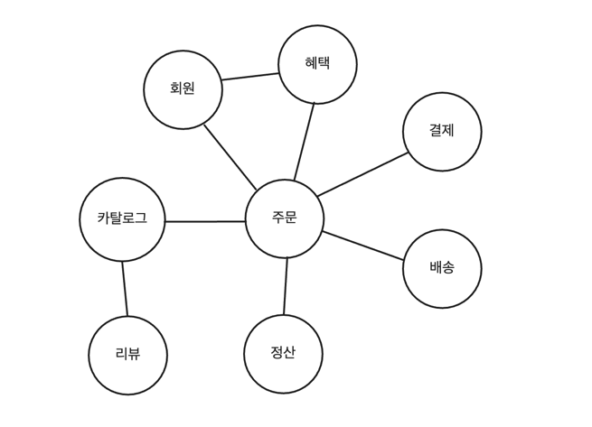
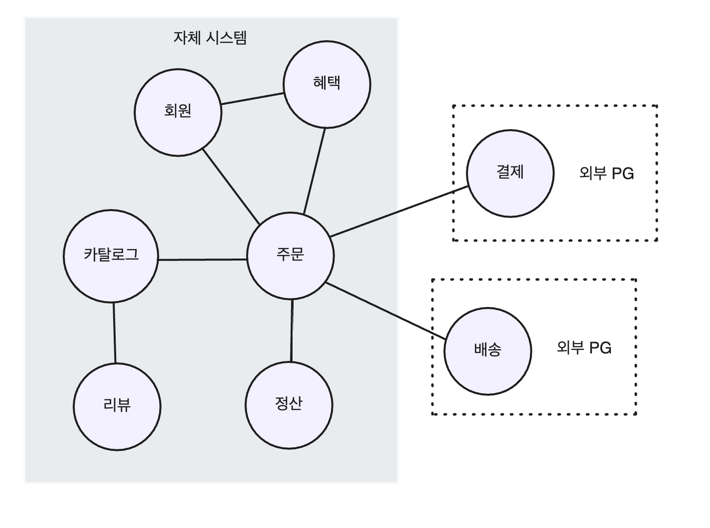

<!-- TOC -->
* [1.1 도메인이란?](#11-도메인이란)
  * [도메인 - 소프트웨어로 해결하고자 하는 문제 영역](#도메인---소프트웨어로-해결하고자-하는-문제-영역-)
  * [한 도메인은 다시 하위 도메인으로 나눌 수 있다](#한-도메인은-다시-하위-도메인으로-나눌-수-있다)
  * [도메인이 제공해야할 모든 기능을 직접 구현하는 것은 아니다](#도메인이-제공해야할-모든-기능을-직접-구현하는-것은-아니다)
* [1.2 도메인 전문가와 개발자 간 지식 공유](#12-도메인-전문가와-개발자-간-지식-공유)
* [1.3 도메인 모델](#13-도메인-모델)
* [1.4 도메인 모델 패턴](#14-도메인-모델-패턴)
  * [아키텍처 구성](#아키텍처-구성)
* [1.5 도메인 모델 도출](#15-도메인-모델-도출)
* [1.6 엔티티와 밸류](#16-엔티티와-밸류)
  * [1.6.1 엔티티](#161-엔티티)
  * [1.6.2 엔티티의 식별자 생성](#162-엔티티의-식별자-생성)
  * [1.6.3 밸류 타입](#163-밸류-타입)
  * [1.6.4 엔티티 식별자와 밸류 타입 구분](#164-엔티티-식별자와-밸류-타입-구분-)
  * [1.6.5 도메인 모델에 set 메서드 넣지 않기](#165-도메인-모델에-set-메서드-넣지-않기)
* [1.7 도메인 용어와 유비쿼터스 언어](#17-도메인-용어와-유비쿼터스-언어)
<!-- TOC -->


---

- 키워드
  - 도메인
  - 도메인 모델
  - 엔티티와 밸류
  - 도메인 용어


---

# 1.1 도메인이란?

## 도메인 - 소프트웨어로 해결하고자 하는 문제 영역

- 필자는 책을 사기 위해 온라인 서점을 이용. (장바구니, 결제, 배송 등)
- 개발자 입장에서, 온라인 서점은 구현해야할 소프트웨어의 대상이 됨.
  - 온라인 서점 소프트웨어의 제공 기능
    - 상품 조회
    - 구매
    - 결제
    - 배송 추적
    - ...
- 이 때 온라인 서점은 ***소프트웨어로 해결하고자 하는 문제 영역***이 된다.
  - 즉, 여기서는 `온라인 서점`이 `도메인`에 해당한다.

## 한 도메인은 다시 하위 도메인으로 나눌 수 있다



_(도메인은 여러 하위 도메인으로 구성된다.)_

- 하위 도메인 간의 연동
  - 카탈로그 하위 도메인은 고객에게 구매할 수 있는 상품 목록 제공.
  - 주문 하위 도메인은 고객 주문 처리. 혜택 하위 도메인은 쿠폰이나 특별 할인 같은 서비스 제공
  - ...
- 👉 **_한 하위 도메인은 다른 하위 도메인과 연동하여 완전한 기능 제공_**
  - ex) 고객이 물건을 구매하면 `주문`, `결제`, `배송`, `혜택` **하위 도메인의 기능이 엮이게 된다.**

## 도메인이 제공해야할 모든 기능을 직접 구현하는 것은 아니다



- 특정 도메인(ex. 온라인 서점)을 위한 소프트웨어라고 해서, 모든 기능을 직접 구현하는 것은 아님.
  - 보통 자체적으로 배송 시스템을 구축하지 않고, 외부 배송 업체 시스템을 사용. 배송 추적 정보를 제공하는 데 **필요한 기능만 일부 연동**
  - 결제 시스템도 직접 구현하기 보다 보통 결제 대행업체를 이용해서 처리.
- ***하위 도메인을 어떻게 구성할지***는 상황에 따라 달라진다.
  - ex) 기업 고객 대상으로 대형 장비를 판매하는 곳
    - 온라인 카탈로그 제공, 주문서 받는 정도만 필요.
    - 온라인 결제, 배송 추적 같은 기능은 불필요.
  - ex) 의류, 액세서리 등 일반 고객 대상으로 할 경우
    - 카탈로그, 리뷰, 주문, 결제, 배송, 회원 기능 등 필요.


<br>

# 1.2 도메인 전문가와 개발자 간 지식 공유

- 코딩에 앞서 요구사항을 올바륵르게 이해하는 것이 중요.
  - 요구사항을 올바르게 이해 못하면 엉뚱한 기능을 만들게 된다.
  - 잘못 개발한 코드를 수정해서 고치는 것은 많은 노력이 든다.
- 요구사항을 올바르게 이해하려면?
  - 👉 **_개발자와 전문가가 직접 대화_**


<br>

# 1.3 도메인 모델

// todo: 도메인 모델 객체 다이어그램 추가.

- 도메인 모델?
  - 특정 도메인을 '개념적으로' 표현한 것. 도메인 자체를 이해하기 위한 개념 모델
  - 도메인 모델을 사용하면 여러 관계자 동일한 모습으로 도메인 이해 가능
- 상태 다이어그램을 이용한 주문 상태 모델링
  - 도메인 모델은 객체 다이어그램 뿐만 아니라, 상태 다이어그램, 수학 공식을 활용한 모델 등 도메인 이해에 도움된다면 방식은 중요치 않음.

<br>

# 1.4 도메인 모델 패턴

> _여기서의 도메인 모델은 마틴 파울러 책의 '도메인 모델 패턴'을 의미._

## 아키텍처 구성

- 표현
  - 사용자 요청 처리, 사용자에게 정보 보여줌.
  - 사용자는 유저 뿐만 아니라 외부 시스템도 포함.
- 응용
  - 사용자가 요청한 기능 실행.
  - 업무 로직을 직접 구현 X. 도메인 계층 조합해서 기능 실행
- 도메인
  - 시스템이 제공할 도메인 규칙 구현
- 인프라스트럭처
  - 데이터베이스, 메시징 시스템 등 외부 시스템과의 연동 처리

---

- 주문 예시
  - 주문과 관련된 중요한 업무 규칙은 도메인 모델인 Order, OrderState에 구현.
- 핵심 규칙을 구현한 코드는 도메인 모델에만 위치.
  - 👉 규칙이 바뀌거나 확장해야할 때 다른 코드에 영향을 덜주고 변경 내역을 모델에 반영 가능

<br>

# 1.5 도메인 모델 도출

- 도메인 모델링은 요구사항 분석에서 시작


<br>

# 1.6 엔티티와 밸류

## 1.6.1 엔티티

- 엔티티는 식별자를가진다.
- 주문의 경우, 주문마다 고유 주문번호를 가지고,
  - 주문 도메인 모델에서 주문에 해당하는 클래스가 Order이므로 Order가 엔티티가 된다.

## 1.6.2 엔티티의 식별자 생성

- 엔티티의 식별자 생성 시점은 도메인의 특징과 사용하는 기술에 따라 달라짐.

## 1.6.3 밸류 타입

- 밸류 타입: 개념적으로 완전한 하나 표현할 때 사용.
- 밸류 타입은 식별자를 가지지 않음.
- 안정성을 위해 주로 불변으로 구현.
- 밸류 객체 데이터 변경 시 기존 데이터 변경이 아닌 변경된 데이터를 갖는 새로운 밸류 객체를 생성.

## 1.6.4 엔티티 식별자와 밸류 타입 구분

```java
public class Order {
  private OrderNo id;
}
```

- OrderNo 밸류 타입  자체로 id가 주문 번호임을 알 수 있다.

## 1.6.5 도메인 모델에 set 메서드 넣지 않기

- setter는 도메인의 핵심 개념이나 의도를 코드에서 사라지게 한다

<br>

# 1.7 도메인 용어와 유비쿼터스 언어

```java
public OrderState {
  STEP1, STEP2, STEP3, STEP4, STEP5
}
```

- 실제 주문 상태는 아래와 같은데 STEP1과 같은 이름에는 도메인 규칙이 드러나지 않음.
  - 결제 대기 중
  - 상품 준비 중
  - 출고 완료됨
  - 배송중
  - 배송 완료됨

```java
public OrderState {
  PAYMENT_WAITING, PREPARING, SHIPPED, DELIVERING, DELIVERED
}
```

- 전문가, 관계자, 개발자가 도메인과 관련된 공통의 언어를 사용하고,
- 대화, 문서, 도메인 모델, 코드, 테스트 등 모든 곳에서 같은 용어 사용.