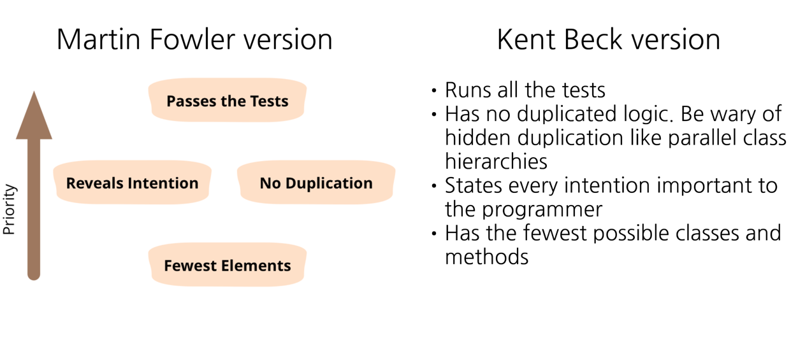

> 자료: https://prezi.com/p/8o0eriyttuu6/simple-design/

<!-- TOC -->
* [좋은 코드의 기준?](#좋은-코드의-기준)
  * [가독성이라는 표현은 해롭다](#가독성이라는-표현은-해롭다)
* [Kent Beck의 Simple Design(revised by Martin Fowler)](#kent-beck의-simple-designrevised-by-martin-fowler)
  * [영록님의 Simple Design: 중복이 없으면서 구성요소가 최소한인 코드](#영록님의-simple-design-중복이-없으면서-구성요소가-최소한인-코드)
  * [좋은 코드를 작성하는 방법 2가지](#좋은-코드를-작성하는-방법-2가지)
* [중복을 제거하는 것은 생각보다 어렵다](#중복을-제거하는-것은-생각보다-어렵다)
  * [Extract Method의 위험성](#extract-method의-위험성)
    * [잘못된 Extract Method는 코드 품질을 더 떨어뜨린다](#잘못된-extract-method는-코드-품질을-더-떨어뜨린다)
    * [Go to Considered Harmful - Dijkstra](#go-to-considered-harmful---dijkstra)
<!-- TOC -->

# 좋은 코드의 기준?

- 코드 품질 기준도 너무 많고,

## 가독성이라는 표현은 해롭다

- 가독성이 좋은 코드가 좋은 코드라고들 한다.
    - 근데 누가 읽기에 좋은 코드여야하는가?
    - 나? 팀장? CTO? 새로온 사람? 왕초보?
    - 사람마다 읽기 쉬운 코드는 다름.
- 그래서 가독성이라는 표현은 해롭다고 생각함. 우리는 가독성이라는 표현을 쓰지 말자.

# Kent Beck의 Simple Design(revised by Martin Fowler)

## 영록님의 Simple Design: 중복이 없으면서 구성요소가 최소한인 코드

1. 테스트 통과
    1. 자동화된 테스트를 만드는 팀에게 테스트 통과는 당연한 얘기임.
2. 의도를 드러내라?
    1. 중요한 원칙이지만, 주관성이 강하고 초중급자들은 실천하기 어려움

👉 결국 **_중복이 없으면서 구성요소가 최소한인 코드_**  가 좋은 코드임.

## 좋은 코드를 작성하는 방법 2가지

1. 코드에서 중복을 제거한다.
2. 그러면서 구성요소를 줄일 방법을 찾는다.

# 중복을 제거하는 것은 생각보다 어렵다

- 예를 들면 중복이 아닌 걸 중복으로 처리한다든가..

## Extract Method의 위험성

### 잘못된 Extract Method는 코드 품질을 더 떨어뜨린다

- 내가 읽고 고쳐야되는 코드가 있는데 이 함수가 갔다가 저 함수 갔다가.. 많이 뒤적거려야하는 경우는 보통 extract Method가 잘못된 경우임.

### Go to Considered Harmful - Dijkstra
