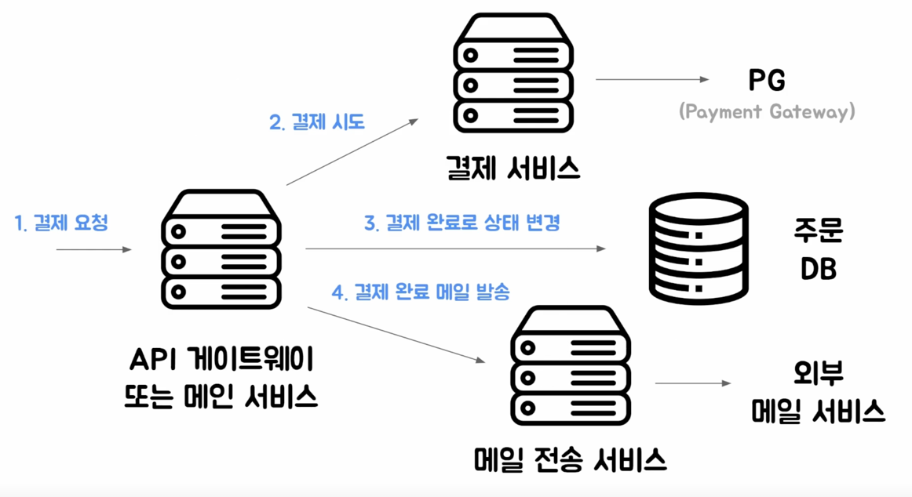
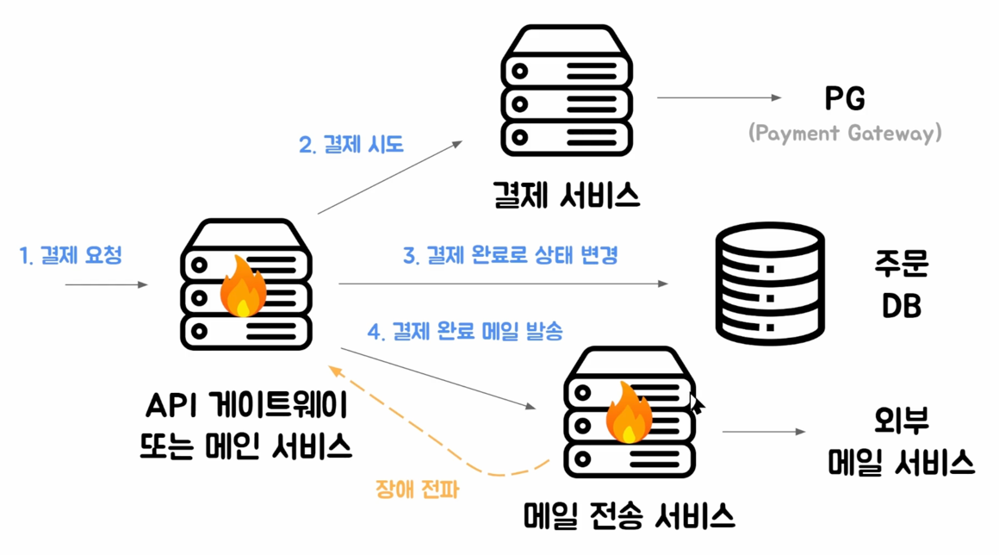
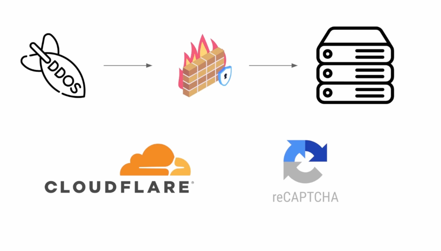
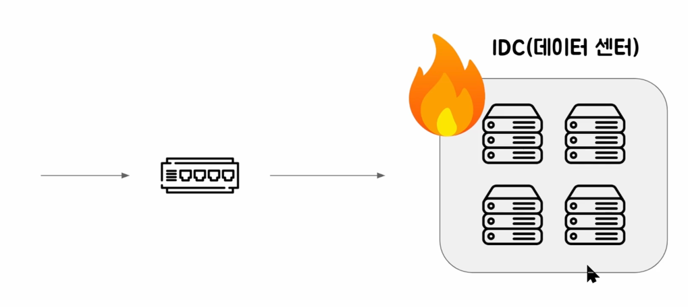
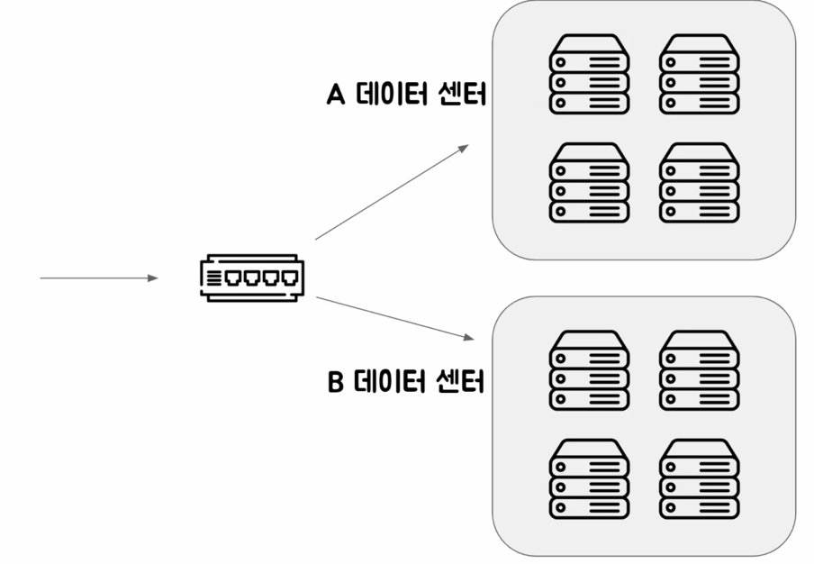

# 4. 서비스 장애는 왜 발생하는가

> 장애가 발생했을 때, 왜 발생했는지 파악하고 재발을 방지하는게 중요.

> **_제일 중요한 것은, 일부 서비스의 장애가 전체 서비스의 장애로 이어지지 않도록 하는 것_**

## 서비스 장애를 유발하는 원인

### 잘못된 코드를 배포

- 테스트 코드 작성을 통해서 방지 가능.
- 테스트에 걸러지지 않은 문제로 장애 발생 가능.

### 부분 서비스의 장애가 전체 장애로 전파

- 테스트 코드로 커버되지 않은 장애 발생. (메일 전송 서비스에 장애 발생)
  - 🔥 클라이언트에게는 장애 발생했다고 응답했지만 _**실제 결제는 완료 되었을 수 있음!!**_

### 여러 장애 원인들..

- 네트워크 장애
  - DNS, 방화벽.. 
- 높은 트래픽
  - 티켓팅 등...

- DDOS 막기

- DB(데이터센터) 이중화

## 그래서 우리가 할 것

- 장애가 다른 애플리케이션으로 전파되는 것을 막고
- 데이터 유실,
- 일관성 깨지는 문제를 어떻게 최소화할지 배울 것이다.