<!-- TOC -->
* [05. 서비스  내부에서 애플리케이션을 나누는 이유](#05-서비스--내부에서-애플리케이션을-나누는-이유)
  * [서비스 내부에서 애플리케이션을 나눈다 = MSA?](#서비스-내부에서-애플리케이션을-나눈다--msa)
  * [모놀리식에서 여러 개의 애플리케이션으로](#모놀리식에서-여러-개의-애플리케이션으로-)
  * [단일 애플리케이션을 '잘' 개발하면 되지 않나?](#단일-애플리케이션을-잘-개발하면-되지-않나)
    * [멀티 애플리케이션의 장애 격리](#멀티-애플리케이션의-장애-격리)
    * [단일 앱을 이중화하면 되지 않을까?](#단일-앱을-이중화하면-되지-않을까)
  * [독립적인 배포와 스케일링](#독립적인-배포와-스케일링)
  * [기술 스택, 언어 선택의 자유로움](#기술-스택-언어-선택의-자유로움)
* [앱 분리는 장점만 있을까?](#앱-분리는-장점만-있을까)
  * [데이터 일관성 문제](#데이터-일관성-문제-)
    * [단일 앱의 간단한 트랜잭션 관리](#단일-앱의-간단한-트랜잭션-관리)
    * [멀티 앱의 트랜잭션 관리의 어려움](#멀티-앱의-트랜잭션-관리의-어려움)
* [그래서 어떻게 하라는 것인가](#그래서-어떻게-하라는-것인가)
  * [팀에서 관리하는 앱을 나눌 필요가 있을까?](#팀에서-관리하는-앱을-나눌-필요가-있을까-)
  * [앱을 나눠서 개발하기로 했다면 챙겨야할 것들](#앱을-나눠서-개발하기로-했다면-챙겨야할-것들)
<!-- TOC -->

> **요약**
> ### 서비스 내부에서 앱을 나누는 이유
> 1. 장애 격리
>    - 서로 다른 리소스를 쓰므로 장애가 전파되지 않고, API 호출에 대한 에러핸들링에 신경쓰면 된다.
> 2. 독립적인 배포와 스케일링 가능.
> 3. 기술 스택, 언어 선택의 자유로움.
> 
> ### 앱 분리의 단점
> - 복잡성, 운영 비용 증가
>   - 서버 간 통신 방식
>   - 서버 간 인증 방식
>   - 모니터링, 로그
>   - 서비스간 데이터 분산 추적 비용 증가
>   - 테스트 난이도 상승
> - 데이터 일관성 맞추기가 어려워짐
>   - 주문 생성 후 재고 차감 실패 시 보상 트랜잭션 필요
> 
> ### 앱 나눌 필요가 있는지 검토해보자
> - 앱을 반드시 나눠서 개발해야하는지 검토해보자.
> - 나눠서 개발하기로 했을 때 지켜야할 것들
>   - 장애 전파를 막기 위한 방법 (같은 DB 공유 시 데드락 가능)
>   - 데이터의 유실을 막고 일관성을 지킬 수 있는 방법
>   - 전체 시스템을 모니터링하고 관측할 수 있는 방법
> - **위 수단 없이 무작정 나누면 단일 앱으로 개발하는 것보다 못하다**

# 05. 서비스  내부에서 애플리케이션을 나누는 이유

## 서비스 내부에서 애플리케이션을 나눈다 = MSA?

- 오해하지말자. 서비스 내부에서 애플리케이션을 나누는게 곧바로 MSA를 의미하는 것은 아니다.

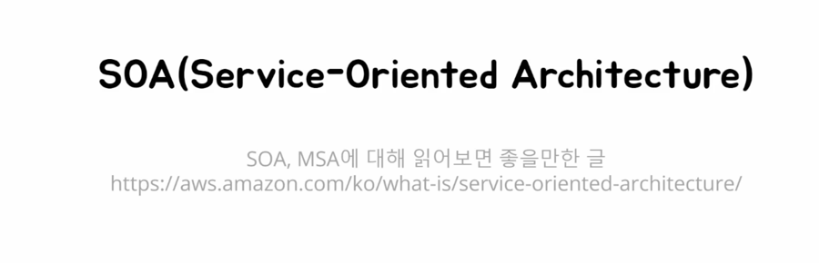

## 모놀리식에서 여러 개의 애플리케이션으로 

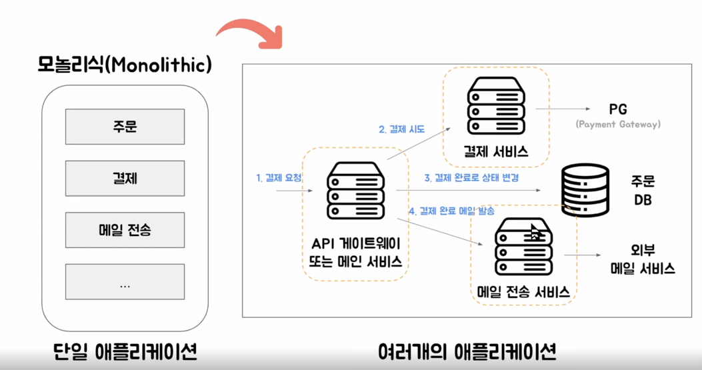

- 처음에는 쉽고 빠르니까, 단일 애플리케이션으로 개발. 
- 그럼 왜 여러 개의 애플리케이션으로 나눌까?

## 단일 애플리케이션을 '잘' 개발하면 되지 않나?

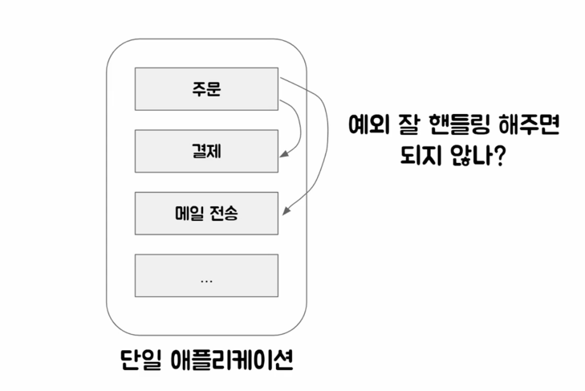

- 예외 잘 핸들링하면 되는 거 아닐까?

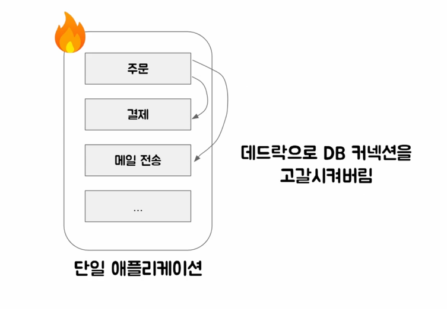

- 예외를 잘 핸들링해도, 데드락으로 DB 커넥션 고갈 시킬 수 있음.

### 멀티 애플리케이션의 장애 격리

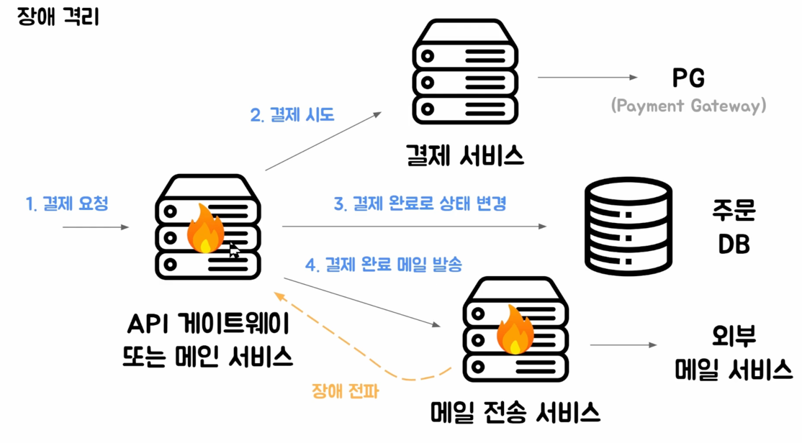

- 단일 앱과 달리, 멀티 앱은 리소스를 공유하는 것은 아니므로 장애가 전파되지는 않는다.
- 즉, 메일 전송 서비스 API 호출에 대한 에러 핸들링만 잘해주면 된다.

### 단일 앱을 이중화하면 되지 않을까?

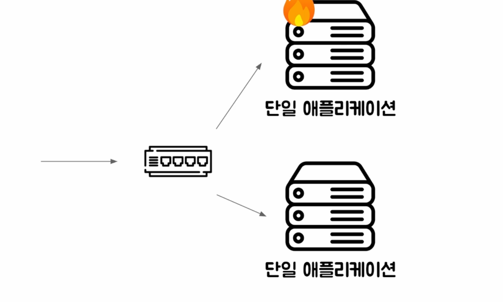

- 단일 애플리케이션 이중화더라도 장애 전파를 막을 수는 없음.
  - 문제 원인이 새로 배포된 코드라고 하면, 이중화가 되어있다 하더라도 Nginx 가 그 장애를 극복할 수 없다.
- 단일 앱 이중화는 서버가 물리적으로 내려가 있다거나 그런 상황에 효과적인 방법.

## 독립적인 배포와 스케일링

- 앱을 나눔으로써, 각 앱을 독립적으로 배포하고, 더 많은 리소스가 필요한 앱은 더 높은 스케일을 사용 가능하다.

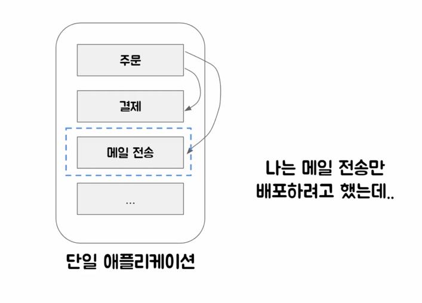
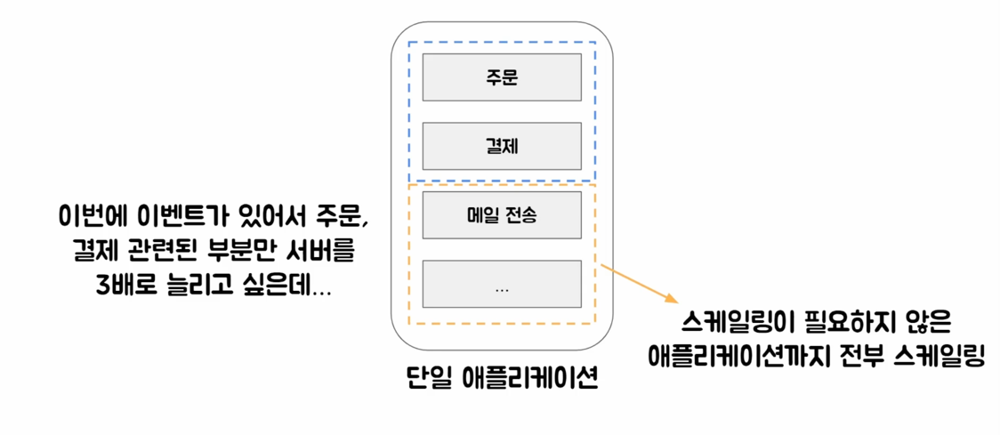

- 앱 규모가 클 수록 긴 빌드 시간, 긴 시작 시간이 걸림

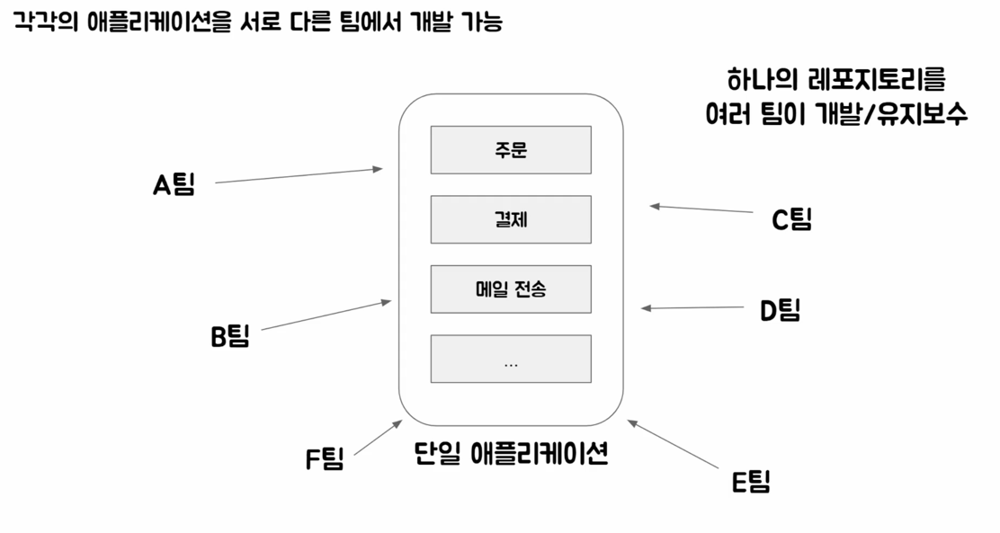

- 하나의 레포를 여러 팀이 유지보수 하려면 브랜치를 어떻게 머지하고, 어떻게 관리할지 등 합의가 어렵고 유지보수 비용이 높음

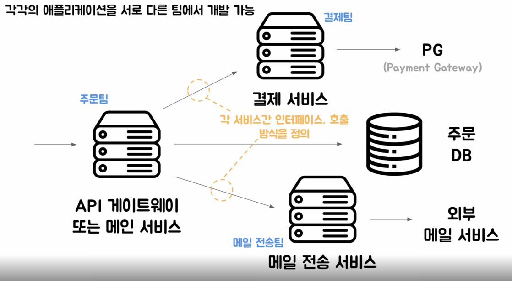

- 각 서비스를 관리하는 팀을 만들고, 각 서비스간 인터페이스, 호출 방식을 정의해서 사용한다.
- 앱을 분리해두면, 서비스 단위 재사용(예시에서는 메일 전송 서비스)이 가능하다  .

## 기술 스택, 언어 선택의 자유로움

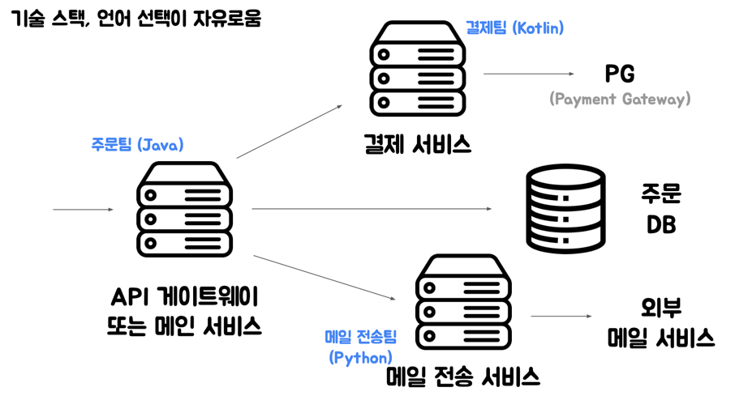

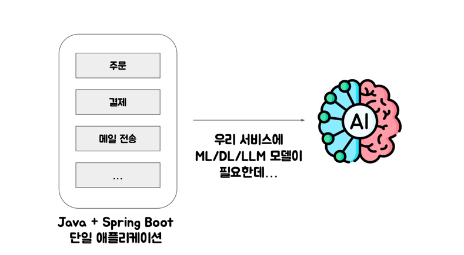

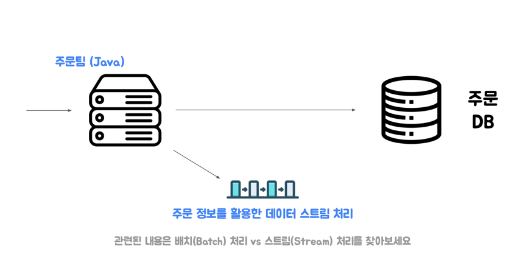

- AI 모델 등은 주로 파이썬 활용. 앱을 분리함으로써 언어의 자유 가능.
- 데이터 스트림 처리를 별도 앱에서 하지 않으면 주문 앱에서 배치처리를 구현해야함

# 앱 분리는 장점만 있을까?

> 앱을 분리하면 복잡성과 운영비용이 증가한다.

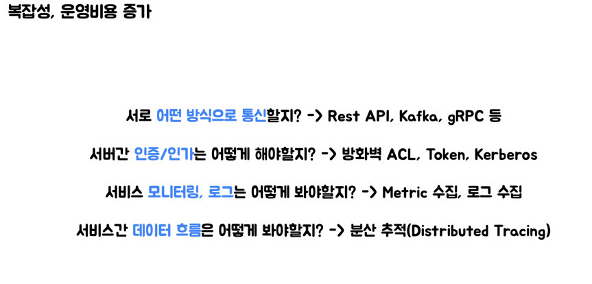
 
- 서버 간 통신 방식
  - 여러 수단 중 선택이 필요.
  - 여러 수단으로 구성된 앱을 개발하고 운영한다면 각각에 대하여 잘 알아야 한다 -> 비용. 
- 서버 간 인증 문제
  - 서버 간 인증을 어떻게 처리할지?
    - 여러 가지 방법이 존재하고, 잘못된 설정으로 장애 지점이 될 수 있음
- 모니터링, 로그
  - 여러 개로 분리된 앱이 각각 이중화 되어, Metric/로그 수집 비용이 증가.
- 서비스간 데이터 흐름
  - 원래라면 한 앱에서만 추적할 수 있던 흐름이 여러 앱으로 나뉘므로, 이를 추적하기가 어려워짐  
- 테스트가 어려워진다

## 데이터 일관성 문제 

### 단일 앱의 간단한 트랜잭션 관리

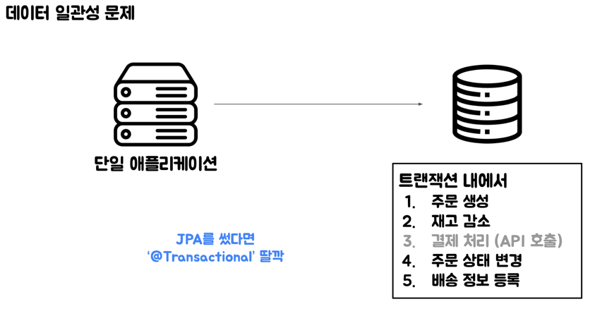

- 단일 앱에서는 간단하게 @Transactional 애노테이션 같은 것을 이용해서 트랜잭션 관리가 되었음. (장애 발생 시 롤백이 쉽다.)

### 멀티 앱의 트랜잭션 관리의 어려움

- **_멀티 앱을 쓰면 데이터 일관성을 맞추기 어려워지고, 맞추기 위해서 추가적인 설계가 필요하다_**

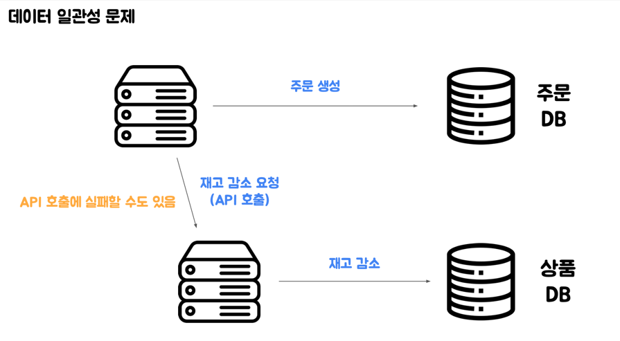

- 주문, 상품 서비스가 서로 다른 DB를 쓴다고 하자.
- 이 때는 DB 트랜잭션을 활용할 수 없어진다.
  - 왜? 재고 감소에 대해서는 API 호출을 쓰니까.

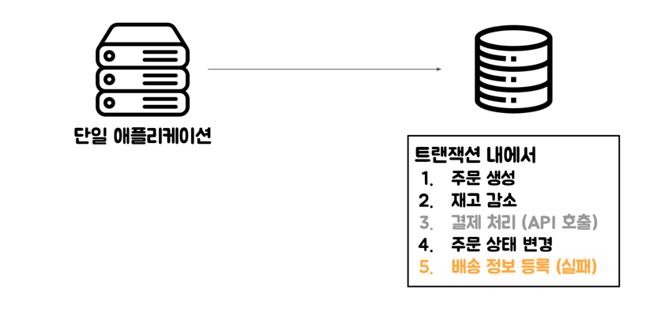

- 단일 앱은 트랜잭션 안에서만 잘 관리하면 된다.

# 그래서 어떻게 하라는 것인가

## 팀에서 관리하는 앱을 나눌 필요가 있을까? 

- 앞서 언급한 단점으로 인해, 개발/운영 속도가 느려질 수 있음.
- 팀 내부적으로 지나치게 앱을 쪼개는 것에 대해서 검토해보자.

## 앱을 나눠서 개발하기로 했다면 챙겨야할 것들

- **위 수단 없이 무작정 애플리케이션을 나눠서 운영하는 것은 장담컨대 단일 앱으로 개발하고 운영하는 것보다 못할 것이다.**
- 강의에서는 1. 장애 전파, 2. 데이터 유실 방지와 일관성에 대해서 배운다.