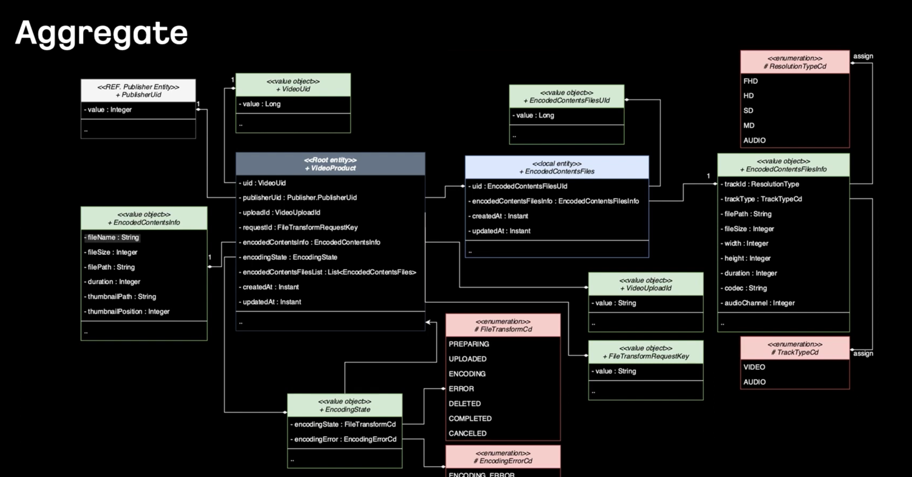
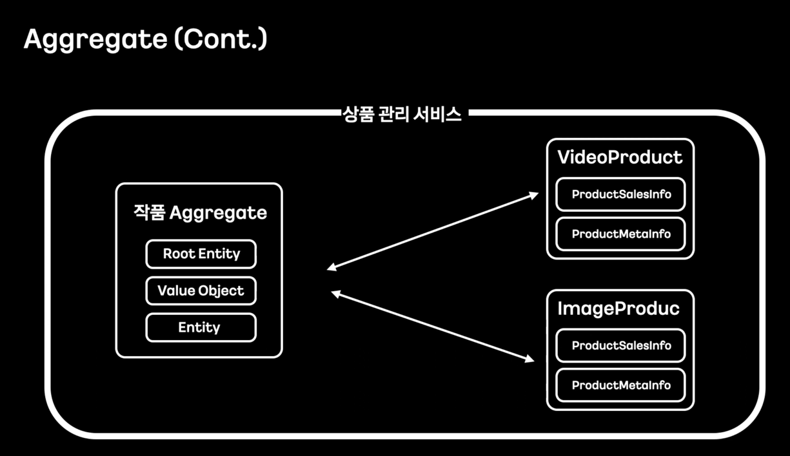

> [ㄷㄷㄷ: Domain Driven Design과 적용 사례공유 / if(kakao)2022](https://youtu.be/4QHvTeeTsj0?si=o1G486gcDWbOsB8I)

# DDD 적용하기 전 필요했던 것들

## 애그리거트

- 애그리거트를 구성하게 되면, 개별 객체들 간의 관계 보다는, 객체들 간의 관계를 더 넓은 시야를 볼 수 있음.

- 예를 들면, 상품관리 BC에서 작품 애그리거트는 VideoProduct, ImageProduct와 연관되어있음을 알게된다.