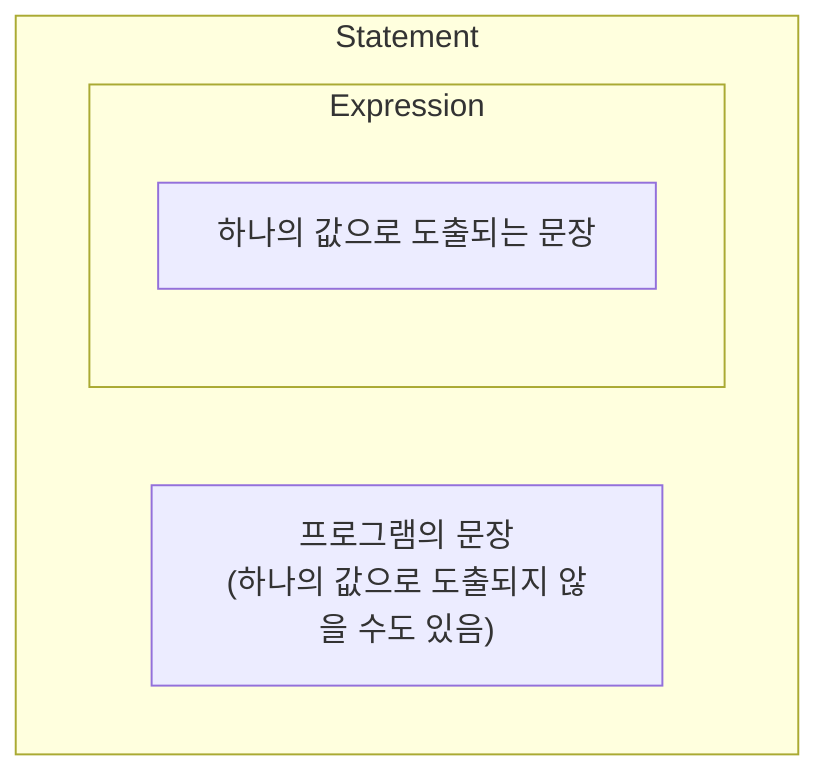

<!-- TOC -->
* [1. if 문](#1-if-문-)
<!-- TOC -->

# 1. if 문

- if 문법은 자바, 코틀린 동일

# 2. Expression & Statement



- Statement vs Expression
  - Statement: 프로그램의 문장, 하나의 값으로 도출되지 않는다.
  - Expression: 하나의 값으로 도출되는 문장. Statement 중 하나의 값으로 도출되는 것들을 Expression이라고 부른다.
- 자바에서 if-else는 Statement이지만, 코틀린에서는 Expression이다.

```java
int score = 30 + 40;
```
- 30 + 40은 70이라는 하나의 값으로 도출되므로 Statement이자 Expression임.

```java
// Java if-else 문은 Statement임
String grade = if (score >= 50) {
  "P"
} else {
  "F"
}
```

- Java의 if-else 문은 Statement이므로 위 코드는 컴파일 오류 발생.

```java
// Java 3항 연산자는 Expression임 
String grade = (score >= 50) ? "P" : "F";
```

- Java에서 3항 연산자는 Expression이므로 위 코드는 정상 동작.

```kt
// Kotlin if-else 문은 Expression임
val grade = if (score >= 50) {
    "P"
} else {
    "F"
}
```
- Kotlin의 if-else 문은 Expression이므로 위 코드 정상 동작.