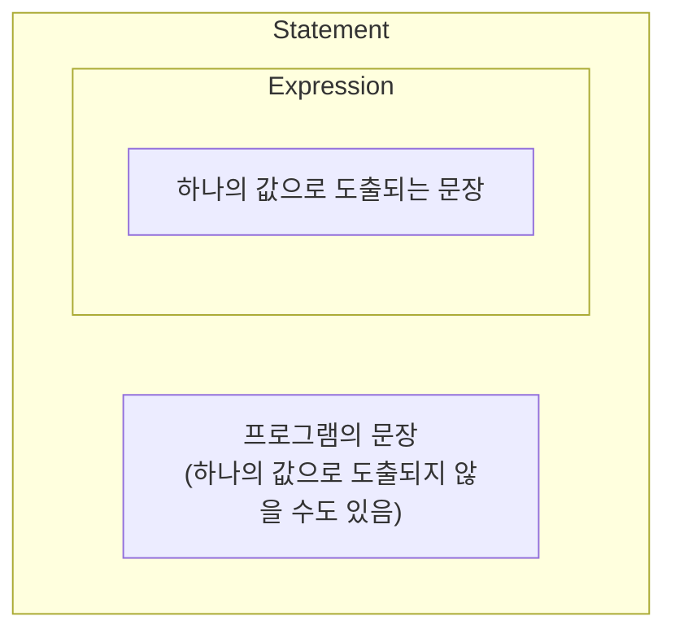

<!-- TOC -->
* [1. if 문](#1-if-문)
* [2. Expression & Statement](#2-expression--statement)
* [Tip: 어떠한 값이 특정 범위에 속하는지 확인할 때](#tip-어떠한-값이-특정-범위에-속하는지-확인할-때)
* [3. switch 문, when 문](#3-switch-문-when-문)
<!-- TOC -->

# 1. if 문

- if 문법은 자바, 코틀린 동일

# 2. Expression & Statement



- Statement vs Expression
  - Statement: 프로그램의 문장, 하나의 값으로 도출되지 않는다.
  - Expression: 하나의 값으로 도출되는 문장. Statement 중 하나의 값으로 도출되는 것들을 Expression이라고 부른다.
- 자바에서 if-else는 Statement이지만, 코틀린에서는 Expression이다.

```java
int score = 30 + 40;
```
- 30 + 40은 70이라는 하나의 값으로 도출되므로 Statement이자 Expression임.

```java
// Java if-else 문은 Statement임
String grade = if (score >= 50) {
  "P"
} else {
  "F"
}
```

- Java의 if-else 문은 Statement이므로 위 코드는 컴파일 오류 발생.

```java
// Java 3항 연산자는 Expression임 
String grade = (score >= 50) ? "P" : "F";
```

- Java에서 3항 연산자는 Expression이므로 위 코드는 정상 동작.
- Kotlin에서는 3항 연산자가 없는데, if-else 문이 Expression이기 때문에 3항 연산자 없이도 동일한 기능을 수행할 수 있기 때문.

```kt
// Kotlin if-else 문은 Expression임
val grade = if (score >= 50) {
    "P"
} else {
    "F"
}

fun getPassOrFail(score: Int): String {
  return if (score >= 50) {
    "P"
  } else {
    "F"
  }
}
```
- Kotlin의 if-else 문은 Expression이므로 위 코드 정상 동작.

# Tip: 어떠한 값이 특정 범위에 속하는지 확인할 때

```java
if (0 <= score && score <= 100) {
}
```
```kt
if (score in 0..100) {
}
```

# 3. switch 문, when 문

```kt
fun getGradeWithSwitchV2(score: Int): String {
  return when (score) {
    in 90..99 -> "A"
    in 80..89 -> "B"
    in 70..79 -> "C"
    else -> "D"
  }
}

when (값) {
  조건부 -> 어떤 구문
  조건부 -> 어떤 구문
  else -> 어떤 구문
}
```

- 조건부에는 어떠한 expression도 들어 올 수 있음. (ex. is Type, in 범위 등)

```kt
fun judgeNumberV2(number: Int) {
  when {
    number == 0 -> println("0입니다.")
    number % 2 == 0 -> println("짝수입니다.")
    else -> println("홀수입니다.")
  }
}
```
- 일종의 early return 형태로도 사용 가능.