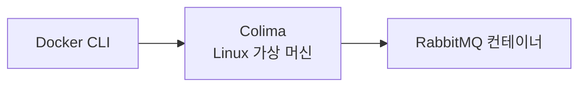
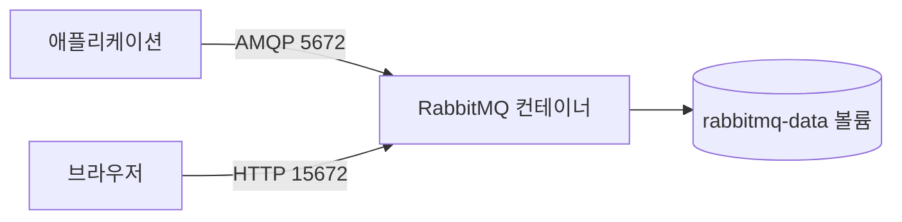

# RabbitMQ 설치

## Colima로 실행하는 이유

**RabbitMQ는 Colima와 Docker를 사용하면 가볍고 동일한 환경에서 실행할 수 있다.**

직접 설치하면 RabbitMQ와 Erlang을 함께 설치해야 한다. 버전 호환성도 확인해야 한다. Docker 이미지를 사용하면 필요한 실행 환경이 이미지에 들어 있으므로 이런 과정을 줄일 수 있다.

Colima는 macOS에서 컨테이너를 실행할 Linux 가상 머신을 제공한다. Docker Desktop 없이도 Docker 명령어와 Docker Compose를 사용할 수 있다.



## 1. Colima와 Docker CLI 설치

**Homebrew로 Colima, Docker CLI, Docker Compose를 설치한다.**

```bash
brew install colima docker docker-compose
```

설치 여부를 확인한다.

```bash
colima version
docker --version
docker compose version
```

`docker compose` 명령어를 찾지 못하면 Compose 플러그인을 Docker CLI에 연결한다.

```bash
mkdir -p ~/.docker/cli-plugins
ln -sfn "$(brew --prefix)/opt/docker-compose/bin/docker-compose" ~/.docker/cli-plugins/docker-compose
docker compose version
```

## 2. Colima 시작

**Docker 명령어를 사용하기 전에 Colima를 시작한다.**

```bash
colima start
```

Colima는 기본으로 Docker 런타임을 사용한다. 실행 상태를 확인한다.

```bash
colima status
docker info
```

`colima is running`이 표시되면 준비가 끝난 것이다.

## 3. Compose 파일 작성

**`rabbitmq-compose.yml` 파일에 RabbitMQ의 실행 설정을 작성한다.**

Compose의 기본 파일명은 `compose.yaml`이다. 지금은 `rabbitmq-compose.yml`이라는 별도 이름을 사용한다. 따라서 실행할 때 `-f rabbitmq-compose.yml`로 파일을 지정해야 한다.

```yaml
# 실행할 컨테이너 목록이다.
services:
  # 서비스 이름이다.
  # 같은 Compose 안의 다른 컨테이너는 rabbitmq라는 이름으로 이 서비스에 접근할 수 있다.
  rabbitmq:
    # RabbitMQ 4.3 공식 이미지 중 웹 관리 화면이 포함된 이미지를 사용한다.
    image: rabbitmq:4.3-management

    # Docker 명령어에서 표시할 컨테이너 이름이다.
    # 예: docker logs rabbitmq
    container_name: rabbitmq

    # 컨테이너 내부에서 사용할 호스트 이름이다.
    # RabbitMQ는 이 값을 노드 이름과 데이터 저장 경로를 정할 때 사용한다.
    hostname: rabbitmq

    # macOS의 포트를 컨테이너의 포트에 연결한다.
    # 형식은 "macOS 포트:컨테이너 포트"이다.
    ports:
      # 애플리케이션이 AMQP로 RabbitMQ에 연결할 때 사용한다.
      - "5672:5672"
      # 브라우저에서 RabbitMQ 관리 화면에 접속할 때 사용한다.
      - "15672:15672"

    # RabbitMQ가 처음 시작될 때 생성할 관리자 계정이다.
    environment:
      # 관리자 아이디이다.
      RABBITMQ_DEFAULT_USER: admin
      # 관리자 비밀번호이다. 로컬 학습용으로만 사용한다.
      RABBITMQ_DEFAULT_PASS: admin1234

    # 컨테이너의 데이터를 Docker 볼륨에 연결한다.
    volumes:
      # 왼쪽은 볼륨 이름이고 오른쪽은 RabbitMQ의 데이터 저장 경로이다.
      # 컨테이너를 삭제해도 rabbitmq-data 볼륨을 삭제하지 않으면 데이터가 남는다.
      - rabbitmq-data:/var/lib/rabbitmq

    # RabbitMQ가 실제로 요청을 받을 수 있는 상태인지 주기적으로 확인한다.
    healthcheck:
      # 컨테이너 안에서 RabbitMQ 노드에 ping 명령을 실행한다.
      # -q 옵션은 성공 여부만 간단히 출력한다.
      test: ["CMD", "rabbitmq-diagnostics", "-q", "ping"]
      # 10초마다 상태를 확인한다.
      interval: 10s
      # 한 번의 확인이 5초를 넘으면 실패로 판단한다.
      timeout: 5s
      # 5번 연속 실패하면 컨테이너 상태를 unhealthy로 표시한다.
      retries: 5

# services에서 사용할 Docker 볼륨을 선언한다.
volumes:
  # RabbitMQ의 Queue, 메시지, 사용자 등의 데이터를 보관한다.
  rabbitmq-data:
```

`management` 이미지에는 RabbitMQ 관리 화면이 포함되어 있다.

| 포트 | 용도 |
|---|---|
| `5672` | 애플리케이션이 RabbitMQ에 연결하는 포트 |
| `15672` | 웹 관리 화면에 접속하는 포트 |

`rabbitmq-data` 볼륨은 RabbitMQ 데이터를 보관한다. 컨테이너를 다시 만들어도 볼륨을 삭제하지 않으면 데이터가 남는다.

> `admin/admin1234`는 로컬 학습용 계정이다. 운영 환경에서는 안전한 비밀번호와 별도의 보안 설정을 사용해야 한다.

## 4. RabbitMQ 실행

**다음 명령어로 RabbitMQ를 백그라운드에서 실행한다.**

```bash
docker compose -f rabbitmq-compose.yml up -d
```

명령어의 의미는 다음과 같다.

- `docker compose`: Docker Compose를 실행한다.
- `-f rabbitmq-compose.yml`: 사용할 Compose 파일을 지정한다.
- `up`: 파일에 정의한 컨테이너를 생성하고 실행한다.
- `-d`: 컨테이너를 백그라운드에서 실행한다.

컨테이너 상태를 확인한다.

```bash
docker compose -f rabbitmq-compose.yml ps
```

`rabbitmq`의 상태가 `healthy`로 표시되면 실행이 끝난 것이다.

## 5. 관리 화면 접속

**브라우저에서 RabbitMQ 관리 화면에 접속한다.**

- 주소: [http://localhost:15672](http://localhost:15672)
- 아이디: `admin`
- 비밀번호: `admin1234`

로그인하면 Queue, Exchange, Connection, Channel 등을 확인할 수 있다.



## 6. 로그 확인

**문제가 생기면 컨테이너 로그부터 확인한다.**

```bash
docker compose -f rabbitmq-compose.yml logs -f rabbitmq
```

로그 확인을 끝낼 때는 `Ctrl+C`를 누른다. RabbitMQ 컨테이너는 계속 실행된다.

## 7. RabbitMQ 종료

**컨테이너만 종료하려면 다음 명령어를 사용한다.**

```bash
docker compose -f rabbitmq-compose.yml down
```

이 명령어는 컨테이너를 삭제하지만 데이터 볼륨은 남긴다. 다음에 다시 실행하면 기존 데이터를 사용할 수 있다.

## 8. 데이터까지 초기화

**Queue와 메시지를 포함한 모든 학습 데이터를 지우려면 볼륨도 함께 삭제한다.**

```bash
docker compose -f rabbitmq-compose.yml down -v
```

이 명령어로 삭제한 데이터는 복구할 수 없다.

## 9. Colima 종료

**RabbitMQ를 종료한 뒤 Colima 가상 머신도 멈출 수 있다.**

```bash
docker compose -f rabbitmq-compose.yml down
colima stop
```

`colima stop`은 가상 머신만 멈춘다. 컨테이너와 볼륨 데이터는 삭제하지 않는다. 다시 사용할 때 `colima start`를 실행한다.

## 자주 쓰는 명령어

| 명령어 | 용도 |
|---|---|
| `colima start` | Colima 가상 머신 시작 |
| `colima status` | Colima 실행 상태 확인 |
| `colima stop` | Colima 가상 머신 종료 |
| `docker compose -f rabbitmq-compose.yml up -d` | RabbitMQ 실행 |
| `docker compose -f rabbitmq-compose.yml ps` | 실행 상태 확인 |
| `docker compose -f rabbitmq-compose.yml logs -f rabbitmq` | 실시간 로그 확인 |
| `docker compose -f rabbitmq-compose.yml restart rabbitmq` | RabbitMQ 재시작 |
| `docker compose -f rabbitmq-compose.yml down` | 컨테이너 종료 및 삭제 |
| `docker compose -f rabbitmq-compose.yml down -v` | 컨테이너와 데이터 삭제 |

## 참고

- [Colima 공식 설치 문서](https://colima.run/docs/installation/)
- [Colima 공식 시작 가이드](https://colima.run/docs/getting-started/)
- [RabbitMQ 공식 Docker 이미지](https://hub.docker.com/_/rabbitmq)
- [RabbitMQ 공식 문서](https://www.rabbitmq.com/docs)
