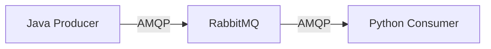
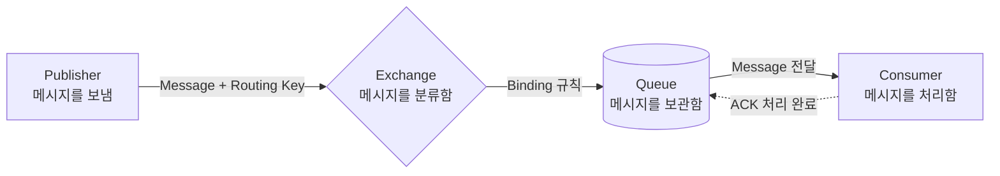
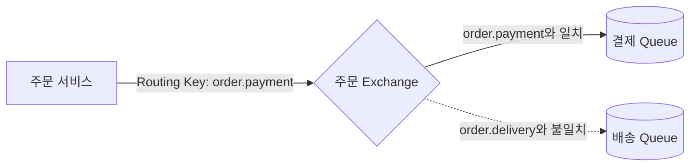
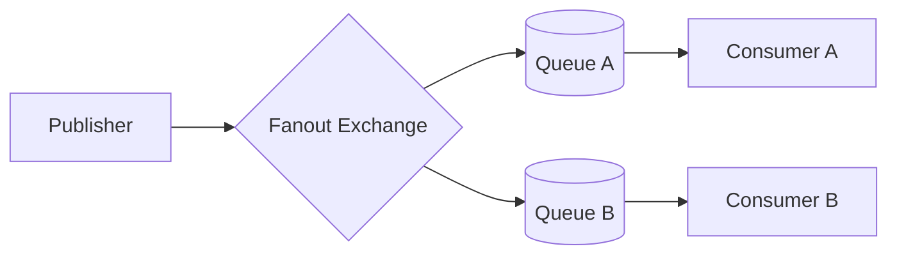
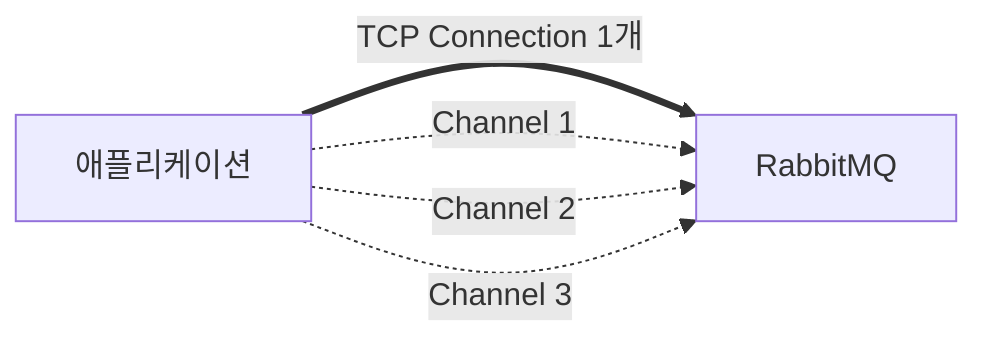

# AMQP의 이해

## AMQP란?

**AMQP는 애플리케이션과 메시지 브로커가 메시지를 주고받는 방법을 정한 통신 규약이다.**

AMQP는 `Advanced Message Queuing Protocol`의 약자다. HTTP가 웹 통신 방법을 정하듯이 AMQP는 메시징 통신 방법을 정한다.

AMQP는 다음 내용을 정의한다.

- 클라이언트가 브로커에 연결하는 방법
- 메시지를 보내고 받는 방법
- 메시지를 Queue로 분배하는 방법
- 메시지 처리 결과를 확인하는 방법

## AMQP는 왜 필요할까?

**AMQP는 플랫폼마다 달랐던 메시지 통신 방식을 하나의 규칙으로 통일하려고 나왔다.**

기존 MQ 제품은 특정 플랫폼에 종속된 경우가 많았다. 서로 다른 MQ 제품끼리 메시지를 교환하려면 메시지 형식을 변환하는 Bridge가 필요했다. 변환 과정은 시스템을 복잡하게 만들고 전송 속도도 낮췄다.

AMQP는 이 문제를 해결하기 위해 다음 항목을 표준화했다.

- Broker가 메시지를 처리하는 방식
- Client가 Broker와 통신하는 방식
- 네트워크로 주고받는 명령어
- 메시지를 Exchange와 Queue로 전달하는 방식

따라서 AMQP를 지원하면 제품과 프로그래밍 언어가 달라도 같은 규칙으로 통신할 수 있다. 단, 각 언어에는 AMQP를 지원하는 클라이언트 라이브러리가 필요하다.



## RabbitMQ와 AMQP의 차이

**RabbitMQ는 프로그램이고 AMQP는 통신 규칙이다.**

| 구분 | 역할 | 비유 |
|---|---|---|
| RabbitMQ | 메시지를 받아서 보관하고 전달한다. | 택배 회사 |
| AMQP | 메시지를 주고받는 형식과 절차를 정한다. | 택배 접수 규칙 |

RabbitMQ는 여러 메시징 프로토콜을 지원한다. 이 문서에서는 RabbitMQ의 기본 메시징 모델인 **AMQP 0-9-1**을 다룬다.

## AMQP의 메시지 전달 흐름

**AMQP 0-9-1에서 메시지는 `Publisher → Exchange → Queue → Consumer` 순서로 이동한다.**



메시지 전달 과정은 다음과 같다.

1. Publisher가 Exchange에 메시지를 보낸다.
2. Exchange가 Binding 규칙을 확인한다.
3. Exchange가 조건에 맞는 Queue로 메시지를 보낸다.
4. Queue가 Consumer에게 메시지를 전달한다.
5. Consumer가 처리를 마치고 ACK를 보낸다.

> Publisher는 Queue에 직접 메시지를 보내지 않는다. 메시지는 먼저 Exchange로 간다. 기본 Exchange를 사용하면 Queue에 바로 보내는 것처럼 보일 뿐이다.

## 핵심 구성 요소

### Publisher

**Publisher는 메시지를 보내는 애플리케이션이다.**

Producer라고도 부른다. 예를 들어 주문 서비스는 `주문 생성` 메시지를 보낼 수 있다.

### Message

**Message는 Publisher가 Consumer에게 전달할 데이터다.**

메시지는 속성과 본문으로 나뉜다.

- 속성: Routing Key, Content Type, 만료 시간 같은 부가 정보
- 본문: 주문 번호와 상품 정보 같은 실제 데이터

RabbitMQ는 본문의 의미를 해석하지 않는다. 애플리케이션이 JSON 같은 형식을 정해서 사용한다.

```json
{
  "orderId": 1001,
  "status": "CREATED"
}
```

### Exchange

**Exchange는 메시지를 어떤 Queue로 보낼지 결정한다.**

Exchange는 메시지를 저장하지 않는다. Exchange Type, Routing Key, Binding을 사용해 목적지를 정한다.

### Queue

**Queue는 Consumer가 처리할 때까지 메시지를 보관한다.**

Consumer가 잠시 멈춰도 Queue는 메시지를 보관할 수 있다. 여러 Consumer가 하나의 Queue를 구독하면 메시지를 나누어 처리할 수 있다.

### Binding

**Binding은 Exchange와 Queue를 연결하는 규칙이다.**

Exchange는 Binding을 보고 메시지를 보낼 Queue를 찾는다. Exchange와 Queue를 만들기만 하고 Binding하지 않으면 메시지가 Queue에 도착하지 않을 수 있다.

하나의 Exchange에는 여러 Queue를 연결할 수 있다. 하나의 Queue도 여러 Exchange에 연결할 수 있다.

### Routing Key

**Routing Key는 메시지의 전달 목적을 나타내는 값이다.**

예를 들어 결제 메시지에는 `order.payment`를 사용할 수 있다. Exchange는 이 값을 Binding의 조건과 비교한다.



### Consumer

**Consumer는 Queue에서 메시지를 받아 처리하는 애플리케이션이다.**

예를 들어 결제 Consumer는 주문 메시지를 받아 결제를 처리한다.

### ACK

**ACK는 Consumer가 메시지 처리를 끝냈다는 확인 응답이다.**

RabbitMQ는 ACK를 받은 뒤 Queue에서 메시지를 제거할 수 있다. Consumer가 ACK를 보내기 전에 멈추면 RabbitMQ는 메시지를 다시 전달할 수 있다.

따라서 Consumer는 같은 메시지를 여러 번 받아도 안전하게 처리해야 한다.

## Exchange Type

**Exchange Type은 메시지를 Queue로 분배하는 방법을 정한다.**

| 종류 | 분배 기준 | 사용 예 |
|---|---|---|
| Direct | Routing Key가 정확히 일치한다. | 작업 종류별 분배 |
| Fanout | 연결된 모든 Queue로 보낸다. | 이벤트 방송 |
| Topic | Routing Key가 패턴과 일치한다. | 조건별 이벤트 구독 |
| Headers | 메시지 Header가 조건과 일치한다. | 여러 속성을 이용한 분배 |

### Direct

**Direct Exchange는 Routing Key가 정확히 일치하는 Queue로 메시지를 보낸다.**

`order.payment`는 Binding Key가 `order.payment`인 Queue로 전달된다.

### Fanout

**Fanout Exchange는 연결된 모든 Queue로 메시지를 보낸다.**

Routing Key는 사용하지 않는다. 하나의 이벤트를 여러 서비스에 알릴 때 사용한다.

Fanout은 메시지를 모든 **Consumer**에게 직접 보내지 않는다. 메시지를 모든 **Queue**에 하나씩 복사한다. 한 Queue에 Consumer가 여러 명이면 그중 한 명만 해당 메시지를 처리한다.



### Topic

**Topic Exchange는 Routing Key를 패턴으로 비교한다.**

- `*`는 단어 하나와 일치한다.
- `#`는 단어 0개 이상과 일치한다.

예를 들어 `order.*`는 `order.created`와 일치한다. `order.#`는 `order.created.email`과도 일치한다.

### Headers

**Headers Exchange는 Routing Key 대신 메시지 Header를 비교한다.**

여러 속성을 함께 비교해야 할 때 사용할 수 있다.

## Connection과 Channel

**애플리케이션은 Connection 안에 Channel을 만들어 RabbitMQ와 통신한다.**

Connection은 애플리케이션과 RabbitMQ 사이의 TCP 연결이다. Connection을 많이 만들면 비용이 크다.

Channel은 하나의 Connection을 나누어 쓰는 가벼운 논리 연결이다. 일반적으로 Connection을 재사용하고 작업 단위별로 Channel을 사용한다.



## 전체 정리

**AMQP는 메시징 시스템이 통신하는 공통 규칙이다.**

```text
Publisher
   ↓ Message + Routing Key
Exchange
   ↓ Binding으로 Queue 선택
Queue
   ↓ Message 전달
Consumer
   ↓ 처리 완료
ACK
```

RabbitMQ를 공부할 때는 다음 흐름을 먼저 기억하면 된다.

> **Publisher가 Exchange에 메시지를 보낸다. Exchange는 Binding 규칙으로 Queue를 선택한다. Consumer는 Queue의 메시지를 처리하고 ACK를 보낸다.**

## 참고

- [RabbitMQ 개요 Notion 자료](https://app.notion.com/p/RabbitMQ-9782e89e641a4deea66876c68fbd388d)
- [RabbitMQ 공식 AMQP 0-9-1 개념 설명](https://www.rabbitmq.com/tutorials/amqp-concepts)
- [RabbitMQ 공식 Exchange 문서](https://www.rabbitmq.com/docs/exchanges)
- [RabbitMQ 공식 튜토리얼](https://www.rabbitmq.com/tutorials)
