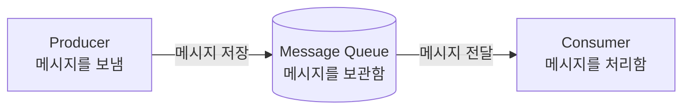
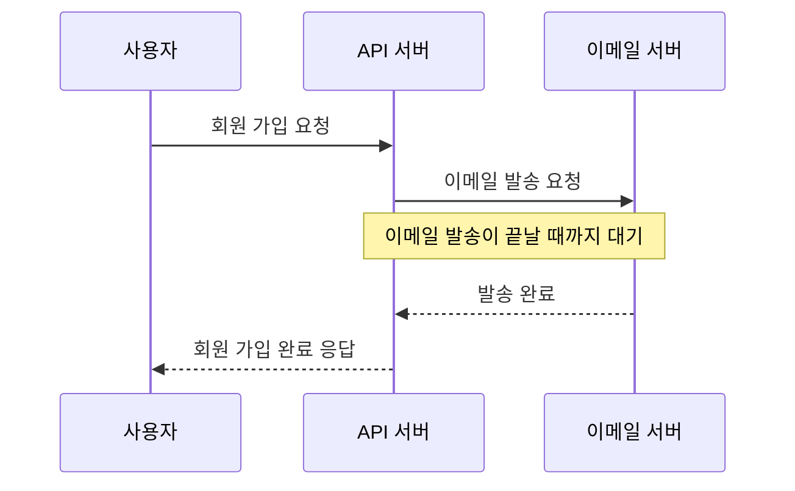
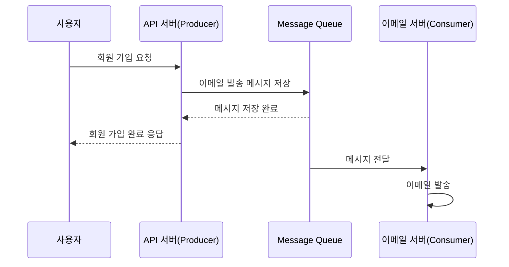
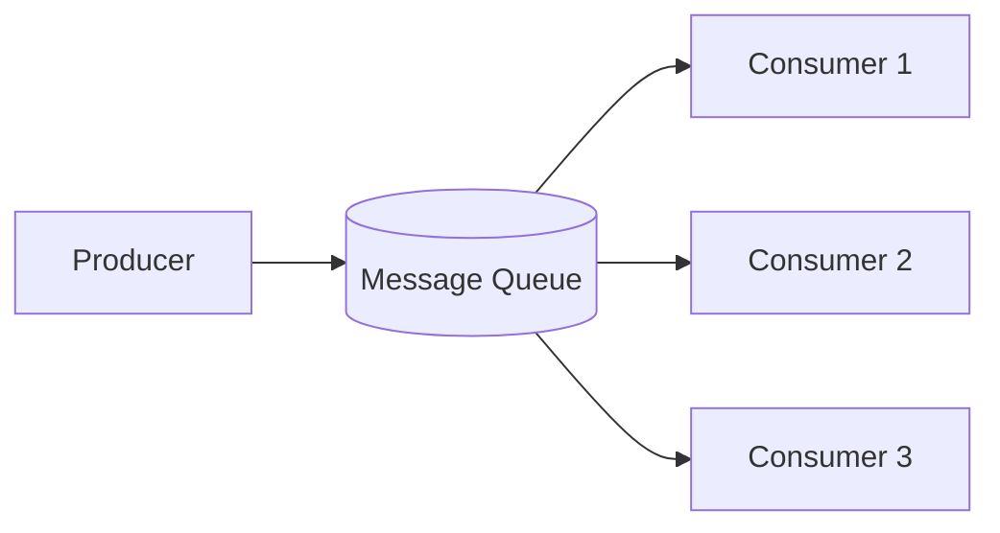
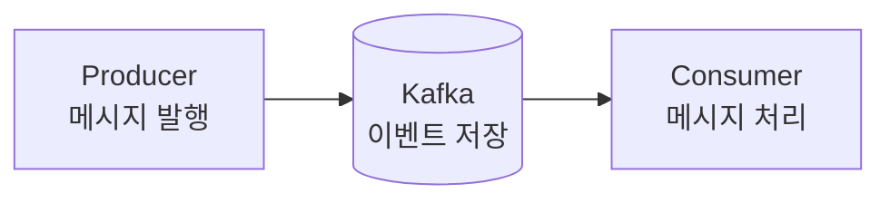

# Kafka란? / 메시지 큐(Message Queue)란?

## Kafka란?

**Kafka는 대규모 이벤트를 빠르고 안전하게 전달하는 분산 이벤트 스트리밍 플랫폼이다.**

[Apache Kafka 공식 홈페이지](https://kafka.apache.org/)는 Kafka를 다음 용도로 사용하는 플랫폼이라고 설명한다.

- 고성능 데이터 파이프라인
- 실시간 스트리밍 분석
- 여러 시스템의 데이터 통합
- 장애가 치명적인 핵심 애플리케이션

처음에는 다음과 같이 이해해도 충분하다.

> **Kafka는 많은 메시지를 저장하고 여러 시스템에 전달하는 도구다.**

Kafka를 더 정확하게 이해하려면 먼저 메시지와 메시지 큐를 알아야 한다.

## 메시지란?

**메시지는 다른 시스템에 전달할 데이터다.**

예를 들어 이메일 발송 메시지는 다음 정보를 담을 수 있다.

```json
{
  "email": "user@example.com",
  "title": "회원 가입을 환영합니다.",
  "content": "가입이 완료되었습니다."
}
```

메시지는 “누구에게 어떤 작업을 해야 하는지”를 다른 시스템에 알려 준다.

## 메시지 큐란?

**메시지 큐는 처리할 메시지를 순서대로 보관하는 중간 저장소다.**

메시지를 보내는 서버와 처리하는 서버 사이에 메시지 큐를 둔다. 보내는 서버는 메시지만 저장하고 다음 작업을 진행한다. 처리하는 서버는 메시지를 가져와 자신의 속도에 맞게 처리한다.



### Producer

**Producer는 메시지를 만들어 보내는 서버다.**

`생산하다`라는 뜻에서 Producer라는 이름이 붙었다. 이메일 발송 요청을 받아 메시지 큐에 넣는 서버가 Producer다.

### Consumer

**Consumer는 메시지를 가져와 실제 작업을 처리하는 서버다.**

`소비하다`라는 뜻에서 Consumer라는 이름이 붙었다. 메시지를 가져와 이메일을 발송하는 서버가 Consumer다.

## 동기 처리와 비동기 처리

**동기 처리는 작업이 끝날 때까지 기다리고, 비동기 처리는 기다리지 않고 다음 작업을 진행한다.**

| 방식 | 처리 방법 | 예시 |
|---|---|---|
| 동기 | 작업 결과가 나올 때까지 기다린다. | 이메일 발송이 끝난 뒤 응답한다. |
| 비동기 | 작업을 맡긴 뒤 기다리지 않는다. | 발송 메시지를 저장한 뒤 응답한다. |

> 비동기와 병렬은 다른 개념이다. 비동기는 작업 완료를 기다리지 않는 방식이다. 병렬은 여러 작업을 같은 시간에 실행하는 방식이다.

## 직접 호출 방식

**서버가 이메일 발송 시스템을 직접 호출하면 발송이 끝날 때까지 응답이 늦어진다.**



이 방식에는 다음 문제가 있다.

- 이메일 발송이 느리면 사용자 응답도 느려진다.
- 이메일 서버에 장애가 나면 회원 가입까지 실패할 수 있다.
- 요청이 몰리면 이메일 서버가 모든 부하를 바로 받는다.

REST API 자체가 항상 동기인 것은 아니다. 여기서는 **다른 서버를 호출하고 결과를 기다리는 방식**을 직접 호출 방식이라고 한다.

## 메시지 큐를 사용한 방식

**메시지 큐를 사용하면 이메일 발송을 기다리지 않고 사용자에게 응답할 수 있다.**



처리 과정은 다음과 같다.

1. 사용자가 API 서버에 요청을 보낸다.
2. API 서버가 처리할 내용을 메시지로 만든다.
3. Producer인 API 서버가 메시지를 메시지 큐에 저장한다.
4. API 서버는 실제 작업이 끝나기를 기다리지 않고 응답한다.
5. 메시지 큐는 Consumer가 처리할 때까지 메시지를 보관한다.
6. Consumer가 메시지를 가져와 실제 작업을 처리한다.

## 메시지 큐를 사용하는 이유

**메시지 큐는 시스템을 분리하고 갑자기 몰린 요청을 안전하게 처리하기 위해 사용한다.**

### 빠르게 응답할 수 있다

Producer는 오래 걸리는 작업을 기다리지 않는다. 메시지를 저장한 뒤 사용자에게 응답할 수 있다.

### 장애가 바로 퍼지지 않는다

Consumer가 잠시 멈춰도 Producer는 메시지를 저장할 수 있다. Consumer가 복구된 뒤 보관된 메시지를 처리할 수 있다.

### 요청 폭주를 완충한다

요청이 한꺼번에 들어오면 메시지 큐에 쌓아 둔다. Consumer는 자신이 처리할 수 있는 속도로 메시지를 가져간다.

### 처리 서버를 확장할 수 있다

Consumer를 여러 개 실행하면 메시지를 나누어 처리할 수 있다.



## Kafka와 일반적인 메시지 큐의 차이

**Kafka는 메시지 큐처럼 사용할 수 있지만, 단순한 임시 저장소는 아니다.**

일반적인 메시지 큐는 Consumer가 처리한 메시지를 제거하는 방식이 많다. Kafka는 이벤트를 정해진 기간 동안 저장한다. Consumer가 읽은 뒤에도 이벤트가 바로 사라지지 않는다.

따라서 Kafka는 다음 작업에 유리하다.

- 대규모 이벤트 처리
- 여러 Consumer가 같은 이벤트를 각각 처리
- 과거 이벤트 다시 읽기
- 실시간 데이터 파이프라인 구성

입문 단계에서는 Kafka를 다음과 같이 이해하면 된다.

```text
메시지 큐 관점: 많은 메시지를 비동기로 전달하는 도구
Kafka의 정확한 역할: 이벤트를 저장하고 전달하는 분산 이벤트 스트리밍 플랫폼
```

## 전체 정리

**Kafka는 대규모 이벤트를 저장하고 여러 Consumer에 전달하는 플랫폼이다.**



- Message는 다른 시스템에 전달할 데이터다.
- Producer는 메시지를 보낸다.
- 메시지 큐는 처리 전 메시지를 보관한다.
- Consumer는 메시지를 받아 실제 작업을 처리한다.
- 메시지 큐를 사용하면 작업을 비동기로 분리할 수 있다.
- Kafka는 메시지 큐의 역할을 포함하지만 이벤트 저장과 재처리도 지원한다.
