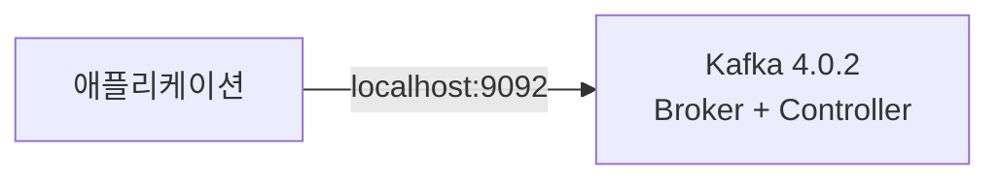
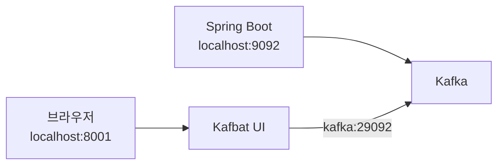
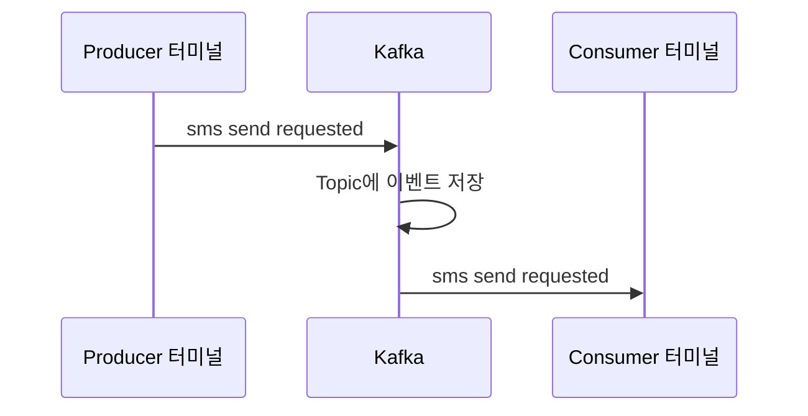

# Kafka 로컬 설치

## Docker로 실행하는 이유

**Kafka는 Docker로 실행하면 운영체제에 직접 설치하지 않고 빠르게 실습할 수 있다.**

Kafka를 직접 설치하면 Java와 Kafka 실행 환경을 따로 관리해야 한다. Docker를 사용하면 필요한 실행 환경이 이미지에 들어 있다. 컨테이너를 삭제하면 학습 환경을 쉽게 초기화할 수도 있다.

이 문서에서는 다음 환경을 사용한다.

- Colima
- Docker CLI
- Docker Compose
- Apache Kafka 4.0.2
- KRaft 단일 노드

> 이 구성은 로컬 학습용이다. 데이터 복제와 보안 설정이 없으므로 운영 환경에서는 사용할 수 없다.

## KRaft란?

**KRaft는 Kafka가 클러스터 정보를 직접 관리하는 방식이다.**

과거 Kafka는 클러스터 정보를 관리하기 위해 ZooKeeper를 사용했다. Kafka 4.x는 ZooKeeper 없이 KRaft로 실행한다. 따라서 이 가이드에는 ZooKeeper 컨테이너가 없다.



학습 환경에서는 Kafka 하나가 두 역할을 함께 맡는다.

- Broker: 이벤트를 저장하고 Producer와 Consumer의 요청을 처리한다.
- Controller: Broker와 Topic 같은 클러스터 정보를 관리한다.

## 1. Colima 실행

**Docker 명령어를 사용하기 전에 Colima를 실행한다.**

```bash
colima start
```

상태를 확인한다.

```bash
colima status
docker info
docker compose version
```

`colima is running`이 표시되고 Docker 정보가 출력되면 준비가 끝난 것이다.

## 2. Compose 파일 작성

**현재 디렉터리의 `compose.yml` 파일로 Kafka와 Kafka UI를 함께 실행한다.**

```yaml
# Docker Compose가 실행할 컨테이너 목록이다.
services:
  # 서비스 이름이다.
  # 같은 Compose 네트워크의 다른 컨테이너는 kafka라는 이름으로 접근할 수 있다.
  kafka:
    # Apache Kafka 프로젝트가 제공하는 공식 이미지다.
    # 강의와 같은 Kafka 4.0 계열의 최신 패치 버전을 사용한다.
    image: apache/kafka:4.0.2

    # docker ps와 docker exec 명령에서 사용할 컨테이너 이름이다.
    container_name: kafka

    # macOS의 포트와 Kafka 컨테이너의 포트를 연결한다.
    # 형식은 "macOS 포트:컨테이너 포트"다.
    ports:
      # Producer와 Consumer가 Kafka에 연결하는 기본 포트다.
      - "9092:9092"

    # Kafka 실행 설정이다.
    environment:
      # KRaft 클러스터의 고정 ID다.
      CLUSTER_ID: "MkU3OEVBNTcwNTJENDM2Qk"

      # 이 Kafka 노드의 고유 번호다.
      KAFKA_NODE_ID: 1

      # 하나의 컨테이너가 Broker와 Controller 역할을 함께 수행한다.
      KAFKA_PROCESS_ROLES: broker,controller

      # INTERNAL은 Kafka UI가 사용한다.
      # EXTERNAL은 macOS의 애플리케이션이 사용한다.
      # CONTROLLER는 KRaft Controller가 사용한다.
      KAFKA_LISTENERS: INTERNAL://:29092,EXTERNAL://:9092,CONTROLLER://:29093

      # Client에게 알려 줄 실제 접속 주소다.
      KAFKA_ADVERTISED_LISTENERS: INTERNAL://kafka:29092,EXTERNAL://localhost:9092

      # 로컬 학습 환경이므로 모든 Listener가 PLAINTEXT를 사용한다.
      KAFKA_LISTENER_SECURITY_PROTOCOL_MAP: INTERNAL:PLAINTEXT,EXTERNAL:PLAINTEXT,CONTROLLER:PLAINTEXT

      # Broker 간 통신과 Controller 통신에 사용할 Listener를 지정한다.
      KAFKA_INTER_BROKER_LISTENER_NAME: INTERNAL
      KAFKA_CONTROLLER_LISTENER_NAMES: CONTROLLER

      # KRaft Controller의 노드 ID와 주소다.
      KAFKA_CONTROLLER_QUORUM_VOTERS: 1@kafka:29093

      # Broker가 하나뿐이므로 Kafka 내부 데이터의 복제 개수를 1로 설정한다.
      KAFKA_OFFSETS_TOPIC_REPLICATION_FACTOR: 1
      KAFKA_TRANSACTION_STATE_LOG_REPLICATION_FACTOR: 1
      KAFKA_TRANSACTION_STATE_LOG_MIN_ISR: 1

      # 로컬에서 Consumer Group을 빠르게 시작하기 위한 설정이다.
      KAFKA_GROUP_INITIAL_REBALANCE_DELAY_MS: 0

    # Kafka가 실제 요청을 받을 수 있는지 주기적으로 확인한다.
    healthcheck:
      # 컨테이너 안에서 Topic 목록을 조회한다.
      # 명령이 성공하면 Kafka가 요청을 처리할 수 있는 상태다.
      test: ["CMD", "/opt/kafka/bin/kafka-topics.sh", "--bootstrap-server", "localhost:9092", "--list"]

      # 10초마다 상태를 확인한다.
      interval: 10s

      # 한 번의 확인이 5초를 넘으면 실패로 판단한다.
      timeout: 5s

      # 10번 연속 실패하면 unhealthy로 표시한다.
      retries: 10

      # Kafka가 처음 실행될 시간을 20초 동안 기다린다.
      start_period: 20s

  # Kafka 구성을 브라우저에서 확인하는 관리 UI다.
  kafka-ui:
    # 현재 유지보수되는 오픈소스 Kafka UI다.
    image: ghcr.io/kafbat/kafka-ui:latest
    container_name: kafka-ui

    # 브라우저에서 http://localhost:8001로 접속한다.
    ports:
      # macOS의 8001 포트를 UI 컨테이너의 8080 포트에 연결한다.
      - "8001:8080"

    environment:
      # UI에 표시할 클러스터 이름이다.
      KAFKA_CLUSTERS_0_NAME: local

      # UI는 Compose 내부 주소로 Kafka에 연결한다.
      KAFKA_CLUSTERS_0_BOOTSTRAPSERVERS: kafka:29092

    # Kafka가 정상 상태가 된 뒤 UI를 시작한다.
    depends_on:
      kafka:
        condition: service_healthy
```

공식 이미지는 별도 설정이 없으면 다음 구성으로 실행된다.

- Kafka와 Controller가 하나의 컨테이너에서 실행된다.
- KRaft 모드를 사용한다.
- macOS 애플리케이션은 `localhost:9092`로 연결한다.
- Kafka UI는 Compose 내부에서 `kafka:29092`로 연결한다.

## 3. Kafka 실행

**Compose 파일을 지정해 Kafka를 백그라운드에서 실행한다.**

```bash
docker compose -f compose.yml up -d
```

각 명령어의 의미는 다음과 같다.

- `docker compose`: Docker Compose를 실행한다.
- `-f compose.yml`: 사용할 Compose 파일을 지정한다.
- `up`: 컨테이너를 생성하고 실행한다.
- `-d`: 터미널을 점유하지 않고 백그라운드에서 실행한다.

Kafka 상태를 확인한다.

```bash
docker compose -f compose.yml ps
```

`kafka`가 `healthy`, `kafka-ui`가 `Up`으로 표시되면 실행이 끝난 것이다.

## 4. Kafka UI 접속

**브라우저에서 [http://localhost:8001](http://localhost:8001)에 접속한다.**

왼쪽 메뉴에서 `local` 클러스터를 선택하면 다음 내용을 확인할 수 있다.

- Broker와 Controller 상태
- Topic 목록과 설정
- Topic의 Partition 구성
- Topic에 저장된 메시지
- Consumer Group과 Offset
- Consumer Lag



`localhost:9092`와 `kafka:29092`는 같은 Kafka를 가리킨다. 접속하는 위치에 따라 주소가 다르다.

- macOS에서 실행한 Spring Boot: `localhost:9092`
- Compose 안에서 실행한 Kafka UI: `kafka:29092`

Kafka UI에서는 Topic을 만들거나 메시지를 발행할 수도 있다. 하지만 기본 명령어를 익히기 전에는 조회 용도로 먼저 사용하는 것이 좋다.

## 5. Kafka 로그 확인

**Kafka가 실행되지 않으면 로그부터 확인한다.**

```bash
docker compose -f compose.yml logs -f kafka
```

로그 확인을 끝낼 때는 `Ctrl+C`를 누른다. Kafka 컨테이너는 계속 실행된다.

## 6. Topic 생성

**메시지를 저장할 `quickstart-events` Topic을 생성한다.**

```bash
docker exec kafka /opt/kafka/bin/kafka-topics.sh \
  --bootstrap-server localhost:9092 \
  --create \
  --topic quickstart-events \
  --partitions 1 \
  --replication-factor 1
```

옵션의 의미는 다음과 같다.

- `--bootstrap-server`: 처음 접속할 Kafka 주소다.
- `--create`: Topic을 생성한다.
- `--topic`: Topic 이름을 지정한다.
- `--partitions 1`: Topic을 하나의 Partition으로 만든다.
- `--replication-factor 1`: 이벤트를 한 개만 저장한다.

현재 Kafka Broker가 하나뿐이므로 복제 개수도 `1`이어야 한다.

Topic 목록을 확인한다.

```bash
docker exec kafka /opt/kafka/bin/kafka-topics.sh \
  --bootstrap-server localhost:9092 \
  --list
```

Topic의 상세 정보를 확인한다.

```bash
docker exec kafka /opt/kafka/bin/kafka-topics.sh \
  --bootstrap-server localhost:9092 \
  --describe \
  --topic quickstart-events
```

## 7. Producer로 메시지 발행

**Producer를 실행해 `quickstart-events` Topic에 메시지를 넣는다.**

```bash
docker exec -it kafka /opt/kafka/bin/kafka-console-producer.sh \
  --bootstrap-server localhost:9092 \
  --topic quickstart-events
```

프롬프트가 나타나면 메시지를 입력하고 `Enter`를 누른다.

```text
hello kafka
sms send requested
alimtalk send requested
```

입력한 한 줄이 하나의 이벤트가 된다. Producer를 종료할 때는 `Ctrl+C`를 누른다.

## 8. Consumer로 메시지 읽기

**Consumer를 실행해 Topic에 저장된 메시지를 읽는다.**

```bash
docker exec -it kafka /opt/kafka/bin/kafka-console-consumer.sh \
  --bootstrap-server localhost:9092 \
  --topic quickstart-events \
  --from-beginning
```

`--from-beginning`은 Topic의 처음부터 메시지를 읽으라는 뜻이다. 앞에서 입력한 메시지가 출력되면 Kafka가 정상적으로 동작하는 것이다.

```text
hello kafka
sms send requested
alimtalk send requested
```

Consumer를 종료할 때는 `Ctrl+C`를 누른다.

## 9. Producer와 Consumer를 동시에 실행

**두 터미널을 사용하면 메시지가 실시간으로 전달되는 모습을 볼 수 있다.**

첫 번째 터미널에서 Consumer를 실행한다.

```bash
docker exec -it kafka /opt/kafka/bin/kafka-console-consumer.sh \
  --bootstrap-server localhost:9092 \
  --topic quickstart-events
```

두 번째 터미널에서 Producer를 실행한다.

```bash
docker exec -it kafka /opt/kafka/bin/kafka-console-producer.sh \
  --bootstrap-server localhost:9092 \
  --topic quickstart-events
```

Producer에 메시지를 입력하면 Consumer 터미널에 같은 메시지가 출력된다.



## 10. Kafka 종료

**실습을 끝내면 Compose로 Kafka 컨테이너를 종료한다.**

```bash
docker compose -f compose.yml down
```

이 구성은 별도 Docker Volume을 사용하지 않는다. `down`으로 컨테이너를 삭제하면 생성한 Topic과 메시지도 함께 삭제된다. 다음에 실행하면 깨끗한 Kafka 환경이 만들어진다.

Kafka만 잠시 멈추고 데이터를 유지하려면 다음 명령어를 사용한다.

```bash
docker compose -f compose.yml stop
```

다시 시작한다.

```bash
docker compose -f compose.yml start
```

## 11. Colima 종료

**Kafka를 사용하지 않을 때는 Colima도 종료할 수 있다.**

```bash
docker compose -f compose.yml down
colima stop
```

다음 실습에서는 Colima를 먼저 시작한다.

```bash
colima start
docker compose -f compose.yml up -d
```

## 자주 쓰는 명령어

| 명령어 | 용도 |
|---|---|
| `colima start` | Colima 실행 |
| `colima status` | Colima 상태 확인 |
| `docker compose -f compose.yml up -d` | Kafka와 Kafka UI 실행 |
| `docker compose -f compose.yml ps` | 컨테이너 상태 확인 |
| `docker compose -f compose.yml logs -f kafka` | Kafka 로그 확인 |
| `docker compose -f compose.yml stop` | Kafka와 Kafka UI 일시 정지 |
| `docker compose -f compose.yml start` | Kafka와 Kafka UI 다시 시작 |
| `docker compose -f compose.yml down` | 컨테이너 삭제 |
| `colima stop` | Colima 종료 |

## 문제가 생겼을 때 확인할 내용

### Docker에 연결할 수 없다

**Colima가 실행 중인지 확인한다.**

```bash
colima status
colima start
docker info
```

### 9092 포트를 이미 사용 중이다

**다른 Kafka나 프로그램이 `9092` 포트를 사용하고 있는지 확인한다.**

```bash
lsof -i :9092
```

기존 Kafka 컨테이너가 있다면 확인한다.

```bash
docker ps -a
```

### Kafka 상태가 unhealthy다

**Kafka 로그에서 실제 오류를 확인한다.**

```bash
docker compose -f compose.yml logs kafka
```

필요하면 컨테이너를 다시 만든다.

```bash
docker compose -f compose.yml down
docker compose -f compose.yml up -d
```

## 참고

- [Apache Kafka 공식 Docker 문서](https://kafka.apache.org/41/getting-started/docker/)
- [Apache Kafka 공식 Docker 이미지 사용 예제](https://github.com/apache/kafka/tree/trunk/docker/examples)
- [Apache Kafka 공식 홈페이지](https://kafka.apache.org/)
