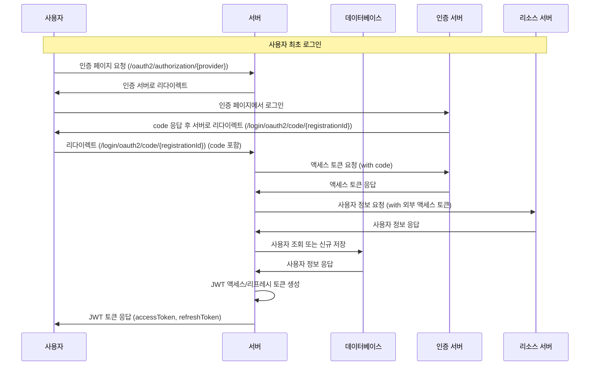

<!-- TOC -->
* [RFC 6749 OAuth2 Protocol Flow](#rfc-6749-oauth2-protocol-flow)
  * [OAuth2 인증 흐름](#oauth2-인증-흐름)
<!-- TOC -->

# RFC 6749 OAuth2 Protocol Flow

 > [RFC 6749 1.2 Protocol Flow](https://datatracker.ietf.org/doc/html/rfc6749#section-1.2)

```
     +--------+                               +---------------+
     |        |--(A)- Authorization Request ->|   Resource    |
     |        |                               |     Owner     |
     |        |<-(B)-- Authorization Grant ---|               |
     |        |                               +---------------+
     |        |
     |        |                               +---------------+
     |        |--(C)-- Authorization Grant -->| Authorization |
     | Client |                               |     Server    |
     |        |<-(D)----- Access Token -------|               |
     |        |                               +---------------+
     |        |
     |        |                               +---------------+
     |        |--(E)----- Access Token ------>|    Resource   |
     |        |                               |     Server    |
     |        |<-(F)--- Protected Resource ---|               |
     +--------+                               +---------------+

                     Figure 1: Abstract Protocol Flow
```

## OAuth2 인증 흐름



---

