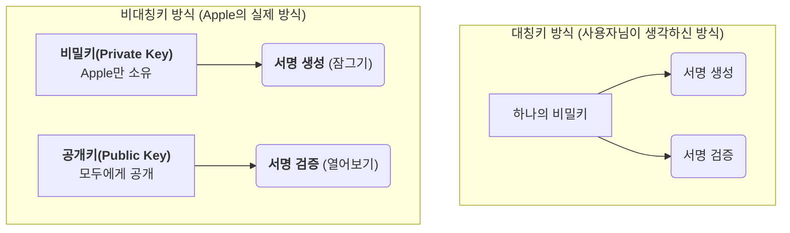
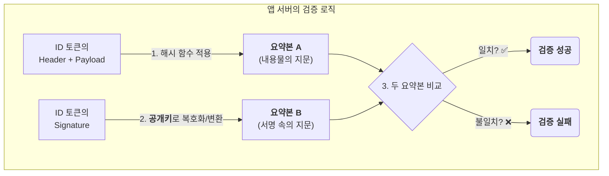
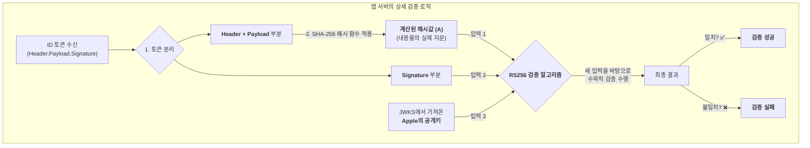
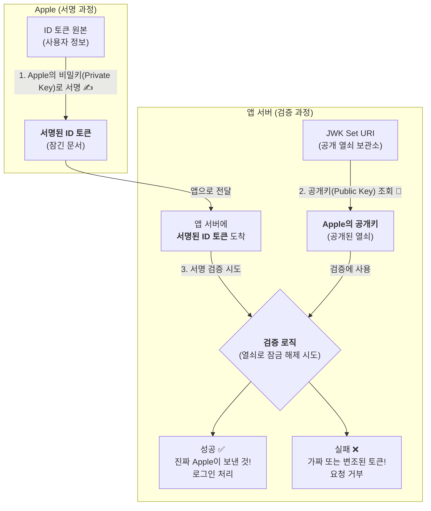
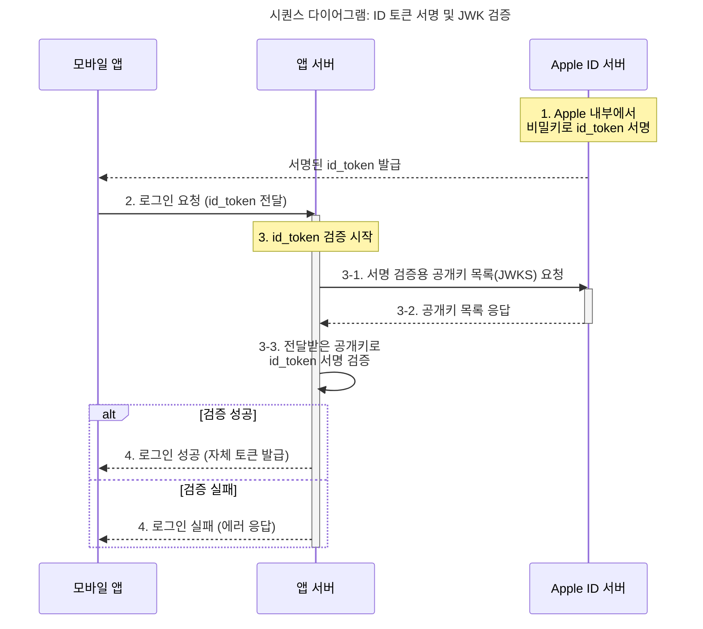
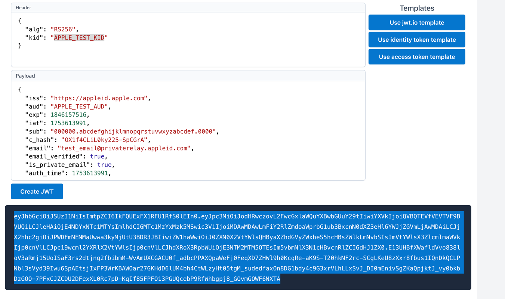

# JWK와 OIDC 상관관계

## 1. 문제 상황: "이 신분증 진짜인가?" 📜

- 모바일 앱이 서버로 id_token을 전달합니다. 이 id_token은 사용자의 "디지털 신분증"과 같습니다. 
- 하지만 서버 입장에서는 이런 의심이 듭니다.
- "이 id_token이 정말 Apple이 발급한 진짜 신분증일까? 해커가 비슷하게 만들어서 보낸 가짜 신분증 아닐까?"
- 만약 서버가 가짜 신분증을 믿고 로그인시켜준다면 큰일 나겠죠.

## 2. 해결책: Apple의 "디지털 서명" ✍️

- 이 문제를 해결하기 위해 Apple은 id_token을 발급할 때 자신만의 **'디지털 서명'**을 남깁니다. 

### Apple의 역할 (서명)
  - 사용자 정보가 담긴 id_token을 만듭니다. 
  - 오직 Apple만 아는 **비밀키(Private Key)**를 사용해 id_token에 암호화된 서명을 추가합니다.
  - 즉, id_token의 헤더와 페이로드를 애플의 Private Key로 서명해서 만들어진게 id_token의 시그니처. 
  - 이 서명된 id_token을 모바일 앱에 전달합니다.

### 앱 서버의 역할 (검증)
  
- 모바일 앱으로부터 서명된 id_token을 받습니다. 
- id_token의 서명이 진짜 Apple의 서명이 맞는지 확인해야 합니다. 
- 이때, jwk-set-uri (https://appleid.apple.com/auth/keys) 주소로 찾아갑니다. 
- 그 주소에는 Apple이 미리 공개해 둔 공개키(Public Key) 목록이 있습니다. 이 공개키는 Apple의 비밀키와 한 쌍을 이룹니다. 
- 서버는 이 공개키를 가져와서 id_token에 있는 서명을 대조해 봅니다

## 3. 결론: 공개키(JWK)는 "진짜 도장 감별기" ✅

- 만약 공개키로 서명 검증에 성공하면, 서버는 두 가지 사실을 확신할 수 있습니다. 
- 진위 여부: 이 id_token은 Apple의 비밀키로 서명된 것이므로 Apple이 발급한 것이 확실하다. 
- 무결성: 중간에 누군가 내용을 수정하지 않았다. (내용이 1글자라도 바뀌면 서명 검증에 실패함)
- 만약 검증에 실패하면, 그 id_token은 가짜이거나 변조된 것이므로 즉시 폐기하고 로그인을 거부합니다.

### 서버는 Apple의 Private Key가 없는데?

## JWKS 인증 방식 플로우 차트

## 테스트를 위한 JWKs 예시

> https://www.scottbrady.io/tools/jwt

