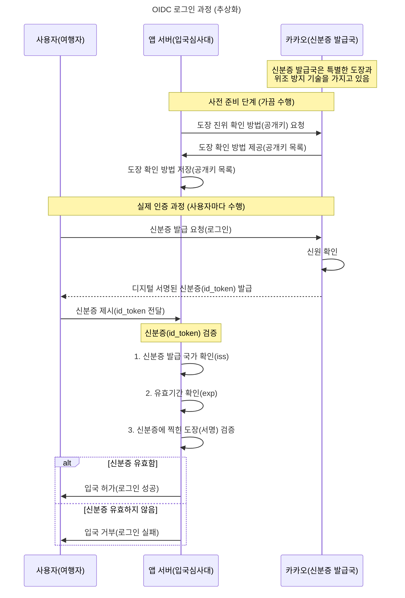
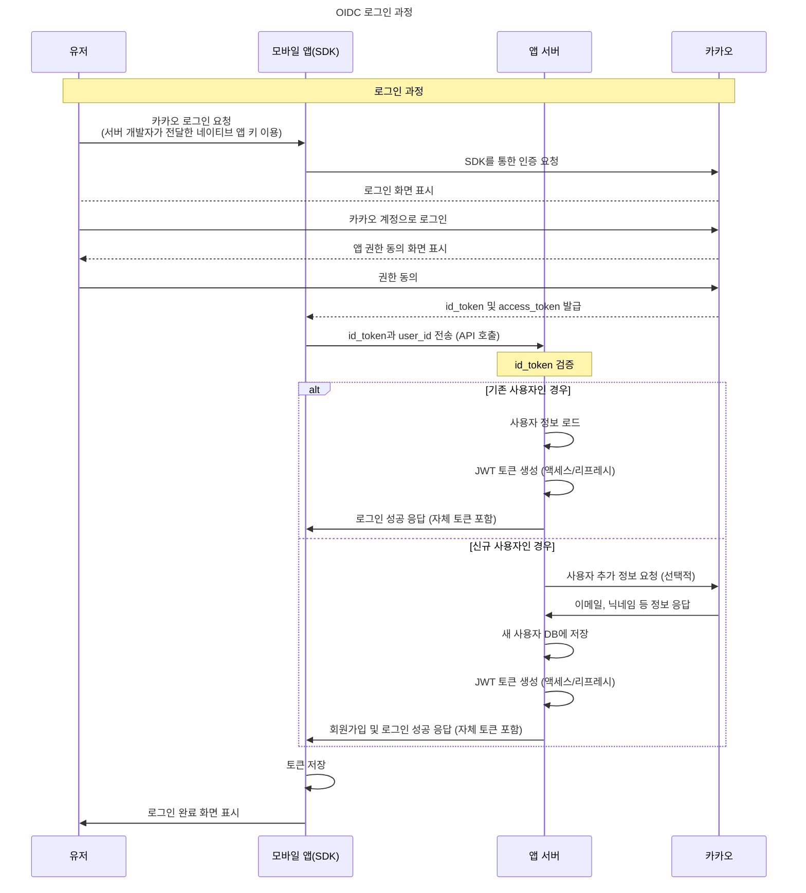

<!-- TOC -->
* [OIDC(OpenID Connect)](#oidcopenid-connect)
  * [실생활 비유](#실생활-비유)
  * [모바일 SDK를 이용한 OIDC 로그인](#모바일-sdk를-이용한-oidc-로그인)
    * [간략 버전](#간략-버전)
<!-- TOC -->

> - [OpenId.net - How OpenID Connect Works](https://openid.net/developers/how-connect-works/)
> - [Microsoft - what-is-openid-connect-oidc](https://www.microsoft.com/ko-kr/security/business/security-101/what-is-openid-connect-oidc)

# OIDC(OpenID Connect)

> 디지털 리소스에 액세스하기 위해 로그인할 때 사용자 ID를 확인하는 인증 프로토콜.

- OIDC(OpenID Connect)?
    - 사용자 인증을 위한 개방형 표준 프로토콜.
    - 간단히 말하자면, 사용자가 누구인지 확인하는 방법을 표준화한 것
- 정의:
    - OpenID Connect는 OAuth 2.0 프로토콜 위에 구축된 인증 레이어
      쉽게 말해, "이 사람이 누구인지" 확인할 수 있는 표준화된 방법
- 목적:
    - 사용자 인증(Authentication): "이 사람이 본인이 맞다"는 것을 증명
    - OAuth 2.0은 권한 부여(Authorization)에 중점을 두는 반면, OIDC는 인증에 중점을 둠
- 핵심 요소:
    - ID 토큰: JWT(JSON Web Token) 형식의 토큰으로, 사용자의 신원 정보 포함
    - UserInfo 엔드포인트: 사용자에 대한 추가 정보를 얻을 수 있는 API

## 실생활 비유

- OIDC는 마치 여권이나 신분증과 같음.
    - 신뢰할 수 있는 기관(예: 카카오)이 발급
    - 신분증에는 본인 확인에 필요한 정보가 포함됨
    - 제3자(내 서비스)가 신분증을 확인해 본인 여부를 판단

## 모바일 SDK를 이용한 OIDC 로그인

### 간략 버전

