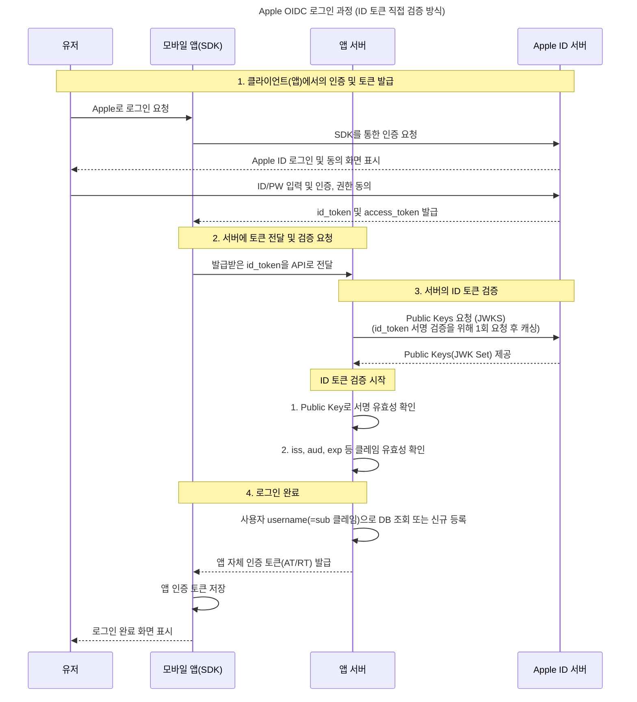
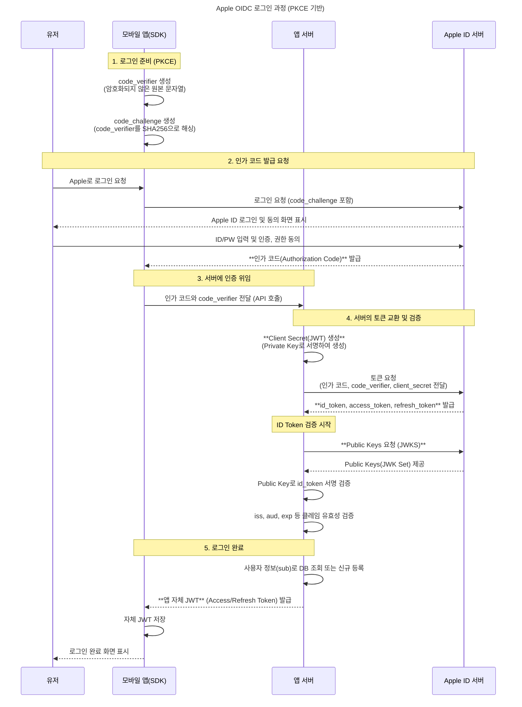

```mermaid
sequenceDiagram
    title Apple OIDC 로그인 과정 (ID 토큰 직접 검증 방식)

    participant user as 유저
    participant cli as 모바일 앱(SDK)
    participant se as 앱 서버
    participant app as Apple ID 서버

    Note over user,app: 1. 클라이언트(앱)에서의 인증 및 토큰 발급
    user->>cli: Apple로 로그인 요청
    cli->>app: SDK를 통한 인증 요청
    app-->>user: Apple ID 로그인 및 동의 화면 표시
    user->>app: ID/PW 입력 및 인증, 권한 동의
    app-->>cli: id_token 및 access_token 발급

    Note over cli,se: 2. 서버에 토큰 전달 및 검증 요청
    cli->>se: 발급받은 id_token을 API로 전달

    Note over se,app: 3. 서버의 ID 토큰 검증
    se->>app: Public Keys 요청 (JWKS)<br> (id_token 서명 검증을 위해 1회 요청 후 캐싱)
    app-->>se: Public Keys(JWK Set) 제공
    note over se, se: ID 토큰 검증 시작
    se->>se: 1. Public Key로 서명 유효성 확인
    se ->> se: 2. iss, aud, exp 등 클레임 유효성 확인

    Note over se,cli: 4. 로그인 완료
    se->>se: 사용자 username(=sub 클레임)으로 DB 조회 또는 신규 등록
    se-->>cli: 앱 자체 인증 토큰(AT/RT) 발급
    cli->>cli: 앱 인증 토큰 저장
    cli-->>user: 로그인 완료 화면 표시
```

```mermaid
sequenceDiagram
    title Apple OIDC 로그인 과정 (PKCE 기반)

    participant user as 유저
    participant cli as 모바일 앱(SDK)
    participant server as 앱 서버
    participant apple as Apple ID 서버

    Note over cli: 1. 로그인 준비 (PKCE)
    cli->>cli: code_verifier 생성 <br> (암호화되지 않은 원본 문자열)
    cli->>cli: code_challenge 생성 <br> (code_verifier를 SHA256으로 해싱)

    Note over user,apple: 2. 인가 코드 발급 요청
    user->>cli: Apple로 로그인 요청
    cli->>apple: 로그인 요청 (code_challenge 포함)
    apple-->>user: Apple ID 로그인 및 동의 화면 표시
    user->>apple: ID/PW 입력 및 인증, 권한 동의
    apple-->>cli: **인가 코드(Authorization Code)** 발급

    Note over cli,server: 3. 서버에 인증 위임
    cli->>server: 인가 코드와 code_verifier 전달 (API 호출)

    Note over server,apple: 4. 서버의 토큰 교환 및 검증
    server->>server: **Client Secret(JWT) 생성** <br> (Private Key로 서명하여 생성)
    server->>apple: 토큰 요청 <br> (인가 코드, code_verifier, client_secret 전달)
    apple-->>server: **id_token, access_token, refresh_token** 발급

    Note over server: ID Token 검증 시작
    server->>apple: **Public Keys 요청 (JWKS)**
    apple-->>server: Public Keys(JWK Set) 제공
    server->>server: Public Key로 id_token 서명 검증
    server->>server: iss, aud, exp 등 클레임 유효성 검증

    Note over server,cli: 5. 로그인 완료
    server->>server: 사용자 정보(sub)로 DB 조회 또는 신규 등록
    server-->>cli: **앱 자체 JWT** (Access/Refresh Token) 발급
    cli->>cli: 자체 JWT 저장
    cli-->>user: 로그인 완료 화면 표시
```