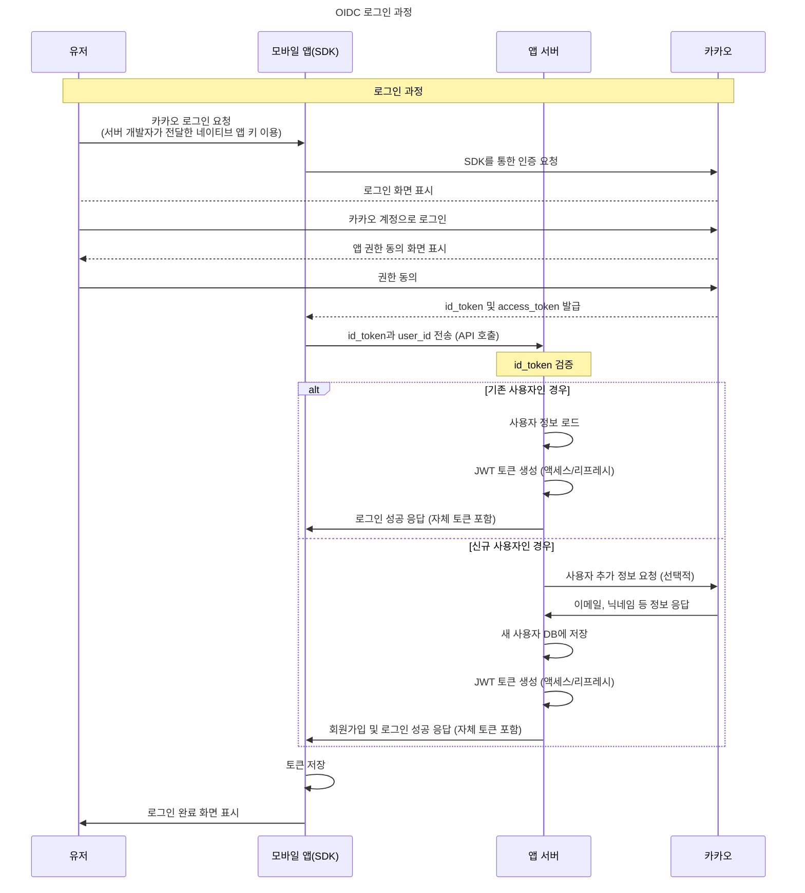
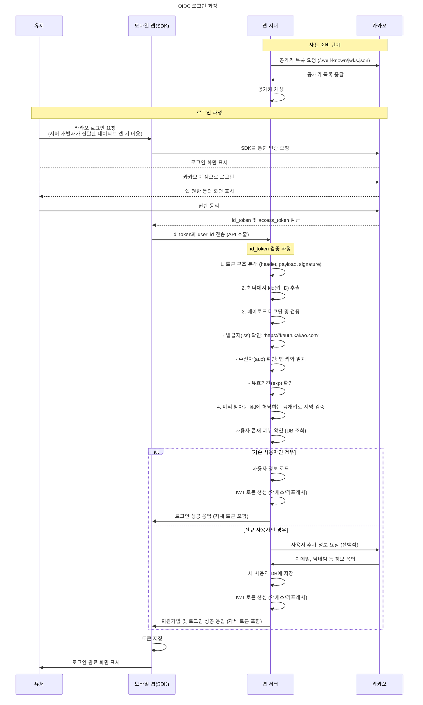

## 모바일 SDK를 이용한 OIDC 로그인

### 간략 버전

```mermaid
sequenceDiagram
    title OIDC 로그인 과정
    
    participant user as 유저
    participant cli as 모바일 앱(SDK)
    participant server as 앱 서버
    participant kakao as 카카오
    
    Note over user,kakao: 로그인 과정
    user->>cli: 카카오 로그인 요청 <br> (서버 개발자가 전달한 네이티브 앱 키 이용)
    cli->>kakao: SDK를 통한 인증 요청
    kakao-->user: 로그인 화면 표시
    user->>kakao: 카카오 계정으로 로그인
    kakao-->>user: 앱 권한 동의 화면 표시
    user->>kakao: 권한 동의
    
    kakao-->>cli: id_token 및 access_token 발급
    
    cli->>server: id_token과 user_id 전송 (API 호출)
    
    Note over server: id_token 검증 
    
    alt 기존 사용자인 경우
        server->>server: 사용자 정보 로드
        server->>server: JWT 토큰 생성 (액세스/리프레시)
        server->>cli: 로그인 성공 응답 (자체 토큰 포함)
    else 신규 사용자인 경우
        server->>kakao: 사용자 추가 정보 요청 (선택적)
        kakao->>server: 이메일, 닉네임 등 정보 응답
        server->>server: 새 사용자 DB에 저장
        server->>server: JWT 토큰 생성 (액세스/리프레시)
        server->>cli: 회원가입 및 로그인 성공 응답 (자체 토큰 포함)
    end
    
    cli->>cli: 토큰 저장
    cli->>user: 로그인 완료 화면 표시
```

### 상세 버전

```mermaid
sequenceDiagram
    title OIDC 로그인 과정
    
    participant user as 유저
    participant cli as 모바일 앱(SDK)
    participant server as 앱 서버
    participant kakao as 카카오
    
    Note over server,kakao: 사전 준비 단계
    server->>kakao: 공개키 목록 요청 (/.well-known/jwks.json)
    kakao->>server: 공개키 목록 응답
    server->>server: 공개키 캐싱
    
    Note over user,kakao: 로그인 과정
    user->>cli: 카카오 로그인 요청 <br> (서버 개발자가 전달한 네이티브 앱 키 이용)
    cli->>kakao: SDK를 통한 인증 요청
    kakao-->user: 로그인 화면 표시
    user->>kakao: 카카오 계정으로 로그인
    kakao-->>user: 앱 권한 동의 화면 표시
    user->>kakao: 권한 동의
    
    kakao-->>cli: id_token 및 access_token 발급
    
    cli->>server: id_token과 user_id 전송 (API 호출)
    
    Note over server: id_token 검증 과정
    server->>server: 1. 토큰 구조 분해 (header, payload, signature)
    server->>server: 2. 헤더에서 kid(키 ID) 추출
    server->>server: 3. 페이로드 디코딩 및 검증
    server->>server: - 발급자(iss) 확인: 'https://kauth.kakao.com'
    server->>server: - 수신자(aud) 확인: 앱 키와 일치
    server->>server: - 유효기간(exp) 확인
    server->>server: 4. 미리 받아둔 kid에 해당하는 공개키로 서명 검증
    
    server->>server: 사용자 존재 여부 확인 (DB 조회)
    
    alt 기존 사용자인 경우
        server->>server: 사용자 정보 로드
        server->>server: JWT 토큰 생성 (액세스/리프레시)
        server->>cli: 로그인 성공 응답 (자체 토큰 포함)
    else 신규 사용자인 경우
        server->>kakao: 사용자 추가 정보 요청 (선택적)
        kakao->>server: 이메일, 닉네임 등 정보 응답
        server->>server: 새 사용자 DB에 저장
        server->>server: JWT 토큰 생성 (액세스/리프레시)
        server->>cli: 회원가입 및 로그인 성공 응답 (자체 토큰 포함)
    end
    
    cli->>cli: 토큰 저장
    cli->>user: 로그인 완료 화면 표시
```
