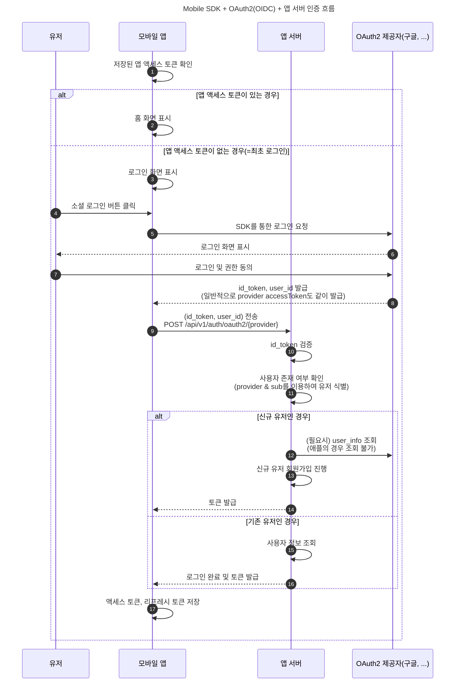
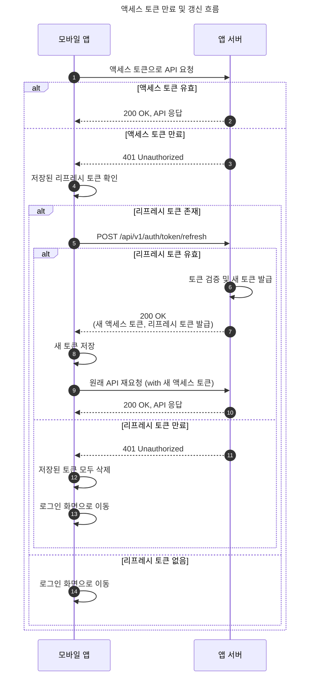
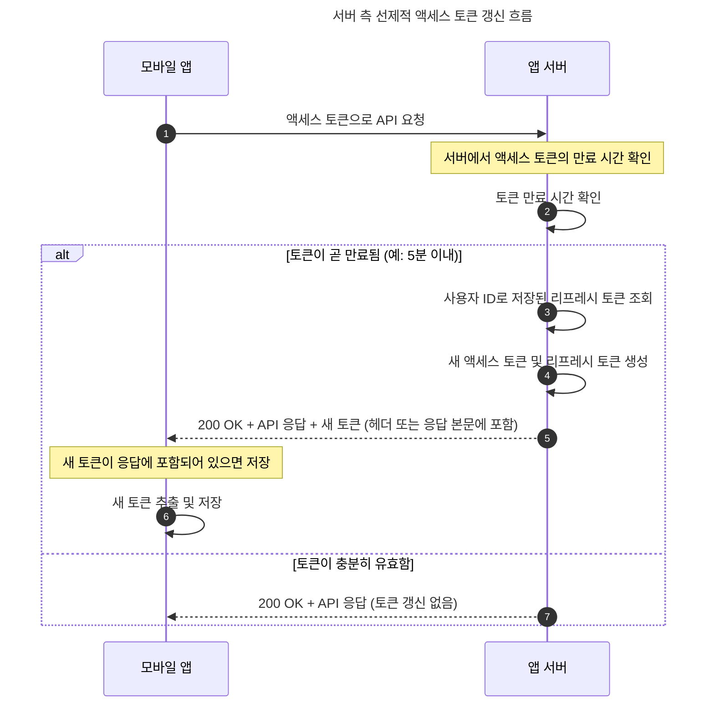

<!-- TOC -->
* [모바일 SDK + OAuth2(OIDC) 인증 흐름](#모바일-sdk--oauth2oidc-인증-흐름)
  * [로그인(신규 유저는 회원가입)](#로그인신규-유저는-회원가입-)
  * [회원가입 시 주의점 - 유저를 (provider, email)로 식별하면 안 된다](#회원가입-시-주의점---유저를-provider-email로-식별하면-안-된다)
    * [해결 방법 - (provider, provider_user_id)로 유저를 식별](#해결-방법---provider-provider_user_id로-유저를-식별)
  * [로그인 이후 서비스 이용](#로그인-이후-서비스-이용)
    * [서버의 선제적 액세스 토큰 갱신](#서버의-선제적-액세스-토큰-갱신)
<!-- TOC -->

# 모바일 SDK + OAuth2(OIDC) 인증 흐름

## 로그인(신규 유저는 회원가입) 

## 회원가입 시 주의점 - 유저를 (provider, email)로 식별하면 안 된다

- 애플의 경우 최초 로그인 시에만 유저 이메일을 제공하고, 이후에는 제공하지 않음.
- 즉, 기존 유저가 존재하는 로직을 사용할 때,
    - (provider, email)로 기존 유저를 식별하려면 유저가 애플로 재 로그인할 때 문제가 된다.
        - 유저가 애플 재로그인할 때는 이메일이 없으니까 서버에서 유저 이메일을 조회할 수가 없음.

### 해결 방법 - (provider, provider_user_id)로 유저를 식별

- OIDC 프로토콜에서, `sub(앱의 provider_user_id)`는 반드시 포함된다.
- 즉, 유저가 애플로 재로그인할 때도 `sub`는 항상 존재한다.

## 로그인 이후 서비스 이용

### 서버의 선제적 액세스 토큰 갱신

