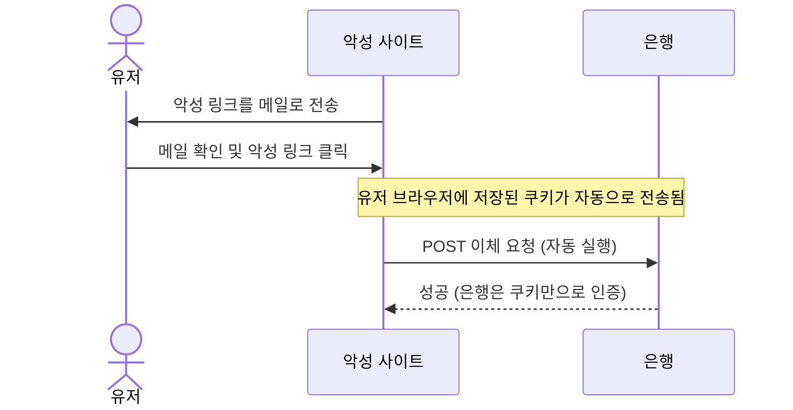
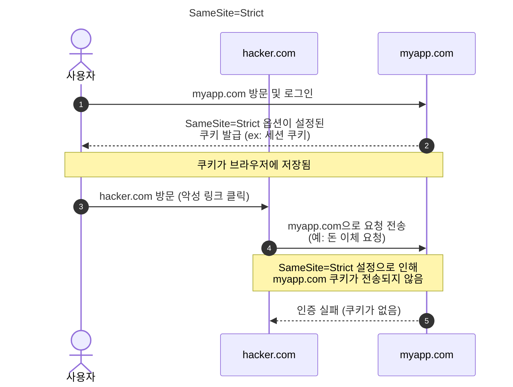
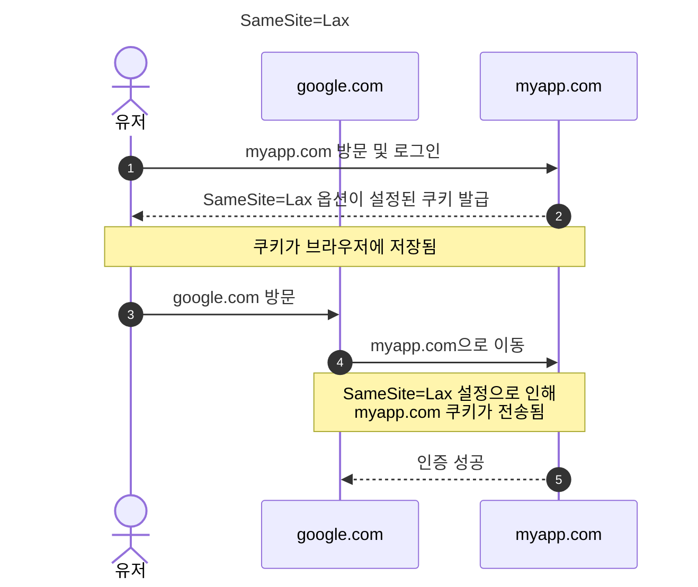
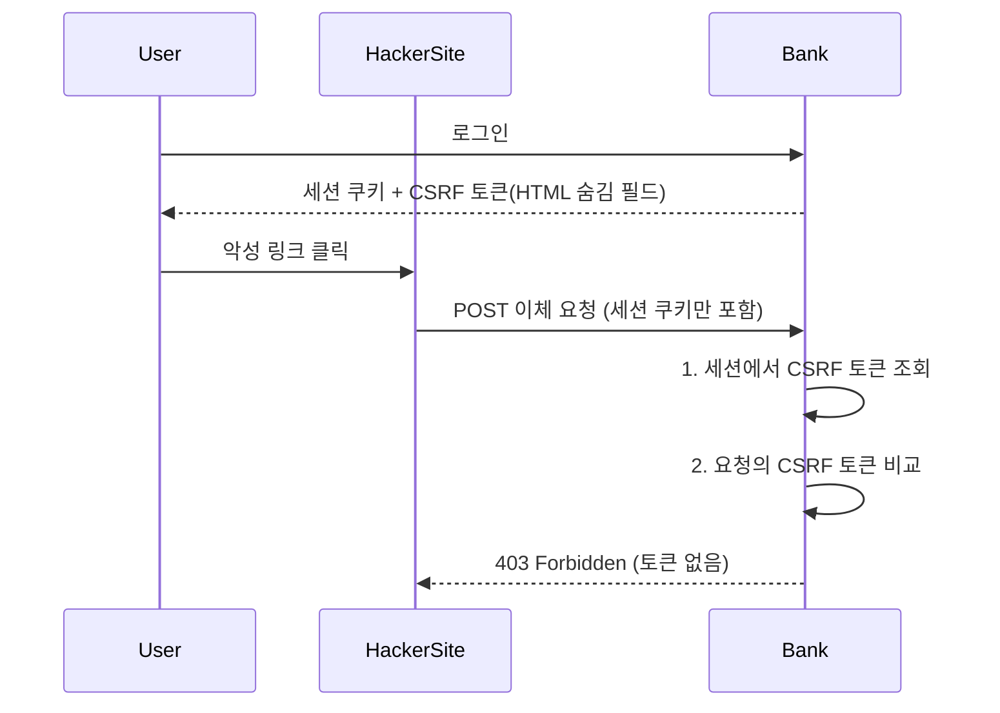

> [CSRF 관련 PR](https://github.com/next-step/spring-security-refactoring/pull/9#discussion_r2001099639) 

<!-- TOC -->
* [CSRF(Cross-Site Request Forgery) 공격이란?](#csrfcross-site-request-forgery-공격이란)
* [CSRF 방어](#csrf-방어)
  * [브라우저 레벨에서의 방어](#브라우저-레벨에서의-방어)
    * [SameSite 옵션이란?](#samesite-옵션이란-)
  * [SameSite 옵션에 따른 CSRF 방어 전략](#samesite-옵션에-따른-csrf-방어-전략)
    * [SameSite=Strict](#samesitestrict)
    * [SameSite=Lax](#samesitelax)
    * [SameSite=None](#samesitenone-)
  * [애플리케이션의 CSRF 방어](#애플리케이션의-csrf-방어)
    * [CSRF 토큰 적용 전](#csrf-토큰-적용-전)
    * [CSRF 토큰 적용 후](#csrf-토큰-적용-후)
* [실무에서는 어떻게 CSRF 방어를 사용할까](#실무에서는-어떻게-csrf-방어를-사용할까)
  * [CSR에서는 쿠키 방식으로, SSR에서는 세션 방식으로](#csr에서는-쿠키-방식으로-ssr에서는-세션-방식으로)
  * [CSRF 토큰이 필요할까?](#csrf-토큰이-필요할까)
  * [JWT 기반의 인증에서는 CSRF 방어를 어떻게 할까?](#jwt-기반의-인증에서는-csrf-방어를-어떻게-할까)
  * [(JWT) 액세스 토큰은 헤더로, 리프레쉬 토큰은 HttpOnly & SameSite 쿠키로](#jwt-액세스-토큰은-헤더로-리프레쉬-토큰은-httponly--samesite-쿠키로)
  * [CSR 환경에서 CSRF 토큰이 아닌 CORS 정책을 활용해 방어할 수 있지 않을까?](#csr-환경에서-csrf-토큰이-아닌-cors-정책을-활용해-방어할-수-있지-않을까)
<!-- TOC -->

# CSRF(Cross-Site Request Forgery) 공격이란?

- HTTP 요청 시, 쿠키가 요청에 자동으로 포함된다는 점을 이용한 보안 공격.
- 예) 해커가 사용자의 브라우저에서 악성 링크를 클릭하게 하여, 서비스로 요청을 보낼 때 사용자의 브라우저에 저장된 쿠키를 함께 보내는 공격

- 위 예시에서 은행 서버 입장에서는 요청이 악성 사이트에서 시작된 요청인지, 유저가 직접 요청한 것인지 구분할 수 없다. 즉 유저가 의도하지 않은 요청에 대해 서버가 요청을 수행하게 됨으로써 금전적 손실 등 심각한 문제가 발생할 수 있다. 

# CSRF 방어

## 브라우저 레벨에서의 방어

- SameSite 쿠키 속성을 이용한 방어

### SameSite 옵션이란? 

- 브라우저의 **크로스 사이트 요청**에 대해, **쿠키 전송 여부를 제어하는 쿠키 옵션**
  - 즉, 다른 사이트에서 내 사이트로 요청할 때 쿠키를 보낼지 결정하는 옵션
- SameSite 옵션은 왜 필요한가? 
  - HTTP 요청 시 브라우저의 쿠키가 자동으로 전송되므로, 해당 취약점을 이용한 공격(=CSRF 공격)을 방어하기 위한 방법이다.
- 예를 들어 같은 origin 대해서만 쿠키를 전송하도록 설정한 상태에서, `hacker.com`에서 `myapp.com`으로 요청을 보내는 상황을 가정해보자. 
  - 이 때 `hacker.com`에서 `myapp.com`으로 요청을 보낼 때, `myapp.com`에서 만든 쿠키라면 이 쿠키는 전송되지 않는다. (이 때 origin은 `google.com`이므로)
  

## SameSite 옵션에 따른 CSRF 방어 전략

### SameSite=Strict

- 요약
  - **_같은 origin에서만 쿠키를 전송하도록 설정하는 옵션_**
    - 즉, 외부 사이트에서 우리 앱으로의 요청에는 쿠키가 전송되지 않음.
- 예를 들어, SameSite=Strict로 설정한 쿠키를 `myapp.com`에서 생성했다고 가정하자.
  - 이 때 `hacker.com`에서 `myapp.com`으로 요청을 보내면, `myapp.com`에서 생성한 쿠키는 전송되지 않는다. (이 때 origin은 `hacker.com`이므로)
- 단점
  - 사용자 경험이 저하될 수 있음.
  - 예를 들어, 
    1. 사용자가 우리 앱에 로그인해서 쿠키가 브라우저가 저장된 상태
    2. 사용자가 다른 사이트에서 링크를 클릭하여 우리 프론트로 이동
    3. 이 때 origin은 다른 사이트이므로 우리 앱에서 발급했던 쿠키는 전송되지가 않아 우리 프론트에서는 쿠키가 없는 상태.
       - 페이지는 로드되지만, 쿠키는 전송되지 않음
    4. 프론트가 서버로 요청을 하지만, 쿠키가 없으므로 인증 실패 (이동 후 첫 API 요청에서 인증 실패 발생)
    5. 사용자는 다시 로그인해야하므로 UX 저하 발생

### SameSite=Lax

- 요약
  - 기본적으로 같은 origin에서만 쿠키를 전송하도록 설정하지만, 최상위 탐색(링크 클릭 등)에서는 쿠키 전송을 허용하는 옵션
- 장점
  - ✅ 일반적인 사용자 경험 흐름 유지
    - 링크 클릭에서는 쿠키 전송을 허용하므로, 우리 앱으로 접속할 때 인증이 유지되는 등 UX가 개선된다.
  - ✅ 적절한 보안 수준 제공 
    - POST 등의 요청에서는 쿠키가 전송되지 않으므로 SameSite=Strict와 마찬가지로 CSRF 공격을 방어할 수 있다.
      - 그래서 앱 서버에서는 GET 요청시에는 상태 변경이 있어서는 안 된다. GET 요청 시에는 쿠키가 전송되므로, GET 요청 시에 상태 변경이 있으면 CSRF 공격이 성공해버리므로.
- 단점
  - ❌ GET을 통한 상태 변경 API가 있다면 여전히 취약할 수 있음.

---

- 최상위 탐색? (top-level navigation)
  - 사용자가 직접 링크를 클릭해서 페이지를 이동할 때
  - 브라우저 주소창에 직접 URL을 입력할 때
  - window.location.href 변경으로 페이지를 이동할 때
  - `HTML <form method="GET">` 제출할 때
    - (top-level navigation 이 아닌 Ajax 등의 GET 요청에서는 쿠키 전송 안 됨.)
- SameSite=Lax에서 쿠키 전송 안 되는 경우
  - Ajax 요청(fetch/XMLHttpRequest)
  - `` 태그의 src 속성
  - `<iframe>` 내에서의 요청
  - `<script>` 태그의 src 속성
  - CSS의 background-image 등 리소스 요청
- 👉즉, SameSite=Lax는 "사용자가 의도적으로 링크를 클릭해서 이동"하는 것은 허용하면서도, "사용자 모르게 백그라운드에서 이루어지는 요청"은 차단하는 방식으로 작동 
  - 👉SameSite=Lax는 보안과 사용자 경험 사이의 균형을 제공하는 이유

### SameSite=None 

- 모든 요청에 쿠키를 전송하므로, 브라우저 레벨에서 CSRF 방어 불가.

## 애플리케이션의 CSRF 방어

- CSRF 토큰을 이용하여 방어

### CSRF 토큰 적용 전

### CSRF 토큰 적용 후

# 실무에서는 어떻게 CSRF 방어를 사용할까

> [고민해볼만한 포인트](https://github.com/next-step/spring-security-refactoring/pull/9#discussion_r2019776661) 
> - CSR에서 쿠키 기반의 CSRF를 사용할 경우 SameSite 옵션은 어떻게 하는게 좋을까?
> - 서버에서 별도로 CSRF 토큰을 관리하지 않고 방어할 수 있는 방법은 없을까?
> - JWT 기반의 인증을 하고 있다면, CSRF 방어 방식이 달라질게 있을까?
> - CSR 환경에서 CSRF 토큰이 아닌 CORS 정책을 활용해 방어할 수 있지 않을까?

## CSR에서는 쿠키 방식으로, SSR에서는 세션 방식으로

1. HTTP 세션에 CSRF 토큰 저장 -> SSR에 적합
   - 타임리프와 같은 템플릿 엔진을 사용하는 경우 토큰값을 직접 프론트로 내려줄 수 있기 때문에, 이 경우 프론트에서는 굳이 번거롭게 쿠키나 세션을 조회하거나 할 필요가 없음.
   - 서버에서는 세션 저장소의 토큰값과 쿼리 파라미터로 넘어온 토큰값을 검증하면 되니 인증 방식도 간편.
2. 쿠키에 토큰 저장 -> CSR에 적합
   - 일단 CSR의 경우 쿼리 파라미터나 헤더로 토큰을 실어서 서버로 전송해야하는데, 세션 ID로만 토큰이 관리되면 프론트에서는 이 값을 알 수가 없음.
   - 즉 서버의 CSRF 인증을 통과하지 못하게되고, 따라서 쿠키에 CSRF 토큰값을 실어 프론트로 내려준 후, 프론트에서는 헤더에 이 토큰을 실어서 다시 전송하는 식으로 구현할 수 밖에 없음. 
   - 서버에서는 쿠키의 토큰값과 헤더의 토큰값을 비교하는 방식으로 인증을 처리.

## CSRF 토큰이 필요할까?

- CSRF 방어는 되는데 구현이 복잡
  - CSRF 토큰을 서버, 프론트 모두 구현하면 CSRF 방어는 가능한데, CSR에서는 쿠키에서 CSRF 토큰을 읽어와서 헤더에 실어서 보내야 하는 등 구현이 복잡해진다.
- **인증용 쿠키의 SameSite를 설정해서 CSRF 방어**
  - 인증용 쿠키를 사용하는 경우, CSRF 토큰을 사용 안 하고 SameSite 쿠키 옵션을 사용하여 CSRF 공격을 방어 가능. 
     

## JWT 기반의 인증에서는 CSRF 방어를 어떻게 할까?

- 쿠키 기반의 인증을 사용하고 있다면 SameSite 옵션 사용.
  - 쿠키를 사용하므로 CSRF 방어를 위해 SameSite 옵션을 Lax 또는 Strict로 설정한다.
- 헤더로 인증하게 된다면, accessToken에 대한 CSRF 방어 자체가 불필요. 
  - (CSRF 방어는 브라우저의 쿠키가 자동으로 전송되는 취약점을 이용한 것이므로) 
  - 다만 refreshToken 같은 경우는 여전히 쿠키로 전달해줘야하므로 SameSite 옵션은 여전히 Lax 이상으로 설정할 필요 있음.

## (JWT) 액세스 토큰은 헤더로, 리프레쉬 토큰은 HttpOnly & SameSite 쿠키로

- AccessToken: Authorization Header로 관리 & 짧은 수명
  - 액세스 토큰을 헤더로 관리하게 되면 CSRF 공격에서는 자유로워짐.
  - 다만 쿠키에 액세스 토큰을 저장하는게 아니고 로컬 스토리지 등에 저장하게 되면 XSS 공격에 취약해질 수 있음.
  - 액세스 토큰 만료 시 리프레쉬 토큰으로 액세스 토큰 재발급
- Refresh Token: HttpOnly & SameSite 쿠키로 관리
  - HttpOnly: JS 에서 접근 불가 -> XSS 공격 차단
  - SameSite: CSRF 공격 차단
- Same Origin Policy를 활용하여 CSRF 공격을 방어할 수 있다.

## CSR 환경에서 CSRF 토큰이 아닌 CORS 정책을 활용해 방어할 수 있지 않을까?

- CORS 정책을 활용해 CSRF 방어는 불가
- 예를 들어 api 서버인 backend.com에서 서비스의 프론트 origin인 https://front.com을 allow origin으로 설정했고, backend.com의 요청에 필요한 쿠키는 SameSite=None 설정되어있다고 가정
  - 위 경우 google.com 에서 front.com으로 요청 시 HTTP 요청에 쿠키가 포함되고, 이어서 front.com에서 backend.com으로의 요청에도 쿠키가 포함되므로 CSRF 방어가 어려움.
