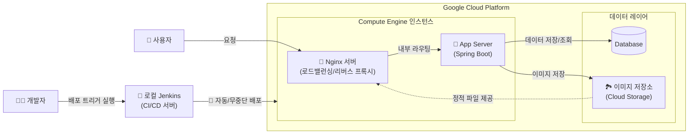

## 

```mermaid
flowchart LR
%% 전체 아키텍처를 좀 더 명확하게 구분

%% 외부 요소 정의
    user["👥 사용자"]
    dev["👨‍💻 개발자"]
    jenkins["🚀 로컬 Jenkins<br>(CI/CD 서버)"]
%% GCP 인프라 서브그래프
    subgraph GCP["Google Cloud Platform"]
        %% 애플리케이션 레이어 (Compute Engine 하나에 Nginx와 App Server 포함)
        subgraph ComputeEngine["Compute Engine 인스턴스"]
            Nginx["🔄 Nginx 서버<br>(로드밸런싱/리버스 프록시)"]
            svr["🍃 App Server<br>(Spring Boot)"]
        end

        %% 데이터 레이어
        subgraph DataLayer["데이터 레이어"]
            db[(Database)]
            storage["🏞️ 이미지 저장소<br>(Cloud Storage)"]
        end
    end

%% 연결 관계
    user -->|요청| Nginx
    dev -->|배포 트리거 실행| jenkins
    jenkins -->|🚀 자동/무중단 배포| ComputeEngine
    Nginx -->|내부 라우팅| svr
    svr -->|데이터 저장/조회| db
    svr -->|이미지 저장| storage
    storage -.->|정적 파일 제공| Nginx
```

