<!-- TOC -->
* [5. EC2 접속](#5-ec2-접속)
  * [인스턴스 요약 정보에 대해](#인스턴스-요약-정보에-대해)
  * [EC2 접속](#ec2-접속-)
    * [브라우저로 접속](#브라우저로-접속)
    * [SSH 접속](#ssh-접속)
* [6. 탄력적 IP 연결하기](#6-탄력적-ip-연결하기)
  * [탄력적 IP가 필요한 이유](#탄력적-ip가-필요한-이유)
  * [탄력적 IP 설정 방법](#탄력적-ip-설정-방법)
    * [임시 IP 눈으로 확인](#임시-ip-눈으로-확인)
    * [탄력적 IP 연결하기](#탄력적-ip-연결하기)
* [7. Express 서버를 EC2에 배포하기](#7-express-서버를-ec2에-배포하기)
* [7-2. Spring Boot 서버를 EC2에 배포하기](#7-2-spring-boot-서버를-ec2에-배포하기)
  * [JDK 설치](#jdk-설치)
  * [애플리케이션 실행](#애플리케이션-실행)
    * [github에서 소스 가져오기](#github에서-소스-가져오기)
    * [yml 파일 설정](#yml-파일-설정)
    * [빌드](#빌드)
    * [실행](#실행)
  * [서버 접근](#서버-접근)
    * [접근이 불가능하다?](#접근이-불가능하다)
    * [80 요청을 8080 포트로 어떻게 보내지?](#80-요청을-8080-포트로-어떻게-보내지)
    * [Reverse Proxy](#reverse-proxy)
* [비용 나가지 않게 EC2 깔끔하게 종료하기](#비용-나가지-않게-ec2-깔끔하게-종료하기)
<!-- TOC -->

# 5. EC2 접속

## 인스턴스 요약 정보에 대해


- 퍼블릭 IPv4 주소
  - 인스턴스의 IP

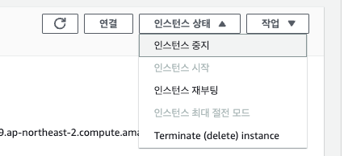

- 인스턴스 중지: 컴퓨터 종료
- 인스턴스 시작: 컴퓨터 시작
- 인스턴스 종료(Terminate instance): 컴퓨터 '삭제'

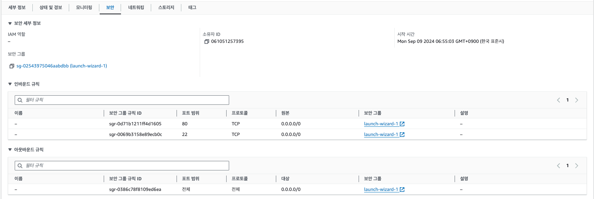

## EC2 접속 

### 브라우저로 접속


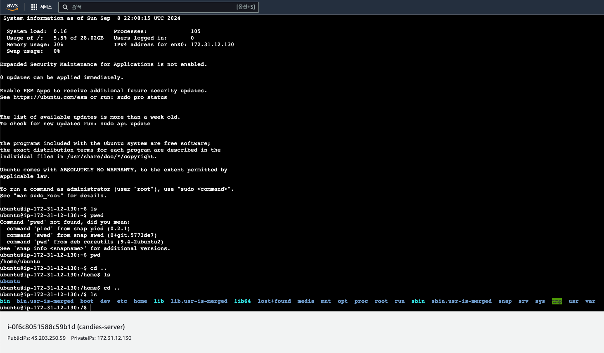

- 브라우저로 접속 시 위 같은 창이 나타난다.

### SSH 접속


- pem Key가 있는 디렉토리로 이동 후, 명령어 입력 시 터미널에서 접속 가능하다.  
  - `ssh -i "candies-server-key-pair.pem" ubuntu@ec2-43-203-250-59.ap-northeast-2.compute.amazonaws.com`


# 6. 탄력적 IP 연결하기

## 탄력적 IP가 필요한 이유

- EC2 인스턴스를 생성하면 IP를 할당 받는데, 이 때 할당받는 IP는 임시적인 IP이다. 
  - 전세계적으로 컴퓨터 개수가 늘어남에 따라 IP가 부족해지는데, 사용하지 않을 경우 다른 컴퓨터에 IP를 할당받아야 하기 때문에 임시 IP를 할당한다.
  - 임시 IP이므로 인스턴스 중지 후 재실행하면 IP가 바뀐다.
- 인스턴스 재실행을 할 때마다 IP가 바뀌면 불편하므로, 재실행해도 바뀌지 않는 고정 IP를 할당 받아야하는데 이것을 `탄력적 IP`라고 한다. 
- 현업에서도 EC2 인스턴스를 생성하면 탄력적 IP를 대부분 필수적으로 설정한다.

## 탄력적 IP 설정 방법

### 임시 IP 눈으로 확인

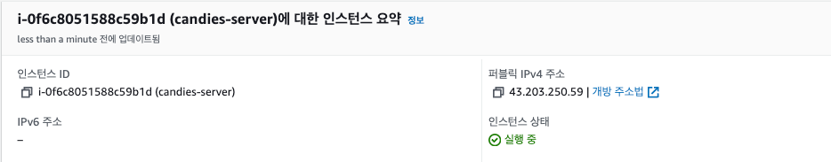


- 인스턴스 중지를 요청하면 인스턴스가 중지된다.


- 인스턴스가 중지되면 IP 주소가 사라진다.

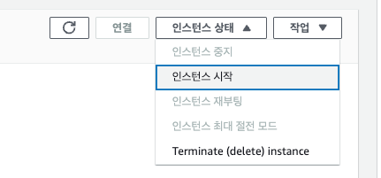

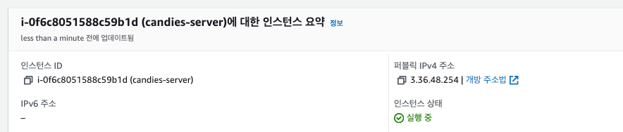

- 인스턴스를 재실행하면 IP 주소가 변경된다.

### 탄력적 IP 연결하기


- [네트워크 및 보안] > [탄력적 IP]

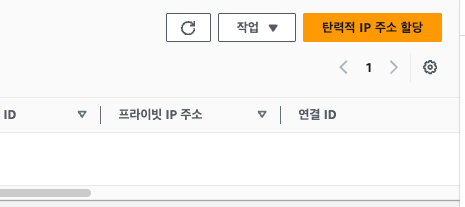

- [탄력적 IP 주소 할당] 클릭

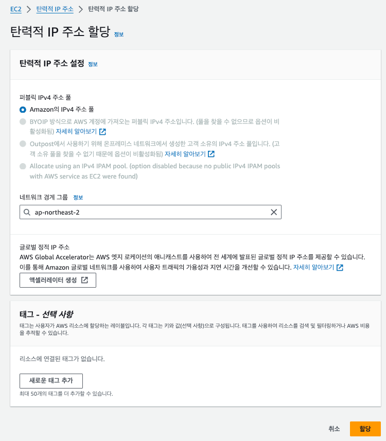

- 별다른 설정 없이 [할당] 클릭.


- 그럼 위처럼 탄력적 IP가 발급된다.

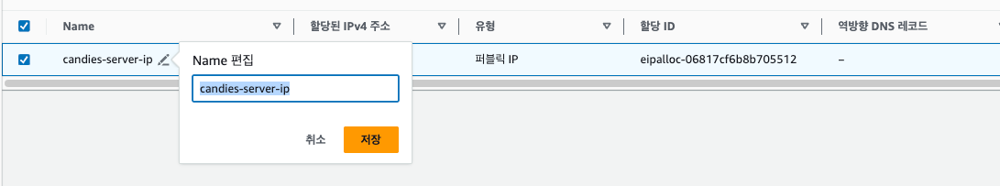

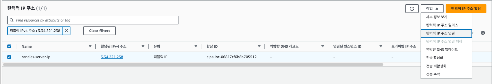

- 탄력적 IP의 이름을 식별할 수 있게 변경하자.
- [작업] > [탄력적 IP 주소 연결]으로 연결 설정창에 접속.

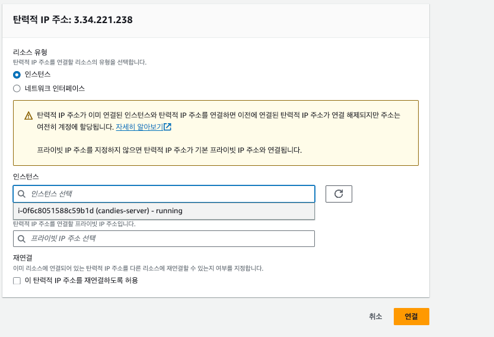

- 인스턴스 선택 후 [연결]후 인스턴스 요약에서 IP가 연결되었는지 확인한다. 

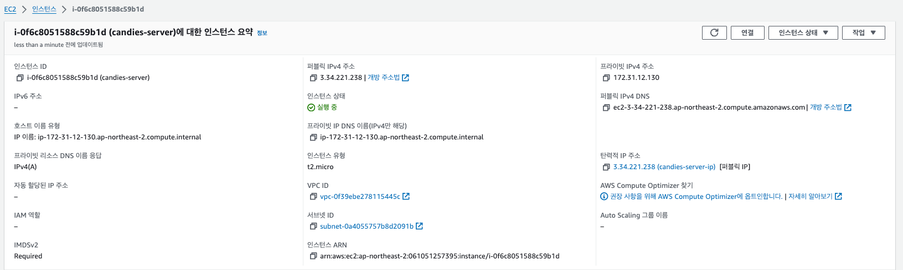

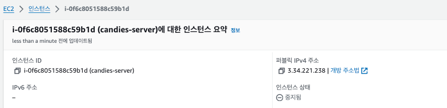

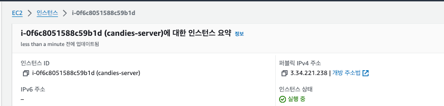

- 인스턴스가 중지, 재실행되어도 IP 주소는 고정된 것을 확인할 수 있다.

# 7. Express 서버를 EC2에 배포하기


# 7-2. Spring Boot 서버를 EC2에 배포하기

## JDK 설치

```text
$ sudo apt update && /
sudo apt install openjdk-17-jdk -y
```

## 애플리케이션 실행

### github에서 소스 가져오기


### yml 파일 설정


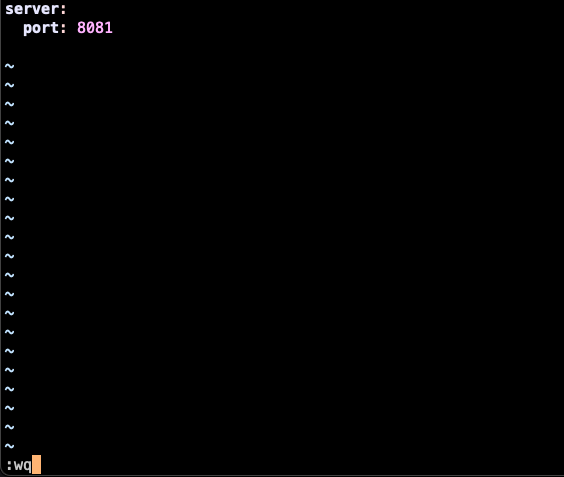

- gitignore에 `application.yml`을 설정해서, 직접 yml 파일을 만들었다.

### 빌드

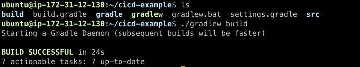

### 실행

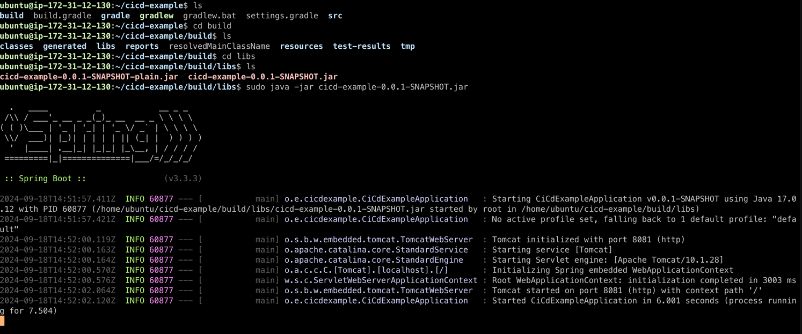

- `project/build/libs` 에 jar 파일이 생성된다.
- sudo java -jar 커맨드로 jar 파일 실행

## 서버 접근

### 접근이 불가능하다?

- ⚠️ 주의: 현재 앱은 8081 포트로 뜨도록 되어있는데, 인바운드 규칙에서는 80포트만 연결해두었다. 
- 따라서 아무리 public IP:80 포트로 접속해도 다음과 같이 서버로부터 응답을 받을 수 없다.


- 서버를 80포트로 띄우면 다음과 같이 접속 가능한 것을 확인 가능


### 80 요청을 8080 포트로 어떻게 보내지?

- 리버스 프록시 사용:
  - Nginx나 Apache와 같은 웹 서버를 사용하여 80번 포트의 요청을 8080 포트로 프록시한다.
- 로드 밸런서 사용: 
  - AWS ELB(Elastic Load Balancer)를 사용하여 80번 포트의 트래픽을 EC2 인스턴스의 8080 포트로 라우팅한다.
 
### Reverse Proxy 사용

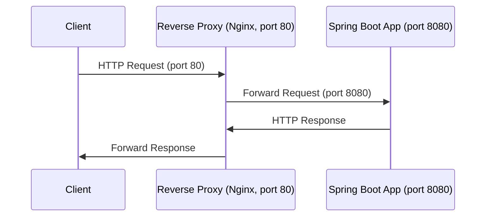

### 로드 밸런서 사용

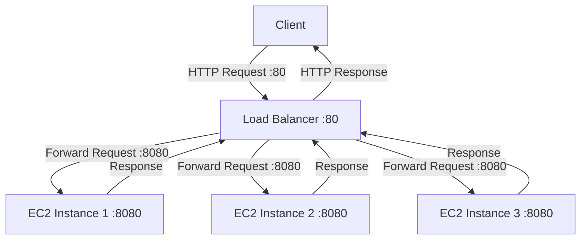

# 비용 나가지 않게 EC2 깔끔하게 종료하기

## 인스턴스 종료하기

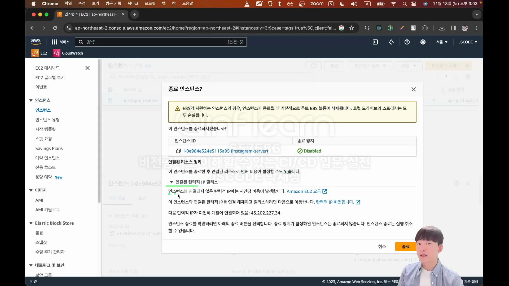

## 탄력적 IP 삭제

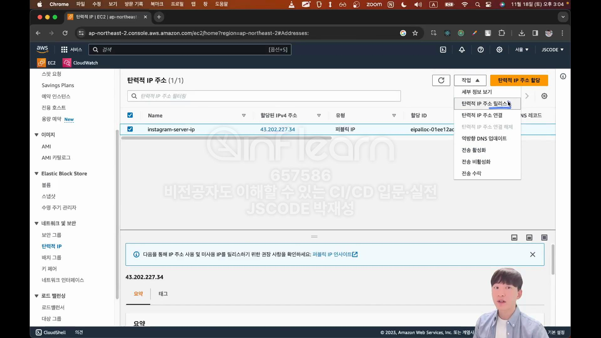

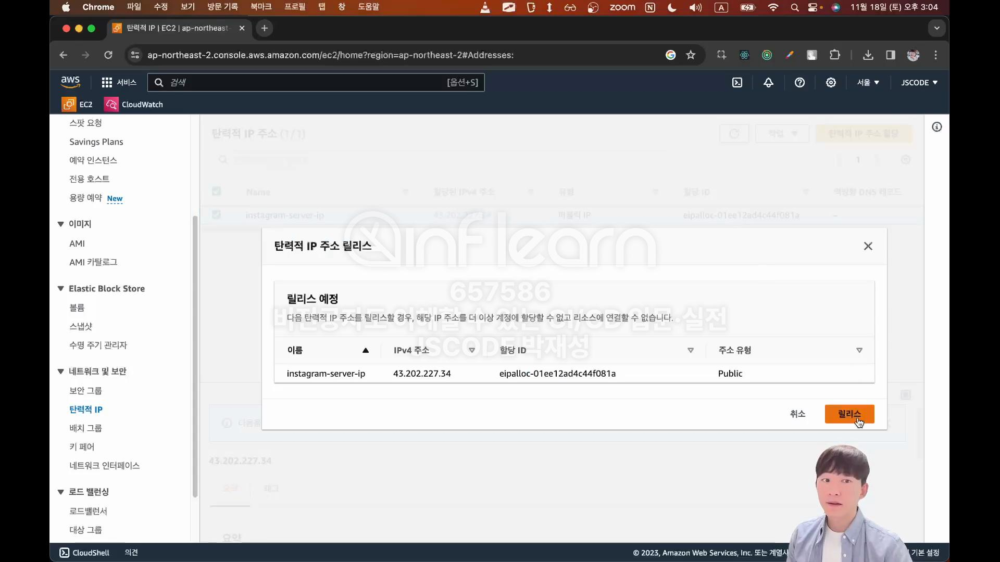


