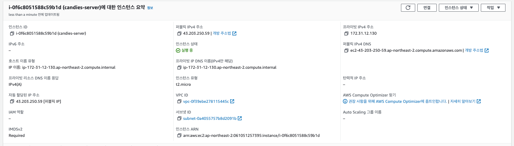
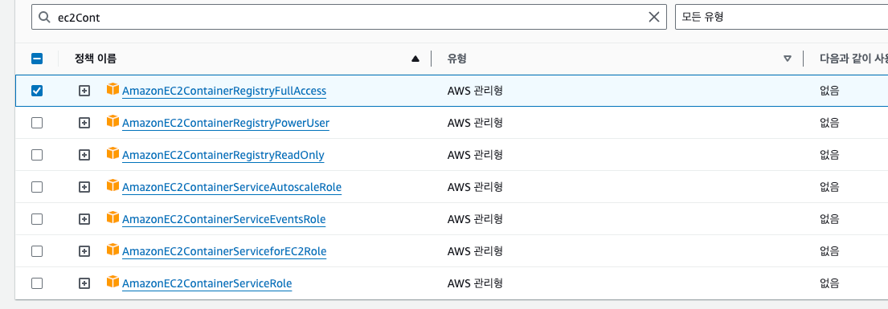

<!-- TOC -->
* [배포(Deployment)란?](#배포deployment란)
* [EC2란? / EC2를 왜 배울까?](#ec2란--ec2를-왜-배울까)
  * [EC2(Elastic Compute Cloud)란?](#ec2elastic-compute-cloud란)
  * [EC2를 왜 배울까?](#ec2를-왜-배울까)
* [1. EC2 설정 - 리전(Region) 선택](#1-ec2-설정---리전region-선택)
  * [리전?](#리전)
    * [리전에서 많이 하는 실수](#리전에서-많이-하는-실수)
  * [리전 설정 실습](#리전-설정-실습)
    * [콘솔 접속](#콘솔-접속)
    * [리전 설정](#리전-설정)
* [2. EC2 설정 - 기본 설정](#2-ec2-설정---기본-설정)
  * [인스턴스 시작](#인스턴스-시작)
    * [운영체제 선택](#운영체제-선택)
    * [인스턴스 유형(컴퓨터 사양)](#인스턴스-유형컴퓨터-사양)
    * [키 페어](#키-페어)
* [3. EC2 설정 - 보안 그룹 설정](#3-ec2-설정---보안-그룹-설정)
* [[보충] IP와 Port 개념](#보충-ip와-port-개념-)
* [4. EC2 설정 - 스토리지 구성](#4-ec2-설정---스토리지-구성)
* [5. EC2 접속](#5-ec2-접속)
* [6. 탄력적 IP 연결하기](#6-탄력적-ip-연결하기)
* [7. Express 서버를 EC2에 배포하기](#7-express-서버를-ec2에-배포하기)
* [7-2. Spring Boot 서버를 EC2에 배포하기](#7-2-spring-boot-서버를-ec2에-배포하기)
* [비용 나가지 않게 EC2 깔끔하게 종료하기](#비용-나가지-않게-ec2-깔끔하게-종료하기)
<!-- TOC -->

# 배포(Deployment)란?

# EC2란? / EC2를 왜 배울까?

## EC2(Elastic Compute Cloud)란?

> 한 줄 요약: **컴퓨터를 빌려서 원격으로 접속해 사용하는 서비스**이다.

- EC2를 쉽게 얘기하면 하나의 컴퓨터.

## EC2를 왜 배울까?

- 서버를 배포하기 위해서는 컴퓨터가 필요. 
  - 내 노트북으로 배포할 수 있지만 24시간 켜놔야하고 인터넷을 통해 내 컴퓨터에 접속하므로 보안에 취약.
- 이런 불편함 때문에 내 컴퓨터 사용대신 AWS EC2 컴퓨터를 빌려서 사용한다.
- 이 외에도 로깅, 오토 스케일링, 로드 밸런싱 등 부가 기능이 많음

# 1. EC2 설정 - 리전(Region) 선택

## 리전?

- 리전(Region)
  - 인프라를 지리적으로 나누어 배포한 각각의 데이터 센터.

### 리전에서 많이 하는 실수

- 아시아 태평양(서울) 리전에서 EC2를 생성해놓고, 다른 리전에 들어가서 아까 생성한 인스턴스가 없어졌다고 당황하는 경우가 있음.
- 리전마다 EC2가 따로 관리되고 있으니 이 점 유의.

## 리전 설정 실습

### 콘솔 접속

### 리전 설정

# 2. EC2 설정 - 기본 설정

## 인스턴스 시작

### 운영체제 선택

- OS는 Ubuntu 최신 버전 선택

### 인스턴스 유형(컴퓨터 사양)

- t2.micro 선택
  - 나름 나쁘지 않은 사양.
  - DAU 2000인 서비스도 나름 잘 돌아갔다.

### 키 페어

- 인스턴스에 접근하기 위한 보안 키

- 키 페어의 이름은 명확하게 짓기.

# 3. EC2 설정 - 보안 그룹 설정
# [보충] IP와 Port 개념 
# 4. EC2 설정 - 스토리지 구성
# 5. EC2 접속
# 6. 탄력적 IP 연결하기
# 7. Express 서버를 EC2에 배포하기
# 7-2. Spring Boot 서버를 EC2에 배포하기

# 비용 나가지 않게 EC2 깔끔하게 종료하기

