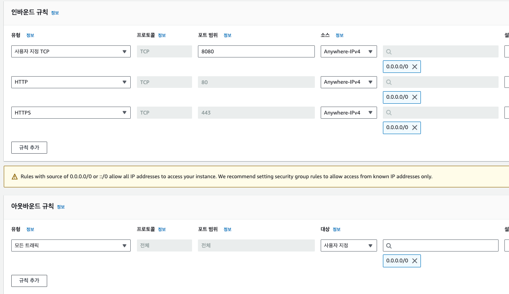

<!-- TOC -->
* [배포(Deployment)란?](#배포deployment란)
* [EC2란? / EC2를 왜 배울까?](#ec2란--ec2를-왜-배울까)
  * [EC2(Elastic Compute Cloud)란?](#ec2elastic-compute-cloud란)
  * [EC2를 왜 배울까?](#ec2를-왜-배울까)
* [1. EC2 설정 - 리전(Region) 선택](#1-ec2-설정---리전region-선택)
  * [리전?](#리전)
    * [리전에서 많이 하는 실수](#리전에서-많이-하는-실수)
  * [리전 설정 실습](#리전-설정-실습)
    * [콘솔 접속](#콘솔-접속)
    * [리전 설정](#리전-설정)
* [2. EC2 설정 - 기본 설정](#2-ec2-설정---기본-설정)
  * [인스턴스 시작](#인스턴스-시작)
    * [운영체제 선택](#운영체제-선택)
    * [인스턴스 유형(컴퓨터 사양)](#인스턴스-유형컴퓨터-사양)
    * [키 페어](#키-페어)
* [3. EC2 설정 - 보안 그룹 설정](#3-ec2-설정---보안-그룹-설정)
  * [보안 그룹이란?](#보안-그룹이란)
    * [트래픽 허용](#트래픽-허용)
  * [보안 그룹 설정하기](#보안-그룹-설정하기)
    * [인바운드 보안 그룹 규칙](#인바운드-보안-그룹-규칙)
* [[보충] IP와 Port 개념](#보충-ip와-port-개념)
  * [IP](#ip)
  * [Port](#port)
    * [브라우저 창에 포트 번호를 입력하지 않는 이유는?](#브라우저-창에-포트-번호를-입력하지-않는-이유는)
* [4. EC2 설정 - 스토리지 구성](#4-ec2-설정---스토리지-구성)
* [5. EC2 접속](#5-ec2-접속)
* [6. 탄력적 IP 연결하기](#6-탄력적-ip-연결하기)
* [7. Express 서버를 EC2에 배포하기](#7-express-서버를-ec2에-배포하기)
* [7-2. Spring Boot 서버를 EC2에 배포하기](#7-2-spring-boot-서버를-ec2에-배포하기)
* [비용 나가지 않게 EC2 깔끔하게 종료하기](#비용-나가지-않게-ec2-깔끔하게-종료하기)
<!-- TOC -->

# 배포(Deployment)란?

# EC2란? / EC2를 왜 배울까?

## EC2(Elastic Compute Cloud)란?

> 한 줄 요약: **컴퓨터를 빌려서 원격으로 접속해 사용하는 서비스**이다.

- EC2를 쉽게 얘기하면 하나의 컴퓨터.

## EC2를 왜 배울까?

- 서버를 배포하기 위해서는 컴퓨터가 필요.
    - 내 노트북으로 배포할 수 있지만 24시간 켜놔야하고 인터넷을 통해 내 컴퓨터에 접속하므로 보안에 취약.
- 이런 불편함 때문에 내 컴퓨터 사용대신 AWS EC2 컴퓨터를 빌려서 사용한다.
- 이 외에도 로깅, 오토 스케일링, 로드 밸런싱 등 부가 기능이 많음

# 1. EC2 설정 - 리전(Region) 선택

## 리전?

- 리전(Region)
    - 인프라를 지리적으로 나누어 배포한 각각의 데이터 센터.

### 리전에서 많이 하는 실수

- 아시아 태평양(서울) 리전에서 EC2를 생성해놓고, 다른 리전에 들어가서 아까 생성한 인스턴스가 없어졌다고 당황하는 경우가 있음.
- 리전마다 EC2가 따로 관리되고 있으니 이 점 유의.

## 리전 설정 실습

### 콘솔 접속

### 리전 설정

# 2. EC2 설정 - 기본 설정

## 인스턴스 시작

### 운영체제 선택

- OS는 Ubuntu 최신 버전 선택

### 인스턴스 유형(컴퓨터 사양)

- t2.micro 선택
    - 나름 나쁘지 않은 사양.
    - DAU 2000인 서비스도 나름 잘 돌아갔다.

### 키 페어

- 인스턴스에 접근하기 위한 보안 키

- 키 페어의 이름은 명확하게 짓기.

# 3. EC2 설정 - 보안 그룹 설정

## 보안 그룹이란?

- 보안 그룹이란 AWS 클라우드에서의 네트워크 보안을 의미

- EC2 인스턴스가 집이라고 치면, 보안 그룹은 **집 바깥의 울타리와 대문** 느낌으로 보면 된다.

### 트래픽 허용

- 인터넷에서 일부 사용자가 EC2 인스턴스에 접근(액세스)하려고 한다고 해보자.
- 우선 인스턴스 주위에 방화벽 역할을 하는 보안 그룹(Security Group)을 생성하고 보안 그룹에 규칙을 지정한다. 보안 규칙에는 인바운드 트래픽과 아웃바운드
  트래픽이 있다.
    - 인바운드 트래픽
        - 외부에서 EC2 인스턴스로 들어오는 트래픽 (인스턴스 입장에서 인바운드)
    - 아웃바운드 트래픽
        - EC2 인스턴스에서 외부로 나가는 트래픽.
- 보안 그룹 설정 시에는 허용할 IP 범위와 포트(port)를 설정할 수 있다

## 보안 그룹 설정하기

### 인바운드 보안 그룹 규칙

- 원격 접속하기 위한 경로. ssh로 22번 포트가 허용되어야만 ec2에 접근 가능.
- 즉 현재 어떤 PC에서든지 EC2에 접근 가능하다.(소스유형이 `위치 무관` 이므로)

- 서버를 80포트로 띄우므로 80포트를 허용했다.
- 어떤 IP에서든 전부 접근할 수 있게 소스 유형은 `위치 무관`으로 설정했다.

# [보충] IP와 Port 개념

## IP

> IP: **네트워크 상에서의 특정 컴퓨터를 가리키는 주소**

- IP는 특정 컴퓨터의 주소를 가리킨다.
- 예를 들어 naver.com 이라는 서비스도 IP 주소를 가진다. 

## Port

> Port: 한 컴퓨터 내에서 실행되고 있는 특정 프로그램의 주소이다.

- `13.250.15.132:3000`에서 `:3000`이 포트 번호를 의미.
- 한 컴퓨터 내에서 여러 프로그램이 실행되고 있는데, 특정 프로그램과 통신하기 위한 주소가 포트 번호.
- 그래서 특정 서버와 통신을 할 때는 **IP 주소와 서버가 실행되고 있는 포트 번호까지 알고 있어야 한다.**

### 브라우저 창에 포트 번호를 입력하지 않는 이유는?

- 특정 서버에 접근하기 위해서는 IP와 포트 번호를 알아야하는데, 브라우저 창에는 포트 번호를 입력하지 않아도 서버에 접속된다.
- 주소창에 도메인을 입력한 후 요청하면 **브라우저는 기본적으로 80포트로 통신을 보내게 되어있다.**
  - 그래서 포트 번호를 입력해주지도 않았는데 정상적으로 통신을 한 것!

### well-known port란?   

- 포트 번호는 0~65,535번까지 사용가능한데, 그 중에서 `0~1023`번까지의 포트 번호는 주요 통신을 위한 규약에 따라 이미 정해져 있다.
- 이렇게 규약을 통해 역할이 정해져있는 포트 번호가 well-known port이다.
- 주요 port
  - **22번 (SSH, Secure Shell Protocol)** : 원격 접속을 위한 포트 번호
    - EC2 인스턴스에 연결할 때 22번 포트를 사용한다.
  - **80번 (HTTP)** : HTTP로 통신을 할 때 사용
  - **443번 (HTTPS)** : HTTPS로 통신을 할 때 사용

# 4. EC2 설정 - 스토리지 구성

# 5. EC2 접속

# 6. 탄력적 IP 연결하기

# 7. Express 서버를 EC2에 배포하기

# 7-2. Spring Boot 서버를 EC2에 배포하기

# 비용 나가지 않게 EC2 깔끔하게 종료하기

