<!-- TOC -->
* [방법 1 - 개인 프로젝트에서 많이 쓰는 CI/CD 구축 방법 (Github Actions)](#방법-1---개인-프로젝트에서-많이-쓰는-cicd-구축-방법-github-actions)
  * [개요](#개요)
    * [전체 흐름](#전체-흐름)
    * [장점](#장점)
    * [단점](#단점)
    * [이 방법은 언제 주로 쓰는 지?](#이-방법은-언제-주로-쓰는-지)
  * [(실습) 개인 프로젝트에서 많이 쓰는 CI/CD 구축 방법](#실습-개인-프로젝트에서-많이-쓰는-cicd-구축-방법)
    * [t2.micro가 부족하다면 t2 micro swap 검색](#t2micro가-부족하다면-t2-micro-swap-검색)
    * [git clone 진행](#git-clone-진행-)
    * [git clone 실패](#git-clone-실패-)
    * [프로젝트 빌드 & 실행](#프로젝트-빌드--실행)
    * [실행 실패](#실행-실패)
    * [서버 접속 확인 - 접속 불가](#서버-접속-확인---접속-불가)
    * [git pull 할 때마다 토큰 입력 안 하도록 수정](#git-pull-할-때마다-토큰-입력-안-하도록-수정)
  * [실습 - Github Actions 배포 자동화](#실습---github-actions-배포-자동화)
    * [workflows script](#workflows-script)
    * [Github Secret](#github-secret)
    * [git push & run github actions](#git-push--run-github-actions)
  * [(실습) .gitignore에 추가된 application.yml을 CI/CD로 관리하기](#실습-gitignore에-추가된-applicationyml을-cicd로-관리하기)
* [방법 2 - 일반 프로젝트에서 많이 쓰는 CI/CD 구축 방법 (Github Actions, SCP)](#방법-2---일반-프로젝트에서-많이-쓰는-cicd-구축-방법-github-actions-scp)
  * [(실습) 일반 프로젝트에서 많이 쓰는 CI/CD 구축 방법](#실습-일반-프로젝트에서-많이-쓰는-cicd-구축-방법)
* [방법 3 - 확장성을 고려한 프로젝트에서 많이 쓰는 CI/CD 구축 방법 (Code Deploy)](#방법-3---확장성을-고려한-프로젝트에서-많이-쓰는-cicd-구축-방법-code-deploy)
  * [Code Deploy 세팅 / IAM 설정](#code-deploy-세팅--iam-설정)
  * [참고 Code Deploy 로그 확인 방법](#참고-code-deploy-로그-확인-방법)
  * [(실습) 확장성을 고려한 프로젝트에서 많이 쓰는 CI/CD 구축 방법](#실습-확장성을-고려한-프로젝트에서-많이-쓰는-cicd-구축-방법)
<!-- TOC -->

# 방법 1 - 개인 프로젝트에서 많이 쓰는 CI/CD 구축 방법 (Github Actions)

## 개요

### 전체 흐름

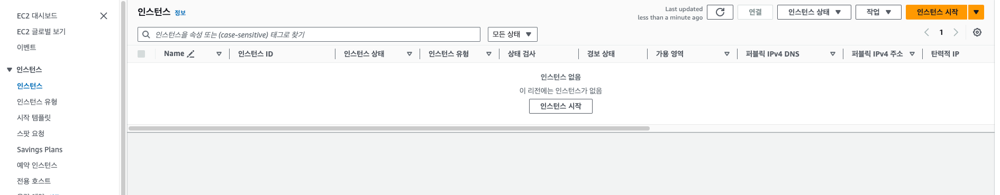

- GitHub 에서 커밋, 푸시
- GitHub Actions가 감지해서, AWS EC2에 SSH 원격 접속 진행. 
  - EC2에 들어가서 Git Pull 진행. 코드를 갈아끼움

### 장점

- git pull을 활용해서 변경된 부분의 프로젝트 코드에 대해서만 업데이트 하기 때문에 CI/CD 속도가 빠르다.
  - git pull 속도가 빠르므로 속도가 빠르다. 
  - 대부분의 CI/CD 방식들은 전체 프로젝트를 통째로 갈아끼우는 방식을 사용한다.
- CI/CD 툴로 Github Actions만 사용하기 때문에 인프라 구조가 복잡하지 않고 간단하다.

### 단점

- 빌드 작업을 EC2에서 직접 진행하기 때문에 운영하고 있는 서버의 성능에 영향을 미칠 수 있다.
  - 프로젝트 빌드 작업은 생각보다 컴퓨터 메모리와 CPU 자원을 많이 잡아 먹는다.
- **Github 계정 정보가 해당 EC2에 저장**되기 때문에 개인 프로젝트 또는 믿을만한 사람들과 같이 진행하는 토이 프로젝트에서만 사용해야 한다.

### 이 방법은 언제 주로 쓰는 지?

- 주로 개인 프로젝트에서 CI/CD를 심플하고 빠르게 적용시키고 싶을 때 적용한다.

## (실습) 개인 프로젝트에서 많이 쓰는 CI/CD 구축 방법

### t2.micro가 부족하다면 t2 micro swap 검색

- ec2가 멈추는 현상 개선 가능

> https://velog.io/@pgmjun/AWS-당신의-EC2가-계속해서-죽는다면feat.-Swap-Memory

### git clone 진행 

> git clone https://{나의 닉네임}:{토큰}@github.com/{레포 소유닉네임}/{레포명}.git

- 문제는 git clone 시 not found 에러 발생

> [[github] remote repository 공유가 안될 때 (remote: Repository not found)](https://o-yeon.tistory.com/90)

- 위 경우 내 레포에서는 `manage access` UI가 보이지 않음

### git clone 실패 

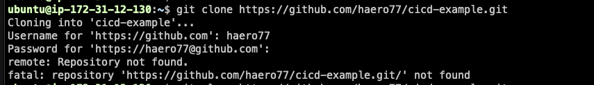

- 토큰 제대로 입력했지만 repository not found 발생

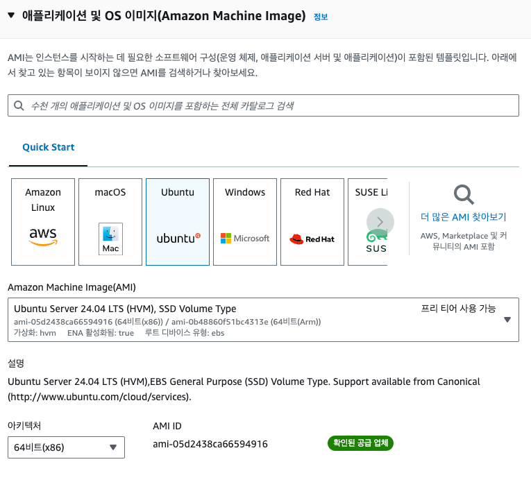

- fine grained token 생성 후 해당토큰에 권한 부여 ✅
- 다시 시도하면 다음과 같이 받아진다.

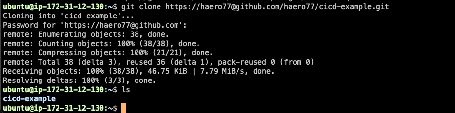

### 프로젝트 빌드 & 실행

> nohup java -jar cicd-example-0.0.1-SNAPSHOT.jar &

- 이 명령어는 'cicd-example-0.0.1-SNAPSHOT.jar'라는 Java 애플리케이션을 백그라운드에서 실행하며, 터미널 세션이 종료되어도 계속 실행되도록 합니다.

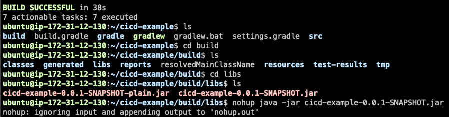

### 실행 실패

> sudo lsof -i:8080
> 
> sudo lsof -i:80

- 위 명령어를 실행해보니까 실행 중인 프로세스가 없다.

```text
Caused by: java.net.BindException: Permission denied
	at java.base/sun.nio.ch.Net.bind0(Native Method) ~[na:na]
	at java.base/sun.nio.ch.Net.bind(Net.java:555) ~[na:na]
	at java.base/sun.nio.ch.ServerSocketChannelImpl.netBind(ServerSocketChannelImpl.java:337) ~[na:na]
	at java.base/sun.nio.ch.ServerSocketChannelImpl.bind(ServerSocketChannelImpl.java:294) ~[na:na]
	at org.apache.tomcat.util.net.NioEndpoint.initServerSocket(NioEndpoint.java:239) ~[tomcat-embed-core-10.1.28.jar!/:na]
	at org.apache.tomcat.util.net.NioEndpoint.bind(NioEndpoint.java:194) ~[tomcat-embed-core-10.1.28.jar!/:na]
	at org.apache.tomcat.util.net.AbstractEndpoint.bindWithCleanup(AbstractEndpoint.java:1304) ~[tomcat-embed-core-10.1.28.jar!/:na]
	at org.apache.tomcat.util.net.AbstractEndpoint.start(AbstractEndpoint.java:1390) ~[tomcat-embed-core-10.1.28.jar!/:na]
	at org.apache.coyote.AbstractProtocol.start(AbstractProtocol.java:643) ~[tomcat-embed-core-10.1.28.jar!/:na]
	at org.apache.catalina.connector.Connector.startInternal(Connector.java:1058) ~[tomcat-embed-core-10.1.28.jar!/:na]
	... 26 common frames omitted
```

- 로그 확인해보니 위 에러 발생

> 이 오류는 애플리케이션이 지정된 포트에 바인딩하려고 할 때 권한이 거부되었음을 나타냅니다. 이는 주로 두 가지 이유로 발생합니다:
> 
> 권한 부족:
> 
> 애플리케이션이 1024 미만의 특권 포트(privileged port)를 사용하려고 하지만, root 권한이 없는 경우 발생할 수 있습니다.
> 해결 방법: 1024 이상의 포트를 사용하거나, 필요한 경우 root 권한으로 애플리케이션을 실행하세요.
> 
> 
> 포트가 이미 사용 중:
> 
> 다른 프로세스가 이미 해당 포트를 사용하고 있을 수 있습니다.
해결 방법: 사용 중인 포트를 확인하고, 필요하다면 애플리케이션의 포트 설정을 변경하세요.

- 포트를 8080으로 변경 후 재실행하니 실행된다. ✅

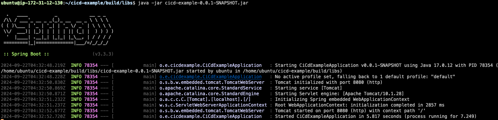


### 서버 접속 확인 - 접속 불가


- 서버에 접속 불가능 👉 인바운드 규칙 편집해본다


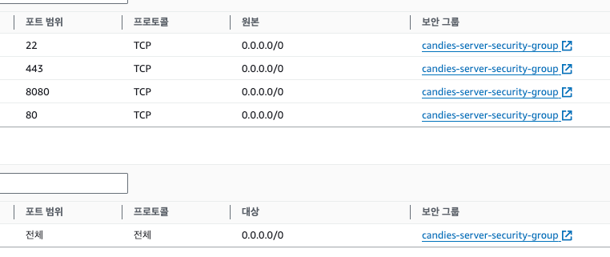


- 프로세스 실행 중 확인 ✅


- 서버 접속 확인 ✅

### git pull 할 때마다 토큰 입력 안 하도록 수정

> git config --global credential.helper store

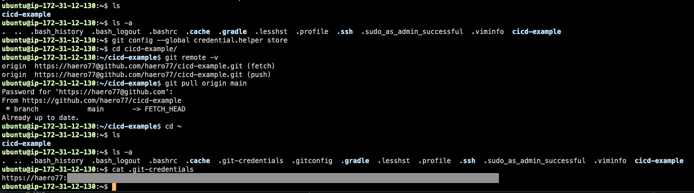

## 실습 - Github Actions 배포 자동화

### workflows script

```yaml
name: Deploy To EC2

on:
  push:
    branches:
      - main

jobs:
  deploy:
    runs-on: ubuntu-latest
    steps:
      - name: SSH로 EC2에 접속하기
        uses: appleboy/ssh-action@v1.0.3 # https://github.com/marketplace/actions/ssh-remote-commands
        env:
          APPLICATION_PROPERTIES: ${{ secrets.APPLICATION_PROPERTIES }}
        with:
          host: ${{ secrets.EC2_HOST }} # EC2의 주소
          username: ${{ secrets.EC2_USERNAME }} # EC2 접속 username
          key: ${{ secrets.EC2_PRIVATE_KEY }} # EC2의 Key 파일의 내부 텍스트
          envs: APPLICATION_PROPERTIES
          script_stop: true # 아래 script 중 실패하는 명령이 하나라도 있으면 실패로 처리 
          script: |
            cd /home/ubuntu/instagram-server # 여기 경로는 자신의 EC2에 맞는 경로로 재작성하기
            rm -rf src/main/resources/application.yml
            git pull origin main
            echo "$APPLICATION_PROPERTIES" > src/main/resources/application.yml
            ./gradlew clean build
            sudo fuser -k -n tcp 8080 || true . # || true를 붙인 이유는 8080에 종료시킬 프로세스가 없더라도 실패로 처리하지 않기 위해서이다 
            nohup java -jar build/libs/*SNAPSHOT.jar > ./output.log 2>&1 &
```

- 프로젝트 경로로 이동해서(cd /home/ubuntu/instagram-server),
- git pull 받고,  빌드 새로 하고,
- 기존 서비스를 종료 시키고(`sudo fuser -k -n tcp 8080`)
  - 그런데 서버가 안 돌아가고 있을 때도 있으므로 (`|| true`) 추가
    - 추가 안 하면 종료할 앱이 없다고 에러가 뜨므로 배포 과정이 중단됨.

---

- ${{ secrets.EC2_HOST }}
  - EC2 인스턴스의 주소
  - SSH를 이용해서 원격 컴퓨터로 접속할 건데, 어떤 컴퓨터로 접속할 것인지 컴퓨터의 호스트(=주소=IP)를 알아야한다.
- ${{ secrets.EC2_USERNAME }}
  - 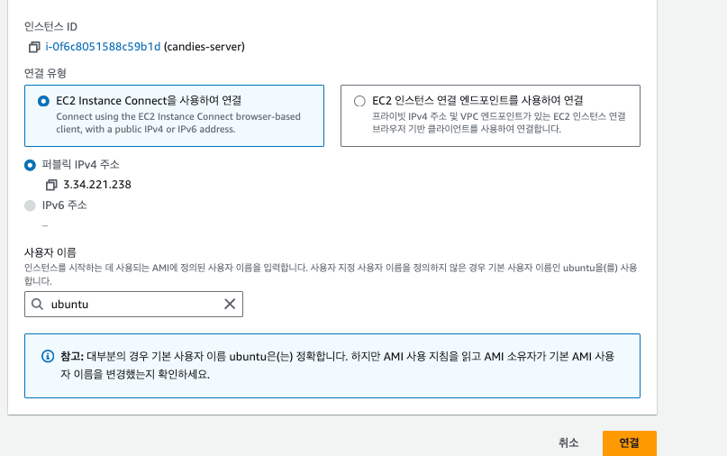
  - ec2에 접속할 때 사용자 이름을 위처럼 입력한다. 이게 바로 ec2 username이다.
- ${{ secrets.EC2_PRIVATE_KEY }}
  - Kep Pair of EC2 instance

### Github Secret

> EC2_HOST

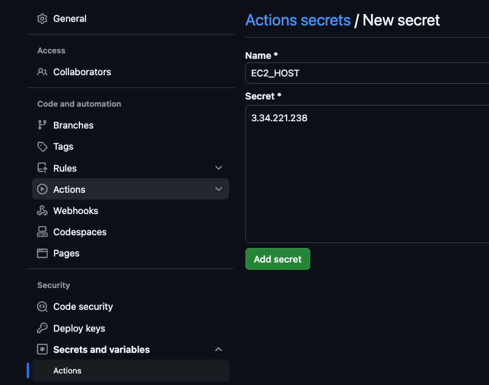

> EC2_USERNAME

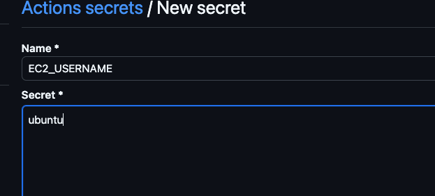

> EC2_PRIVATE_KEY


- PEM KEY를 입력 시에는 cat 명령어로 키의 텍스트값을 조회하고 '%' 전까지 복붙한다.

### git push & run github actions

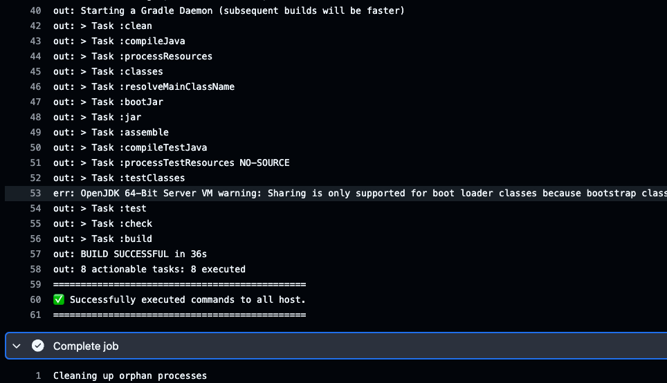

- 정상적으로 배포되고 서버 접속 가능한 것 확인 완료 ✅


## (실습) .gitignore에 추가된 application.yml을 CI/CD로 관리하기

```yaml
name: Deploy To EC2

on:
  push:
    branches:
      - main

jobs:
  deploy:
    runs-on: ubuntu-latest
    steps:
      - name: SSH로 EC2에 접속하기
        uses: appleboy/ssh-action@v1.0.3 # https://github.com/marketplace/actions/ssh-remote-commands
        env:
          APP_YML: ${{ secrets.APP_YML }}
        with:
          host: ${{ secrets.EC2_HOST }} # EC2의 주소
          username: ${{ secrets.EC2_USERNAME }} # EC2 접속 username
          key: ${{ secrets.EC2_PRIVATE_KEY }} # EC2의 Key 파일의 내부 텍스트
          envs: APPLICATION_PROPERTIES
          script_stop: true # 아래 script 중 실패하는 명령이 하나라도 있으면 실패로 처리 # || true를 붙인 이유는 8080에 종료시킬 프로세스가 없더라도 실패로 처리하지 않기 위해서이다
          script: |
            cd /home/ubuntu/cicd-example # 여기 경로는 자신의 EC2에 맞는 경로로 재작성하기
            rm -rf src/main/resources/application.yml
            git pull origin main
            echo "$APP_YML" > src/main/resources/application.yml
            ./gradlew clean build
            sudo fuser -k -n tcp 8080 || true . 
            nohup java -jar build/libs/*SNAPSHOT.jar > ./output.log 2>&1 &

```

- 기존 yml 삭제(`rm -rf src/main/resources/application.yml`)
- echo "$APP_YML" > src/main/resources/application.yml

# 방법 2 - 일반 프로젝트에서 많이 쓰는 CI/CD 구축 방법 (Github Actions, SCP)

## 개요

### 전체적인 흐름

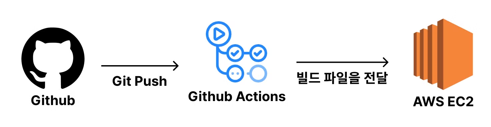

### 장점

- 빌드 작업을 Github Actions에서 하기 때문에 운영하고 있는 서버의 성능에 영향을 거의 주지 않는다.
- CI/CD 툴로 Github Actions만 사용하기 때문에 인프라 구조가 복잡하지 않고 간단하다.

### 단점 

- 무중단 배포를 구현하거나 여러 EC2 인스턴스에 배포를 해야 하는 상황이라면, 직접 Github Actions에 스크립트를 작성해서 구현해야 한다. 직접 구현을 해보면 알겠지만 생각보다 꽤 복잡하다.

### 이 방법은 언제 주로 쓰는 지

- 현업에서 초기 서비스를 구축할 때 이 방법을 많이 활용한다.
- **처음 서비스를 구현할 때는 대규모 서비스에 적합한 구조로 구현하지 않는다.**
  - 즉, 오버 엔지니어링을 하지 않는다. 
  - 확장의 필요성이 있다고 느끼는 시점에 인프라를 고도화하기 시작한다. 
  - 왜냐하면 복잡한 인프라 구조를 갖추고 관리하는 건 생각보다 **여러 측면**에서 신경쓸 게 많아지기 때문이다.
    - **인프라 구조를 변경할 때 시간이 많이 들어감**
    - 에러가 발생했을 때 트러블 슈팅의 어려움
    - 팀원이 **인프라 구조를 이해하기 어려워 함**
    - 기능을 추가하거나 수정할 때 더 많은 시간이 들어감
    - **금전적인 비용**이 더 많이 발생


## (실습) 일반 프로젝트에서 많이 쓰는 CI/CD 구축 방법
  
### Workflows

```yaml
name: Deploy To EC2

on:
  push:
    branches:
      - main

jobs:
  deploy:
    runs-on: ubuntu-latest
    steps:
      - name: Github Repository 파일 불러오기
        uses: actions/checkout@v4

      - name: JDK 17버전 설치
        uses: actions/setup-java@v4
        with:
          distribution: temurin
          java-version: 17

      - name: application.yml 파일 만들기
        run: echo "${{ secrets.APP_YML }}" > ./src/main/resources/application.yml

      - name: 테스트 및 빌드하기
        run: ./gradlew clean build

      - name: 빌드된 파일 이름 변경하기
        run: mv ./build/libs/*SNAPSHOT.jar ./project.jar

      - name: SCP로 EC2에 빌드된 파일 '전송'하기 (파일 전송 프로토콜)
        uses: appleboy/scp-action@v0.1.7
        with:
          host: ${{ secrets.EC2_HOST }}
          username: ${{ secrets.EC2_USERNAME }}
          key: ${{ secrets.EC2_PRIVATE_KEY }}
          source: project.jar
          target: /home/ubuntu/cicd-example/tobe # tobe 폴더로 전송

      - name: SSH로 EC2에 접속하기
        uses: appleboy/ssh-action@v1.0.3
        with:
          host: ${{ secrets.EC2_HOST }}
          username: ${{ secrets.EC2_USERNAME }}
          key: ${{ secrets.EC2_PRIVATE_KEY }}
          script_stop: true
          script: |
            rm -rf /home/ubuntu/cicd-example/current
            mkdir /home/ubuntu/cicd-example/current
            mv /home/ubuntu/cicd-example/tobe/project.jar /home/ubuntu/cicd-example/current/project.jar
            cd /home/ubuntu/cicd-example/current
            sudo fuser -k -n tcp 8080 || true
            nohup java -jar project.jar > ./output.log 2>&1 & 
            rm -rf /home/ubuntu/cicd-example/tobe

```

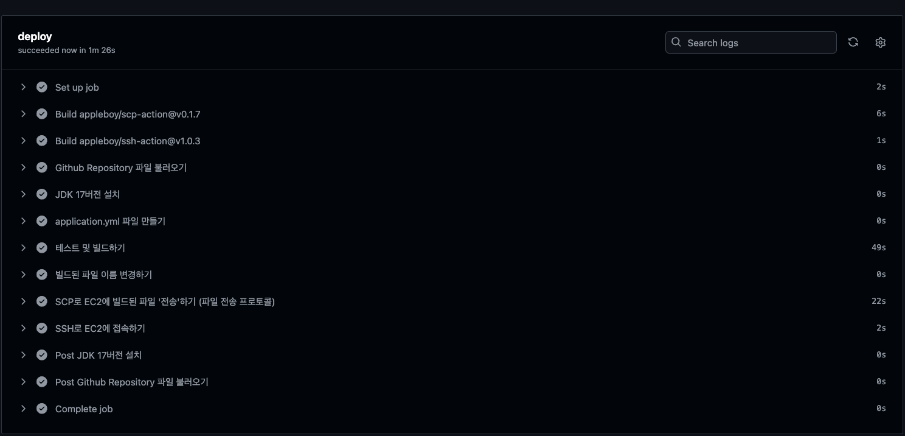

### 로그 확인

> cat output.log

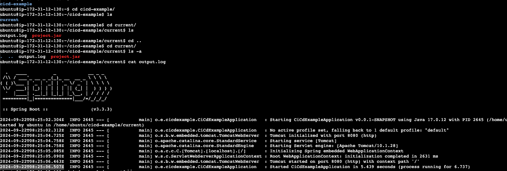

# 방법 3 - 확장성을 고려한 프로젝트에서 많이 쓰는 CI/CD 구축 방법 (Code Deploy)

## Code Deploy 세팅 / IAM 설정

## 참고 Code Deploy 로그 확인 방법

## (실습) 확장성을 고려한 프로젝트에서 많이 쓰는 CI/CD 구축 방법
