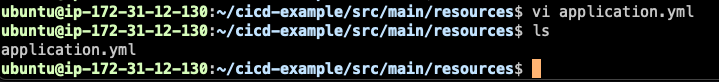

<!-- TOC -->
* [방법 4 - 컨테이너 기반의 프로젝트에서 많이 쓰는 CI/CD 구축 방법 (Docker)](#방법-4---컨테이너-기반의-프로젝트에서-많이-쓰는-cicd-구축-방법-docker)
  * [장단점](#장단점)
    * [장점](#장점)
    * [단점](#단점)
    * [이 방법은 언제 주로 쓰는가?](#이-방법은-언제-주로-쓰는가-)
* [[실습] EC2에 Docker 설치, ECR 셋팅하기](#실습-ec2에-docker-설치-ecr-셋팅하기)
* [[실습] 컨테이너 기반의 프로젝트에서 많이 쓰는 CI/CD 구축 방법](#실습-컨테이너-기반의-프로젝트에서-많이-쓰는-cicd-구축-방법)
* [방법 5 - 컨테이너 기반 + 확장성을 고려한 프로젝트에서 많이 쓰는 CI/CD 구축 방법 (Docker, CodeDeploy)](#방법-5---컨테이너-기반--확장성을-고려한-프로젝트에서-많이-쓰는-cicd-구축-방법-docker-codedeploy)
* [[실습] 컨테이너 기반 + 확장성을 고려한 프로젝트에서 많이 쓰는 CI/CD 구축 방법](#실습-컨테이너-기반--확장성을-고려한-프로젝트에서-많이-쓰는-cicd-구축-방법)
* [비용 나가지 않게 사용한 AWS 서비스들 정리하기](#비용-나가지-않게-사용한-aws-서비스들-정리하기)
<!-- TOC -->

# 방법 4 - 컨테이너 기반의 프로젝트에서 많이 쓰는 CI/CD 구축 방법 (Docker)

- AWS ECR?
  - Docker Hub 는 들어봤다. Docker Hub는 도커 이미지들을 쭉 저장하고 있는 곳이다.
  - AWS ECR 도 도커 이미지를 저장해놓는 곳이다. (도커 허브와는 다른 브랜드라고 생각하자.)
- 배포 방식
  - Github Actions가 SSH 원격 접속으로 EC2 인스턴스에 접속하고, ECR로부터 그 이미지에 대해서 PULL 받아온다.  
  - 이후 다운로드 받은 이미지를 기반으로 서버 실행.

## 장단점

### 장점

- Docker 기반으로 서비스를 운영할 때, 가장 간단하게 구성할 수 있는 인프라 구조임.

### 단점

- 무중단 배포를 구현하거나 여러 EC2 인스턴스에 배포를 해야 하는 상황이라면, 직접 Github Actions에 스크립트를 작성해서 구현해야 한다.
  - **이렇게 직접 스크립트를 작성하는 방식이 꽤 복잡하다.**
    - 이렇게 스크립트 작성의 복잡함을 줄여주는 것이 `Code Deploy`를 도입하는 방식이다.

### 이 방법은 언제 주로 쓰는가? 

- 컨테이너 기반으로 인프라를 구성했을 때 이 방법을 많이 활용한다.
- 서버를 여러 대 운영하고 있지 않을 정도의 소규모 프로젝트 일 때 주로 활용한다.
  - 왜? 이 것을 전부 구현해서 여러 인스턴스별로 배포하는게 귀찮기 때문.

# [실습] EC2에 Docker 설치, ECR 셋팅하기
# [실습] 컨테이너 기반의 프로젝트에서 많이 쓰는 CI/CD 구축 방법

---

# 방법 5 - 컨테이너 기반 + 확장성을 고려한 프로젝트에서 많이 쓰는 CI/CD 구축 방법 (Docker, CodeDeploy)
# [실습] 컨테이너 기반 + 확장성을 고려한 프로젝트에서 많이 쓰는 CI/CD 구축 방법
# 비용 나가지 않게 사용한 AWS 서비스들 정리하기
