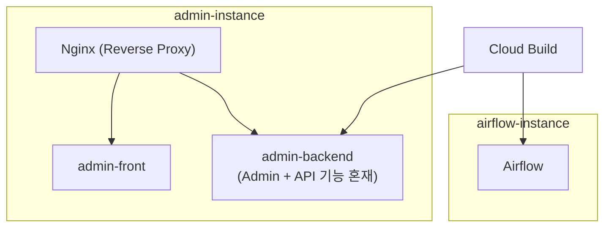
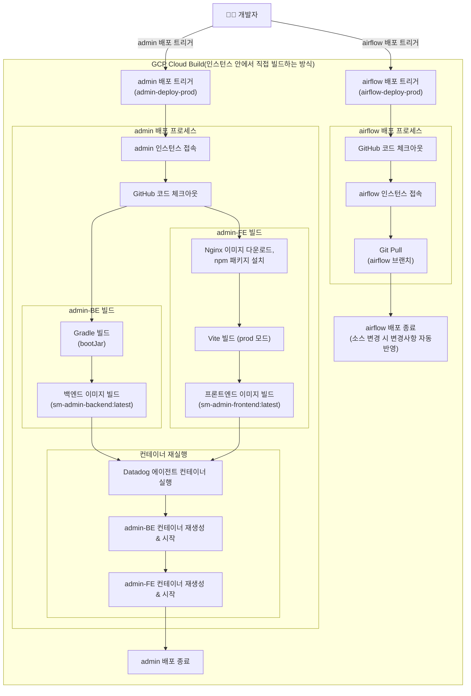
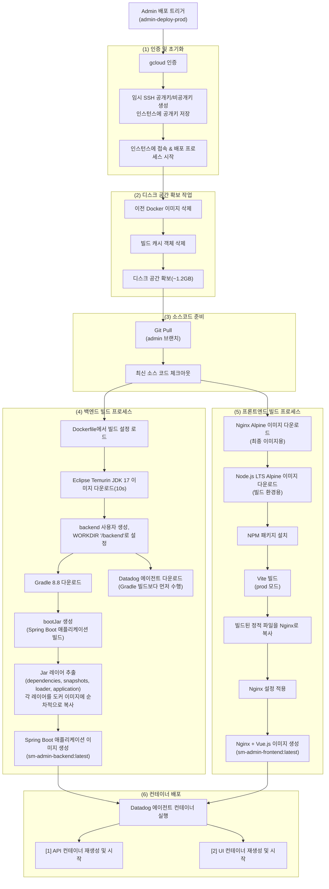
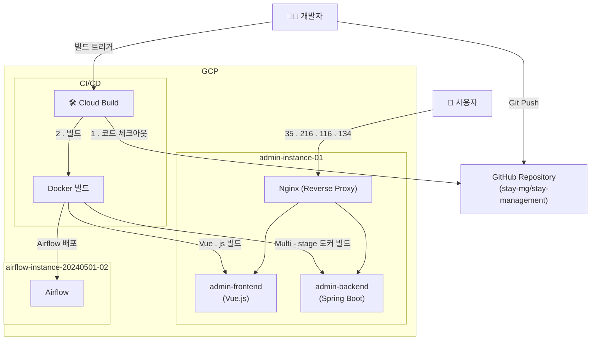
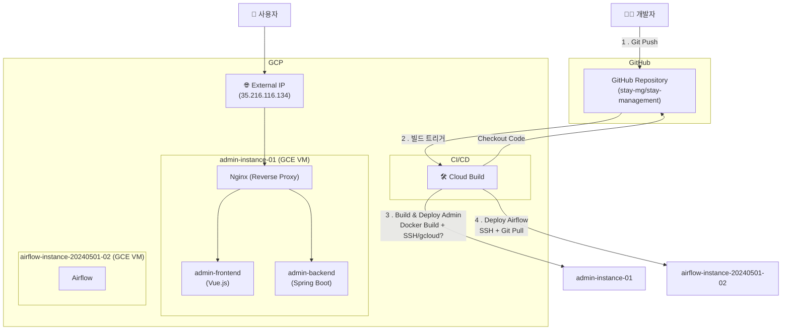

```mermaid
flowchart TD
    subgraph "admin-instance"
        Nginx["Nginx (Reverse Proxy)"]
        AdminFront["admin-front"]
        AdminBackend["admin-backend<br>(Admin + API 기능 혼재)"]
    end
    subgraph "airflow-instance"
        Airflow["Airflow"]
    end
    CloudBuild["Cloud Build"]
    Nginx --> AdminFront
    Nginx --> AdminBackend
    CloudBuild --> AdminBackend
    CloudBuild --> Airflow
```

# As Is

## CI/CD

```mermaid
flowchart TD
    dev["👨‍💻 개발자"]

    subgraph "GCP Cloud Build(인스턴스 안에서 직접 빌드하는 방식)"
        admin-trigger["admin 배포 트리거<br>(admin-deploy-prod)"]
        airflow-trigger["airflow 배포 트리거<br>(airflow-deploy-prod)"]

        subgraph "admin 배포 프로세스"
            admin-instance-enter["admin 인스턴스 접속"]
            admin-checkout["GitHub 코드 체크아웃"]

            subgraph "admin-BE 빌드"
                gradle["Gradle 빌드<br>(bootJar)"]
                backimg["백엔드 이미지 빌드<br>(sm-admin-backend:latest)"]
                gradle --> backimg
            end

            subgraph "admin-FE 빌드"
                npm["Nginx 이미지 다운로드,<br>npm 패키지 설치"]
                vite["Vite 빌드 (prod 모드)"]
                frontimg["프론트엔드 이미지 빌드<br>(sm-admin-frontend:latest)"]
                npm --> vite --> frontimg
            end

            subgraph "컨테이너 재실행"
                admin-datadog["Datadog 에이전트 컨테이너 실행"]
                admin-api["admin-BE 컨테이너 재생성 & 시작"]
                admin-ui["admin-FE 컨테이너 재생성 & 시작"]
                admin-datadog --> admin-api --> admin-ui
            end 

            admin-checkout --> gradle
            admin-checkout --> npm
        end

        subgraph "airflow 배포 프로세스"
            airflow-checkout["GitHub 코드 체크아웃"]
            airflow-instance-enter["airflow 인스턴스 접속"]
            airflow-git-pull["Git Pull<br>(airflow 브랜치)"]
            
            airflow-checkout  --> airflow-instance-enter --> airflow-git-pull
        end

        admin-cd-finished["admin 배포 종료"]
        airflow-cd-finished["airflow 배포 종료<br>(소스 변경 시 변경사항 자동반영)"]

        admin-ui --> admin-cd-finished
        airflow-git-pull --> airflow-cd-finished
    end

%% 트리거 실행
    dev -->|admin 배포 트리거| admin-trigger
    dev -->|airflow 배포 트리거| airflow-trigger
    admin-trigger --> admin-instance-enter --> admin-checkout
    airflow-trigger --> airflow-checkout
%% 배포
    backimg --> admin-datadog
    frontimg --> admin-datadog
```

### admin 배포 상세

```mermaid
flowchart TD
    trigger["Admin 배포 트리거<br>(admin-deploy-prod)"]

    subgraph "(1) 인증 및 초기화"
        gcloud["gcloud 인증"]
        ssh-key["임시 SSH 공개키/비공개키 생성<br>인스턴스에 공개키 저장"]
        ssh-meta["인스턴스에 접속 & 배포 프로세스 시작"]
    end

    subgraph "(2) 디스크 공간 확보 작업"
        old-images["이전 Docker 이미지 삭제"]
        build-cache["빌드 캐시 객체 삭제"]
        space-reclaim["디스크 공간 확보(~1.2GB)"]
    end

    subgraph "(3) 소스코드 준비"
        git-pull["Git Pull<br>(admin 브랜치)"]
        code-checkout["최신 소스 코드 체크아웃"]
    end

    subgraph "(4) 백엔드 빌드 프로세스"
        gradle-init["Dockerfile에서 빌드 설정 로드"]
        temurin["Eclipse Temurin JDK 17 이미지 다운로드(10s)"]
        backend-user["backend 사용자 생성,<br>WORKDIR '/backend'로 설정"]
        gradle-download["Gradle 8.8 다운로드"]
        gradle-build["bootJar 생성<br>(Spring Boot 애플리케이션 빌드)"]
        datadog["Datadog 에이전트 다운로드<br>(Gradle 빌드보다 먼저 수행)"]
        jar-extract["Jar 레이어 추출<br>(dependencies, snapshots, loader, application)<br>각 레이어를 도커 이미지에 순차적으로 복사"]
        backend-image["Spring Boot 애플리케이션 이미지 생성<br>(sm-admin-backend:latest)"]
    end

    subgraph "(5) 프론트엔드 빌드 프로세스"
        nginx-image["Nginx Alpine 이미지 다운로드<br>(최종 이미지용)"]
        node-image["Node.js LTS Alpine 이미지 다운로드<br>(빌드 환경용)"]
        npm-install["NPM 패키지 설치"]
        npm-build["Vite 빌드<br>(prod 모드)"]
        nginx-copy["빌드된 정적 파일을 Nginx로 복사"]
        nginx-config["Nginx 설정 적용"]
        frontend-image["Nginx + Vue.js 이미지 생성<br>(sm-admin-frontend:latest)"]
    end

    subgraph "(6) 컨테이너 배포"     
        deploy-datadog["Datadog 에이전트 컨테이너 실행"]
        deploy-api["[1] API 컨테이너 재생성 및 시작"]
        deploy-ui["[2] UI 컨테이너 재생성 및 시작"]
    end

%% 1단계 연결
    trigger --> gcloud --> ssh-key --> ssh-meta 

%% 2단계 연결
    ssh-meta --> old-images --> build-cache --> space-reclaim

%% 3단계 연결
    space-reclaim --> git-pull --> code-checkout

%% 4단계 연결 (백엔드)
    code-checkout --> gradle-init --> temurin  --> backend-user --> gradle-download --> gradle-build
    backend-user --> datadog
    gradle-build --> jar-extract

%% 5단계 연결 (프론트엔드)
    code-checkout --> nginx-image --> node-image --> npm-install --> npm-build --> nginx-copy --> nginx-config

%% 6단계 연결 (배포)
    jar-extract --> backend-image
    nginx-config --> frontend-image
    backend-image --> deploy-datadog
    frontend-image --> deploy-datadog
    deploy-datadog --> deploy-api
    deploy-datadog --> deploy-ui
```

## 요청 트래픽

```mermaid
flowchart TD
    dev["👨‍💻 개발자"]
    user["👤 사용자"]

    github["GitHub Repository<br>(stay-mg/stay-management)"]

    subgraph "GCP"
        subgraph "CI/CD"
            cb["🛠️ Cloud Build"]
            docker["Docker 빌드"]
        end

        subgraph "admin-instance-01"
            nginx["Nginx (Reverse Proxy)"]
            af["admin-frontend<br>(Vue.js)"]
            ab["admin-backend<br>(Spring Boot)"]
        end

        subgraph "airflow-instance-20240501-02"
            airflow["Airflow"]
        end
    end

    dev -->|Git Push| github
    dev -->|빌드 트리거| cb
%% CI CD
    cb -->|1 . 코드 체크아웃| github
    cb -->|2 . 빌드| docker
    docker -->|Multi - stage 도커 빌드| ab
    docker -->|Vue . js 빌드| af
    docker -->|Airflow 배포| airflow
    user -->|35 . 216 . 116 . 134| nginx
    nginx --> af
    nginx --> ab
```

```mermaid
flowchart TD
    dev["👨‍💻 개발자"]
    user["👤 사용자"]

    subgraph "GitHub"
        github["GitHub Repository<br>(stay-mg/stay-management)"]
    end

    subgraph "GCP"
        subgraph "CI/CD"
            cb["🛠️ Cloud Build"]
        %% 'Docker 빌드' 노드 제거 -> Cloud Build가 포함하는 역할로 간주
        end

        subgraph "admin-instance-01 (GCE VM)"
            nginx["Nginx (Reverse Proxy)"]
            af["admin-frontend<br>(Vue.js)"]
            ab["admin-backend<br>(Spring Boot)"]
        end

        subgraph "airflow-instance-20240501-02 (GCE VM)"
            airflow["Airflow"]
        end

    %% External IP (스크린샷 기준)
        ext_ip["🌐 External IP<br>(35.216.116.134)"]
    end

%% CI/CD Flow ====================================
    dev -->|1 . Git Push| github
    github -->|2 . 빌드 트리거| cb
    cb -- "Checkout Code" --> github
    cb -->|3 . Build & Deploy Admin<br>Docker Build + SSH/gcloud?| admin-instance-01
%% 빌드와 배포를 하나로 표현
    cb -->|4 . Deploy Airflow<br>SSH + Git Pull| airflow-instance-20240501-02
%% 수정된 배포 방식
%% ===============================================


%% User Access Flow
    user --> ext_ip
    ext_ip --> nginx
    nginx --> af
%% Nginx가 프론트/백엔드로 프록시
    nginx --> ab
```
