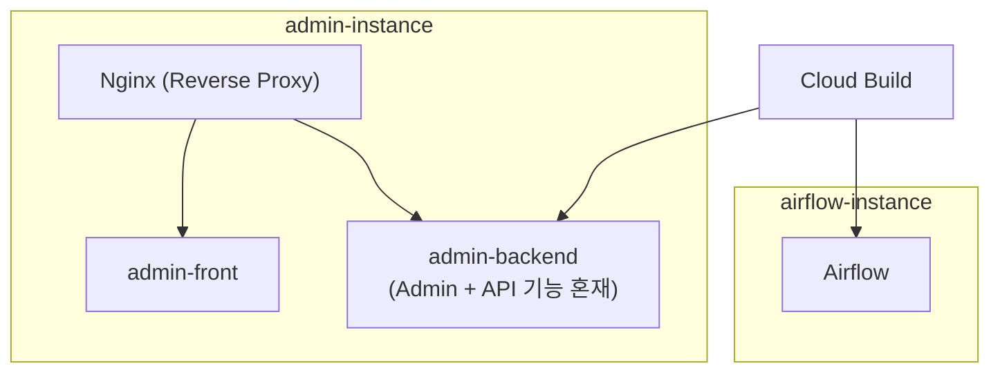
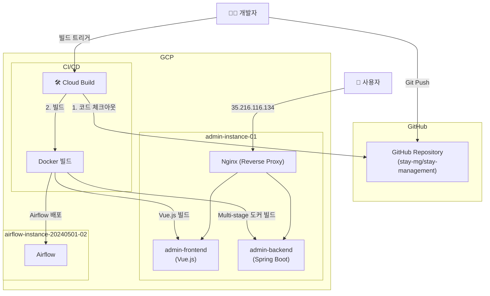

```mermaid
flowchart TD
    subgraph "admin-instance"
        Nginx["Nginx (Reverse Proxy)"]
        AdminFront["admin-front"]
        AdminBackend["admin-backend<br>(Admin + API 기능 혼재)"]
    end
    subgraph "airflow-instance"
        Airflow["Airflow"]
    end
    CloudBuild["Cloud Build"]
    Nginx --> AdminFront
    Nginx --> AdminBackend
    CloudBuild --> AdminBackend
    CloudBuild --> Airflow
```

```mermaid
flowchart TD
    dev["👨‍💻 개발자"]
    user["👤 사용자"]

    subgraph "GitHub"
        github["GitHub Repository<br>(stay-mg/stay-management)"]
    end

    subgraph "GCP"
        subgraph "CI/CD"
            cb["🛠️ Cloud Build"]
            docker["Docker 빌드"]
        end

        subgraph "admin-instance-01"
            nginx["Nginx (Reverse Proxy)"]
            af["admin-frontend<br>(Vue.js)"]
            ab["admin-backend<br>(Spring Boot)"]
        end

        subgraph "airflow-instance-20240501-02"
            airflow["Airflow"]
        end
    end


    dev --> |Git Push| github
    dev --> |빌드 트리거| cb
    
    %% CI CD
    cb --> |1. 코드 체크아웃| github
    cb --> |2. 빌드| docker
    docker --> |Multi-stage 도커 빌드| ab
    docker --> |Vue.js 빌드| af
    docker --> |Airflow 배포| airflow

    user --> |35.216.116.134| nginx
    nginx --> af
    nginx --> ab
```
