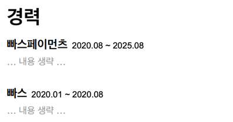
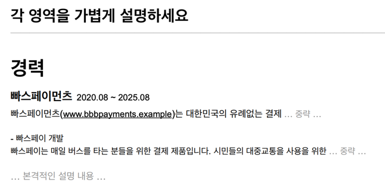
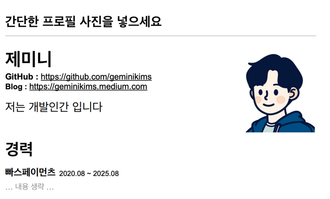
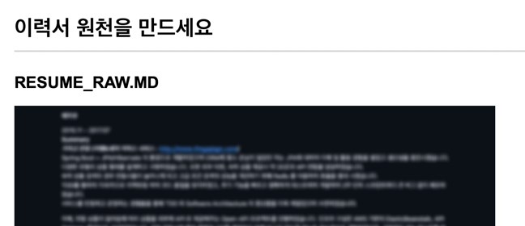

<!-- TOC -->
* [20. 최근 사항을 위로 올리세요](#20-최근-사항을-위로-올리세요)
<!-- TOC -->

# 20. 최근 사항을 위로 올리세요

- 무조건 최근 게 위로, 역순으로.
- 시간 순서 뿐만 아니라, **어필하고 싶은 것을 위로 올리면 된다.**

# 21. 각 영역을 OO하세요 

- **프로젝트 필요성을 검토자에게 인지**시키기 위해 간단한 설명을 추가하는 것이 좋음.
  - 설명이 전혀 없으면, 프로젝트 필요성에 대한 부분을 면접관이 이해하기 어려울 수 있음. 그래서 필요성을 인지시키기 위해 각 영역을 가볍게 설명하는 것은 좋다.
- 예를 들어, 떡하니 '성능 개선' 이렇게 적혀있으면 **왜 성능 개선이 필요했는지**에 대한 맥락을 전혀 파악 불가능.
  - 그런데 '매일 유저가 버스 타고 ~' 이런식으로 회사와 프로젝트 맥락이 있으면 검토자의 이해도를 높일 수 있음. (왜 했는지에 대한 필요성 전달 가능.) 
- 검토자가 회사를 잘 모를 것 같은 경우, 간단한 회사 설명은 괜찮음. 링크는 선택이긴 하나 외부 링크로 이동 시 집중이 분산되므로 지양하는 것이 나음. 

# 22. 간단한 프로필 사진을 넣으세요

- 신뢰도나 프로페셔널하게 느껴지는 부분이 있어서 프로필 사진 넣는 것이 좋음.
- SNS, GitHub, 블로그 등 프로필 사진을 통일하는 것이 좋음.
  - 이 사람 어디서 봤는데 하면서 친근감이 느껴지는 사람 심리에 도움이 됨.

# 23. 이력서 원천을 만드세요 ⭐️⭐️

- **⭐️ 어떤 일을 했는지 기억할 수 있게, 원천 데이터를 관리하라.**
  - 시간이 지나면 구체적인 문제 해결 과정이나 트러블 슈팅 경험이 희미해져서 나중에 이력서를 쓰려 해도 내용을 채우기 어려움.
  - **⭐️⭐️ 회사에서 있던 일, 실제 했던일, 어떻게 처리했는지, 어떤 문제가 있었는지, 운영 이슈는 뭐가 있었는지, 어떤 트러블이 있었고 어떻게 해결했는지 그 원천 데이터를 관리하라.**
  - 강사는 Git & Private Repo로 관리 중.
- 관리 주기: 생각 날때마다, 프로젝트가 끝날 때마다 업데이트 하라.
  - 원천 데이터를 관리하고, 이걸 기반으로 6개월마다 이력서를 업데이트하면 된다.
- 이력서 패턴 실험 가능: 원천 데이터가 있으면 이력서 패턴 실험 가능해진다.
  - 100개 회사에 같은 패턴으로 지원해서 떨어지는 것은 실험 기회를 잃는 것.
  - 원천 데이터가 있으면 이력서 전략을 회사에 맞게 가공/변조해가면서 지원해볼 수 있음.
- (RESUME_SPECIFICATION.md) 
  - raw 데이터를 가공한 파일. 규칙을 기준으로 정리한 파일. (필요하면 입맛에 맞게 해보기) 

# 24. OOOO를 OO로 끝내보세요   