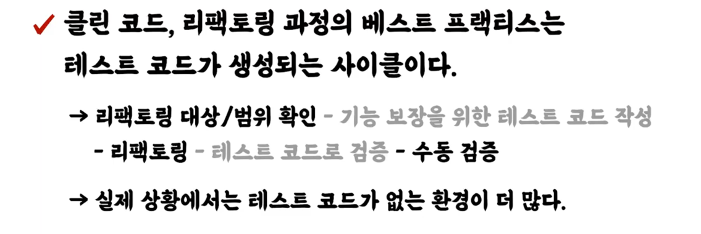

<!-- TOC -->
* [강의 소개](#강의-소개)
  * [우리는 코드를 읽는데 시간을 많이 쓴다.](#우리는-코드를-읽는데-시간을-많이-쓴다)
  * [코드를 잘 짠다는 것?](#코드를-잘-짠다는-것)
    * [읽기 좋은 코드는 왜 중요한가?](#읽기-좋은-코드는-왜-중요한가)
  * ["코드는 작성하고 난 순간부터 레거시다."](#코드는-작성하고-난-순간부터-레거시다)
* [강의 구성](#강의-구성)
  * [클린 코드, 리팩토링 과정의 베스트 프랙티스: 테스트 코드가 생성되는 사이클](#클린-코드-리팩토링-과정의-베스트-프랙티스-테스트-코드가-생성되는-사이클)
    * [실제 강의 구성](#실제-강의-구성)
* [강의에서 사용하는 용어들](#강의에서-사용하는-용어들)
  * [도메인(domain)](#도메인domain)
    * [도메인 지식](#도메인-지식)
  * [강의에서'만' 사용할 용어들](#강의에서만-사용할-용어들)
<!-- TOC -->

# 강의 소개

## 우리는 코드를 읽는데 시간을 많이 쓴다.

- 소프트웨어를 만드는데 시간을 아끼고, 그 시간을 아껴서 더 좋은 곳 사용하고, 더 나은 협업을 하기 위해서는 **읽기의 중요성을 알아야한다.**

## 코드를 잘 짠다는 것?

- 코드를 잘 짠다는 것은 곧 읽기가 좋다는 것.

### 읽기 좋은 코드는 왜 중요한가?

- 읽기 좋은 코드는 **원할한 유지보수**를 위해서 필요함.
- 읽기 좋은 코드는 **현재가 아닌 미래**를 위해 필요한 것임.
- 기능을 추가해야하는 일이 생겼는데 기존 소스 가독성이 너무 떨어지면 비용이 너무 많이든다..

## "코드는 작성하고 난 순간부터 레거시다."

- 이 코드를 읽을 사람은 미래의 옆 자리 동료, 미래의 나.
- 이 강의는 미래의 동료와 미래의 나를 위한 강의

---

# 강의 구성

## 클린 코드, 리팩토링 과정의 베스트 프랙티스: 테스트 코드가 생성되는 사이클

1. 리팩토링 대상/범위 확인
2. 기능 보장을 위한 테스트 작성
3. 리팩토링 진행 - 테스트 코드로 검증

### 실제 강의 구성

- 실제 환경에서는 테스트 없는 경우가 많고. 강의에서는 수동으로 검증할 것임.
  - 테스트가 동반되는 리팩토링 사이클이 가장 좋은 프랙티스인 것은 맞다!
- 롬복을 사용하지 않음으로써 순수 코드에만 집중 예정

---

# 강의에서 사용하는 용어들

## 도메인(domain)

- 해결하고자 하는 **문제 영역**
  - 결제 도메인, 주문 도메인, 상품 도메인...

### 도메인 지식

- 도메인을 이해하고 해결하는데 필요한 지식

## 강의에서'만' 사용할 용어들

- 레거시, 유산
  - 우리가 현재 가지고 있는 코드
- 조상
  - 과거의 나, 과거의 동료, 이 코드를 작성했던 많은 개발자들
- 후손
  - 미래의 나, 미래의 동료, 내가 만든 코드를 보게 될 많은 개발자들