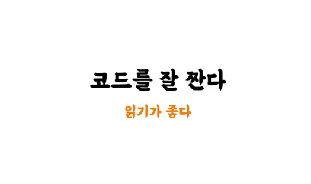

<!-- TOC -->
* [강의 소개](#강의-소개)
  * [우리는 코드를 읽는데 시간을 많이 쓴다.](#우리는-코드를-읽는데-시간을-많이-쓴다)
  * [코드를 잘 짠다는 것?](#코드를-잘-짠다는-것)
    * [읽기 좋은 코드는 왜 중요한가?](#읽기-좋은-코드는-왜-중요한가)
  * ["코드는 작성하고 난 순간부터 레거시다."](#코드는-작성하고-난-순간부터-레거시다)
<!-- TOC -->

# 강의 소개

## 우리는 코드를 읽는데 시간을 많이 쓴다.

- 소프트웨어를 만드는데 시간을 아끼고, 그 시간을 아껴서 더 좋은 곳 사용하고, 더 나은 협업을 하기 위해서는 **읽기의 중요성을 알아야한다.**

## 코드를 잘 짠다는 것?

- 코드를 잘 짠다는 것은 곧 읽기가 좋다는 것.

### 읽기 좋은 코드는 왜 중요한가?

- 읽기 좋은 코드는 **원할한 유지보수**를 위해서 필요함.
- 읽기 좋은 코드는 **현재가 아닌 미래**를 위해 필요한 것임.
- 기능을 추가해야하는 일이 생겼는데 기존 소스 가독성이 너무 떨어지면 비용이 너무 많이든다..

## "코드는 작성하고 난 순간부터 레거시다."

- 이 코드를 읽을 사람은 미래의 옆 자리 동료, 미래의 나.
- 이 강의는 미래의 동료와 미래의 나를 위한 강의

