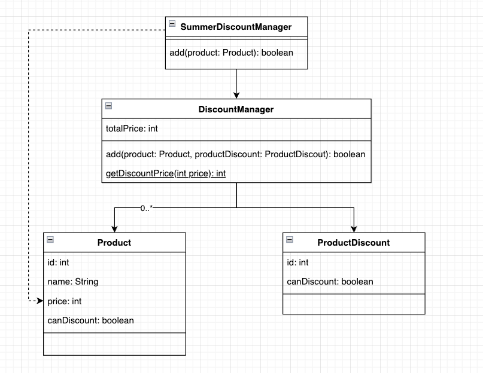
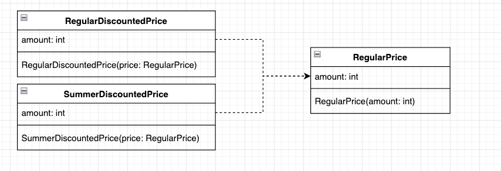

<!-- TOC -->
* [8.1 결합도와 책무](#81-결합도와-책무)
  * [책무를 다하지 않아서 생기는 문제](#책무를-다하지-않아서-생기는-문제)
    * [쇼핑몰 예제 - 일반 할인 사양](#쇼핑몰-예제---일반-할인-사양)
    * [쇼핑몰 예제 - 여름 할인 사양](#쇼핑몰-예제---여름-할인-사양)
  * [8.1.1 다양한 버그](#811-다양한-버그)
  * [8.1.2 로직의 위치에 일관성이 없음](#812-로직의-위치에-일관성이-없음)
  * [8.1.3 단일 책임 원칙](#813-단일-책임-원칙)
    * [책임이란?](#책임이란)
    * [단일 책임 원칙](#단일-책임-원칙)
  * [8.1.4 단일 책임 원칙 위반으로 발생하는 악마](#814-단일-책임-원칙-위반으로-발생하는-악마)
  * [8.1.5 책임이 하나가 되게 클래스 설계하기](#815-책임이-하나가-되게-클래스-설계하기)
    * [가격과 관련된 책임을 지는 값 객체](#가격과-관련된-책임을-지는-값-객체)
    * [일반 할인 가격, 여름 할인 가격과 관련된 내용을 개별적으로 책임지는 값 객체](#일반-할인-가격-여름-할인-가격과-관련된-내용을-개별적으로-책임지는-값-객체)
    * [느슨한 결합](#느슨한-결합)
  * [8.1.6 DRY 원칙의 잘못된 적용](#816-dry-원칙의-잘못된-적용)
    * [무턱대고 중복을 제거한다? (진짜 중복일까?)](#무턱대고-중복을-제거한다-진짜-중복일까)
    * [책무를 생각하지 않고 중복을 제거하지 말라](#책무를-생각하지-않고-중복을-제거하지-말라-)
    * [DRY 원칙](#dry-원칙)
  * [나쁜 설계 영상: '일반화의 덫'](#나쁜-설계-영상-일반화의-덫)
    * [섣부른 일반화의 문제](#섣부른-일반화의-문제)
    * [일반화는 언제할까?](#일반화는-언제할까)
    * [알고봤더니 다른 비즈니스 개념인 경우는 구조 변경을 검토한다](#알고봤더니-다른-비즈니스-개념인-경우는-구조-변경을-검토한다)
* [8.2 다양한 결합 사례와 대처 방법](#82-다양한-결합-사례와-대처-방법)
  * [8.2.1 상속과 관련된 강한 결합](#821-상속과-관련된-강한-결합)
  * [8.2.2 인스턴스 변수별로 클래스 분할이 가능한 로직](#822-인스턴스-변수별로-클래스-분할이-가능한-로직)
  * [8.2.3 특별한 이유없이 public 사용하지 않기](#823-특별한-이유없이-public-사용하지-않기)
  * [8.2.4 private 메서드가 너무 많다는 것은 책임이 너무 많다는 것](#824-private-메서드가-너무-많다는-것은-책임이-너무-많다는-것)
  * [8.2.5 높은 응집도를 오해해서 생기는 강한 결합](#825-높은-응집도를-오해해서-생기는-강한-결합)
  * [8.2.6 스마트 UI](#826-스마트-ui)
  * [8.2.7 거대 데이터 클래스](#827-거대-데이터-클래스)
  * [8.2.8 트랜잭션 스크립트 패턴](#828-트랜잭션-스크립트-패턴)
  * [8.2.9 갓 클래스](#829-갓-클래스)
  * [8.2.10 강한 결합 클래스 대처 방법](#8210-강한-결합-클래스-대처-방법)
<!-- TOC -->

# 8.1 결합도와 책무

## 책무를 다하지 않아서 생기는 문제

### 쇼핑몰 예제 - 일반 할인 사양

- 쇼핑몰의 할인 서비스가 추가 되었고, 우선 '일반 할인' 요구사항을 처리했다고 하자
- 정책(사양)은 다음과 같다.
  - 상품 하나당 3,000원 할인.
  - 최대 200,000원까지 상품 추가 가능.

```java
public class DiscountManager {

    List<Product> discountProducts;
    int totalPrice;

    /**
     * 상품 추가하기
     *
     * @param product         상품
     * @param productDiscount 상품 할인 정보
     * @return 추가에 성공하면 true
     */
    boolean add(Product product, ProductDiscount productDiscount) {
        if (product.id < 0) {
            throw new IllegalArgumentException();
        }
        if (product.name.isEmpty()) {
            throw new IllegalArgumentException();
        }
        if (product.price < 0) {
            throw new IllegalArgumentException();
        }
        if (product.id != productDiscount.id) {
            throw new IllegalArgumentException();
        }

        int discountPrice = getDiscountPrice(product.price);

        int tmp;
        if (productDiscount.canDiscount) {
            tmp = totalPrice + discountPrice;
        } else {
            tmp = totalPrice + product.price;
        }

        if (tmp <= 200000) {
            totalPrice = tmp;
            discountProducts.add(product);
            return true;
        } else {
            return false;
        }
    }

    /**
     * 할인 가격 확인하기
     * @param price 상품 가격
     * @return 할인 가격
     */
    private int getDiscountPrice(int price) {
        int discountPrice = price - 3000;
        if (discountPrice < 0) {
            discountPrice = 0;
        }
        return discountPrice;
    }

}

public class Product {

    int id; // 상품 ID
    String name; // 상품명
    int price; // 가격

}

class ProductDiscount {

    public int id; // 상품 ID
    public boolean canDiscount; // 할인 가능한 경우 true

}
```

- DiscountManager.add 는 다음과 같이 실행됨.
  - 올바른 상품인지 확인.
  - getDiscountPrice()로 할인 가격을 계산.
  - productDiscount.canDiscount를 확인하여 할인 가능한 경우에는 할인 가격을 모두 더하고, 할인이 불가능한 경우는 원래 상품 가격을 모두 더함.
  - 가격 총합이 상한가인 200,000 이내인 경우, 상품 리스트에 추가

### 쇼핑몰 예제 - 여름 할인 사양

- 이후 일반 할인 이외에, 여름 할인 사양이 추가되었다.
- 여름 할인 사양
  - 상품 하나당 3,000원 할인
  - 최대 300,000원까지 상품 추가 가능.
- 이때 DiscountManager 클래스를 구현한 개발자가 아닌 다른 개발자가 아래와 같이 SummerDiscountManager를 구현했다고 하자.

```java
public class SummerDiscountManager {

    DiscountManager discountManager;
    
    /**
     * 상품 추가하기
     *
     * @param product 상품
     * @return 추가에 성공하면 true
     */
    boolean add(Product product) {
        if (product.id < 0) {
            throw new IllegalArgumentException();
        }
        if (product.name.isEmpty()) {
            throw new IllegalArgumentException();
        }

        int tmp;
        if (product.canDiscount) {
            tmp = discountManager.totalPrice + DiscountManager.getDiscountPrice(product.price);
        } else {
            tmp = discountManager.totalPrice + product.price;
        }

        if (tmp <= 300_000) {
            discountManager.totalPrice = tmp;
            discountManager.discountProducts.add(product);
            return true;
        } else {
            return false;
        }
    }

}

public class Product {

    int id; // 상품 ID
    String name; // 상품명
    int price; // 가격
    public boolean canDiscount; // <- 새로 추가했음(여름 할인이 가능한 경우 true).

}
```



_(문제없는 설계일까?)_

- SummerDiscountManager.add는 다음과 같이 실행됨
  - 올바른 상품인지 확인
  - 할인 금액이 일반 할인과 마찬가지로 3,000원까지이므로 getDiscountPrice로 할인 가격을 계산
  - productDiscount.canDiscount를 확인하여 할인 가능한 경우, 할인 가격을 모두 더함.
    - 할인 불가능한 경우, 원래 상품 가격을 모두 더함.
  - 가격 총합이 상한가인 300,000 이내인 경우, 상품 리스트에 추가.

<br>

## 8.1.1 다양한 버그

- 어느날 요구사항이 다음과 같이 변경되었다고 하자.
  - 일반 할인 가격을 3,000원에서 4,000원으로 변경.
- DiscountManager 구현 담당자는 DiscountManger.getDiscountPrice를 다음과 같이 변경했다.

```java
static int getDiscountPrice(int price) {
    int discountPrice = price - 4000; // 3000 -> 4000으로 변경
    if (discountPrice < 0) {
        discountPrice = 0;
    }
    return discountPrice;
}
```

- 문제는 여름 할인 서비스를 담당하는 SummerDiscountManager역시 DiscountManager.getDiscountPrice를 사용하고 있었기 때문에, 버그가 발생한다.
- 이 밖에도 다양한 버그 들이 발생한다.

| 버그                            | 원인                                                                 |
|-------------------------------|--------------------------------------------------------------------|
| 음수 가격의 상품을 여름 할인에 추가할 수 있게 됨. | SummerDiscountManager.add에 가격확인 로직이 없음.                            |
| 할인 대상 상품으로 설정했는데, 설정이 되지 않음.  | ProductDiscount.canDiscount와 Product.canDiscount를 서로 헷갈려서 잘못 사용했음. |

<br>

## 8.1.2 로직의 위치에 일관성이 없음

- 기존 할인 서비스 로직은 로직의 위치 자체에 문제가 있다.
  - `DiscountManager`가 상품 정보 확인 외에 할인 가격 계산, 할인 적용 여부 판단, 총액 상한 확인 등 너무 많은 일을 하고 있음.
    - `SummerDiscountManager`도 마찬가지임.
  - `Product`가 직접 해야하는 유효성 검사 로직이 `DiscountManager`, `SummerDiscountManager`에 구현되어 있음.
  -  `Product.canDiscount`와 `ProductDiscount.canDiscount`의 이름이 유사해서 어떤게 일반 할인이고 어떤게 여름할인인지 구분이 어려움.
  - 여름 할인 가격 계산을 위해서 `SummerDiscountManager`가 `DiscountManager`의 일반 할인 로직을 활용할고 있음.
- 👉 즉, **로직의 위치에 일관성이 없음.**
  - 어떤 클래스는 처리해야할 작업이 많고, **어떤 클래스는 특별히 하는 일이 없음.**
  - 또, 어떤 클래스는 편의를 위해 **다른 클래스의 메서드를 무리하게 활용함.**
  - 👉 이런 설계는 **책무를 고려하지 않은** 설계임.

  <br>

## 8.1.3 단일 책임 원칙

- 책임은 '누가 책임을 져야 하는가'라는 적용 범위와 밀접.
- 출력에 버그가 있다고 해서 DB 관련 로직을 수정할 것인가? 
  - No. 출력을 제대로 하는 것은 출력 로직의 책임. 
  - 애초에 관심사가 아예 다른 것.

### 책임이란?

- 소프트웨어의 책임이란?
  - **_'자신의 관심사와 관련해서, 정상적으로 동작하도록 제어하는 것.'_**

### 단일 책임 원칙

- 단일 책임 원칙
  - **_'클래스가 담당하는 책임은 하나로 제한해야 한다.'_** 라는 설계 원칙.

<br>

## 8.1.4 단일 책임 원칙 위반으로 발생하는 악마

- `DiscountManager.getDiscountPrice`는 일반 할인 가격 계산을 책임지지, 여름 할인 가격을 책임지기 위해 만들어진 메서드가 아님.
  - 👉 현재는 둘 다 책임지고 있으므로 단일 책임 원칙을 위반하고 있음.
  - **할인 되는 가격이 같다는 이유만으로 메서드 하나만 만들어 사용하면, 한쪽 사양이 변경될 때 다른 쪽 사양도 변경되어 버그 발생.**
    - (중복이 실제로는 중복이 아닐 수도 있다는 얘기라고 생각)
- 상품명과 가격이 타당한지 판단하는 책임은 **이 데이터를 갖고 있는 `Product`의 책임.**
  - 현재는 아무것도 안 하므로 미성숙한 클래스임.
- `DiscountManager`는 `Product` 대신 너무 많은 작업을 하고 있음.
  - 👉 `Product`는 성숙해질 수 없음.
    - **_결국 값 확인 등을 포함해 여러 코드가 중복될 것임._**

_(SRP 위반으로 버그 발생, 코드 중복이 발생한다는 얘기를 하고 싶은 것 같다.)_

<br>

## 8.1.5 책임이 하나가 되게 클래스 설계하기

- SRP 위반으로 만들어진 악마를 퇴치하기 위해 SRP를 지키도록 설계를 바꾸자.

### 가격과 관련된 책임을 지는 값 객체

```java
class RegularPrice {

    private static final int MIN_AMOUNT = 0;

    final int amount;

    public RegularPrice(int amount) {
        if (amount < MIN_AMOUNT) {
            throw new IllegalArgumentException("가격은 0 이상이어야 합니다.");
        }
        this.amount = amount;
    }

}
```

- 상품의 가격을 나타내는 값 객체를 추가했다.
- 가격의 유효성 검사와 관련된 책임을 모두 `RegularPrice`에서 지게 되므로, 다른 곳에 유효성 검사와 관련된 코드가 중복될 일이 없어진다.

### 일반 할인 가격, 여름 할인 가격과 관련된 내용을 개별적으로 책임지는 값 객체

```java
public class RegularDiscountedPrice {

    private static final int MIN_AMOUNT = 0;
    private static final int DISCOUNT_AMOUNT = 4000;
    final int amount;

    public RegularDiscountedPrice(final RegularPrice price) {
        int discountedAmount = price.amount - DISCOUNT_AMOUNT;
        if (discountedAmount < MIN_AMOUNT) {
            discountedAmount = MIN_AMOUNT;
        }

        this.amount = discountedAmount;
    }

}

public class SummerDiscountedPrice {

  private static final int MIN_AMOUNT = 0;
  private static final int DISCOUNT_AMOUNT = 3000;
  final int amount;

  public SummerDiscountedPrice(final RegularPrice price) {
    int discountedAmount = price.amount - DISCOUNT_AMOUNT;
    if (discountedAmount < MIN_AMOUNT) {
      discountedAmount = MIN_AMOUNT;
    }

    this.amount = discountedAmount;
  }

}
```

- 일반 할인 가격, 여름 할인 가격과 관련된 내용을 개별적으로 책임지는 클래스를 만들었고, 값 객체로 설계했다.

### 느슨한 결합




- 클래스가 일반 할인 가격, 여름 할인 가격으로 **구분되어 사양이 변경되어도 서로 영향을 주지 않는다.**
- 이렇게 관심사에 따라 분리해서 독립되어 있는 구조를 **느슨한 결합**이라고 하고, 느슨한 결합을 권한다!

<br>

## 8.1.6 DRY 원칙의 잘못된 적용

### 무턱대고 중복을 제거한다? (진짜 중복일까?)

- `RegularDiscountedPrice`, `SummerDiscountedPrice`의 로직은 대부분 같고, 중복 코드가 작성되어 있는 것처럼 보일 수 있음.
- 요구사항이 변경되면 어떻게 될까?
  - 예를 들어 _'여름 할인 가격은 정가에서 5% 할인한다.'_ 라고 사양이 변경되면, `RegularDiscountedPrice`, 
    `SummerDiscountedPrice` 로직은 달라진다.

### 책무를 생각하지 않고 중복을 제거하지 말라 

- 책무를 생각하지 않고 로직의 중복을 제거하면 안 된다.
- 책무 생각없이 로직의 중복을 제거할 경우,
  - **하나로 모인 로직이 여러 책무를 담당하게됨.**
  - DiscountManager.getDiscountPrice 처럼 사양 변경이 다른 로직에도 영향을 줄 수 있음. 

### DRY 원칙

- '코드 중복을 절대 허용하지 말라'가 아님.
- DRY 원칙
  - > _모든 지식은 시스템 내에서 단 한 번만, 애매하지 않고, 권위 있게 표현되어야 한다._ <실용주의 프로그래머 20주년 기념판>
- 여기서의 지식은 다양한 관점으로 설명할 수 있는데 그 중 하나는 **비즈니스 지식**임.
- 비즈니스 지식?
  - 소프트웨어에서 다루는 비즈니스 개념.
  - 온라인 쇼핑몰 예시)
    - 할인, 관심 상품, 크리스마스 캠페인 등
  - 게임 예시)
    - 히트포인트, 공격력, 매직포인트.
- **여기서 일반 할인과 여름 할인은 서로 다른 개념임**.
  - DRY는 각각의 **개념 단위 내에서 반복을 하지 말라는 의미**이다.
  - 👉 **_같은 로직, 비슷한 로직이라도 개념이 달라도 중복을 허용해야한다._** ⭐️
    - 개념적으로 다른데 무리하게 중복을 제거하게되면 강한 결합 상태가 되고(관심사가 다른데 독립되어 있지 않으므로), 이것은 즉 단일 책임 원칙이 깨지는 것임.

## 나쁜 설계 영상: '일반화의 덫'

### 섣부른 일반화의 문제

- 여러 클래스의 처리가 비슷한 것 같으니, 일반화해서 하나로 합친다.
- 문제는 이후 사양이 변경되어 각 클래스의 로직을 변경하고 싶어도 이미 너무 많은 것을 범용 처리 모듈에 의존하므로 분해도 불가. 이러지도 저러지도 못하는 상황이 된다.
- 중복 코드를 제거하려면 일반화를 사용하지만, 개념이 다른 코드는 일반화하면 안 된다. (DRY 원칙 참고)
  - 사양이 변경되어 특정 유즈케이스인지 판정하는 조건 분기를 추가하게 되는 경우는 더 이상 일반 로직이 아니란 뜻임.
  - 👉 일반로직이 아닌 것을 알게 된 시점에서 일반화했던 코드를 분해하지 않으면 유즈케이스를 판정하는 조건 분기를 계속 구현해야함.

### 일반화는 언제할까?

- 이 장에서 확인했던 것처럼, 같은 비즈니스 개념인지 확인하면 알 수 있다.
- 다른 비즈니스 개념이라면 코드를 분해한다.

### 알고봤더니 다른 비즈니스 개념인 경우는 구조 변경을 검토한다

- 비즈니스에 대한 이해가 높아지면서, 사실은 같은 비즈니스 개념이 아니었음을 뒤늦게 인지할 수 있음.
- 서로 다른 비즈니스 개념임을 알게 되었다면, **곧바로(그 즉시) 일반화했던 것을 다시 나누는 등 구조 변경을 검토하자.**


# 8.2 다양한 결합 사례와 대처 방법

## 8.2.1 상속과 관련된 강한 결합

## 8.2.2 인스턴스 변수별로 클래스 분할이 가능한 로직

## 8.2.3 특별한 이유없이 public 사용하지 않기

## 8.2.4 private 메서드가 너무 많다는 것은 책임이 너무 많다는 것

## 8.2.5 높은 응집도를 오해해서 생기는 강한 결합

## 8.2.6 스마트 UI

## 8.2.7 거대 데이터 클래스

## 8.2.8 트랜잭션 스크립트 패턴

## 8.2.9 갓 클래스

## 8.2.10 강한 결합 클래스 대처 방법