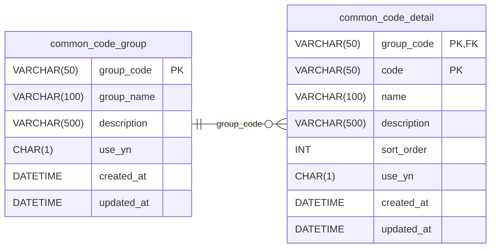

<!-- TOC -->
* [공통 코드가 필요한 이유](#공통-코드가-필요한-이유)
  * [공통 코드를 쓰지 않을 때의 문제점](#공통-코드를-쓰지-않을-때의-문제점)
    * [문제1. 데이터 불일치](#문제1-데이터-불일치)
    * [문제2. 오타로 인한 버그](#문제2-오타로-인한-버그)
    * [문제3. 상태 변경의 어려움](#문제3-상태-변경의-어려움)
    * [문제4. 표시 이름과 코드값의 혼재](#문제4-표시-이름과-코드값의-혼재)
  * [해결책: 코드값 분리](#해결책-코드값-분리)
  * [공통 코드란?](#공통-코드란-)
    * [공통 코드의 장점](#공통-코드의-장점)
  * [공통 코드가 필요한 대표적인 경우 (실무에서 공통 코드로 쓰면 좋은 데이터)](#공통-코드가-필요한-대표적인-경우-실무에서-공통-코드로-쓰면-좋은-데이터)
* [공통 코드 테이블 설계](#공통-코드-테이블-설계)
  * [기본형 공통 코드 테이블 설계와 문제점](#기본형-공통-코드-테이블-설계와-문제점)
* [공통 코드를 더 범용성 있게 - 그룹화 설계](#공통-코드를-더-범용성-있게---그룹화-설계)
  * [그룹화 설계 DB 스키마](#그룹화-설계-db-스키마)
  * [그룹화 설계 활용](#그룹화-설계-활용)
    * [코드와 표시 이름 같이 조회 (공통 코드와 조인)](#코드와-표시-이름-같이-조회-공통-코드와-조인)
    * [특정 그룹의 코드 목록 조회 (드롭다운 목록 표시)](#특정-그룹의-코드-목록-조회-드롭다운-목록-표시)
    * [코드 비활성화](#코드-비활성화)
* [공통 코드와 추가 속성](#공통-코드와-추가-속성)
* [공통 코드의 단점](#공통-코드의-단점)
* [공통 코드의 단점 해결 방안 1](#공통-코드의-단점-해결-방안-1)
* [공통 코드의 단점 해결 방안 2](#공통-코드의-단점-해결-방안-2)
* [공통 코드 vs 애플리케이션 ENUM 1](#공통-코드-vs-애플리케이션-enum-1)
* [공통 코드 vs 애플리케이션 ENUM 2](#공통-코드-vs-애플리케이션-enum-2)
* [공통 코드 vs 애플리케이션 ENUM 3](#공통-코드-vs-애플리케이션-enum-3)
* [공통 코드 설계와 비즈니스 설계의 차이](#공통-코드-설계와-비즈니스-설계의-차이)
* [정리](#정리)
<!-- TOC -->

# 공통 코드가 필요한 이유

> - 하드코딩된 문자열로 상태값이나 유형을 관리하면 데이터 불일치, 오타로 인한 버그, 변경의 어려움 등 다양한 문제 발생. 
> - 공통 코드를 도입하면 이러한 문제들을 해결하고, 코드값을 중앙에서 일관되게 관리 가능. (유지보수성 증가)

## 공통 코드를 쓰지 않을 때의 문제점

- 공통 코드를 사용하지 않고, 하드코딩된 문자열로 직접 사용한다고 할 경우 다음 문제 발생 가능.
  - 데이터 불일치
  - 오타로 인한 버그
  - 변경의 어려움

### 문제1. 데이터 불일치

| order_id | member_id | order_status | total_amount | created_at |
| :--- | :--- | :--- | :--- | :--- |
| 1 | 1 | 주문완료 | 50000 | 2026-01-15 10:30:00 |
| 2 | 2 | 결제완료 | 75000 | 2026-01-15 11:00:00 |
| 3 | 3 | 배송중 | 30000 | 2026-01-15 12:00:00 |
| 4 | 1 | 배송완료 | 120000 | 2026-01-14 09:00:00 |
| 5 | 4 | 주문취소 | 45000 | 2026-01-13 15:00:00 |

- 위와 같이 주문 상태를 하드 코딩된 문자열로 쓰는 경우를 생각해보자.
- 어떤 개발자는 '주문완료'라고 써야하는 상황에서 띄어쓰기 실수로 '주문 완료'라고 입력할 수 있음.
- 또 다른 개발자는 영어로 'ORDER_COMPLETE'라고 입력할 수도 있음.

| order_id | order_status |
| :--- | :--- |
| 1 | 주문완료 |
| 2 | 결제완료 |
| 3 | 배송중 |
| 4 | 배송완료 |
| 5 | 주문취소 |
| 6 | 주문 완료 |
| 7 | ORDER_COMPLETE |

- 그 결과 같은 주문 상태에 대해서 다른 데이터가 저장되는 데이터 불일치 문제가 발생함.

### 문제2. 오타로 인한 버그

- '배송중' 상태에 대해서 '배송증'이라고 잘못 입력하는 경우도 생김 -> 데이터 불일치 발생.

### 문제3. 상태 변경의 어려움

- 기획팀에서 '주문완료' 단어 대신 '주문성공'이라는 단어로 바꾸고 싶어함.
- 이 경우, 이미 저장된 모든 데이터를 UPDATE 해야함. (**매우 위험한 작업이 됨**)
  - 데이터가 수백만 건이라면 업데이트 쿼리가 오래 걸리고, 중간에 오류가 발생할 경우 데이터가 일관성 없는 상태로 남을 수 있음.
  - WRITE/READ 테이블이 분리되어있지 않을 경우 UPDATE 작업으로 인해 서비스 전체에 영향을 줄 수 있음.

### 문제4. 표시 이름과 코드값의 혼재

- 영어 서비스를 추가해야하는 상황이 되면 '주문완료'를 'Order Complete'로 표시해야하는데, 데이터베이스에 한글로 저장되어있으면 처리가 복잡해짐.

## 해결책: 코드값 분리

| 코드값 | 한글 이름 | 영문 이름 |
| :--- | :--- | :--- |
| ORDER | 주문시작 | Order Received |
| PAID | 결제완료 | Payment Complete |
| SHIPPING | 배송중 | Shipping |
| DELIVERED | 배송완료 | Delivered |
| CANCEL | 주문취소 | Cancelled |

- **코드값과 표시 이름을 분리**하면 이 데이터 불일치, 오타, 변경의 어려움 문제를 해결할 수 있음.
- 매핑 정보는 공통 코드 테이블에 저장.

## 공통 코드란? 

- 공통 코드(Common Code)는 **시스템 전체에서 사용하는 코드값과 표시 이름을 중앙에서 관리하는 방식임.**
- **코드값은 데이터베이스에 저장되고, 표시 이름은 공통 코드 테이블에서 조회함.**

### 공통 코드의 장점

1. **데이터 일관성 보장** 
   1. 정해진 코드값만 사용하도록 강제 가능. 개발자가 임의로 다른 값을 넣을 수 없음.
2. **표시 이름 변경 용이**
   1. '주문접수'를 '주문완료'로 변경하고 싶다면, 공통 코드 테이블의 이름만 수정하면 됨. 
   2. **실제 데이터가 저장된 주문 테이블 수정 불필요.**
3. **다국어 지원 용이**
   1. 한글 이름, 영문 이름 등을 공통 코드 테이블에서 관리하면 다국어 지원이 쉬워짐.
4. **중앙 집중 관리**
   1. 모든 코드값을 한 곳에서 관리 -> 어떤 코드값들이 있는지 한눈에 파악 가능.
   2. 새로운 개발자가 투입되어도 공통 코드 테이블만 보면 시스템에서 사용하는 코드값들을 쉽게 이해 가능.

## 공통 코드가 필요한 대표적인 경우 (실무에서 공통 코드로 쓰면 좋은 데이터)

- 상태값
  - 주문 상태: ORDER, PAID, SHIPPING, DELIVERED, CANCEL
  - 회원 상태: ACTIVE, DORMANT, WITHDRAWN
  - 결제 상태: PENDING, COMPLETE, FAILED, REFUND 
- 유형/종류
  - 회원 유형: NORMAL, VIP, VVIP
  - 상품 유형: PHYSICAL, DIGITAL, SUBSCRIPTION
  - 결제 수단: CARD, BANK, VIRTUAL, MOBILE
- 카테고리성 데이터
  - 배송 방법: QUICK, PICKUP
  - 문의 유형: PRODUCT, DELIVERY, REFUND, ETC
- 기타 코드성 데이터
  - 성별: MALE, FEMALE
  - 요일: MON, TUE, WED, THU, FRI, SAT, SUN

# 공통 코드 테이블 설계

## 기본형 공통 코드 테이블 설계와 문제점

```sql
CREATE TABLE common_code (
    code VARCHAR(50) PRIMARY KEY,
    name VARCHAR(100) NOT NULL
);
```
| code | name |
| :--- | :--- |
| ORDER | 주문접수 |
| PAID | 결제완료 |
| SHIPPING | 배송중 |
| DELIVERED | 배송완료 |
| CANCEL | 주문취소 |

- 주문 쪽에서만 사용할 때는 사용 가능.
- 다른 용도의 코드 구분 불가 
  - 회원 등급 코드가 추가되면, 주문 상태 코드와 회원 등급 코드가 뒤섞여 구분 불가!
- 이름이 같은 코드값이 있을 경우 추가 불가능!!
  - 심지어 결제 상태 코드 중 주문 상태 코드와 동일한 코드값이 있을 경우 추가 불가능!!
- 이 경우 그룹화 설계로 해결 가능.

| code | name |
| :--- | :--- |
| CANCEL | 주문취소 |
| DELIVERED | 배송완료 |
| NORMAL | 일반회원 |
| ORDER | 주문접수 |
| PAID | 결제완료 |
| SHIPPING | 배송중 |
| VIP | VIP회원 |
| VVIP | VVIP회원 |

(회원 등급 코드와 주문 상태 코드가 뒤섞여 있어 구분 불가)


```sql
INSERT INTO common_code (code, name) 
VALUES ('CANCEL', '결제취소'); -- 주문취소와 코드가 중복!

# Error Code: 1062. Duplicate entry 'CANCEL' for key 'common_code.PRIMARY'
```

(결제 상태 코드 중 주문 상태 코드와 동일한 코드값이 있을 경우 추가 불가능)

# 공통 코드를 더 범용성 있게 - 그룹화 설계

- 코드를 주문, 회원등 종**류별로 구분하기 위해 그룹 개념을 도입**해보자. 
- 실무에서는 이 방식을 가장 많이 사용함.

## 그룹화 설계 DB 스키마


```sql
-- 그룹 코드 테이블
CREATE TABLE common_code_group (
    group_code VARCHAR(50) PRIMARY KEY,
    group_name VARCHAR(100) NOT NULL,
    description VARCHAR(500),
    use_yn CHAR(1) NOT NULL DEFAULT 'Y',
    created_at DATETIME NOT NULL DEFAULT CURRENT_TIMESTAMP,
    updated_at DATETIME NOT NULL DEFAULT CURRENT_TIMESTAMP ON UPDATE CURRENT_TIMESTAMP
);

-- 상세 코드 테이블
CREATE TABLE common_code_detail (
    group_code VARCHAR(50) NOT NULL,
    code VARCHAR(50) NOT NULL,
    name VARCHAR(100) NOT NULL,
    description VARCHAR(500),
    sort_order INT NOT NULL DEFAULT 0,
    use_yn CHAR(1) NOT NULL DEFAULT 'Y',
    created_at DATETIME NOT NULL DEFAULT CURRENT_TIMESTAMP,
    updated_at DATETIME NOT NULL DEFAULT CURRENT_TIMESTAMP ON UPDATE CURRENT_TIMESTAMP,
    PRIMARY KEY (group_code, code),
    FOREIGN KEY (group_code) REFERENCES common_code_group(group_code)
);
```
> - 레거시에서는 use_yn 을 char(1)로 많이 사용.
> - 하지만 최신 프로젝트에서는 use_yn 등은 BOOLEAN 을 사용하는 것이 좋음. 
>   - char(1)로 하면 다른 값이 들어갈 수 있어서 데이터 불일치 문제 발생 가능
> - MySQL에서는 BOOLEAN 사용 내부저긍 TINYINT(1)로 구현되어 있음.

- 그룹 코드 테이블 (common_code_group)
  - `group_code` : 그룹을 식별하는 코드 (예: ORDER_STATUS, MEMBER_GRADE)
  - `group_name` : 그룹의 표시 이름 (예: 주문상태, 회원등급)
  - `description` : 그룹에 대한 설명
  - `use_yn` : 사용 여부 (Y/N). 코드 그룹 전체를 비활성화할 때 사용
  - `created_at` , `updated_at` : 생성일시, 수정일시
- 상세 코드 테이블 (common_code_detail)
  - `group_code` : 이 코드가 속한 그룹
  - `code` : 실제 코드값
  - `name` : 코드의 표시 이름
  - `description` : 코드에 대한 설명
  - `sort_order` : 정렬 순서. 화면에 목록을 표시할 때 순서를 지정
  - `use_yn` : 사용 여부. 특정 코드만 비활성화할 때 사용
  - `created_at` , `updated_at` : 생성일시, 수정일시


## 그룹화 설계 활용

### 코드와 표시 이름 같이 조회 (공통 코드와 조인)

```sql
-- 회원 테이블
CREATE TABLE members (
     member_id BIGINT PRIMARY KEY AUTO_INCREMENT,
     name VARCHAR(50) NOT NULL,
     email VARCHAR(100) NOT NULL,
     grade VARCHAR(20) NOT NULL DEFAULT 'NORMAL',
     created_at DATETIME NOT NULL DEFAULT CURRENT_TIMESTAMP
);

-- 회원 목록 조회
SELECT
    m.member_id,
    m.name,
    m.email,
    m.grade,
    c.name AS grade_name
FROM members m
         JOIN common_code_detail c
              ON c.group_code = 'MEMBER_GRADE' AND m.grade = c.code
ORDER BY m.member_id;
```

| member_id | name | email | grade | grade_name |
| :--- | :--- | :--- | :--- | :--- |
| 1 | 션 | seon@example.com | NORMAL | 일반회원 |
| 2 | 네이트 | nate@example.com | VIP | VIP회원 |
| 3 | 이순신 | lee@example.com | VVIP | VVIP회원 |


### 특정 그룹의 코드 목록 조회 (드롭다운 목록 표시)

```sql
-- 결제 수단 목록 조회
SELECT code, name
FROM common_code_detail
WHERE group_code = 'PAYMENT_METHOD'
  AND use_yn = 'Y'
ORDER BY sort_order;
```

| code | name |
| :--- | :--- |
| CARD | 신용카드 |
| BANK | 계좌이체 |
| VIRTUAL | 가상계좌 |
| MOBILE | 휴대폰결제 |

### 코드 비활성화

- 보통 이런 조작은 **어드민을 통해 운영자가 실시간**으로 편리하게 관리할 수 있도록 한다.

```sql
-- 가상계좌 결제 수단 비활성화
UPDATE common_code_detail
SET use_yn = 'N'
WHERE group_code = 'PAYMENT_METHOD' AND code = 'VIRTUAL';

-- 결제 수단 목록 조회
SELECT code, name
FROM common_code_detail
WHERE group_code = 'PAYMENT_METHOD'
  AND use_yn = 'Y'
ORDER BY sort_order;
```

| code | name |
| :--- | :--- |
| CARD | 신용카드 |
| BANK | 계좌이체 |
| MOBILE | 휴대폰결제 |


# 공통 코드와 추가 속성
# 공통 코드의 단점
# 공통 코드의 단점 해결 방안 1
# 공통 코드의 단점 해결 방안 2
# 공통 코드 vs 애플리케이션 ENUM 1
# 공통 코드 vs 애플리케이션 ENUM 2
# 공통 코드 vs 애플리케이션 ENUM 3
# 공통 코드 설계와 비즈니스 설계의 차이
# 정리