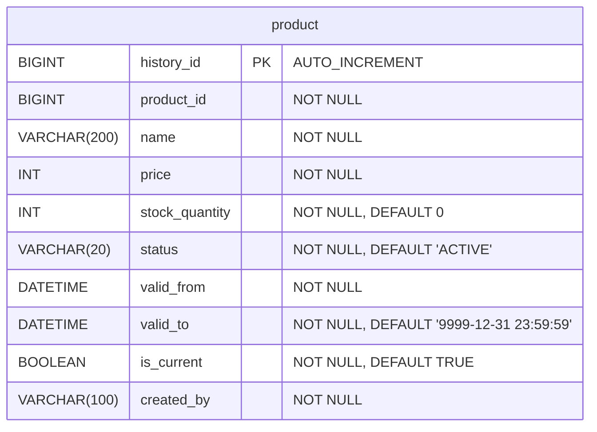
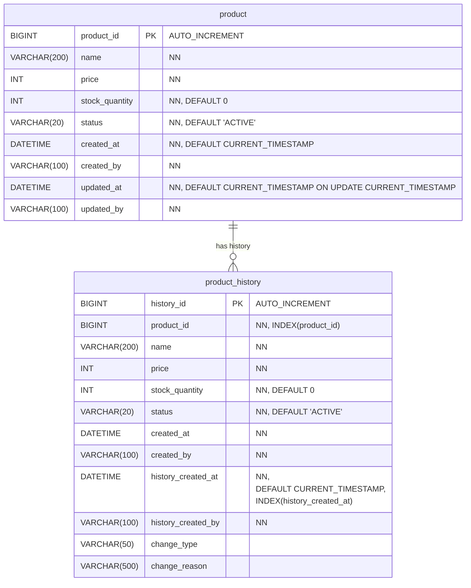

<!-- TOC -->
* [컬럼에 이전 값 보관 방식](#컬럼에-이전-값-보관-방식)
  * [컬럼에 이전 값 보관 방식 단점](#컬럼에-이전-값-보관-방식-단점)
    * [최초의 값을 알 수 없다](#최초의-값을-알-수-없다)
    * [여러 컬럼 추적 어려움](#여러-컬럼-추적-어려움)
* [현재 테이블로 이력 관리 - 시작](#현재-테이블로-이력-관리---시작)
* [현재 테이블로 이력 관리 - 단점 1](#현재-테이블로-이력-관리---단점-1-)
* [현재 테이블로 이력 관리 - 단점 2](#현재-테이블로-이력-관리---단점-2)
* [현재 테이블로 이력 관리 - 유효 기간](#현재-테이블로-이력-관리---유효-기간)
* [전체 행 스냅샷 이력 테이블 - 시작](#전체-행-스냅샷-이력-테이블---시작-)
* [전체 행 스냅샷 이력 테이블 - 주의점](#전체-행-스냅샷-이력-테이블---주의점-)
* [전체 행 스냅샷 이력 테이블 - 유효 기간](#전체-행-스냅샷-이력-테이블---유효-기간-)
* [전체 행 스냅샷 이력 테이블 - 한계](#전체-행-스냅샷-이력-테이블---한계)
* [컬럼 단위 변경 로그 테이블](#컬럼-단위-변경-로그-테이블)
* [공통 이력 테이블](#공통-이력-테이블-)
* [정리](#정리-)
<!-- TOC -->

# 컬럼에 이전 값 보관 방식

## 컬럼에 이전 값 보관 방식 단점

### 최초의 값을 알 수 없다

### 여러 컬럼 추적 어려움

# 현재 테이블로 이력 관리 - 시작

# 현재 테이블로 이력 관리 - 단점 1 
# 현재 테이블로 이력 관리 - 단점 2

## 전체 통계에서의 성능 문제


# 현재 테이블로 이력 관리 - 유효 기간

```sql
DROP TABLE IF EXISTS product;
CREATE TABLE product
(
    history_id     BIGINT PRIMARY KEY AUTO_INCREMENT,
    product_id     BIGINT       NOT NULL,
    name           VARCHAR(200) NOT NULL,
    price          INT          NOT NULL,
    stock_quantity INT          NOT NULL DEFAULT 0,
    status         VARCHAR(20)  NOT NULL DEFAULT 'ACTIVE',
    -- 유효 기간
    valid_from     DATETIME     NOT NULL,
    valid_to       DATETIME     NOT NULL DEFAULT '9999-12-31 23:59:59',
    is_current     BOOLEAN      NOT NULL DEFAULT TRUE,
    created_by     VARCHAR(100) NOT NULL,
    INDEX idx_product_id_valid_range (product_id, valid_from, valid_to),
    INDEX idx_valid_range (valid_from, valid_to),
    INDEX idx_is_current (is_current)
);
```



## 단점

### 단점 1: 변경 시 UPDATE 필요

### 단점 2: 트랜잭션 관리 필요

### 단점 3: 데이터가 계속 쌓인다

## 남은 문제점

1. 시점 조회와 통계 쿼리 작성의 복잡함 👉 해결
2. 시점 조회와 통계 쿼리의 성능 문제 👉 해결
3. 한 테이블에 너무 많은 데이터 보유 👉 미해결

# 전체 행 스냅샷 이력 테이블 - 시작

- 실무에서 가장 많이 사용하는 패턴은 **현재 테이블과 이력 테이블을 분리**하는 것

## 이력 테이블 분리가 필요한 이유

실무에서 데이터 조회 패턴을 분석해보면 보통은 다음과 같음. (물론 비즈니스 상황에 따라 다름)

> - **현재 데이터 조회**: 99%
> - **이력 조회**: 1%

- 이력 조회는 거의 사용되지 않음. 주로 현재 데이터를 조회함.
- 만약 현재 테이블에 이력을 같이 조회하면 99%의 일반 조회에서도 이력 데이터를 같이 조회하게됨. **매우 비효율적.**

## 스냅샷 이력 테이블 스키마 (테이블 분리 설계)

```sql
-- 현재 데이터 테이블
DROP TABLE IF EXISTS product;
CREATE TABLE product
(
    product_id     BIGINT PRIMARY KEY AUTO_INCREMENT,
    name           VARCHAR(200) NOT NULL,
    price          INT          NOT NULL,
    stock_quantity INT          NOT NULL DEFAULT 0,
    status         VARCHAR(20)  NOT NULL DEFAULT 'ACTIVE',
    created_at     DATETIME     NOT NULL DEFAULT CURRENT_TIMESTAMP,
    created_by     VARCHAR(100) NOT NULL,
    updated_at     DATETIME     NOT NULL DEFAULT CURRENT_TIMESTAMP ON UPDATE
        CURRENT_TIMESTAMP,
    updated_by     VARCHAR(100) NOT NULL
);

-- 이력 테이블
DROP TABLE IF EXISTS product_history;
CREATE TABLE product_history
(
    history_id         BIGINT PRIMARY KEY AUTO_INCREMENT,
    product_id         BIGINT       NOT NULL,
    name               VARCHAR(200) NOT NULL,
    price              INT          NOT NULL,
    stock_quantity     INT          NOT NULL DEFAULT 0,
    status             VARCHAR(20)  NOT NULL DEFAULT 'ACTIVE',
    created_at         DATETIME     NOT NULL,
    created_by         VARCHAR(100) NOT NULL,
    -- 이력 관리 컬럼
    history_created_at DATETIME     NOT NULL DEFAULT CURRENT_TIMESTAMP,
    history_created_by VARCHAR(100) NOT NULL,
    change_type        VARCHAR(50),
    change_reason      VARCHAR(500),
    INDEX idx_product_id (product_id),
    INDEX idx_history_created_at (history_created_at)
);
```


| 구분 | created_at (원본 데이터 유지) | history_created_at (이력 시점) |
|---|---|---|
| 의미 | 원본 테이블(product)의 `created_at` 값을 그대로 복사 | 이 이력 데이터가 `product_history` 테이블에 `INSERT` 되는 순간의 시간 |
| 질문 예시 | “이 상품은 최초에 언제 등록되었나요?” | “상품의 가격이 언제 변경되었나요?”<br>“과거 특정 시점의 데이터는 무엇이었나요?” |
| 값의 변화 | 동일한 `product_id`를 가진 이력 데이터들 사이에서는 값이 변하지 않는다. (상품의 생일은 바뀌지 않으므로) | 변경이 발생할 때마다 매번 새로운 시간이 기록된다. |
| 비고 | 데이터의 ‘속성’에 해당한다. | 데이터 변경의 ‘타임라인’ 역할을 한다. |

## 데이터 등록


# 전체 행 스냅샷 이력 테이블 - 주의점

## 주의! - 이력 테이블에는 첫 데이터부터 저장해야 한다


### 1. 잘못된 설계 실험: 변경 시점에만 이력을 저장하는 경우


# 전체 행 스냅샷 이력 테이블 - 유효 기간 

## 기존 이력 테이블의 문제 - 시점 조회의 문제 

- 기존 이력 테이블 구조에서 특정 상품의 '2026년 3월 10일 기준 가격'을 조회하려면?

```sql
SELECT product_id, name, price, history_created_at
FROM product_history
WHERE product_id = 1
    AND history_created_at <= '2026-03-10 23:59:59'
ORDER BY history_created_at DESC
LIMIT 1;
```

| product_id | name | price | history_created_at |
|------------|------|-------|-------------------|
| 1 | 스마트폰 케이스 | 12000 | 2026-01-15 10:00:00 |

- 👉 단일 행 조회 시에는 문제 없음.
- 👉 그러나 전체 상품의 특정 시점 통계를 내려면 **복잡한 서브 쿼리** 필요.

```sql
-- 2026년 3월 10일 기준 전체 재고
SELECT SUM(h.stock_quantity) AS total_stock
FROM product_history h
INNER JOIN (
  SELECT product_id, MAX(history_created_at) AS max_history_at
  FROM product_history
  WHERE history_created_at <= '2026-03-10 23:59:59'
  GROUP BY product_id
) latest ON h.product_id = latest.product_id
AND h.history_created_at = latest.max_history_at;
```
| total_stock |
|-------------|
| 150 |

## 유효 기간이 추가된 이력 테이블

```sql
CREATE TABLE product_history
(
    history_id         BIGINT PRIMARY KEY AUTO_INCREMENT,
    product_id         BIGINT       NOT NULL,
    name               VARCHAR(200) NOT NULL,
    price              INT          NOT NULL,
    stock_quantity     INT          NOT NULL DEFAULT 0,
    status             VARCHAR(20)  NOT NULL DEFAULT 'ACTIVE',
    -- 유효 기간
    valid_from         DATETIME     NOT NULL, -- 기존 history_created_at 컬럼 대체
    valid_to           DATETIME     NOT NULL DEFAULT '9999-12-31 23:59:59',
    -- 기타 컬럼
    created_at         DATETIME     NOT NULL,
    created_by         VARCHAR(100) NOT NULL,
    history_created_by VARCHAR(100) NOT NULL,
    change_type        VARCHAR(50),
    change_reason      VARCHAR(500),

    INDEX idx_product_id_valid_range (product_id, valid_from, valid_to), -- 특정 상품의 시계열 조회
    INDEX idx_valid_range (valid_from, valid_to) -- 전체 상품의 특정 시점 스냅샷 조회
);
```

### 유효 기간이 추가된 이력 테이블 단점

## 실무 예시

## 유효 기간 컬럼이 불필요한 테이블 (Transaction, Log Data)


# 전체 행 스냅샷 이력 테이블 - 한계


# 컬럼 단위 변경 로그 테이블
# 공통 이력 테이블 
# 정리 


