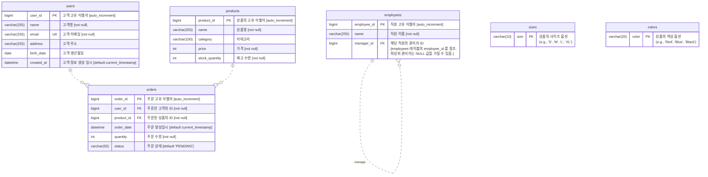

> [김영한의 실전 데이터베이스 - 기본편](https://inf.run/XRUC3) 강의 정리 레포.

# 주요 비즈니스 규칙 및 제약사항

> 우리가 만들 쇼핑몰의 비즈니스 규칙은 다음과 같다.

> **_왜 이런 비즈니스 규칙과 제약사항을 먼저 살펴볼까?_**
>
> 실제로 데이터베이스를 만들 때는 먼저 어떤 데이터가 필요하고, 그 데이터들이 어떻게 연결되는지 설계하
는 과정이 꼭 필요하다.
하지만 이번 강의는 데이터베이스 설계가 주제가 아니기 때문에, 이런 규칙과 구조가 있다는 것만 간단히 이
해하고 넘어가자.
데이터베이스 설계에 관한 부분은 데이터베이스 설계 강의에서 자세히 다룬다.

1. **고객 가입**: 모든 고객은 고유한 이메일 주소를 가져야 한다. 이름과 이메일은 필수 정보다.
2. **주문 생성**: 주문은 반드시 특정 고객(`user_id` )과 특정 상품(`product_id` )에 연결되어야 한다.
    1. 하나의 주문에 한 종류의 상품만 선택할 수 있다. 상품의 수량은 선택할 수 있다.
3. **주문 상태 관리**: 주문이 생성되면 기본 상태는 'PENDING'이며, 이후 'COMPLETED', 'SHIPPED',
   'CANCELLED'로 변경될 수 있다.
    1. PENDING(대기)
    2. SHIPPED(배송)
    3. COMPLETED(완료)
    4. CANCELLED(취소)
4. **재고 관리**: 주문이 발생하면 해당 `products` 테이블의 `stock_quantity` (재고)는 주문 `quantity` (수량)만
   큼 차감되어야 한다.
   이 로직은 데이터베이스가 아니라 애플리케이션에서 구현해야 한다.
5. **직원 관리 구조**: 직원은 매니저를 가질 수 있으며, 매니저 또한 직원이다. 매니저가 없는 최상위 직원이 존재할 수
   있다.

# ERD

