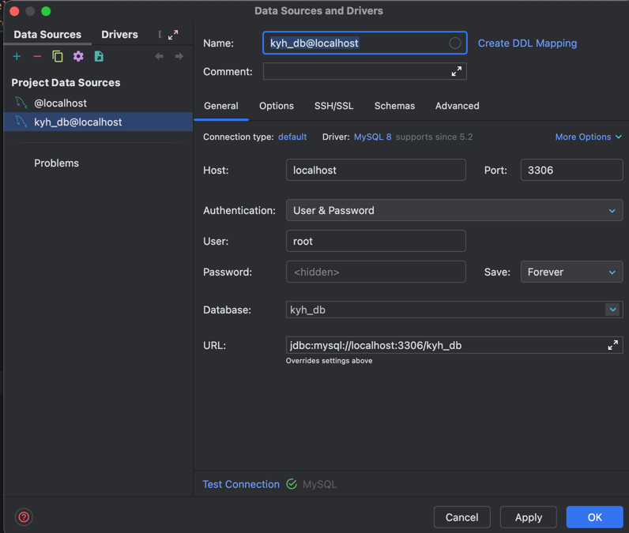

<!-- TOC -->
* [환경 세팅](#환경-세팅)
  * [도커를 이용한 MySQL 컨테이너 생성](#도커를-이용한-mysql-컨테이너-생성)
  * [실습 데이터 준비](#실습-데이터-준비)
    * [주요 비즈니스 규칙 및 제약사항](#주요-비즈니스-규칙-및-제약사항)
<!-- TOC -->

# 환경 세팅

> 강의에서는 MySQL을 설치해서 사용하고, Workbench를 사용해서 진행하지만, 여기서는 Docker, Datagrip 사용해서 진행.

## 도커를 이용한 MySQL 컨테이너 생성

**1. MySQL 이미지 다운로드**

```shell
docker images
```


**2. 도커 컨테이너 실행(볼륨 설정 포함)**

```shell
docker run -d \
    --name mysql-local \
    -e MYSQL_DATABASE=kyh_db \
    -e MYSQL_ROOT_PASSWORD={PW} \
    -p 3306:3306 \
    -v mysql_local_volume:/var/lib/mysql \
    mysql:8.0.40
```

- `-v`: 볼륨 설정
  - `mysql_local_volume`: 도커 볼륨 이름
  - `/var/lib/mysql`: 컨테이너 내부 경로
- `-e` 환경 변수 설정
  - `MYSQL_DATABASE`: 컨테이너 시작 시 생성할 데이터베이스 이름
  - `MYSQL_ROOT_PASSWORD`: root 계정 비밀번호 설정

**3. DB 연결**




