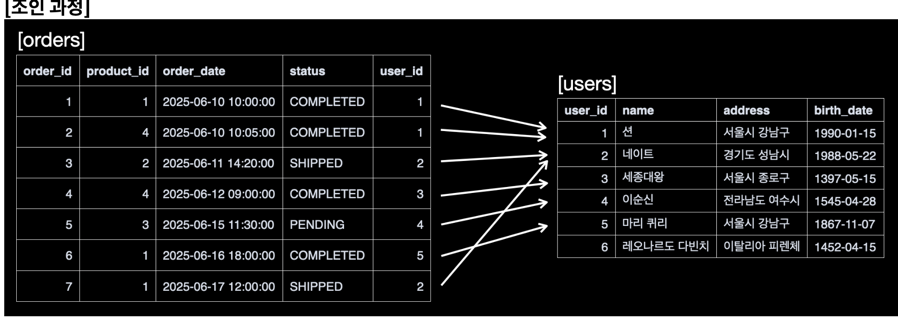
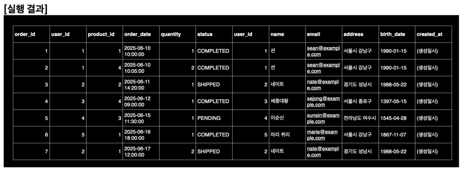
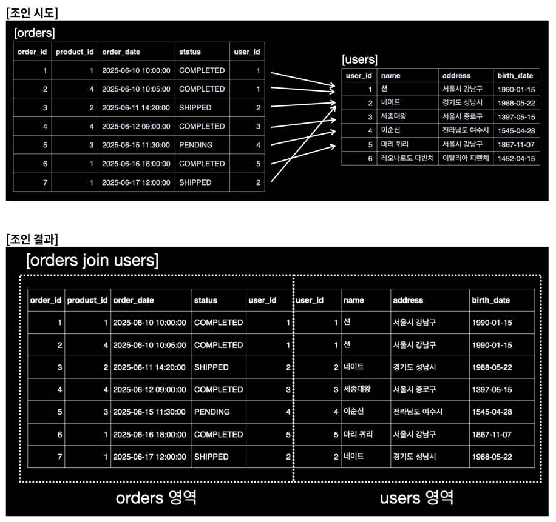
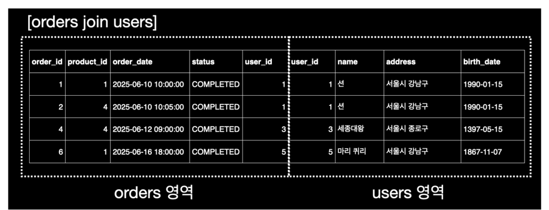
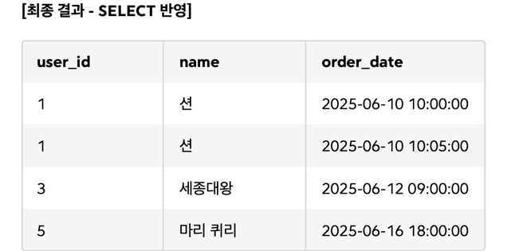

<!-- TOC -->
* [주요 비즈니스 규칙 및 제약사항](#주요-비즈니스-규칙-및-제약사항)
    * [**고객 주문 상품의 관계**](#고객-주문-상품의-관계)
    * [**나머지 관계**](#나머지-관계)
  * [실습 데이터 SQL](#실습-데이터-sql)
* [7. 조인이 필요한 이유](#7-조인이-필요한-이유)
  * [조인을 하지 않으면?](#조인을-하지-않으면)
  * [왜 테이블에 데이터를 나눠서 저장할까?](#왜-테이블에-데이터를-나눠서-저장할까)
  * [테이블 하나에 모든 데이터를 저장할 경우 발생하는 '이상현상'](#테이블-하나에-모든-데이터를-저장할-경우-발생하는-이상현상)
    * [**데이터 중복 발생(Redundancy)**](#데이터-중복-발생redundancy)
    * [**갱신 이상(Update Anomaly)**](#갱신-이상update-anomaly)
    * [**삽입 이상(Insertion Anomaly)**](#삽입-이상insertion-anomaly)
    * [**삭제 이상(Deletion Anomaly)**](#삭제-이상deletion-anomaly)
  * [정규화](#정규화)
  * [조인이 필요한 이유](#조인이-필요한-이유)
  * [조인](#조인)
* [8. 내부 조인 1](#8-내부-조인-1)
  * [내부 조인의 개념](#내부-조인의-개념)
  * [내부 조인 문법](#내부-조인-문법)
  * [실습: 주문별 고객정보 조회하기](#실습-주문별-고객정보-조회하기)
    * [1단계: 두 테이블을 그대로 연결하기](#1단계-두-테이블을-그대로-연결하기)
    * [2단계: 2단계: 필요한 컬럼만 선택하고, `WHERE`로 필터링하기](#2단계-2단계-필요한-컬럼만-선택하고-where로-필터링하기)
  * [⭐️ 조인 작동 순서](#-조인-작동-순서)
    * [쿼리 옵티마이저](#쿼리-옵티마이저)
<!-- TOC -->

# 주요 비즈니스 규칙 및 제약사항

> 우리가 만들 쇼핑몰의 비즈니스 규칙은 다음과 같다.

> **_왜 이런 비즈니스 규칙과 제약사항을 먼저 살펴볼까?_**
>
> 실제로 데이터베이스를 만들 때는 먼저 어떤 데이터가 필요하고, 그 데이터들이 어떻게 연결되는지 설계하
> 는 과정이 꼭 필요하다.
> 하지만 이번 강의는 데이터베이스 설계가 주제가 아니기 때문에, 이런 규칙과 구조가 있다는 것만 간단히 이
> 해하고 넘어가자.
> 데이터베이스 설계에 관한 부분은 데이터베이스 설계 강의에서 자세히 다룬다.

1. **고객 가입**: 모든 고객은 고유한 이메일 주소를 가져야 한다. 이름과 이메일은 필수 정보다.
2. **주문 생성**: 주문은 반드시 특정 고객(`user_id` )과 특정 상품(`product_id` )에 연결되어야 한다.
    1. 하나의 주문에 한 종류의 상품만 선택할 수 있다. 상품의 수량은 선택할 수 있다.
3. **주문 상태 관리**: 주문이 생성되면 기본 상태는 'PENDING'이며, 이후 'COMPLETED', 'SHIPPED',
   'CANCELLED'로 변경될 수 있다.
    1. PENDING(대기)
    2. SHIPPED(배송)
    3. COMPLETED(완료)
    4. CANCELLED(취소)
4. **재고 관리**: 주문이 발생하면 해당 `products` 테이블의 `stock_quantity` (재고)는 주문 `quantity` (수량)만
   큼 차감되어야 한다.
   이 로직은 데이터베이스가 아니라 애플리케이션에서 구현해야 한다.
5. **직원 관리 구조**: 직원은 매니저를 가질 수 있으며, 매니저 또한 직원이다. 매니저가 없는 최상위 직원이 존재할 수
   있다.

### **고객 주문 상품의 관계**

- **고객(users)** 은 여러 개의 **주문(orders)** 을 생성할 수 있다.
- **상품(products)** 은 여러 **주문(orders)** 에 포함될 수 있다.
- 하나의 **주문(orders)** 은 한 명의 **고객**과 하나의 **상품**에 연결된다.

### **나머지 관계**

- **직원(employees)** 은 다른 **직원**을 관리하는 계층 구조(SELF JOIN)를 가진다.
  `manager_id` 를 통해 상사를 알 수 있다.
- **사이즈(sizes)** 와 **색상(colors)** 테이블은 상품의 모든 옵션 조합을 생성하기 위해 사용된다.

## 실습 데이터 SQL

```sql
-- 데이터베이스가 존재하지 않으면 생성
CREATE DATABASE IF NOT EXISTS my_shop2;
USE my_shop2;

-- 테이블이 존재하면 삭제 (실습을 위해 초기화)
DROP TABLE IF EXISTS orders;
DROP TABLE IF EXISTS users;
DROP TABLE IF EXISTS products;
DROP TABLE IF EXISTS employees;
DROP TABLE IF EXISTS sizes;
DROP TABLE IF EXISTS colors;

-- 고객 테이블 생성
CREATE TABLE users
(
    user_id    BIGINT AUTO_INCREMENT,
    name       VARCHAR(255) NOT NULL,
    email      VARCHAR(255) NOT NULL UNIQUE,
    address    VARCHAR(255),
    birth_date DATE,
    created_at DATETIME DEFAULT CURRENT_TIMESTAMP,
    PRIMARY KEY (user_id)
);

-- 상품 테이블 생성
CREATE TABLE products
(
    product_id     BIGINT AUTO_INCREMENT,
    name           VARCHAR(255) NOT NULL,
    category       VARCHAR(100),
    price          INT          NOT NULL,
    stock_quantity INT          NOT NULL,
    PRIMARY KEY (product_id)
);

-- 주문 테이블 생성
CREATE TABLE orders
(
    order_id   BIGINT AUTO_INCREMENT,
    user_id    BIGINT NOT NULL,
    product_id BIGINT NOT NULL,
    order_date DATETIME    DEFAULT CURRENT_TIMESTAMP,
    quantity   INT    NOT NULL,
    status     VARCHAR(50) DEFAULT 'PENDING',
    PRIMARY KEY (order_id),

    CONSTRAINT fk_orders_users FOREIGN KEY (user_id)
        REFERENCES users (user_id),

    CONSTRAINT fk_orders_products FOREIGN KEY (product_id)
        REFERENCES products (product_id)
);

-- 직원 테이블 생성 (SELF JOIN 실습용)
CREATE TABLE employees
(
    employee_id BIGINT AUTO_INCREMENT,
    name        VARCHAR(255) NOT NULL,
    manager_id  BIGINT,
    PRIMARY KEY (employee_id),
    FOREIGN KEY (manager_id) REFERENCES employees (employee_id)
);

-- 사이즈 테이블 (CROSS JOIN 실습용)
CREATE TABLE sizes
(
    size VARCHAR(10) PRIMARY KEY
);

-- 색상 테이블 (CROSS JOIN 실습용)
CREATE TABLE colors
(
    color VARCHAR(20) PRIMARY KEY
);

-- 고객 데이터 입력
INSERT INTO users(name, email, address, birth_date)
VALUES ('션', 'sean@example.com', '서울시 강남구', '1990-01-15'),
       ('네이트', 'nate@example.com', '경기도 성남시', '1988-05-22'),
       ('세종대왕', 'sejong@example.com', '서울시 종로구', '1397-05-15'),
       ('이순신', 'sunsin@example.com', '전라남도 여수시', '1545-04-28'),
       ('마리 퀴리', 'marie@example.com', '서울시 강남구', '1867-11-07'),
       ('레오나르도 다빈치', 'vinci@example.com', '이탈리아 피렌체', '1452-04-15');

-- 상품 데이터 입력
INSERT INTO products(name, category, price, stock_quantity)
VALUES ('프리미엄 게이밍 마우스', '전자기기', 75000, 50),
       ('기계식 키보드', '전자기기', 120000, 30),
       ('4K UHD 모니터', '전자기기', 350000, 20),
       ('관계형 데이터베이스 입문', '도서', 28000, 100),
       ('고급 가죽 지갑', '패션', 150000, 15),
       ('스마트 워치', '전자기기', 280000, 40);

-- 주문 데이터 입력
INSERT INTO orders(user_id, product_id, quantity, status, order_date)
VALUES (1, 1, 1, 'COMPLETED', '2025-06-10 10:00:00'),
       (1, 4, 2, 'COMPLETED', '2025-06-10 10:05:00'),
       (2, 2, 1, 'SHIPPED', '2025-06-11 14:20:00'),
       (3, 4, 1, 'COMPLETED', '2025-06-12 09:00:00'),
       (4, 3, 1, 'PENDING', '2025-06-15 11:30:00'),
       (5, 1, 1, 'COMPLETED', '2025-06-16 18:00:00'),
       (2, 1, 2, 'SHIPPED', '2025-06-17 12:00:00');

-- 직원 데이터 입력
INSERT INTO employees(employee_id, name, manager_id)
VALUES (1, '김회장', NULL),
       (2, '박사장', 1),
       (3, '이부장', 2),
       (4, '최과장', 3),
       (5, '정대리', 4),
       (6, '홍사원', 4);

-- 사이즈 데이터 입력
INSERT INTO sizes(size)
VALUES ('S'),
       ('M'),
       ('L'),
       ('XL');

-- 색상 데이터 입력
INSERT INTO colors(color)
VALUES ('Red'),
       ('Blue'),
       ('Black');


```

# 7. 조인이 필요한 이유

> 대표님이 "최근 주문 현황을 고객 이름과 상품명을 포함해서 보고서로 만들어줘!"라고 요청했다고 가정하자.

## 조인을 하지 않으면?

- orders 테이블에는 고객 이름과 상품명이 없다.
- 조인을 하지 않으면,
    - 고객 이름을 구하기 위해서는 `users` 테이블을 통해 `user_id` 에 해당하는 고객명을 하나하나 직접 찾아야 한
      다.
    - 상품명을 구하기 위해서는 `products` 테이블을 통해 `product_id` 에 해당하는 상품명을 하나하나 직접 찾아
      야 한다.

지금처럼 데이터가 많이 없다면 고객명과 상품명을 각 테이블에서 직접 찾아서 보고서를 작성해도 되겠지만, 데이터가
수 백만 건이라면 상당히 큰 어려움이 있을 것이다.

## 왜 테이블에 데이터를 나눠서 저장할까?

- **왜 우리는 이렇게 불편하게 데이터를 여러 테이블에 나누어 저장하는 걸까?**
- 차라리 처음부터 하나의 큰 테이블에 주문
  정보, 고객 정보, 상품 정보를 모두 담아두면 편하지 않았을까?

## 테이블 하나에 모든 데이터를 저장할 경우 발생하는 '이상현상'

> - **이상현상**
    >
- 삭제이상
>   - 삽입이상
>   - 수정이상
> > 데이터베이스 개론과 실습 ch7.1 이상현상 참고

- users, products, orders 테이블을 하나로 합쳐서 `all_in_one`이라는 테이블에 모든 정보를 담는다고 해보자.

### **데이터 중복 발생(Redundancy)**

- '션' 이라는 고객이 상품을 100번 주문하면, 그의 이름, 이메일, 주소가 100번 불필요하게 저장되고, **저장 공간의 낭비로 이어진다.**

### **갱신 이상(Update Anomaly)**

> _**중복된 데이터 중 일부만 수정되어 데이터의 일관성이 깨지는 문제.**_

- 고객 '션'이 이메일 주소를 변경한다고 가정할 경우, 션이 주문한 100개의 주문 데이터를 찾아서, 이메일 주소를 일일일이 새로운 주소로 변경해야한다.
- 실수로 하나라도 누락한다면, 어떤 주문에서는 예전 이메일 주소로, 다른 주문에서는 새로운 이메일 주소로 저장되어 데이터 일관성이 깨지게된다.
- 즉, 어떤 정보가 진짜 정보인지 믿을 수 없게된다.

### **삽입 이상(Insertion Anomaly)**

> _**어떤 데이터를 저장할 때, 원치 않는 다른 데이터가 없으면 아예 삽입이 불가능한 문제.**_

- 우리 쇼핑몰에 아직 아무도 주문하지 않은 새로운 상품 '초경량 노트북'을 등록하고 싶다고 하자.
- 하지만 이 테이블 구조에서는 '주문'이 발생해야만 데이터를 추가할 수 있다.
- 주문한 사람이 없으니, **상품 정보조차 등록할 수 없는** 말도 안 되는 상황이 발생한다

### **삭제 이상(Deletion Anomaly)**

> _**특정 데이터를 삭제할 때, 원치 않게 다른 데이터까지 함께 삭제되는 문제.**_

- '이순신' 고객이 딱 한 번 주문한 기록이 있다고 하자.
- 만약 회사 정책상 이 주문 기록을 삭제해야 한다면 어떻게 될
  까?
- 주문 데이터를 삭제하는 순간, '이순신' 고객의 이름, 이메일, 주소 정보까지 데이터베이스에서 영원히 사라져
  버릴 수 있다.
- 우리는 단지 주문 내역 하나를 지웠을 뿐인데, 소중한 고객 정보까지 잃게 되는 것이다.

## 정규화

- 위 같이 잘못 설계된 테이블로 인해 발생하는 이상현상을 없애기 위해, 정규화라는 과정을 거침.
- 정규화는 데이터의 중복을 최소화하고, 데이터의 일관성을 해치는 '이상 현상'들을 방지하기 위해 데이터를 논리적인 단위로 분리하는 과정
- 우리가 `users` , `products` , `orders`로 테이블을 나눈 것이 바로 이 정규화의 결과물이다.

## 조인이 필요한 이유

> **_흩어진 데이터에서 유의미한 정보를 얻기 위해_**

- 잘 관리하기 위해 흩어놓은 데이터에서 의미 있는 정보를 얻으려면, 이 흩어진 조각들 을 다시 합쳐야만한다.
- 그렇게 데이터를 합치기 위해서 조인이 필요하다.
- "어떤 고객이 어떤 상품을 주문했는지"와 같은 통합된 보고서를 만들기 위해, 분리된 테이블들을 다시 연결해야 하는 것이다.

## 조인

> 조인은 두 개 이상의 테이블을 특정 컬럼(주로 기본키, 왜래키)을 기준으로 연결하여, 마치 처음부터 하나의 테이블이었던 것처럼 보여주는 기능

# 8. 내부 조인 1

- 어느날 우리 쇼핑몰의 대표님이 다음과 같은 요청을 한다.
    - **"주문이 완료된(`COMPLETED` ) 모든 주문에 대해, 어떤 고객이 주문했는지 고객 ID, 고객 이름과 주문 날짜를 함께 보고싶네."**
- 이 요구사항을 충족하려면 '고객 이름'을 담고있는 users 테이블과, '주문 날짜'와 '주문 상태'를 담고있는 orders 테이블의 정보가 모두 필요하다. (즉, 두 테이블을
  연결해야한다.)

## 내부 조인의 개념

- 내부 조인(INNER JOIN)은 양쪽 테이블에 모두 공통으로 존재하는 데이터만을 결과로 보여준다.
- 기준이 되는 컬럼(예: `orders.user_id` 와 `users.user_id` )의 값이 서로 일치하는 행들만 짝을 지어짐
    - `orders` 테이블에 `user_id` 가 존재하고, 연결되는 `users` 테이블에도 해당 `user_id` 를 가진 사용자가 존재할 때만 결과에 포함된다.
        - 예를 들어 `orders` 테이블에 `user_id` 가 1인 주문이 있고 `users` 테이블에 `user_id` 가 1인 회원이 있다면
          둘은 함께 결과에 포함된다.
        - 예를 들어 `orders` 테이블에 `user_id` 가 99인 주문이 있지만 `users` 테이블에 `user_id` 가 99인 회원이 없다면, 결과에서
          제외된다. (실제로는 데이터 무결성을 위해 외래 키(FOREIGN KEY) 제약조건을 사용하므로 이런 경우는 발생하지 않는다.)

## 내부 조인 문법

```sql
SELECT 컬럼1, 컬럼2, ...
FROM 테이블A
INNER JOIN 테이블B
ON 테이블A.연결컬럼 = 테이블B.연결컬럼;
```

- `FROM` : 기준이 되는 첫 번째 테이블을 지정한다.
- `INNER JOIN` : 연결할 두 번째 테이블을 지정한다.
- `ON` : **조인에서 가장 중요한 부분이다.** 두 테이블을 어떤 조건으로 연결할지 명시하는 연결고리다. `ON` 절의 조건이 참(true)이 되는 행들만 결과에 포함된다

> 실무에서는 `INNER JOIN` 대신 그냥 `JOIN` 키워드를 사용하는 경우가 많다. `JOIN`은 기본적으로 `INNER JOIN`을 의미한다.

## 실습: 주문별 고객정보 조회하기

### 1단계: 두 테이블을 그대로 연결하기

```sql
select *
from orders o
join users u on o.user_id = u.user_id;
```

- 실행 결과는 orders 테이블의 모든 컬럼과 users 테이블의 user_id가 같은 모든 컬럼이 옆으로 합쳐진 아주 넓은 테이블이 됨.
- 조인은 쉽게 얘기해서 '테이블을 합치는 것'.



1. 데이터베이스는 orders 테이블과 users 테이블을 조회한다.
2. `JOIN ON`에 의해 orders의 user_id와 users의 user_id 기준으로 조인한다.
3. `orders` 의 `user_id` 의 값으로 `users` 의 `user_id` 항목을 찾고 연결한다.
   - `order_id:1` 의 경우 `user_id:1` 이다. 따라서 `users` 의 `user_id:1` 항목과 연결한다.
   - `order_id:2` 의 경우 `user_id:1` 이다. 따라서 `users` 의 `user_id:1` 항목과 연결한다.
   - `order_id:3` 의 경우 `user_id:2` 이다. 따라서 `users` 의 `user_id:2` 항목과 연결한다.
   - ...
   - `user_id:6` 인 레오나르도 다빈치의 경우 연결할 대상이 없다. 따라서 내부 조인 대상에 포함되지 않는다.



- 결과에서 볼 수 있듯이, `orders` 와 `users` 의 모든 컬럼이 옆으로 합쳐진다.
- `user_id` 컬럼이 두 번 나타나는 이유는 `orders` , `users` 두 테이블 모두에 존재하기 때문이다. 
- 참고: SELECT에 `*` 대신 컬럼을 직접 나열하는 경우 `user_id` 처럼 중복으로 나타나는 컬럼은 테이블 명을 지정해주어야 한다.

### 2단계: 2단계: 필요한 컬럼만 선택하고, `WHERE`로 필터링하기

- `SELECT *` 은 구조 파악에는 좋지만, 실제 결과에는 불필요한 정보가 많음.

```sql
SELECT users.user_id,    -- 테이블 명 생략 불가
       users.name,       -- 테이블 명 생략 가능
       orders.order_date -- 테이블 명 생략 가능
FROM orders
         INNER JOIN users ON orders.user_id = users.user_id
WHERE orders.status = 'COMPLETED';
```

- SELECT 절에서, name, order_date 컬럼은 테이블 명을 생략해도 된다. (각 테이블에만 존재하는 컬럼이기 때문)
- 실무에서는 **어떤 테이블의 필드인지 명시하는 것이 가독성을 높이고, 컬럼의 소속을 쉽게 인지할 수 있기 때문에 사용하는 것을 권장**한다. (참고로 뒤에서 설명할 테이블 별칭과 함께 사용하는 것이 좋다.)

## ⭐️ 조인 작동 순서

> `FROM/JOIN (테이블 결합)` → `WHERE (조건 필터링)` → `SELECT (컬럼 선택)`

```sql
SELECT
users.user_id,
users.name,
orders.order_date
FROM orders
INNER JOIN users ON orders.user_id = users.user_id
WHERE orders.status = 'COMPLETED';
```

데이터베이스는 이 쿼리를 다음과 같은 논리적인 순서로 처리한다.

1. `FROM` / `JOIN`: 가장 먼저 `FROM` 절의 `orders` 테이블과 `INNER JOIN`으로 연결된 `users` 테이블을 연결하기 위해 `ON` 절에 명시된 `orders.user_id = users.user_id` 조건을 만족하는 행들을 결합하여 하나의 큰 가상 테이블을 생성한다.
   - *FROM에는 JOIN이 포함되어있다고 보면 된다.



2. `WHERE`: `JOIN` 을 통해 생성된 가상 테이블에서 `WHERE` 절의 조건인 `orders.status = 'COMPLETED'` 를 만족하는 행들만 필터링한다. 즉, `COMPLETED` 상태의 주문 데이터만 남게 된다.

(where 필터링 결과)



3. `SELECT`: 마지막으로, 필터링된 결과에서 `SELECT` 절에 명시된 `users.user_id` , `name` 과 `order_date` 컬럼을 추출하여 최종 결과를 반환한다.




### 쿼리 옵티마이저

- 사용자와 데이터베이스 간의 논리적 순서는 일종의 약속이지만, 데이터베이스 내부의 **쿼리 최적화기(Query Optimizer)** 는 쿼리를 더 효율적인 방식으로 실행한다.
- 예를 들어, `orders` 테이블에서 `COMPLETED` 상태의 행만 먼저 선택한 다음, 남은 행을 기준으로 `users` 테이블과 조인하는 방식으로 진행하면 조인 대상이 줄어들어 성능이 더 최적화 될 수 있다.
  - 예) orders에서 COMPLETED 상태의 행만 먼저 남기면 행이 4개가 되고, 그거 가지고 users와 조인하면 조인 개수가 줄어듦. (성능 최적화)
-  쿼리 최적화기를 통해 실제 물리적인 실행 순서는 달라질 수 있지만 어떻게 작동하든 최종 결과는 논리적인 순서와 동일하다. 
- 하지만 데이터베이스의 최적화 방식을 잘 이해하면 같은 결과를 얻으면서도 조회 성능을 최적화할 수 있다. 
- 성능 최적화에 대한 자세한 내용은 데이터베이스 성능 최적화 강의에서 다룬다. 지금은 SQL의 기능 자체에 집중하자
- SQL 처리 순서는 논리적인 순서와 물리적인 순서가 따로 있음.
- 논리적인 순서: SQL은 이 순서대로 작동해야한다고 표준적으로 정리해놓은게 있음.
- 물리적인 순서: 실제로 DBMS가 쿼리를 처리하는 순서

