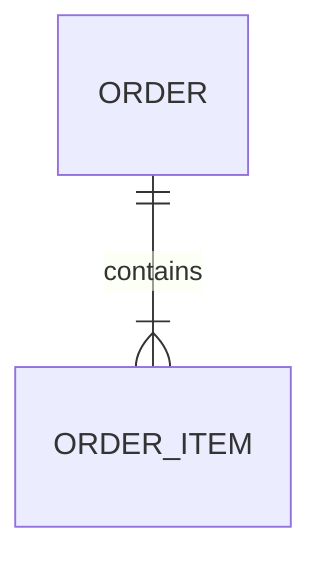
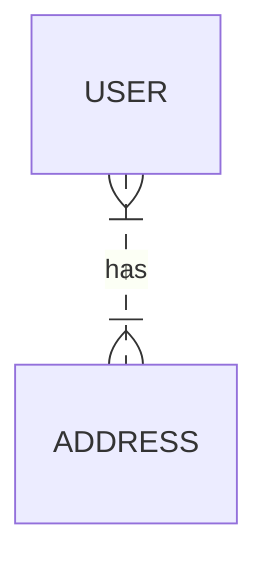
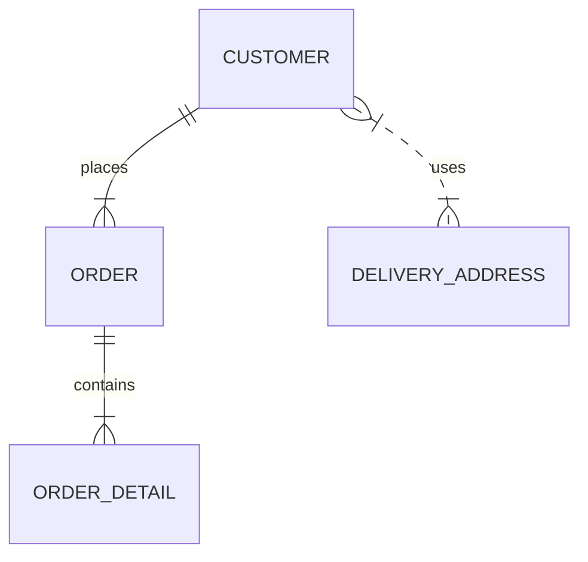

# 쉬운 비유

쉬운 비유: 아파트와 호수

이 개념을 아파트 동과 각 세대의 호수에 비유하면 이해하기 쉽습니다.

- 식별 관계 (현실 세계)
  - '101동'이라는 정보 없이는 '503호'가 어느 아파트의 503호인지 특정할 수 없습니다. 
  - 여기서 각 세대의 고유 식별자는 (아파트 동, 호수)가 됩니다. 
  - APARTMENT_UNIT 테이블의 PK = (building_number, unit_number)
  - 이처럼, 부모('아파트 동')의 식별자가 자식('호수') 식별자의 일부가 되는 것이 식별 관계입니다.
- 비식별 관계 (데이터베이스 모델링)
  - 만약 모든 세대에 절대 겹치지 않는 고유한 '세대 관리 번호'를 부여한다고 상상해 보세요. (예: unit_id = 12345)
  - '12345'라는 번호만 알면 어느 동, 어느 호수인지 바로 알 수 있습니다. **'101동'이라는 정보는 이 세대가 어느 동에 속하는지 알려주는 참조 정보**일 뿐, 세대를 특정하는 **고유 식별자의 일부는 아닙니다.**
  - APARTMENT_UNIT 테이블의 PK = unit_id (독립적) / FK = building_number (단순 참조)
  - 이것이 비식별 관계입니다.

# 식별 관계 vs 비식별 관계

> - 실선 (--): "떼려야 뗄 수 없는" 강한 관계 
> - 점선 (..): "있으면 좋고 없어도 되는" 약한 관계

## 식별 관계 (Identifying Relationship)

- 표기법: -- (실선, 하이픈 2개)
- 의미:
  - 자식 엔티티가 부모 엔티티 없이는 존재할 수 없음 
  - **부모의 PK가 자식의 PK의 일부가 됨** 
  - 강한 종속 관계
- 단점
  - 복합키로 인한 JOIN 복잡도 증가
  - 자식 테이블이 또 있으면 PK가 계속 길어짐 
  - ORM(JPA) 사용 시 복합키 클래스 필요

예시:

- 주문(ORDER)과 주문상세(ORDER_ITEM)
  - 주문상세는 주문 없이 존재 불가 
  - ORDER_ITEM의 PK = (order_id, product_id) ← order_id가 PK의 일부

    
## 비식별 관계 (Non-Identifying Relationship)

- 표기법: .. (점선, 점 2개)
- 의미:
  - 자식 엔티티가 부모 엔티티 없이도 독립적으로 존재 가능 
  - 부모의 PK가 자식의 일반 FK로만 사용됨 
  - 약한 종속 관계

- 사용자(USER)와 배송지(ADDRESS)
- 배송지는 사용자와 독립적으로 존재 가능
- ADDRESS의 PK = address_id (독립적)
- ADDRESS의 FK = user_id (참조만 함)

## 실전 예제

- 왜 이렇게 구분할까? 
  - ORDER_DETAIL: 주문 없으면 의미 없음 → 식별 관계 (--)
  - DELIVERY_ADDRESS: 고객이 탈퇴해도 주소 정보는 남아있을 수 있음 → 비식별 관계 (..)

# 식별관계를 비식별관계로 바꿔서 쓰는 것이 나은 이유

## 식별 관계 (복합 PK)

- 장점:
  - 자연키 사용, 
  - 데이터 의미 명확 
  - 중복 방지 자동 보장 
- 단점:
  - 복합키로 인한 JOIN 복잡도 증가 
  - 자식 테이블이 또 있으면 PK가 계속 길어짐 
  - ORM(JPA) 사용 시 복합키 클래스 필요

## 비식별 관계 (대리키 + UNIQUE)

- 장점:
  - 단순한 PK로 JOIN 단순화
  - ORM 친화적 (단일 @Id 사용)
  - 확장성 좋음 (자식 테이블에도 단일 PK 전파)
  - 성능상 유리 (단일 컬럼 인덱스)
- 단점:
  - UNIQUE 제약조건 별도 관리 필요
  - 대리키와 비즈니스 키의 이중 관리