<!-- TOC -->
* [인덱스란?](#인덱스란)
  * [[실습] 인덱스 직접 설정해보기 / 성능 측정해보기](#실습-인덱스-직접-설정해보기--성능-측정해보기)
    * [데이터 준비](#데이터-준비)
    * [성능 측정](#성능-측정)
    * [(팁💡) 성능 측정 시 주의할 점: 정확한 시간](#팁-성능-측정-시-주의할-점-정확한-시간)
    * [인덱스 생성 후 성능 측정](#인덱스-생성-후-성능-측정)
    * [인덱스 생성 시 주의점](#인덱스-생성-시-주의점)
* [기본으로 설정되는 인덱스(PK)](#기본으로-설정되는-인덱스pk)
  * [PK 변경 시 자동으로 정렬되서 저장한다.](#pk-변경-시-자동으로-정렬되서-저장한다)
    * [PK 변경 후 조회](#pk-변경-후-조회)
  * [클러스터링 인덱스](#클러스터링-인덱스)
* [제약 조건을 추가하면 자동으로 생성되는 인덱스(UNIQUE)](#제약-조건을-추가하면-자동으로-생성되는-인덱스unique)
  * [실제로 생기는지 확인](#실제로-생기는지-확인)
* [[실습] 인덱스를 무식하게 많이 걸면 어떻게 될까?](#실습-인덱스를-무식하게-많이-걸면-어떻게-될까)
  * [실습으로 확인해보기](#실습으로-확인해보기)
    * [데이터 준비](#데이터-준비-1)
    * [데이터 삽입 성능 테스트](#데이터-삽입-성능-테스트)
  * [⭐️ 기억할 것: 최소한의 인덱스 사용](#-기억할-것-최소한의-인덱스-사용)
* [멀티 컬럼 인덱스(Multiple-Column Index)란?](#멀티-컬럼-인덱스multiple-column-index란)
  * [[실습] 멀티 컬럼 인덱스 직접 설정해보기 / 작동 방식 이해하기](#실습-멀티-컬럼-인덱스-직접-설정해보기--작동-방식-이해하기)
    * [데이터 조회 시 멀티 컬럼 인덱스가 어떻게 활용되는지에 대한 이해](#데이터-조회-시-멀티-컬럼-인덱스가-어떻게-활용되는지에-대한-이해)
  * [멀티 컬럼 인덱스 생성 시 주의점](#멀티-컬럼-인덱스-생성-시-주의점)
    * [멀티 컬럼 인덱스를 만들어두면 일반 인덱스로 활용 가능(선행 컬럼 활용)](#멀티-컬럼-인덱스를-만들어두면-일반-인덱스로-활용-가능선행-컬럼-활용)
    * [멀티 컬럼 인덱스를 만들어두었는데 일반 인덱스처럼 활용 못하는 경우](#멀티-컬럼-인덱스를-만들어두었는데-일반-인덱스처럼-활용-못하는-경우)
    * [멀티 컬럼 인덱스 구성 시에 대분류 -> 중분류 -> 소분류 컬럼순으로 구성하기](#멀티-컬럼-인덱스-구성-시에-대분류---중분류---소분류-컬럼순으로-구성하기)
    * [멀티 컬럼 인덱스의 유지 비용](#멀티-컬럼-인덱스의-유지-비용)
    * [멀티 컬럼 인덱스에서의 범위 조건 사용에 대해](#멀티-컬럼-인덱스에서의-범위-조건-사용에-대해)
    * [⭐️ 기억할 것](#-기억할-것)
* [커버링 인덱스(Covering Index)란?](#커버링-인덱스covering-index란)
<!-- TOC -->

# 인덱스란?

- 인덱스
  - **_데이터를 빨리 찾기 위해 특정 컬럼을 기준으로 미리 정렬해놓은 표_**

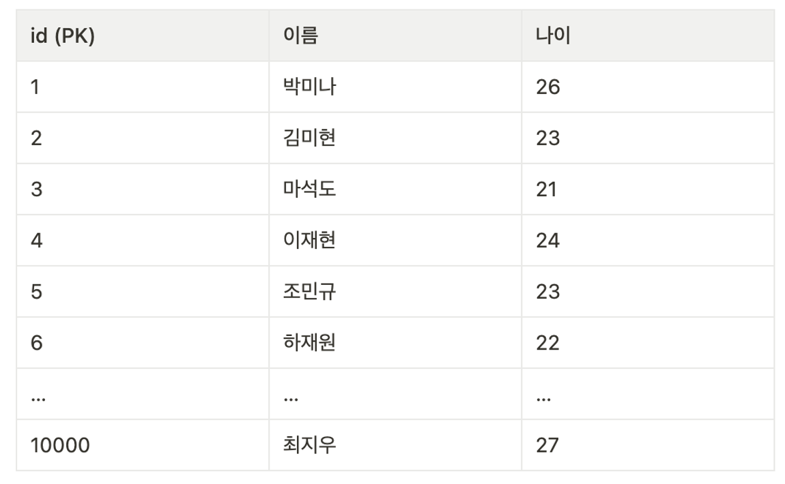

- 나이가 23살인 사용자를 직접 찾으려고 하면, 나이순으로 정렬되어있지 않기 때문에 모든 행을 비교해가면서 23살인 사용자를 찾아야한다. 
  - 즉, 1만개의 **데이터를 모두 확인**해야하므로 시간이 오래걸림.

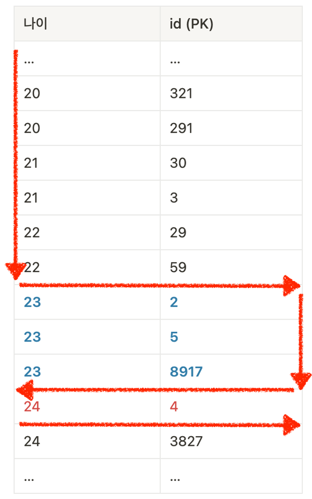

- 하지만 위 표와 같이 미리 나이순으로 정렬된 표가 있다면 어떨까?

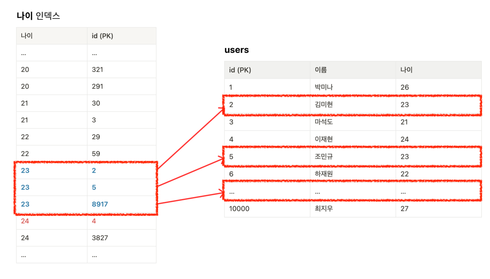

- 나이가 23살인 사용자를 찾기 위해서는 표에서 나이가 **23살로 시작하는 지점과 24살로 시작되는 지점**만 찾은 뒤, **그 사이에 있는 모든 값**을 가져오면 됨. 
  - 여기서 나이 순으로 정렬된 표가 인덱스. (정확하게는 나이 컬럼을 기준으로 생성한 인덱스)
- 인덱스를 생성한다고 해서 실제로 볼 수는 없고, 시스템 내부적으로 생성될 뿐임.

> ⭐️ 인덱스는 데이터를 빨리 찾기 위해 **특정 컬럼을 기준으로 미리 정렬해놓은 표**이다.


## [실습] 인덱스 직접 설정해보기 / 성능 측정해보기

### 데이터 준비

```sql
DROP TABLE IF EXISTS users; # 기존 테이블 삭제

CREATE TABLE users (
   id INT AUTO_INCREMENT PRIMARY KEY,
   name VARCHAR(100),
   age INT
);
```

```sql
-- MySQL 세션의 최대 재귀 깊이를 1_000_000 으로 설정
-- (아래에서 생성할 더미 데이터의 개수와 맞춰서 작성하면 된다.)
SET SESSION cte_max_recursion_depth = 1000000;

-- 더미 데이터 삽입 쿼리
INSERT INTO users (name, age)
WITH RECURSIVE cte (n) AS
(
  SELECT 1 -- 기본케이스
  UNION ALL
  SELECT n + 1 FROM cte WHERE n < 1000000 -- 재귀 케이스
)
SELECT
    CONCAT('User', LPAD(n, 7, '0')),   -- 'User' 다음에 7자리 숫자로 구성된 이름 생성
    FLOOR(1 + RAND() * 1000) AS age    -- 1부터 1000 사이의 랜덤 값으로 나이 생성
FROM cte;

-- 잘 생성됐는 지 확인
SELECT COUNT(*) FROM users;
```

- CTE(Common Table Expression): 일시적으로 명명된 결과 집합. 
- 재귀적 CTE: 
  - 자기 자신을 참조하는 CTE.
  - 기본 케이스와 재귀 케이스로 나뉨
    - 기본 케이스: `SELECT 1`
      - 시작값 1을 생성.
    - 재귀 케이스: `SELECT n + 1 FROM cte WHERE n < 10000`
      - 이전 값에 1을 더한 새 값을 생성.
      - 이 과정을 1_000_000에 도달할 때까지 반복

```text
INSERT INTO users (name, age)
SELECT
    CONCAT('User', LPAD(n, 7, '0')),
    FLOOR(1 + RAND() * 1000) AS age
FROM cte;
```

- 데이터 삽입하는 부분:
  - CTE에서 생성된 각 숫자에 대해 사용자 데이터를 생성한다.

```sql
select * from users
where age = 300;
```

### 성능 측정

- 성능을 측정해보면 대략 150ms 이 걸린다.

### (팁💡) 성능 측정 시 주의할 점: 정확한 시간

- 어떤 SQL이 느린 것 같다, 빠른 것 같다라는 것은 X
- 성능 개선할 때는 **수치를 정확히 측정**해서(ms), 이전과 이후를 정확히 비교하는 것이 중요. (몇 배 향상)
  - 몇ms 가 걸렸는데, 몇 ms로 개선했는지를 정확히 봐야함.
  
### 인덱스 생성 후 성능 측정

```sql
create index idx_age on users (age);
show index from users;
```

- 설정하고 성능 측정해보니 30ms 정도로 확연히 속도가 향상됨.

### 인덱스 생성 시 주의점

- 전체 row에 락이 걸리므로 그동안은 DB 접근을 할 수 없다?


> >  by claude 3.5
> 
> 이 말은 일부 맞지만, MySQL 버전과 사용하는 스토리지 엔진에 따라 다릅니다. 좀 더 자세히 설명해 드리겠습니다:
> 
> - MyISAM 엔진: 
>   -  전통적으로 MyISAM 엔진에서는 인덱스 생성 시 전체 테이블에 락이 걸립니다.
>   이는 운영 중 인덱스 생성을 어렵게 만듭니다.
> 
> 
> - InnoDB 엔진:
>  - MySQL 5.5 이전 버전: InnoDB도 인덱스 생성 시 전체 테이블 락을 사용했습니다.
>  - MySQL 5.6 이후 버전: "온라인 DDL" 기능이 도입되었습니다.
>    -  이 기능으로 인해 대부분의 인덱스 생성 작업이 다른 작업을 차단하지 않고 수행될 수 있습니다. 
>    - 단, 작업 초기와 마지막에 짧은 메타데이터 락이 필요합니다.
> - MySQL 8.0 이후: 
>   - 인스턴트 DDL, 원자적 DDL 등 더욱 개선된 기능들이 도입되었습니다.
>   - 이로 인해 많은 DDL 작업들이 더욱 빠르고 효율적으로 수행될 수 있게 되었습니다.
> 
> 따라서, 최신 버전의 MySQL과 InnoDB 엔진을 사용한다면, 대부분의 경우 운영 중에도 인덱스를 생성할 수 있습니다. 하지만 여전히 주의가 필요합니다:
> 
> - 대용량 테이블의 경우, 인덱스 생성이 오래 걸릴 수 있어 서버 부하를 증가시킬 수 있습니다.
> - 특정 상황에서는 여전히 락이 발생할 수 있으므로, 중요한 운영 시간에는 가급적 피하는 것이 좋습니다.
> - 실제 적용 전 테스트 환경에서 충분한 검증을 거치는 것이 안전합니다.


# 기본으로 설정되는 인덱스(PK)

## PK 변경 시 자동으로 정렬되서 저장한다.

```sql
DROP TABLE IF EXISTS users; # 기존 테이블 삭제

CREATE TABLE users
(
    id   INT PRIMARY KEY,
    name VARCHAR(100)
);

INSERT INTO users (id, name)
VALUES (1, 'a'),
       (3, 'b'),
       (5, 'c'),
       (7, 'd');
```

```sql
SELECT * FROM users;
```

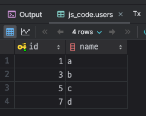

- 위처럼 데이터를 준비하고 조회 시 결과 PK를 기준으로 정렬된 것을 확인 가능.

### PK 변경 후 조회

```sql
UPDATE users
SET id = 2
WHERE id = 7;

SELECT * FROM users;
```


- 조회 시 데이터 추가 순이 아닌 PK 기준으로 정렬된 것을 확인 가능.


## 클러스터링 인덱스

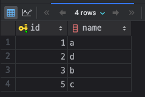

- PK를 기준으로 데이터가 정렬된 것처럼, **원본 데이터 자체가 정렬되는 인덱스**를 `클러스터링 인덱스`라고한다.
- `PK = 클러스터링 인덱스`라고 이해해도 된다. 
  - 클러스터링 인덱스는 PK밖에 없기 때문. 

```sql
show index from users;
```

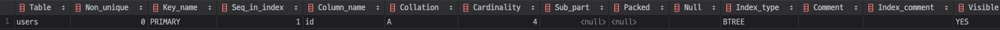

- PK에 대한 인덱스가 있는지 조회하면 `PRIMARY`라는 이름으로 인덱스가 존재한다. 

> ⭐️
> - **PK에는 인덱스가 기본으로 적용**됨. 
> - PK에는 인덱스가 적용되어 있으므로, **PK를 기준으로 데이터가 정렬**된다.

---

# 제약 조건을 추가하면 자동으로 생성되는 인덱스(UNIQUE)

- **UNIQUE 제약 조건을 추가하면 자동으로 인덱스가 생성된다.**
  - 이유?: _MySQL에서 유니크 제약 조건을 구성하고 사용할 때 기본적으로 인덱스의 원리를 활용해서 제약 조건을 걸기 때문._

## 실제로 생기는지 확인

```sql
create table users
(
    id   int auto_increment primary key,
    name varchar(100) unique
);

show index from users;
```

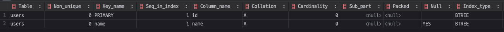

> ⭐️ 이것만은 꼭 기억하자.
> - UNIQUE 옵션을 사용하면 **인덱스가 같이 생성되기 때문에 조회 성능이 향상**된다.

---

# [실습] 인덱스를 무식하게 많이 걸면 어떻게 될까?

- 인덱스를 많이 추가하면 데이터 삽입, 수정, 삭제 즉 **쓰기 작업의 성능이 저하된다.**

## 실습으로 확인해보기

### 데이터 준비

_인덱스 있는 테이블과 없는 테이블 생성._

```sql
-- 테이블 A: 인덱스가 없는 테이블
CREATE TABLE test_table_no_index (
    id INT AUTO_INCREMENT PRIMARY KEY,
    column1 INT,
    column2 INT,
    column3 INT,
    column4 INT,
    column5 INT,
    column6 INT,
    column7 INT,
    column8 INT,
    column9 INT,
    column10 INT
);

-- 테이블 B: 인덱스가 많은 테이블
CREATE TABLE test_table_many_indexes (
    id INT AUTO_INCREMENT PRIMARY KEY,
    column1 INT,
    column2 INT,
    column3 INT,
    column4 INT,
    column5 INT,
    column6 INT,
    column7 INT,
    column8 INT,
    column9 INT,
    column10 INT
);
```

_모든 컬럼에 인덱스 추가_

```sql
-- 각 컬럼에 인덱스를 추가
CREATE INDEX idx_column1 ON test_table_many_indexes (column1);
CREATE INDEX idx_column2 ON test_table_many_indexes (column2);
CREATE INDEX idx_column3 ON test_table_many_indexes (column3);
CREATE INDEX idx_column4 ON test_table_many_indexes (column4);
CREATE INDEX idx_column5 ON test_table_many_indexes (column5);
CREATE INDEX idx_column6 ON test_table_many_indexes (column6);
CREATE INDEX idx_column7 ON test_table_many_indexes (column7);
CREATE INDEX idx_column8 ON test_table_many_indexes (column8);
CREATE INDEX idx_column9 ON test_table_many_indexes (column9);
CREATE INDEX idx_column10 ON test_table_many_indexes (column10);
```

### 데이터 삽입 성능 테스트

**_인덱스 없는 테이블에 삽입할 때_** 

```sql
-- 높은 재귀(반복) 횟수를 허용하도록 설정
-- (아래에서 생성할 더미 데이터의 개수와 맞춰서 작성하면 된다.)
SET SESSION cte_max_recursion_depth = 100000; 

-- 인덱스가 없는 테이블에 데이터 10만개 삽입
INSERT INTO test_table_no_index (column1, column2, column3, column4, column5, column6, column7, column8, column9, column10)
WITH RECURSIVE cte AS (
    SELECT 1 AS n
    UNION ALL
    SELECT n + 1 FROM cte WHERE n < 100000
)
SELECT
    FLOOR(RAND() * 1000),
    FLOOR(RAND() * 1000),
    FLOOR(RAND() * 1000),
    FLOOR(RAND() * 1000),
    FLOOR(RAND() * 1000),
    FLOOR(RAND() * 1000),
    FLOOR(RAND() * 1000),
    FLOOR(RAND() * 1000),
    FLOOR(RAND() * 1000),
    FLOOR(RAND() * 1000)
FROM cte;
```

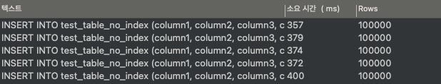

- 약 376ms 속도가 걸리고, 쓰기 속도가 증가하거나 하지는 않음.


**_인덱스 있는 테이블에 삽입할 때_**

```sql
-- 인덱스가 많은 테이블에 데이터 10만개 삽입
INSERT INTO test_table_many_indexes (column1, column2, column3, column4, column5, column6, column7, column8, column9, column10)
WITH RECURSIVE cte AS (
    SELECT 1 AS n
    UNION ALL
    SELECT n + 1 FROM cte WHERE n < 100000
)
SELECT
    FLOOR(RAND() * 1000),
    FLOOR(RAND() * 1000),
    FLOOR(RAND() * 1000),
    FLOOR(RAND() * 1000),
    FLOOR(RAND() * 1000),
    FLOOR(RAND() * 1000),
    FLOOR(RAND() * 1000),
    FLOOR(RAND() * 1000),
    FLOOR(RAND() * 1000),
    FLOOR(RAND() * 1000)
FROM cte;
```

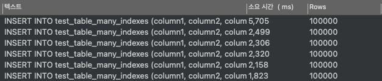

- 데이터가 많아지면 많아질수록 삽입 속도가 오래 걸린다.

## ⭐️ 기억할 것: 최소한의 인덱스 사용

- 최소한의 인덱스만 사용하려고 하자.
- 인덱스를 추가하면 조회 속도는 빨라지나, 쓰기(삽입, 수정, 삭제) 속도는 느려짐을 항상 기억하자.

# 멀티 컬럼 인덱스(Multiple-Column Index)란?

- 멀티 컬럼 인덱스
  - 2개 이상의 컬럼을 묶어서 설정하는 인덱스.
  - **데이터를 빨리 찾기 위해 2개 이상의 컬럼을 기준으로 미리 정렬해놓은 표.**

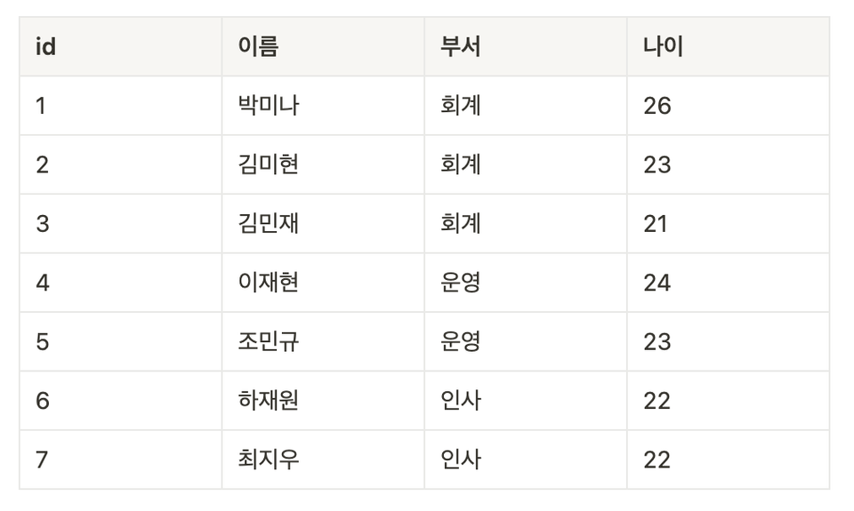

- users 테이블이 위와 같이 있다.
- 부서와 이름으로 멀티 컬럼 인덱스를 만들면, 시스템 내부적으로 아래와 같은 표가 생성된다.


- `부서`를 기준으로 오름차순 정렬한 뒤, `부서`안에서 `이름`을 기준으로 오름차순 정렬하게 된다.

>  ⭐ 기억할 것
> - 2개 이상의 컬럼을 묶어서 인덱스를 생성할 수도 있다. (멀티컬럼 인덱스)

## [실습] 멀티 컬럼 인덱스 직접 설정해보기 / 작동 방식 이해하기

```sql
DROP TABLE IF EXISTS users;

CREATE TABLE users
(
  id INT AUTO_INCREMENT PRIMARY KEY,
  이름 VARCHAR(100),
  부서 VARCHAR(100),
  나이 INT
);

INSERT INTO users (이름, 부서, 나이)
VALUES ('박미나', '회계', 26),
       ('김미현', '회계', 23),
       ('김민재', '회계', 21),
       ('이재현', '운영', 24),
       ('조민규', '운영', 23),
       ('하재원', '인사', 22),
       ('최지우', '인사', 22);

CREATE INDEX idx_부서_이름 ON users (`부서`, `이름`);
show indexes from users;
```


- 하나의 인덱스가 두 줄로 표현됨.

### 데이터 조회 시 멀티 컬럼 인덱스가 어떻게 활용되는지에 대한 이해

```sql
select *
from users
where 부서 = '인사'
order by 이름;
```

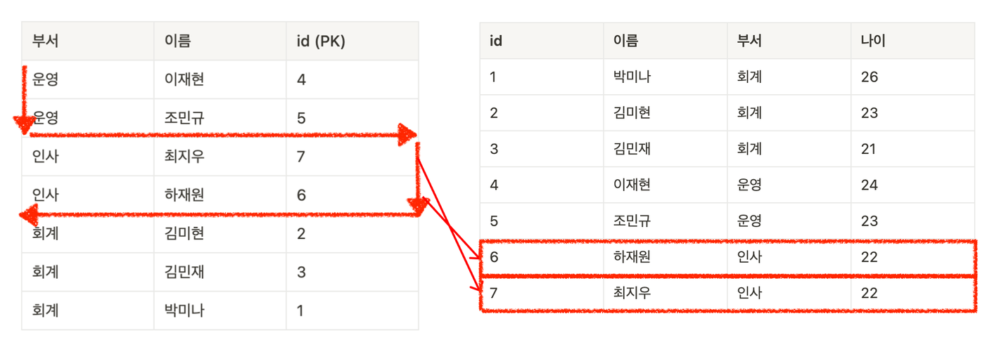

- `(부서, 이름)`으로 인덱스를 만들었으므로, `where 부서 = '인사'`를 만족하는 데이터를 빠르게 조회 가능.
- 그런 뒤에 `order by 이름`으로 정렬해야하는데, 이미 정렬이 되어있으므로 위 SQL을 통해 데이터를 가져오는 것은 속도가 빠를 수 밖에 없음.

```text
| 부서 | 이름   | id (PK) |
|------|--------|---------|
| 운영 | 이재현 | 4       |
| 운영 | 조민규 | 5       |
| 인사 | 하재원 | 6       |
| 인사 | 최지우 | 7       |
| 회계 | 김미현 | 2       |
| 회계 | 김민재 | 3       |
| 회계 | 박미나 | 1       |
```

## 멀티 컬럼 인덱스 생성 시 주의점

### 멀티 컬럼 인덱스를 만들어두면 일반 인덱스로 활용 가능(선행 컬럼 활용)

```sql
CREATE INDEX idx_부서_이름 ON users (`부서`, `이름`);
```


- `(부서, 이름)`으로 인덱스를 생성했으므로, 먼저 `부서`를 기준으로 정렬되고, 그 다음 `이름`을 기준으로 정렬된다.
- 즉 `부서` 컬럼만 놓고 봤을 때, `(부서)` 인덱스와 동일한 정렬 상태를 갖고 있다. 
  - 따라서 위 `(부서, 이름)` 멀티 컬럼 인덱스를 사용할 때는 `(부서)` 인덱스를 활용하듯이 쓸 수 있다.
  - 이것을 [Left Prefix Index Rule](https://orangematter.solarwinds.com/2019/02/05/the-left-prefix-index-rule/)이라고 함.

```sql
SELECT * FROM users
WHERE 부서 = '운영';
```

- 위 SQL문을 볼 때, `(부서)` 인덱스를 생성하면 성능이 향상되리라 짐작할 수 있지만, **이미 `(부서, 이름)` 멀티 컬럼 인덱스를 만들어 뒀기 때문에 `(부서)` 
  인덱스를 또 만들 필요는 없다.**  

### 멀티 컬럼 인덱스를 만들어두었는데 일반 인덱스처럼 활용 못하는 경우


- `(부서, 이름)` 멀티 컬럼 인덱스를 `(부서)` 인덱스를 쓰는 것처럼 활용할 수는 있지만, `(이름)` 인덱스처럼 활용할 수 있는 것은 아니다. 
  - 생성된 인덱스 표를 살펴보면 `부서`로 정렬된 것이지, `이름`을 기준으로 정렬된 것은 아니기 때문.
- 즉, **멀티 컬럼 인덱스에서 일반 인덱스처럼 활용할 수 있는 것은 처음에 배치된 컬럼 뿐**이다.


### 멀티 컬럼 인덱스 구성 시에 대분류 -> 중분류 -> 소분류 컬럼순으로 구성하기

- 멀티 컬럼 인덱스를 만들 때는 순서에 주의해야함.
  - 순서를 어떻게 정하느냐에 따라 성능 차이가 나기 때문.
- 멀티 컬럼 인덱스에서 탐색할 때는 배치한 컬럼 순서대로 데이터를 탐색한다. 
  - `(부서, 이름)` 인덱스를 생성했다면 일치하는 `부서`를 먼저 찾은 뒤 `부서`에서 `이름`을 찾는 식이다.
- 따라서 멀티 컬럼 인덱스 구성 시 데이터 **중복도가 높은 컬럼이 앞쪽**으로 오도록 하는 것이 좋은 경우가 많다.
  - 단, 항상 그런 것은 아니므로, 실행 계획과 SQL을 실행 속도로 측정해서 대분류, 중분류, 소분류로 멀티 컬럼 인덱스를 세팅하는게 진짜 두드러지게 성능이 향상되는 지 판단해야한다.
  - (이건 좀 애매한게, 보통 카디널리티가 높을 수록 인덱스 효과가 좋아지기 때문에 강사님이 항상 그런 것은 아니라고 얘기한 것이라고 생각함.)
  - [향로님: 카디널리티가 높은 순에서 낮은 순으로 잡는게 낫다?](https://jojoldu.tistory.com/243)
    - (이건 직접 성능 테스트 해보면서 비교해봐야할 듯)

### 멀티 컬럼 인덱스의 유지 비용

- 멀티 컬럼 인덱스는 단일 컬럼 인덱스보다 유지 비용이 높기 때문에, 단일 컬럼 인덱스에 비해서 쓰기(INSERT, UPDATE, DELETE) 연산의 부하가 더 크다.

### 멀티 컬럼 인덱스에서의 범위 조건 사용에 대해

- 멀티 컬럼 인덱스에서 범위 조건(>, <, BETWEEN, LIKE 등)이 사용되면, 해당 컬럼 이후의 컬럼들에 대해서는 인덱스의 정렬 효과를 활용할 수 없다.

```sql
CREATE INDEX idx_A_B_C ON users(A, B, C);
SELECT * FROM table WHERE A = 1 AND B > 5 AND C = 10;
```

- 위 쿼리에서는 A에 대한 동등 조건와 B에 대한 범위 조건이 사용됨.
  - A 컬럼은 인덱스를 완전히 활용 가능
  - B 컬럼은 인덱스를 사용할 수 있음.
  - **C 컬럼은 인덱스를 사용할 수 없음.**
    - 범위 조건이 사용되면(B에서 범위 조건이 사용되었음), 해당 컬럼 이후의 값은 정렬된 상태가 아니기 때문.

### ⭐️ 기억할 것

- 멀티 컬럼 인덱스 컬럼의 순서는 매우 중요한다.
- 멀티 컬럼 인덱스에서 처음에 배치된 컬럼은 일반 인덱스처럼 활용가능하다.
- 멀티 컬럼 인덱스를 구성할 때 중복도가 높은 컬럼이 앞쪽으로 오는 것이 좋다.

---

# 커버링 인덱스(Covering Index)란?

- 커버링 인덱스
  - SQL문을 실행시킬 때 필요한 모든 컬럼을 갖고 있는 인덱스.

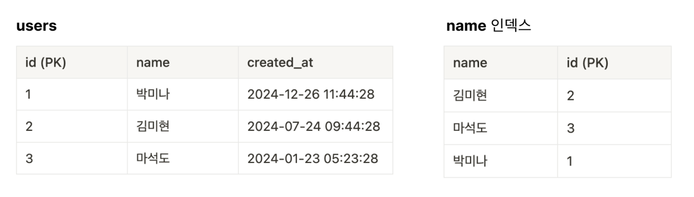

- 예를 들어 위처럼 생긴 users 테이블이 있다고 하자.

```sql
SELECT id, created_at FROM users;
SELECT id, name FROM users;
```

- 첫 번째 SQL문을 보면, `id`, `created_at`이라는 컬럼만 조회한다고 하더라도, 결국 실제 테이블의 데이터에 접근해야한다.
- 반면에 두 번째 SQL문에서는 `id`, `name` 컬럼은 실제 테이블에 접근하지 않고도 인덱스에만 접근해서 알아낼 수 있는 컬럼들이다. **따라서 실제 테이블에 접근하지 
  않고도 데이터를 조회할 수 있다.**
  - 실제 테이블에 접근하는 것 자체가 인덱스에 접근하는 것보다 느리다.
  - 이처럼 SQL문을 실행할 때 필요한 모든 컬럼을 갖고 있는 인덱스를 보고 커버링 인덱스(Covering Index)라고 한다.

## 커버링 인덱스를 만들 때 팁

- 자주 사용되는 쿼리 패턴을 분석하여 적절한 복합 인덱스를 생성하면 커버링 인덱스의 이점을 극대화할 수 있다.
  - 예를 들면, `(name, created_at)` 복합 인덱스로 `SELECT name, created_at FROM users WHERE name = ?` 
    쿼리를 최적화하는 식이다.
- 모든 컬럼을 인덱스에 포함하는 것은 비효율적일 수 있으며, 자주 조회되는 컬럼 위주로 설계하는 것이 좋음.
  - 인덱스의 크기와 갱신 비용을 고려해야 하므로.

> 향로님 [1. 커버링 인덱스 (기본 지식 / WHERE / GROUP BY)](https://jojoldu.tistory.com/476)

